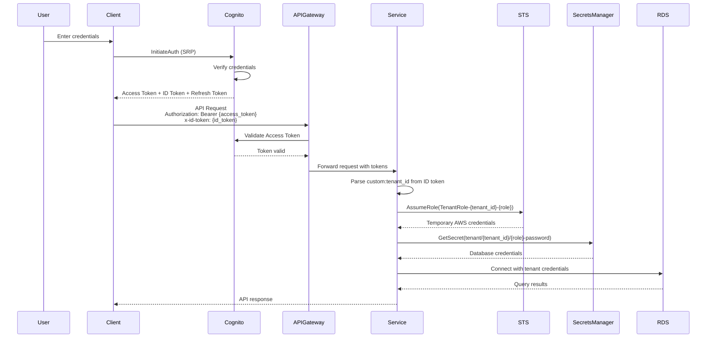
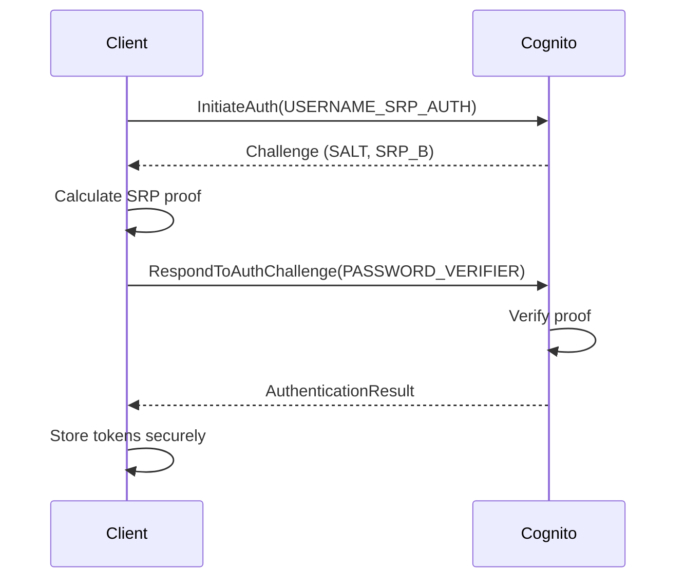
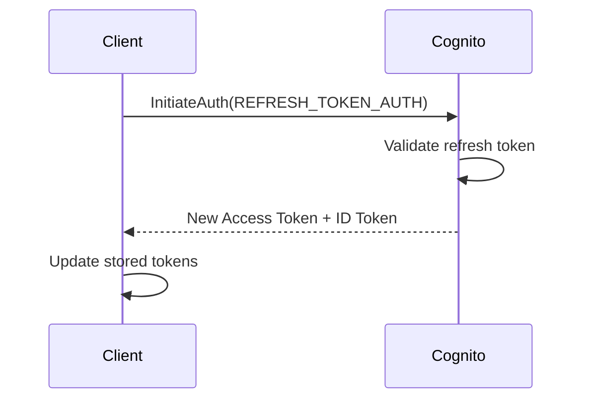

# API Authentication Guide

> **📌 Quick Reference for API Developers**  
> For comprehensive authentication architecture and Cognito configuration, see [Security: Authentication](../security/authentication.md).

## Purpose

This document explains how to authenticate API requests to Sybol services. It focuses on practical API usage patterns and token handling.

## Context

Sybol implements authentication using **AWS Cognito User Pools** with custom attributes for multi-tenant isolation. Services perform additional authorization using **AWS STS** to assume tenant-specific IAM roles.

## Authentication Architecture



## Cognito Authentication

### User Pool Configuration

Sybol uses AWS Cognito User Pools with the following configuration:

| Setting | Value |
|---------|-------|
| Username attributes | Email |
| Password policy | Minimum 8 characters, uppercase, lowercase, numbers, symbols |
| MFA | Optional (TOTP) |
| Token validity | Access: 1 hour, ID: 1 hour, Refresh: 30 days |

### Custom Attributes

User pool is configured with custom attributes for multi-tenancy:

| Attribute | Type | Description | Required |
|-----------|------|-------------|----------|
| `custom:tenant_id` | String | Tenant identifier | Yes |
| `custom:role` | String | User role within tenant | Yes |
| `custom:permissions` | String | JSON array of permissions | No |

## Authentication Flow - Secure Remote Password (SRP)

Cognito uses SRP protocol to authenticate users without transmitting passwords over the network.

### Login Flow



### Request Example

```javascript
const AWS = require('aws-sdk');
const cognito = new AWS.CognitoIdentityServiceProvider();

// Step 1: Initiate authentication
const initiateAuthResponse = await cognito.initiateAuth({
  AuthFlow: 'USER_SRP_AUTH',
  ClientId: 'your-client-id',
  AuthParameters: {
    USERNAME: 'user@example.com',
    SRP_A: srpA  // Calculated by client
  }
}).promise();

// Step 2: Respond to challenge
const authResponse = await cognito.respondToAuthChallenge({
  ChallengeName: 'PASSWORD_VERIFIER',
  ClientId: 'your-client-id',
  ChallengeResponses: {
    USERNAME: 'user@example.com',
    PASSWORD_CLAIM_SECRET_BLOCK: initiateAuthResponse.ChallengeParameters.SECRET_BLOCK,
    PASSWORD_CLAIM_SIGNATURE: signature  // Calculated proof
  }
}).promise();

// Result contains tokens
const { 
  AccessToken, 
  IdToken, 
  RefreshToken 
} = authResponse.AuthenticationResult;
```

### cURL Example (Not Recommended)

SRP authentication requires cryptographic calculations and is best performed using AWS SDK. Direct API calls with cURL are not practical for SRP flow.

For testing purposes, use AWS Amplify or Cognito SDK in your application.

## Token Structure

### Access Token

Used for API Gateway authentication. Contains standard OAuth 2.0 claims.

**JWT Header**

```json
{
  "alg": "RS256",
  "kid": "key-id",
  "typ": "JWT"
}
```

**JWT Payload**

```json
{
  "sub": "550e8400-e29b-41d4-a716-446655440000",
  "iss": "https://cognito-idp.us-east-1.amazonaws.com/us-east-1_POOLID",
  "client_id": "client-id",
  "origin_jti": "jti-value",
  "event_id": "event-id",
  "token_use": "access",
  "scope": "aws.cognito.signin.user.admin",
  "auth_time": 1678901234,
  "exp": 1678904834,
  "iat": 1678901234,
  "jti": "jti-value",
  "username": "550e8400-e29b-41d4-a716-446655440000"
}
```

### ID Token

Contains user identity and custom attributes. Used for tenant isolation.

**JWT Payload**

```json
{
  "sub": "550e8400-e29b-41d4-a716-446655440000",
  "email_verified": true,
  "iss": "https://cognito-idp.us-east-1.amazonaws.com/us-east-1_POOLID",
  "cognito:username": "user@example.com",
  "custom:tenant_id": "tenant-abc123",
  "custom:role": "admin",
  "custom:permissions": "[\"credentials:read\",\"credentials:write\"]",
  "origin_jti": "jti-value",
  "aud": "client-id",
  "event_id": "event-id",
  "token_use": "id",
  "auth_time": 1678901234,
  "exp": 1678904834,
  "iat": 1678901234,
  "jti": "jti-value",
  "email": "user@example.com"
}
```

### Refresh Token

Opaque token used to obtain new access and ID tokens without re-authentication.

**Validity**: 30 days  
**Storage**: Secure storage only (encrypted at rest)  
**Rotation**: New refresh token issued on each refresh

## Token Refresh

### Refresh Flow



### Request Example

```javascript
const refreshResponse = await cognito.initiateAuth({
  AuthFlow: 'REFRESH_TOKEN_AUTH',
  ClientId: 'your-client-id',
  AuthParameters: {
    REFRESH_TOKEN: refreshToken
  }
}).promise();

const { 
  AccessToken, 
  IdToken 
} = refreshResponse.AuthenticationResult;
// Note: Refresh token not returned unless it was rotated
```

### cURL Example

```bash
curl -X POST https://cognito-idp.us-east-1.amazonaws.com/ \
  -H "Content-Type: application/x-amz-json-1.1" \
  -H "X-Amz-Target: AWSCognitoIdentityProviderService.InitiateAuth" \
  -d '{
    "AuthFlow": "REFRESH_TOKEN_AUTH",
    "ClientId": "your-client-id",
    "AuthParameters": {
      "REFRESH_TOKEN": "refresh-token-string"
    }
  }'
```

**Response**

```json
{
  "AuthenticationResult": {
    "AccessToken": "new-access-token",
    "IdToken": "new-id-token",
    "TokenType": "Bearer",
    "ExpiresIn": 3600
  }
}
```

## STS Assume Role Flow

After Cognito authentication, services assume tenant-specific IAM roles for database access.

### IAM Role Structure

**Role ARN Format**:  
`arn:aws:iam::ACCOUNT_ID:role/TenantRole-{tenantId}-{userRole}`

**Example**:  
`arn:aws:iam::123456789012:role/TenantRole-tenant-abc123-admin`

### Trust Policy

```json
{
  "Version": "2012-10-17",
  "Statement": [
    {
      "Effect": "Allow",
      "Principal": {
        "Service": "lambda.amazonaws.com"
      },
      "Action": "sts:AssumeRole",
      "Condition": {
        "StringEquals": {
          "sts:ExternalId": "tenant-abc123"
        }
      }
    }
  ]
}
```

### Assume Role Request

```javascript
const AWS = require('aws-sdk');
const sts = new AWS.STS();

const assumeRoleResponse = await sts.assumeRole({
  RoleArn: `arn:aws:iam::${accountId}:role/TenantRole-${tenantId}-${role}`,
  RoleSessionName: `session-${tenantId}-${Date.now()}`,
  ExternalId: tenantId,
  DurationSeconds: 3600
}).promise();

const { 
  AccessKeyId, 
  SecretAccessKey, 
  SessionToken 
} = assumeRoleResponse.Credentials;
```

## Secrets Manager Integration

Tenant database credentials are stored in AWS Secrets Manager.

### Secret Naming Convention

**Format**: `tenant/{tenantId}/{role}-password`

**Example**: `tenant/tenant-abc123/admin-password`

### Secret Structure

```json
{
  "username": "tenant_admin",
  "password": "secure-password",
  "host": "tenant-abc123.cluster-xyz.us-east-1.rds.amazonaws.com",
  "port": 5432,
  "dbname": "tenant_database",
  "ssl": true
}
```

### Retrieve Secret

```javascript
const AWS = require('aws-sdk');
const secretsManager = new AWS.SecretsManager({
  credentials: {
    accessKeyId: assumedRoleCredentials.AccessKeyId,
    secretAccessKey: assumedRoleCredentials.SecretAccessKey,
    sessionToken: assumedRoleCredentials.SessionToken
  }
});

const secret = await secretsManager.getSecretValue({
  SecretId: `tenant/${tenantId}/${role}-password`
}).promise();

const dbCredentials = JSON.parse(secret.SecretString);
```

## Database Connection Flow

Once tenant credentials are retrieved, the service establishes a database connection.

### Connection Example

```javascript
const { Pool } = require('pg');

const pool = new Pool({
  host: dbCredentials.host,
  port: dbCredentials.port,
  user: dbCredentials.username,
  password: dbCredentials.password,
  database: dbCredentials.dbname,
  // TODO(pro): Enable TLS certificate verification for production.
  // rejectUnauthorized must be true (or removed) with a proper CA bundle in production environments.
  ssl: dbCredentials.ssl ? { rejectUnauthorized: false } : false,
  max: 5,
  idleTimeoutMillis: 30000
});

// Execute query
const result = await pool.query('SELECT * FROM credentials WHERE id = $1', [credentialId]);
```

## Authentication Middleware

Services implement authentication middleware to extract and validate tokens.

### Required Authentication (`requireIdToken`)

Forces tenant-specific database connection.

```javascript
const requireIdToken = async (req, res, next) => {
  try {
    const idToken = req.headers['x-id-token'];
    const authHeader = req.headers['authorization'];
    
    if (!idToken || !authHeader) {
      return res.status(401).json({
        success: false,
        error: 'AUTH_REQUIRED',
        message: 'Both Authorization and x-id-token headers required'
      });
    }
    
    // Validate token and extract claims
    const claims = await validateIdToken(idToken);
    const tenantId = claims['custom:tenant_id'];
    const userRole = claims['custom:role'];
    
    // Assume role and get credentials
    const credentials = await assumeTenantRole(tenantId, userRole);
    const dbConfig = await getTenantDbConfig(tenantId, userRole, credentials);
    
    // Attach to request
    req.auth = {
      userId: claims.sub,
      email: claims.email,
      tenantId,
      role: userRole,
      dbConfig,
      credentials
    };
    
    next();
  } catch (error) {
    return res.status(401).json({
      success: false,
      error: 'AUTH_FAILED',
      message: error.message
    });
  }
};
```

### Optional Authentication (`optionalIdToken`)

Allows unauthenticated access or tenant-specific access.

```javascript
const optionalIdToken = async (req, res, next) => {
  const idToken = req.headers['x-id-token'];
  const authHeader = req.headers['authorization'];
  
  if (!idToken && !authHeader) {
    // Use general database
    req.auth = null;
    return next();
  }
  
  // Same flow as requireIdToken
  try {
    const claims = await validateIdToken(idToken);
    // ... (tenant authentication)
    req.auth = { /* ... */ };
    next();
  } catch (error) {
    return res.status(401).json({
      success: false,
      error: 'INVALID_TOKEN',
      message: error.message
    });
  }
};
```

## Token Validation

JWT tokens must be validated against Cognito's public keys.

### Validation Steps

1. Decode JWT header and payload
2. Retrieve Cognito public keys from JWKS endpoint
3. Verify signature using public key
4. Validate standard claims (`iss`, `aud`, `exp`, `token_use`)
5. Extract custom claims

### JWKS Endpoint

```
https://cognito-idp.{region}.amazonaws.com/{userPoolId}/.well-known/jwks.json
```

### Validation Example

```javascript
const jwksClient = require('jwks-rsa');
const jwt = require('jsonwebtoken');

const client = jwksClient({
  jwksUri: `https://cognito-idp.us-east-1.amazonaws.com/${userPoolId}/.well-known/jwks.json`
});

const getKey = (header, callback) => {
  client.getSigningKey(header.kid, (err, key) => {
    const signingKey = key.getPublicKey();
    callback(null, signingKey);
  });
};

const validateIdToken = (token) => {
  return new Promise((resolve, reject) => {
    jwt.verify(token, getKey, {
      issuer: `https://cognito-idp.us-east-1.amazonaws.com/${userPoolId}`,
      audience: clientId
    }, (err, decoded) => {
      if (err) reject(err);
      else resolve(decoded);
    });
  });
};
```

## Security Best Practices

### Token Storage

- **Browser**: Store tokens in memory or `httpOnly` cookies (not `localStorage`)
- **Mobile**: Use secure storage (Keychain, Keystore)
- **Server**: Do not store tokens server-side

### Token Transmission

- Always use HTTPS
- Include tokens in headers, never in URL query parameters
- Implement CORS policies to restrict token exposure

### Token Rotation

- Refresh tokens before expiration
- Implement sliding session windows
- Revoke tokens on logout

### Error Handling

- Do not expose internal error details in responses
- Log authentication failures for monitoring
- Implement rate limiting on auth endpoints

## Related Documentation

- [Backoffice API](backoffice-api.md)
- [Business Logic API](businesslogic-api.md)
- [Security Architecture](../architecture/security-architecture.md)
- [Multi-Tenancy Architecture](../architecture/multi-tenancy.md)
