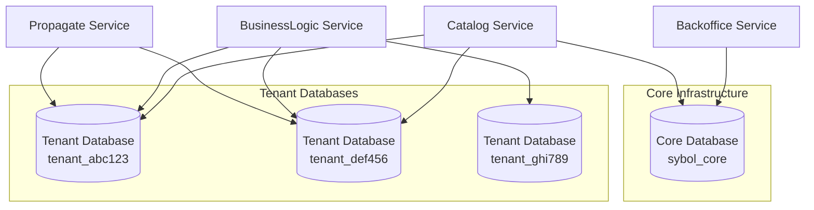

# Data Architecture

> **📌 Schema Version Information**  
> **Current Schema Version:** 2.1.0 (March 2026)  
> **Authoritative Source:** `infraestructure/CoreInfra/sql-scripts/`  
> **Last Schema Update:** March 10, 2026
>
> **Version History:**
> - v2.1.0 (March 2026): Added tenant status tracking
> - v2.0.0 (February 2026): Renamed `origin` to `documents`
> - v1.0.0 (January 2024): Initial schema

## Purpose

This document describes the database design, multi-tenant data isolation strategy, schema organization, and data management patterns used in the Sybol platform.

> **Note:** This document describes the conceptual data model. For exact CREATE TABLE statements used in deployment, refer to the SQL migration scripts in the infrastructure repository.

## Context

The Sybol platform uses a **database-per-tenant** isolation model to ensure complete data separation between tenants. This approach provides the highest level of security, compliance, and performance isolation while enabling independent tenant scaling and backup strategies.

## Database Strategy Overview



## Database Instances

### Core Database

**Name**: `sybol_core`  
**Purpose**: Platform-wide configuration and shared metadata  
**Access**: Backoffice and Catalog services  
**Engine**: PostgreSQL 17.4

**Characteristics**:
- Single instance shared across all tenants
- Contains no tenant business data
- Stores tenant registry and infrastructure mappings
- Manages global credential templates and claim definitions

### Tenant Databases

**Naming Convention**: `tenant_{tenantId}`  
**Purpose**: Isolated data storage per tenant  
**Access**: BusinessLogic, Catalog, and Propagate services (tenant-routed)  
**Engine**: PostgreSQL 17.4

**Characteristics**:
- One database per tenant
- Complete data isolation
- Independent backup and restore
- Tenant-specific scaling configurations
- Identical schema across all tenant databases

## Core Database Schema

### Tenant Registry

```sql
-- tenants table
CREATE TABLE tenants (
    tenant_id VARCHAR(50) PRIMARY KEY,
    tenant_name VARCHAR(255) NOT NULL,
    organization_legal_name VARCHAR(500),
    tenant_status VARCHAR(20) NOT NULL, -- active, suspended, deleted
    kyb_status VARCHAR(20), -- pending, verified, failed
    created_at TIMESTAMP NOT NULL DEFAULT NOW(),
    updated_at TIMESTAMP NOT NULL DEFAULT NOW(),
    metadata JSONB
);

-- tenant_infrastructure table
CREATE TABLE tenant_infrastructure (
    tenant_id VARCHAR(50) PRIMARY KEY REFERENCES tenants(tenant_id),
    database_name VARCHAR(255) NOT NULL,
    kms_key_id VARCHAR(255) NOT NULL,
    kms_key_arn VARCHAR(500) NOT NULL,
    iam_role_arn VARCHAR(500) NOT NULL,
    s3_bucket_name VARCHAR(255),
    cloudfront_distribution_id VARCHAR(255),
    cognito_user_pool_id VARCHAR(255),
    created_at TIMESTAMP NOT NULL DEFAULT NOW(),
    infrastructure_config JSONB
);
```

### Platform Administration

```sql
-- admin_users table
CREATE TABLE admin_users (
    user_id VARCHAR(50) PRIMARY KEY,
    email VARCHAR(255) NOT NULL UNIQUE,
    cognito_username VARCHAR(255) NOT NULL,
    role VARCHAR(50) NOT NULL, -- super_admin, admin, support
    active BOOLEAN NOT NULL DEFAULT true,
    created_at TIMESTAMP NOT NULL DEFAULT NOW(),
    last_login TIMESTAMP
);

-- audit_logs table
CREATE TABLE audit_logs (
    log_id BIGSERIAL PRIMARY KEY,
    tenant_id VARCHAR(50) REFERENCES tenants(tenant_id),
    user_id VARCHAR(50),
    action VARCHAR(100) NOT NULL,
    resource_type VARCHAR(100),
    resource_id VARCHAR(255),
    timestamp TIMESTAMP NOT NULL DEFAULT NOW(),
    details JSONB,
    ip_address INET
);

CREATE INDEX idx_audit_logs_tenant ON audit_logs(tenant_id);
CREATE INDEX idx_audit_logs_timestamp ON audit_logs(timestamp);
```

### KYB Verification

```sql
-- kyb_verifications table
CREATE TABLE kyb_verifications (
    verification_id VARCHAR(50) PRIMARY KEY,
    tenant_id VARCHAR(50) NOT NULL REFERENCES tenants(tenant_id),
    verification_status VARCHAR(20) NOT NULL, -- pending, in_progress, verified, failed
    verification_provider VARCHAR(100),
    submitted_at TIMESTAMP NOT NULL DEFAULT NOW(),
    completed_at TIMESTAMP,
    verification_data JSONB,
    documents JSONB, -- array of document references in S3
    notes TEXT
);
```

### Global Catalog

```sql
-- global_templates table
CREATE TABLE global_templates (
    template_id VARCHAR(50) PRIMARY KEY,
    template_name VARCHAR(255) NOT NULL,
    template_type VARCHAR(100) NOT NULL,
    schema_definition JSONB NOT NULL,
    version VARCHAR(20) NOT NULL,
    active BOOLEAN NOT NULL DEFAULT true,
    created_at TIMESTAMP NOT NULL DEFAULT NOW(),
    updated_at TIMESTAMP NOT NULL DEFAULT NOW()
);

-- claim_definitions table
CREATE TABLE claim_definitions (
    claim_id VARCHAR(50) PRIMARY KEY,
    claim_name VARCHAR(255) NOT NULL,
    claim_type VARCHAR(100) NOT NULL, -- string, number, date, boolean
    validation_rules JSONB,
    description TEXT,
    created_at TIMESTAMP NOT NULL DEFAULT NOW()
);
```

## Tenant Database Schema

Each tenant database contains an identical schema structure with tenant-specific data.

### Credential Management

```sql
-- credentials table
CREATE TABLE credentials (
    credential_id VARCHAR(50) PRIMARY KEY,
    credential_type VARCHAR(100) NOT NULL,
    template_id VARCHAR(50),
    subject_did VARCHAR(500) NOT NULL,
    issuer_did VARCHAR(500) NOT NULL,
    issuance_date TIMESTAMP NOT NULL,
    expiration_date TIMESTAMP,
    status VARCHAR(20) NOT NULL, -- active, revoked, suspended, expired
    credential_data JSONB NOT NULL, -- W3C VC JSON structure
    signature JSONB NOT NULL, -- proof object
    created_at TIMESTAMP NOT NULL DEFAULT NOW(),
    updated_at TIMESTAMP NOT NULL DEFAULT NOW()
);

CREATE INDEX idx_credentials_subject ON credentials(subject_did);
CREATE INDEX idx_credentials_status ON credentials(status);
CREATE INDEX idx_credentials_type ON credentials(credential_type);
```

### Schema Registry

```sql
-- credential_schemas table
CREATE TABLE credential_schemas (
    schema_id VARCHAR(50) PRIMARY KEY,
    schema_name VARCHAR(255) NOT NULL,
    schema_version VARCHAR(20) NOT NULL,
    json_schema JSONB NOT NULL,
    examples JSONB,
    active BOOLEAN NOT NULL DEFAULT true,
    created_at TIMESTAMP NOT NULL DEFAULT NOW()
);
```

### Verifiable Presentations

```sql
-- presentations table
CREATE TABLE presentations (
    presentation_id VARCHAR(50) PRIMARY KEY,
    holder_did VARCHAR(500) NOT NULL,
    verifier_did VARCHAR(500),
    presentation_data JSONB NOT NULL, -- W3C VP JSON structure
    credential_ids JSONB NOT NULL, -- array of included credential IDs
    signature JSONB NOT NULL,
    created_at TIMESTAMP NOT NULL DEFAULT NOW(),
    verified_at TIMESTAMP
);
```

### Revocation Management

```sql
-- revocation_registry table
CREATE TABLE revocation_registry (
    credential_id VARCHAR(50) PRIMARY KEY,
    revoked_at TIMESTAMP NOT NULL DEFAULT NOW(),
    revocation_reason VARCHAR(255),
    revoked_by VARCHAR(255),
    blockchain_anchor_tx VARCHAR(255) -- optional blockchain proof
);

-- revocation_lists table
CREATE TABLE revocation_lists (
    list_id VARCHAR(50) PRIMARY KEY,
    list_version INTEGER NOT NULL,
    credential_ids JSONB NOT NULL, -- array of revoked IDs
    published_at TIMESTAMP NOT NULL DEFAULT NOW(),
    blockchain_anchor_tx VARCHAR(255)
);
```

### Issuance Audit

```sql
-- issuance_audit table
CREATE TABLE issuance_audit (
    audit_id BIGSERIAL PRIMARY KEY,
    credential_id VARCHAR(50) NOT NULL,
    event_type VARCHAR(50) NOT NULL, -- issued, viewed, verified, revoked
    event_timestamp TIMESTAMP NOT NULL DEFAULT NOW(),
    actor_id VARCHAR(255),
    actor_type VARCHAR(50), -- issuer, holder, verifier
    event_details JSONB,
    ip_address INET
);

CREATE INDEX idx_issuance_audit_credential ON issuance_audit(credential_id);
CREATE INDEX idx_issuance_audit_timestamp ON issuance_audit(event_timestamp);
```

### Webhook Configuration

```sql
-- webhook_endpoints table
CREATE TABLE webhook_endpoints (
    endpoint_id VARCHAR(50) PRIMARY KEY,
    endpoint_url VARCHAR(500) NOT NULL,
    event_types JSONB NOT NULL, -- array of subscribed event types
    active BOOLEAN NOT NULL DEFAULT true,
    secret_key VARCHAR(255), -- for webhook signature verification
    created_at TIMESTAMP NOT NULL DEFAULT NOW(),
    last_triggered_at TIMESTAMP
);

-- event_delivery_log table
CREATE TABLE event_delivery_log (
    log_id BIGSERIAL PRIMARY KEY,
    endpoint_id VARCHAR(50) NOT NULL REFERENCES webhook_endpoints(endpoint_id),
    event_type VARCHAR(100) NOT NULL,
    event_payload JSONB NOT NULL,
    delivery_status VARCHAR(20) NOT NULL, -- pending, success, failed
    attempts INTEGER NOT NULL DEFAULT 0,
    last_attempt_at TIMESTAMP,
    created_at TIMESTAMP NOT NULL DEFAULT NOW()
);
```

### Custom Templates

```sql
-- tenant_templates table
CREATE TABLE tenant_templates (
    template_id VARCHAR(50) PRIMARY KEY,
    template_name VARCHAR(255) NOT NULL,
    based_on_global_template VARCHAR(50), -- reference to global template
    customizations JSONB NOT NULL,
    active BOOLEAN NOT NULL DEFAULT true,
    created_at TIMESTAMP NOT NULL DEFAULT NOW()
);

-- template_usage table
CREATE TABLE template_usage (
    usage_id BIGSERIAL PRIMARY KEY,
    template_id VARCHAR(50) NOT NULL,
    credentials_issued INTEGER NOT NULL DEFAULT 0,
    last_used_at TIMESTAMP,
    created_at TIMESTAMP NOT NULL DEFAULT NOW()
);
```

## JSONB Usage Strategy

The platform leverages PostgreSQL's JSONB type for flexible schema storage while maintaining query performance.

### Credential Data Storage

Credentials are stored as complete W3C Verifiable Credential JSON objects:

```json
{
  "@context": [
    "https://www.w3.org/2018/credentials/v1",
    "https://www.w3.org/2018/credentials/examples/v1"
  ],
  "id": "http://example.edu/credentials/3732",
  "type": ["VerifiableCredential", "UniversityDegreeCredential"],
  "issuer": "did:example:abc123",
  "issuanceDate": "2023-01-01T00:00:00Z",
  "credentialSubject": {
    "id": "did:example:xyz789",
    "degree": {
      "type": "BachelorDegree",
      "name": "Bachelor of Science in Computer Science"
    }
  },
  "proof": {
    "type": "EcdsaSecp256k1Signature2019",
    "created": "2023-01-01T00:00:00Z",
    "proofPurpose": "assertionMethod",
    "verificationMethod": "did:example:abc123#keys-1",
    "jws": "eyJhbGciOiJFUzI1NiIsImI2NCI6ZmFsc2UsImNyaXQiOlsiYjY0Il19..."
  }
}
```

### JSONB Indexing

Critical JSONB fields are indexed for performance:

```sql
-- Index on credential subject DID
CREATE INDEX idx_credentials_subject_did 
ON credentials USING GIN ((credential_data -> 'credentialSubject' -> 'id'));

-- Index on credential type
CREATE INDEX idx_credentials_type_array 
ON credentials USING GIN ((credential_data -> 'type'));

-- Index on issuance date
CREATE INDEX idx_credentials_issuance_date 
ON credentials ((credential_data ->> 'issuanceDate'));
```

## Multi-Tenant Routing

### Tenant Resolution

Services determine the target tenant database using:

1. **JWT Token Claims**: `tenant_id` embedded in authentication token
2. **Header-Based Routing**: `X-Tenant-ID` HTTP header
3. **Path Parameter**: `/tenants/{tenantId}/...` in API path

### Connection Pooling

```javascript
// Tenant-specific connection pool
const tenantConnections = new Map();

function getTenantConnection(tenantId) {
  if (!tenantConnections.has(tenantId)) {
    const config = {
      host: process.env.RDS_ENDPOINT,
      database: `tenant_${tenantId}`,
      user: process.env.DB_USER,
      password: process.env.DB_PASSWORD,
      max: 10, // pool size
      idleTimeoutMillis: 30000
    };
    tenantConnections.set(tenantId, new Pool(config));
  }
  return tenantConnections.get(tenantId);
}
```

## Backup and Recovery

### Core Database

- **Automated Backups**: Daily RDS snapshots with 30-day retention
- **Point-in-Time Recovery**: Enabled with 7-day retention
- **Backup Window**: 02:00-04:00 UTC

### Tenant Databases

- **Automated Backups**: Daily RDS snapshots per tenant database
- **Retention Policy**: 30 days standard, extended for enterprise tenants
- **Independent Restoration**: Each tenant database can be restored independently
- **Cross-Region Replication**: Optional for high-availability tenants

## Data Migration

### Tenant Onboarding

When a new tenant is created:

1. Create tenant database: `tenant_{tenantId}`
2. Apply base schema from migration scripts
3. Populate default credential templates
4. Configure database-specific encryption
5. Register database connection in infrastructure table

### Schema Versioning

Database migrations use a version-controlled approach:

```bash
migrations/
  ├── core/
  │   └── V001__initial_schema.sql
  │   └── V002__add_kyb_tables.sql
  └── tenant/
      └── V001__initial_tenant_schema.sql
      └── V002__add_presentations.sql
```

## Performance Considerations

| Optimization | Implementation |
|--------------|----------------|
| **Connection Pooling** | 10 connections per tenant database |
| **Read Replicas** | Available for high-traffic tenants |
| **Query Optimization** | JSONB GIN indexes on frequently queried fields |
| **Partitioning** | Time-based partitioning on audit tables |
| **Caching** | Redis cache for frequently accessed templates |

## Data Retention Policies

| Data Type | Retention Period |
|-----------|------------------|
| **Active Credentials** | Indefinite (until revoked) |
| **Revoked Credentials** | 7 years (compliance requirement) |
| **Audit Logs** | 2 years in hot storage, archived afterward |
| **Event Delivery Logs** | 90 days |
| **KYB Documents** | 10 years |

## References

- [System Overview](system-overview.md) - Platform architecture context
- [Component Architecture](component-architecture.md) - Service database access patterns
- [Multi-Tenancy](multi-tenancy.md) - Tenant isolation strategy
- [Security Architecture](security-architecture.md) - Database encryption and access control
