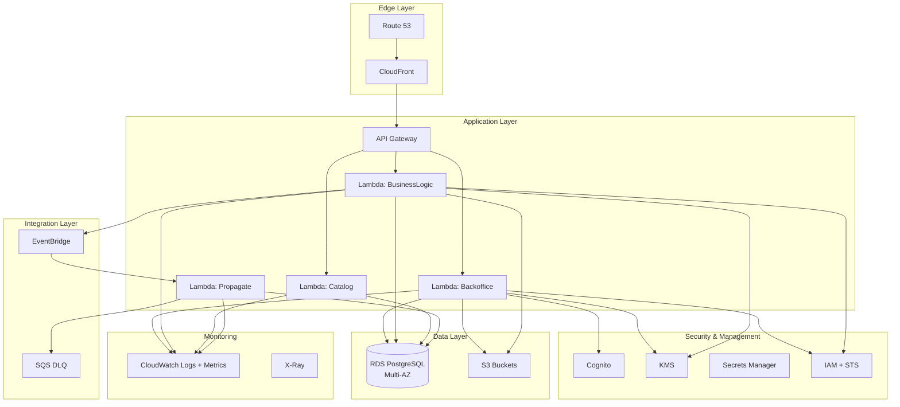
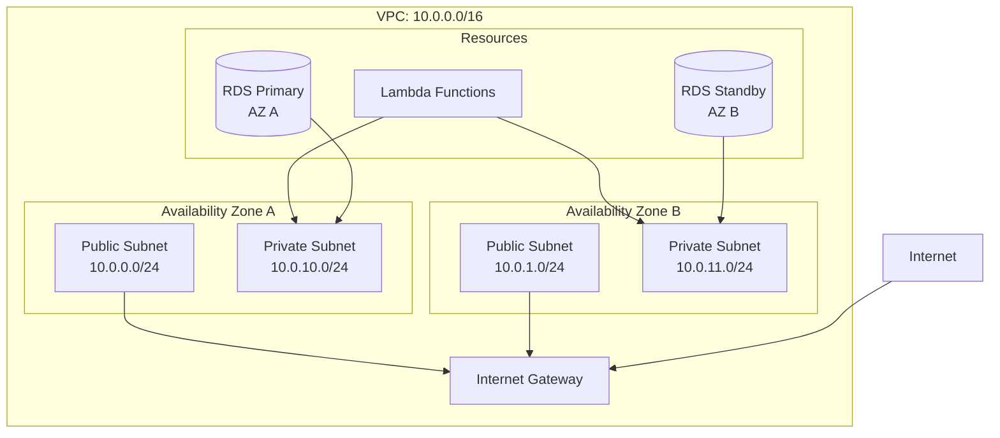
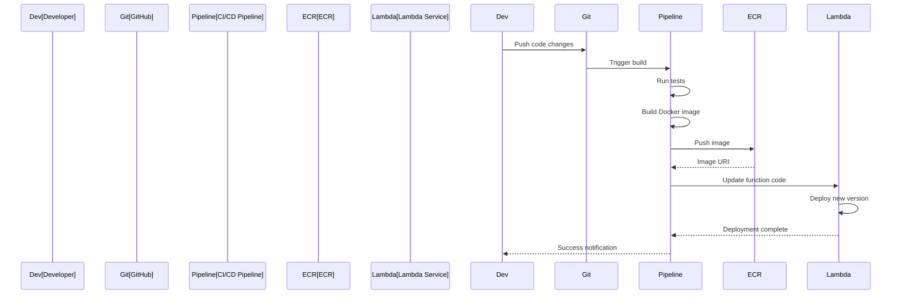
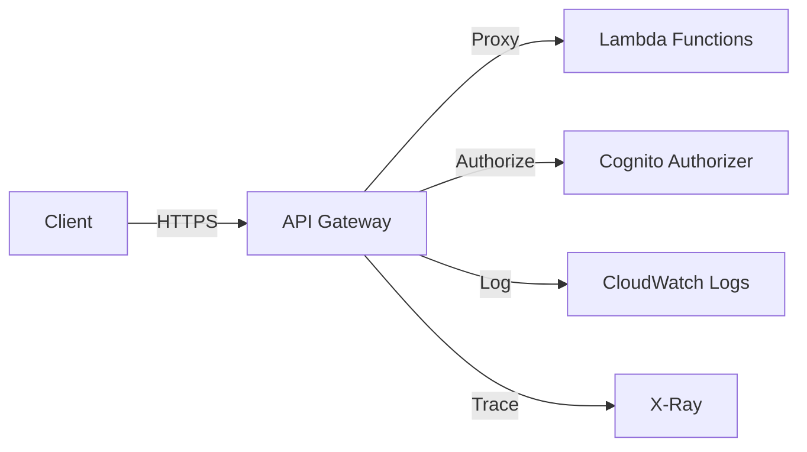
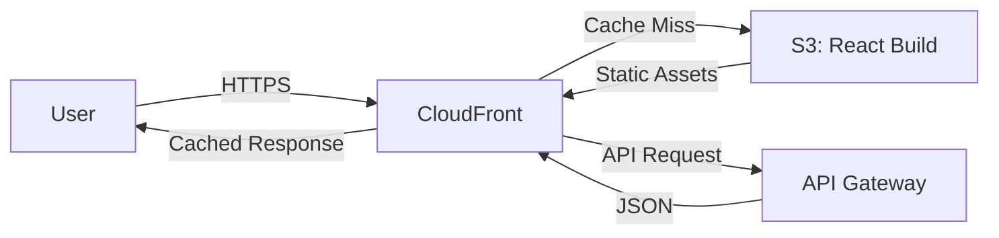
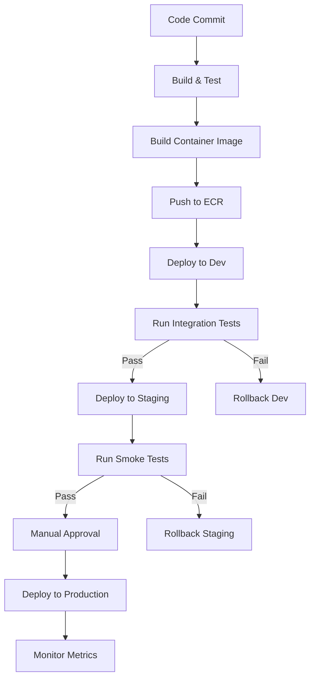

# Deployment Architecture

## Purpose

This document describes the AWS infrastructure, networking configuration, deployment pipelines, and operational characteristics of the Sybol platform.

## Context

The Sybol platform is deployed entirely on AWS using serverless and managed services. Infrastructure is defined as code using AWS CDK (TypeScript), enabling repeatable and version-controlled deployments.

## AWS Infrastructure Overview



## Infrastructure as Code

### CDK Stack Architecture

The platform uses two primary CDK stacks:

#### CoreInfra Stack

**Purpose**: Shared platform resources deployed once.

**Resources**:
- VPC and networking infrastructure
- RDS instance (hosts all databases)
- Core database (`sybol_core`)
- Shared KMS keys for platform encryption
- API Gateway
- CloudWatch log groups
- EventBridge custom event bus
- Lambda container registry (ECR)

**Deployment Trigger**: Manual, infrastructure changes only

#### ClientInfra Stack

**Purpose**: Per-tenant resource provisioning.

**Resources**:
- Tenant-specific RDS database
- Tenant KMS customer-managed key
- Tenant IAM role
- Tenant S3 bucket
- Tenant CloudFront distribution (optional)
- Tenant Cognito User Pool (optional)

**Deployment Trigger**: Automated via Backoffice service on tenant creation

### CDK Project Structure

```
infraestructure/
├── CoreInfra/
│   ├── bin/
│   │   └── core-infra.ts          # CDK app entry point
│   ├── lib/
│   │   ├── core-infra-stack.ts    # Main stack definition
│   │   ├── network-stack.ts       # VPC, subnets, security groups
│   │   ├── database-stack.ts      # RDS configuration
│   │   ├── api-gateway-stack.ts   # API Gateway setup
│   │   └── lambda-stack.ts        # Lambda function definitions
│   └── cdk.json                   # CDK configuration
│
└── ClientInfra/
    ├── bin/
    │   └── client-infra.ts         # CDK app entry point
    ├── lib/
    │   ├── client-infra-stack.ts   # Tenant provisioning stack
    │   ├── tenant-database.ts      # RDS database creation
    │   ├── tenant-kms.ts           # KMS key provisioning
    │   └── tenant-storage.ts       # S3 bucket creation
    └── cdk.json
```

## Networking Architecture

### VPC Configuration

**CIDR Block**: `10.0.0.0/16`

**Subnets**:

| Subnet Type | CIDR Blocks | Purpose | NAT Gateway |
|------------|-------------|---------|-------------|
| **Public** | `10.0.0.0/24`, `10.0.1.0/24` | API Gateway VPC endpoints | N/A |
| **Private** | `10.0.10.0/24`, `10.0.11.0/24` | Lambda functions, RDS | No |

**Note**: The current architecture uses public subnets only without NAT Gateway to reduce costs. Lambda functions access AWS services via VPC endpoints and RDS within the VPC.

### Network Diagram



### Security Groups

#### Lambda Security Group

```typescript
const lambdaSG = new ec2.SecurityGroup(this, 'LambdaSG', {
  vpc: vpc,
  description: 'Security group for Lambda functions',
  allowAllOutbound: true // Outbound to RDS and AWS services
});
```

**Inbound Rules**: None (Lambda doesn't accept inbound connections)  
**Outbound Rules**: All traffic (0.0.0.0/0)

#### RDS Security Group

```typescript
const rdsSG = new ec2.SecurityGroup(this, 'RDSSG', {
  vpc: vpc,
  description: 'Security group for RDS PostgreSQL',
  allowAllOutbound: false
});

rdsSG.addIngressRule(
  lambdaSG,
  ec2.Port.tcp(5432),
  'Allow PostgreSQL from Lambda'
);
```

**Inbound Rules**: Port 5432 from Lambda Security Group only  
**Outbound Rules**: None

### VPC Endpoints

To avoid NAT Gateway costs, VPC endpoints provide Lambda access to AWS services:

| Service | Endpoint Type | Purpose |
|---------|--------------|---------|
| **S3** | Gateway | Access S3 buckets |
| **Secrets Manager** | Interface | Retrieve secrets |
| **KMS** | Interface | Encryption operations |
| **ECR** | Interface | Pull container images |

## Compute Layer

### Lambda Configuration

All services are deployed as containerized Lambda functions:

#### Container Image Strategy

**Base Image**: `public.ecr.aws/lambda/nodejs:20`

**Dockerfile Example** (BusinessLogic service):

```dockerfile
FROM public.ecr.aws/lambda/nodejs:20

# Copy application code
COPY package*.json ./
RUN npm ci --production

COPY src/ ./src/

# Set Lambda handler
CMD ["src/index.handler"]
```

**Image Registry**: Amazon ECR (Elastic Container Registry)

```
{account-id}.dkr.ecr.{region}.amazonaws.com/sybol-backoffice:latest
{account-id}.dkr.ecr.{region}.amazonaws.com/sybol-businesslogic:latest
{account-id}.dkr.ecr.{region}.amazonaws.com/sybol-catalog:latest
{account-id}.dkr.ecr.{region}.amazonaws.com/sybol-propagate:latest
```

#### Lambda Function Configuration

| Service | Memory | Timeout | Provisioned Concurrency | Reserved Concurrency |
|---------|--------|---------|------------------------|---------------------|
| **Backoffice** | 1024 MB | 30s | 2 | 50 |
| **BusinessLogic** | 2048 MB | 30s | 5 | 100 |
| **Catalog** | 512 MB | 10s | 2 | 50 |
| **Propagate** | 512 MB | 300s | 0 | 50 |
| **PAdES** | 3008 MB | 60s | 0 | 20 |
| **SignEth** | 512 MB | 10s | 0 | 20 |

#### Environment Variables

Common environment variables for all Lambda functions:

```javascript
{
  "NODE_ENV": "production",
  "AWS_REGION": "us-east-1",
  "CORE_DB_SECRET_ARN": "arn:aws:secretsmanager:...",
  "TENANT_ROUTING_ENABLED": "true",
  "LOG_LEVEL": "info",
  "POWERTOOLS_SERVICE_NAME": "sybol-{service}",
  "POWERTOOLS_METRICS_NAMESPACE": "Sybol"
}
```

### Lambda Deployment Process



## Data Layer

### RDS Configuration

**Engine**: PostgreSQL 17.4  
**Deployment**: Multi-AZ for high availability  
**Instance Class**: `db.r6g.xlarge` (4 vCPU, 32 GB RAM)  
**Storage**: 100 GB gp3 SSD (initial), auto-scaling up to 1 TB  
**Backup Retention**: 30 days  
**Backup Window**: 02:00-04:00 UTC  
**Maintenance Window**: Sunday 04:00-05:00 UTC

**High Availability**:
- Multi-AZ deployment with synchronous replication
- Automatic failover to standby (typically 60-120 seconds)
- Read replicas available for reporting workloads

### Database Naming Convention

```
Core database:     sybol_core
Tenant databases:  tenant_{tenantId}
```

### RDS Monitoring

**CloudWatch Metrics**:
- CPU utilization
- Database connections
- Read/Write IOPS
- Free storage space
- Replication lag (Multi-AZ)

**Performance Insights**: Enabled with 7-day retention

### S3 Storage

#### Bucket Strategy

Each tenant has a dedicated S3 bucket:

```
s3://sybol-tenant-{tenantId}/
  ├── credentials/         # Issued credential documents
  ├── kyb-documents/       # KYB verification documents
  ├── attachments/         # Credential attachments
  └── exports/             # Data export archives
```

#### Storage Classes

| Path | Storage Class | Lifecycle Policy |
|------|--------------|------------------|
| `credentials/*` | Standard | Transition to Intelligent-Tiering after 90 days |
| `kyb-documents/*` | Standard | Retain for 10 years, then Glacier Deep Archive |
| `attachments/*` | Intelligent-Tiering | N/A |
| `exports/*` | Standard | Delete after 30 days |

#### Encryption

- **Server-Side Encryption**: SSE-KMS with tenant-specific KMS key
- **Bucket Policy**: Deny unencrypted uploads
- **Versioning**: Enabled for compliance and recovery

## API Gateway

### REST API Configuration

**API Type**: Regional REST API  
**Endpoint Type**: Regional  
**Protocol**: HTTPS only (TLS 1.2+)

### Stage Configuration

| Stage | Purpose | Throttling |
|-------|---------|-----------|
| **dev** | Development and testing | 100 req/s, 200 burst |
| **staging** | Pre-production validation | 500 req/s, 1000 burst |
| **prod** | Production traffic | 1000 req/s, 2000 burst |

### API Gateway Integrations



### Request Flow

```
1. Client sends HTTPS request
2. API Gateway validates request format
3. Custom authorizer validates JWT token via Cognito
4. Throttling rules applied
5. Request forwarded to Lambda (proxy integration)
6. Lambda processes request and returns response
7. API Gateway logs request to CloudWatch
8. Response returned to client
```

### CORS Configuration

```javascript
{
  "allowOrigins": [
    "https://wallet.sybol.com",
    "https://*.sybol.com"
  ],
  "allowMethods": ["GET", "POST", "PUT", "DELETE", "OPTIONS"],
  "allowHeaders": [
    "Content-Type",
    "Authorization",
    "X-Tenant-ID",
    "X-Request-ID"
  ],
  "maxAge": 3600
}
```

## CloudFront Distribution

### Per-Tenant CDN

Each tenant can have a dedicated CloudFront distribution for:
- Frontend application hosting (React apps)
- Custom domain support
- API caching (optional)

### Distribution Configuration

**Origin**: S3 bucket (static assets) or API Gateway (API caching)  
**Price Class**: PriceClass_100 (US, Canada, Europe)  
**Cache Behavior**: Cache based on query strings and headers  
**SSL Certificate**: ACM certificate for custom domains  
**Security**: Origin Access Identity (OAI) for S3

### Frontend Application Delivery



## Security Services

### AWS KMS

**Platform Master Key**: Encrypts core database and shared resources  
**Tenant Keys**: One customer-managed key per tenant

**Key Policy** (Tenant Key Example):

```json
{
  "Version": "2012-10-17",
  "Statement": [
    {
      "Sid": "Enable IAM User Permissions",
      "Effect": "Allow",
      "Principal": {"AWS": "arn:aws:iam::account:root"},
      "Action": "kms:*",
      "Resource": "*"
    },
    {
      "Sid": "Allow tenant role to use key",
      "Effect": "Allow",
      "Principal": {"AWS": "arn:aws:iam::account:role/tenant-abc123"},
      "Action": [
        "kms:Decrypt",
        "kms:Encrypt",
        "kms:GenerateDataKey",
        "kms:Sign",
        "kms:Verify"
      ],
      "Resource": "*"
    }
  ]
}
```

### AWS Secrets Manager

Stores sensitive configuration:

| Secret Name | Purpose | Rotation |
|------------|---------|----------|
| `/sybol/core/db-credentials` | Core database password | 90 days |
| `/sybol/tenant/{id}/db-credentials` | Tenant database password | 90 days |
| `/sybol/external-api-keys` | Third-party API keys | 180 days |

## Event-Driven Architecture

### EventBridge

**Custom Event Bus**: `sybol-events`

**Event Patterns**:

```json
{
  "source": ["sybol.businesslogic"],
  "detail-type": [
    "Credential Issued",
    "Credential Revoked",
    "Credential Verified"
  ]
}
```

**Event Targets**:
- Propagate Lambda (webhook delivery)
- CloudWatch Logs (audit trail)
- SNS topics (monitoring alerts)

### SQS Dead Letter Queue

Failed webhook deliveries are sent to DLQ for manual review:

**Queue Name**: `sybol-propagate-dlq`  
**Retention**: 14 days  
**Alarm**: CloudWatch alarm when queue depth > 10

## Monitoring and Observability

### CloudWatch Logs

**Log Groups**:
- `/aws/lambda/sybol-backoffice`
- `/aws/lambda/sybol-businesslogic`
- `/aws/lambda/sybol-catalog`
- `/aws/lambda/sybol-propagate`
- `/aws/apigateway/sybol-api`
- `/aws/rds/instance/sybol-core/postgresql`

**Retention**: 30 days

**Log Insights Queries**:
```sql
-- Credential issuance by tenant
fields @timestamp, tenantId, credentialType
| filter @message like /credential.issued/
| stats count() by tenantId
```

### AWS X-Ray

**Tracing**: Enabled for all Lambda functions and API Gateway  
**Sampling Rate**: 10% for normal traffic, 100% for errors

### CloudWatch Alarms

| Alarm | Metric | Threshold | Action |
|-------|--------|-----------|--------|
| **High Error Rate** | Lambda errors | > 5% in 5 min | SNS notification |
| **RDS CPU High** | CPU Utilization | > 80% for 10 min | SNS notification |
| **API Latency** | API Gateway latency | p99 > 2s | SNS notification |
| **DLQ Messages** | SQS messages | > 10 | SNS notification |

## Deployment Pipeline

### CI/CD Workflow



### Deployment Scripts

Located in `deploy/` directory:

| Script | Purpose |
|--------|---------|
| `deploy.sh` | Deploy Lambda function updates |
| `deployServices.sh` | Deploy all services sequentially |

## Disaster Recovery

### Backup Strategy

| Resource | Backup Method | Frequency | Retention |
|----------|--------------|-----------|-----------|
| **RDS** | Automated snapshots | Daily | 30 days |
| **RDS** | Manual snapshots | On-demand | Indefinite |
| **S3** | Versioning + replication | Continuous | 90 days |
| **CloudFormation/CDK** | Git repository | On commit | Indefinite |

### Recovery Procedures

**RTO (Recovery Time Objective)**: 4 hours  
**RPO (Recovery Point Objective)**: 24 hours (daily snapshots)

**Recovery Steps**:
1. Restore RDS from snapshot
2. Update DNS records (Route 53)
3. Redeploy Lambda functions from ECR
4. Restore S3 data from versioning
5. Validate application functionality

## Cost Optimization

| Strategy | Implementation |
|----------|----------------|
| **No NAT Gateway** | Use VPC endpoints instead (~$30/month savings) |
| **Lambda Rightsizing** | Optimized memory allocation per function |
| **S3 Lifecycle Policies** | Automatic transition to Intelligent-Tiering |
| **RDS Reserved Instances** | 1-year reserved instance for production RDS |
| **CloudFront Caching** | Reduce API Gateway requests |

## References

- [System Overview](system-overview.md) - Platform architecture context
- [Component Architecture](component-architecture.md) - Service deployment details
- [Security Architecture](security-architecture.md) - Network and IAM security
- [Multi-Tenancy](multi-tenancy.md) - Tenant infrastructure provisioning
