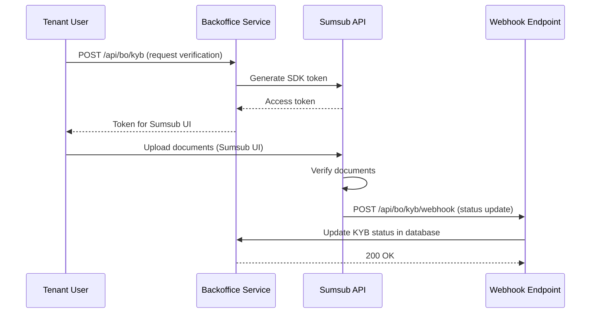
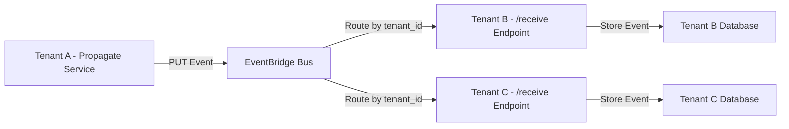
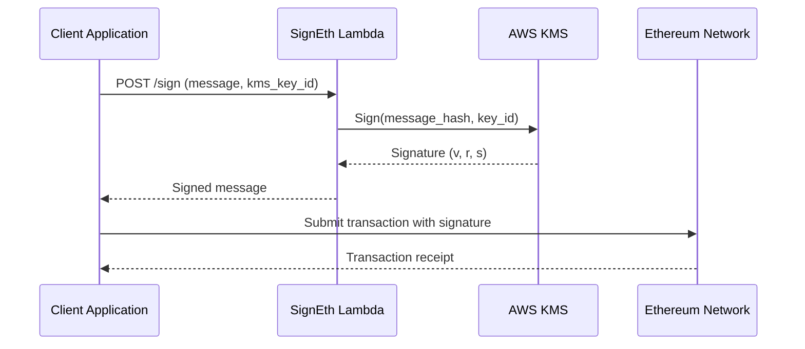
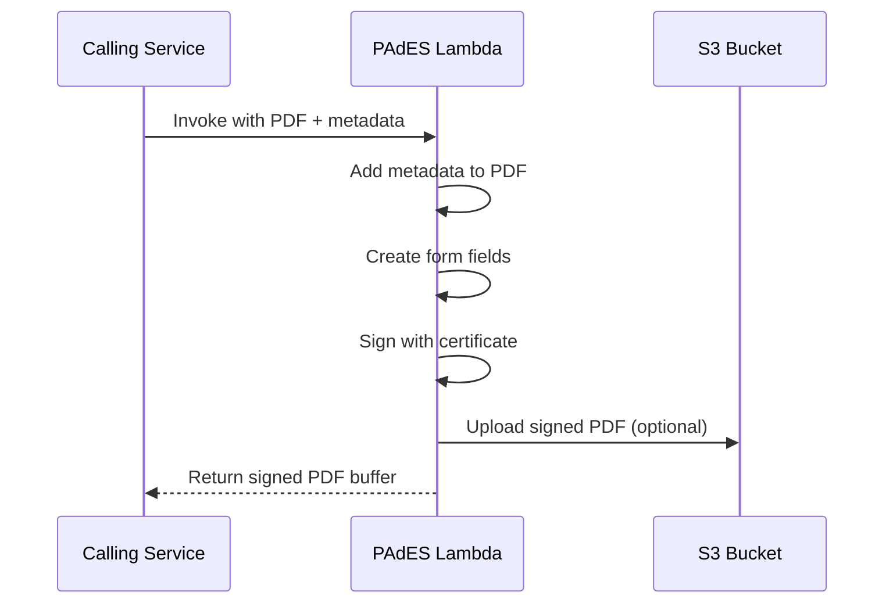
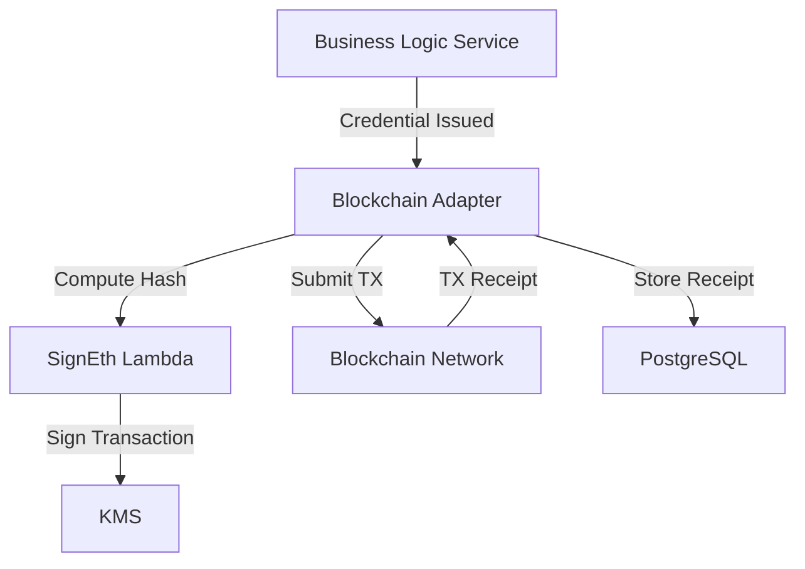

# Integration Architecture

## Purpose

This document describes how Sybol integrates with external systems and services, including third-party APIs, blockchain networks, and cross-tenant communication mechanisms.

## Integration Overview

Sybol integrates with external systems for:
- **Identity Verification**: Sumsub KYB (Know Your Business)
- **Cross-Tenant Communication**: AWS EventBridge for inter-tenant events
- **Blockchain**: Ethereum signing for blockchain-based credential anchoring
- **PDF Processing**: Internal PAdES signing for document certification
- **Future**: Multi-blockchain support for DID anchoring and revocation registries

## Integration Patterns

### Pattern 1: Webhook-Based Integration (Sumsub)

**Use Case**: Receive asynchronous KYB verification updates



**Configuration**:
- Webhook URL: `https://api.sybol.id/api/bo/kyb/webhook`
- Authentication: Sumsub signature verification
- Retry policy: Exponential backoff (Sumsub handles retries)

**Data Flow**:
1. Tenant initiates KYB via backoffice API
2. Backoffice generates Sumsub access token
3. Tenant completes verification in Sumsub UI
4. Sumsub sends webhook notification on verification completion
5. Backoffice updates KYB status in PostgreSQL

**Error Handling**:
- Invalid signature → 401 Unauthorized
- Unknown user → 404 Not Found
- Processing error → 500 Internal Server Error (Sumsub retries)

### Pattern 2: Event-Driven Integration (EventBridge)

**Use Case**: Cross-tenant credential sharing and notifications



**Architecture**:
- **Event Source**: Propagate service (Lambda)
- **Event Bus**: AWS EventBridge (default bus)
- **Event Targets**: Lambda functions (per-tenant /receive endpoints)
- **Event Routing**: Based on `tenant_id` in event detail

**Event Schema**:
```json
{
  "source": "sybol.propagate",
  "detail-type": "CredentialUpdate",
  "detail": {
    "tenant_id": "repsol",
    "credential_id": "cred_123",
    "action": "issued",
    "timestamp": "2026-03-10T10:00:00Z",
    "payload": { }
  }
}
```

**Security**:
- Events are tenant-scoped
- Receiving Lambda validates sender identity
- Payload encrypted in transit (TLS)
- Audit logging in CloudWatch

**Configuration**:
- Event rule per tenant
- Lambda function URL as target
- Dead-letter queue for failed deliveries

### Pattern 3: Direct API Integration (Ethereum Signing)

**Use Case**: Sign messages for blockchain interactions



**Integration Type**: Synchronous Lambda invocation

**Use Cases**:
- Sign DID document updates for blockchain storage
- Sign credential anchoring transactions
- Generate Ethereum addresses from KMS keys

**Security**:
- KMS keys restricted to specific IAM roles
- Input validation for message format
- Signature verification before returning

### Pattern 4: Internal Service Integration (PAdES Signing)

**Use Case**: Generate cryptographically signed PDF certificates



**Integration Type**: Lambda-to-Lambda invocation or direct invocation

**Features**:
- Standard and custom PDF metadata
- Interactive form field creation
- PAdES-compliant digital signatures
- XMP metadata for compliance

**Input**:
```javascript
{
  input: Buffer | "path/to/file.pdf",
  output: "path/to/signed.pdf" | null,
  metadata: {
    title: "Certificate",
    author: "Issuer",
    customProperties: { tenant: "repsol" }
  },
  formFields: [
    { name: "signature", type: "text", x: 100, y: 100, ... }
  ]
}
```

## External Service Integrations

### Sumsub KYB Integration

**Purpose**: Automated business identity verification for tenant onboarding

**API**: REST API (https://api.sumsub.com)

**Authentication**: API key + signature-based request signing

**Endpoints Used**:
- `POST /resources/accessTokens` - Generate SDK token for tenant
- Webhook: `POST /api/bo/kyb/webhook` - Receive verification status

**Workflow**:
1. New tenant requests onboarding
2. Backoffice generates Sumsub access token
3. Tenant completes verification in Sumsub UI (embedded iframe or redirect)
4. Sumsub reviews documents (automated + manual)
5. Webhook notification sent to Sybol on completion
6. Backoffice updates tenant status (approved/rejected)

**Configuration** (Environment Variables):
```
SUMSUB_API_URL=https://api.sumsub.com
SUMSUB_APP_TOKEN=<token>
SUMSUB_SECRET_KEY=<secret>
SUMSUB_LEVEL_NAME=basic-kyb-level
```

**Error Handling**:
- Token generation failure → Log error, return 503 to client
- Webhook signature mismatch → Return 401, log security event
- Unknown user in webhook → Return 404, log data inconsistency

### Future: Blockchain Integration

**Planned Integrations**:

| Blockchain | Purpose | Status |
|------------|---------|--------|
| Ethereum | DID anchoring, credential hashes | Signing implemented |
| Polygon | Cost-effective credential anchoring | Planned |
| Hyperledger | Permissioned credential registry | Under evaluation |

**Architecture Pattern** (Planned):


## Inter-Service Communication

### Service-to-Service Authentication

All internal API calls between Sybol services use:
- **JWT tokens** from Cognito (for user-initiated requests)
- **IAM STS credentials** (for service-to-service calls)

**Pattern**: STS Assume Role
```javascript
// Business Logic assumes tenant role to access tenant database
const credentials = await assumeTenantRole(tenantId, role);
const dbConnection = await connectWithCredentials(credentials);
```

### API Gateway Routing

```
API Gateway: sybol-api (api.sybol.id)
├── /api/bl/* → Business Logic Lambda
├── /api/ps/* → Propagate Lambda  
└── /api/catalog/* → Catalog Lambda

API Gateway: backoffice-api (backoffice.sybol.id)
└── /api/bo/* → Backoffice Lambda
```

**Integration Type**: Lambda proxy integration (v2.0 payload format)

**Authentication**: JWT authorizer (Cognito User Pool)

## Event Communication

### EventBridge Event Types

| Event Type | Source | Purpose | Target |
|------------|--------|---------|--------|
| `CredentialIssued` | Business Logic | Notify other tenants of new credential | Propagate /receive |
| `CredentialRevoked` | Business Logic | Notify credential revocation | Propagate /receive |
| `TenantProvisioned` | Backoffice | New tenant created | Admin notifications |
| `KYBCompleted` | Backoffice | KYB verification done | Tenant activation |

**Event Bus**: Default EventBridge bus (per region)

**Routing Rules**:
- Events tagged with `tenant_id`
- EventBridge rules filter by tenant
- Each tenant has dedicated target Lambda

**Retry Policy**:
- Max retry: 3 attempts
- Exponential backoff: 1s, 2s, 4s
- Dead-letter queue (SQS) for failed events

### Dead-Letter Queue Processing

Failed events are sent to SQS DLQ for manual review:
1. CloudWatch alarm triggers on DLQ message count > 0
2. Operations team notified
3. Manual inspection and replay of failed events

## API Gateway Integration Details

### Lambda Proxy Integration

**Payload Format**: 2.0 (HTTP API format)

**Example Event**:
```json
{
  "version": "2.0",
  "routeKey": "POST /api/bl/credentials",
  "rawPath": "/api/bl/credentials",
  "headers": {
    "authorization": "Bearer eyJhbGc...",
    "content-type": "application/json"
  },
  "requestContext": {
    "authorizer": {
      "jwt": {
        "claims": {
          "sub": "user_id",
          "custom:tenant_id": "repsol",
          "custom:role": "admin"
        }
      }
    }
  },
  "body": "{\"type\":\"EnergyCertificate\",...}"
}
```

**Lambda Response**:
```json
{
  "statusCode": 201,
  "headers": {
    "content-type": "application/json"
  },
  "body": "{\"id\":\"cred_123\",\"status\":\"issued\"}"
}
```

### JWT Authorizer Configuration

- **Issuer**: Cognito User Pool URL
- **Audience**: App Client ID
- **Token Location**: `Authorization` header (Bearer)
- **Claims Validation**: `sub`, `custom:tenant_id`, `custom:role`

**Unauthorized Responses**:
- Invalid token → 401 Unauthorized
- Expired token → 401 Unauthorized
- Missing token → 401 Unauthorized

## Integration Testing

### Sumsub Integration Tests

**Test Cases**:
1. Token generation success
2. Token generation failure (API down)
3. Webhook signature validation
4. Webhook with valid status update
5. Webhook with invalid user

**Test Environment**: Sumsub sandbox environment

### EventBridge Integration Tests

**Test Cases**:
1. Event published successfully
2. Event routed to correct tenant
3. Dead-letter queue processing
4. Event replay from DLQ

**Test Tools**: AWS CLI, LocalStack (local testing)

### PAdES Integration Tests

**Test Cases**:
1. PDF metadata addition
2. Form field creation
3. Digital signature validation
4. XMP metadata extraction

**Test Data**: Sample PDF files, certificate fixtures

## Monitoring and Observability

### Integration Metrics

| Integration | Metric | Threshold | Alert |
|-------------|--------|-----------|-------|
| Sumsub | Token generation failure rate | > 5% | Critical |
| EventBridge | Dead-letter queue depth | > 10 messages | Warning |
| PAdES | Lambda error rate | > 1% | Warning |
| SignEth | KMS throttling errors | > 0 | Warning |

### CloudWatch Dashboards

**Integration Health Dashboard**:
- Sumsub API latency
- EventBridge event throughput
- Lambda invocation counts
- Error rates by integration

### Logging

All integrations log:
- Request/response payloads (sanitized)
- Error details and stack traces
- Correlation IDs for distributed tracing
- Performance metrics

**Log Groups**:
- `/aws/lambda/backoffice` (Sumsub integration)
- `/aws/lambda/propagate` (EventBridge)
- `/aws/lambda/PAdES` (PDF signing)
- `/aws/lambda/signEth` (Ethereum signing)

## Security Considerations

### API Key Management

- Sumsub keys stored in AWS Secrets Manager
- Rotation policy: Every 90 days
- Access restricted via IAM policies

### Webhook Security

- Signature validation required
- IP whitelisting (optional)
- Rate limiting (API Gateway)

### Event Security

- Events encrypted in transit (TLS)
- No sensitive data in event payloads (use references)
- Tenant-scoped access controls

### KMS Security

- Asymmetric keys for signing (ECC_NIST_P256)
- Key policies restrict access to specific IAM roles
- CloudTrail logging for all KMS operations

## Related Documentation

- [Component Architecture](component-architecture.md) - Service details
- [Security Architecture](security-architecture.md) - Security model
- [API Documentation](../api/README.md) - API specifications
- [Monitoring](../operations/monitoring.md) - Observability setup

---

*Last updated: March 2026*
