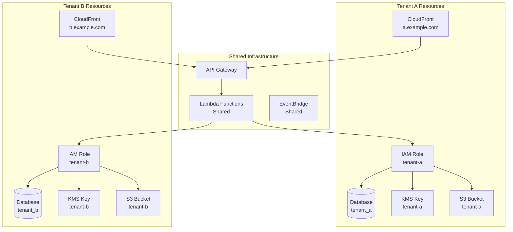
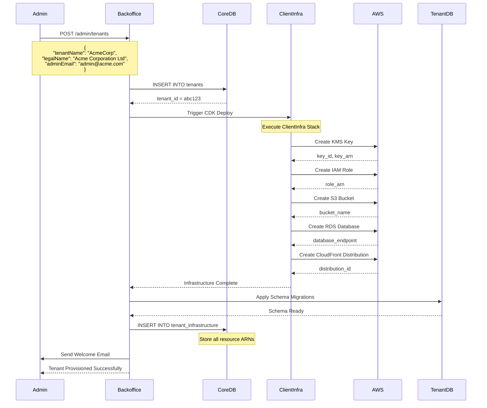
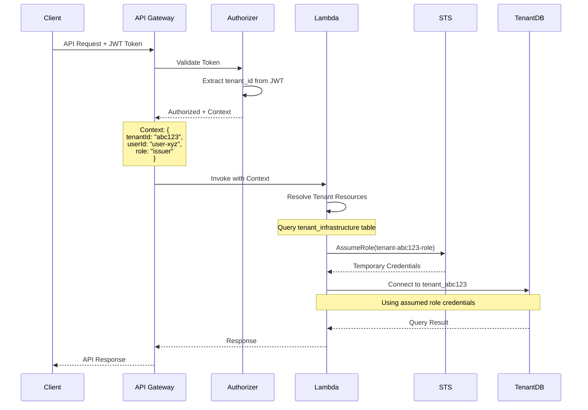

# Multi-Tenancy

## Purpose

This document describes the multi-tenant architecture patterns, tenant isolation strategies, provisioning workflows, and routing mechanisms implemented in the Sybol platform.

## Context

The Sybol platform is designed as a **multi-tenant SaaS** platform where multiple organizations (tenants) share the same application infrastructure while maintaining complete data and resource isolation. The platform implements the highest level of isolation using a **database-per-tenant** strategy combined with **tenant-specific AWS resources**.

## Multi-Tenancy Strategy

### Isolation Levels

The platform implements multiple isolation levels for different resource types:

| Resource Type | Isolation Strategy | Rationale |
|--------------|-------------------|-----------|
| **Databases** | Database-per-tenant | Maximum data isolation, independent scaling |
| **Encryption Keys** | KMS key per tenant | Cryptographic isolation, compliance |
| **IAM Roles** | Role per tenant | Fine-grained access control, audit trails |
| **S3 Buckets** | Bucket per tenant | Storage isolation, lifecycle policies |
| **CloudFront Distributions** | Distribution per tenant (optional) | Custom domains, branding |
| **Application Services** | Shared Lambda functions | Cost efficiency, operational simplicity |
| **API Gateway** | Shared with tenant routing | Centralized traffic management |

### Architectural Pattern



## Tenant Lifecycle

### Tenant Provisioning Workflow



### Tenant Onboarding Steps

1. **Tenant Registration**
   - Admin creates tenant record in backoffice
   - Basic tenant information validated
   - Tenant ID generated (UUID)

2. **Infrastructure Provisioning** (via ClientInfra CDK)
   - KMS customer-managed key created
   - IAM role with tenant-specific permissions
   - S3 bucket with tenant prefix
   - RDS database: `tenant_{tenantId}`
   - CloudFront distribution (optional)
   - Cognito User Pool (optional)

3. **Database Initialization**
   - Apply tenant schema migrations
   - Insert default credential templates
   - Configure webhook endpoints (if provided)

4. **Configuration Storage**
   - Update `tenant_infrastructure` table in core database
   - Store all AWS resource ARNs and IDs
   - Enable tenant for API access

5. **Admin User Setup**
   - Create tenant admin user in Cognito
   - Send welcome email with credentials
   - Provide onboarding documentation

## Tenant Routing

### Request Routing Flow



### Tenant Identification Methods

The platform supports multiple methods for tenant identification:

#### 1. JWT Token Claims

Preferred method for authenticated requests:

```json
{
  "sub": "user-xyz",
  "tenant_id": "abc123",
  "user_role": "issuer",
  "email": "user@acme.com",
  "iat": 1709985600,
  "exp": 1709989200
}
```

#### 2. HTTP Header

Used for server-to-server communication:

```http
GET /credentials/123 HTTP/1.1
Host: api.sybol.com
Authorization: Bearer {token}
X-Tenant-ID: abc123
```

#### 3. Custom Domain Routing

CloudFront distributions map custom domains to tenants:

```
https://acme.sybol.com -> tenant_id: abc123
https://globex.sybol.com -> tenant_id: def456
```

#### 4. Path-Based Routing

API paths can include tenant identifier:

```
/api/tenants/abc123/credentials
/api/tenants/def456/templates
```

### Tenant Context Resolution

Lambda functions resolve tenant context using:

```javascript
// Tenant resolution middleware
async function resolveTenant(event) {
  // Priority 1: JWT token claims
  if (event.requestContext.authorizer?.claims?.tenant_id) {
    return event.requestContext.authorizer.claims.tenant_id;
  }
  
  // Priority 2: Custom header
  if (event.headers['X-Tenant-ID']) {
    return event.headers['X-Tenant-ID'];
  }
  
  // Priority 3: Path parameter
  if (event.pathParameters?.tenantId) {
    return event.pathParameters.tenantId;
  }
  
  // Priority 4: Custom domain mapping
  const domain = event.requestContext.domainName;
  return await resolveTenantFromDomain(domain);
}

// Tenant infrastructure lookup
async function getTenantInfrastructure(tenantId) {
  const result = await coreDB.query(
    'SELECT * FROM tenant_infrastructure WHERE tenant_id = $1',
    [tenantId]
  );
  
  return {
    databaseName: result.database_name,
    kmsKeyId: result.kms_key_id,
    iamRoleArn: result.iam_role_arn,
    s3BucketName: result.s3_bucket_name
  };
}
```

## Tenant Isolation Mechanisms

### Database Isolation

**Physical Separation**: Each tenant has a dedicated PostgreSQL database.

```sql
-- Core database query to get tenant databases
SELECT tenant_id, database_name 
FROM tenant_infrastructure 
WHERE tenant_status = 'active';

-- Result:
-- abc123 | tenant_abc123
-- def456 | tenant_def456
-- ghi789 | tenant_ghi789
```

**Connection Pooling**: Separate connection pools per tenant.

```javascript
const tenantPools = new Map();

function getPool(tenantId) {
  if (!tenantPools.has(tenantId)) {
    tenantPools.set(tenantId, new Pool({
      database: `tenant_${tenantId}`,
      max: 10
    }));
  }
  return tenantPools.get(tenantId);
}
```

### Cryptographic Isolation

**Tenant-Specific KMS Keys**: Each tenant has a unique KMS customer-managed key.

```javascript
// Signing with tenant KMS key
async function signCredential(credential, tenantId) {
  const infra = await getTenantInfrastructure(tenantId);
  
  const params = {
    KeyId: infra.kmsKeyId,
    Message: Buffer.from(JSON.stringify(credential)),
    SigningAlgorithm: 'ECDSA_SHA_256'
  };
  
  const signature = await kms.sign(params).promise();
  return signature.Signature;
}
```

**Cross-Tenant Decryption Prevention**: IAM policies prevent one tenant's role from accessing another tenant's KMS key.

### IAM Role Isolation

**STS AssumeRole Pattern**: Services assume tenant-specific roles for all operations.

```javascript
// Assume tenant role
async function assumeTenantRole(tenantId) {
  const infra = await getTenantInfrastructure(tenantId);
  
  const params = {
    RoleArn: infra.iamRoleArn,
    RoleSessionName: `tenant-${tenantId}-session`,
    DurationSeconds: 3600
  };
  
  const credentials = await sts.assumeRole(params).promise();
  
  return {
    accessKeyId: credentials.Credentials.AccessKeyId,
    secretAccessKey: credentials.Credentials.SecretAccessKey,
    sessionToken: credentials.Credentials.SessionToken
  };
}
```

### Storage Isolation

**S3 Bucket Structure**: Each tenant has a dedicated S3 bucket.

```
s3://sybol-tenant-abc123/
  ├── credentials/
  ├── kyb-documents/
  └── attachments/

s3://sybol-tenant-def456/
  ├── credentials/
  ├── kyb-documents/
  └── attachments/
```

**Bucket Policy**: IAM role can only access its own bucket.

```json
{
  "Version": "2012-10-17",
  "Statement": [
    {
      "Effect": "Allow",
      "Principal": {
        "AWS": "arn:aws:iam::account:role/tenant-abc123-role"
      },
      "Action": ["s3:GetObject", "s3:PutObject"],
      "Resource": "arn:aws:s3:::sybol-tenant-abc123/*"
    }
  ]
}
```

## Tenant Configuration

### Tenant Settings

Each tenant has customizable settings stored in `tenants.metadata` JSONB field:

```json
{
  "branding": {
    "primaryColor": "#0066CC",
    "logoUrl": "https://cdn.acme.com/logo.png",
    "customDomain": "credentials.acme.com"
  },
  "features": {
    "pdfSigning": true,
    "blockchainAnchoring": false,
    "customTemplates": true
  },
  "limits": {
    "maxCredentialsPerMonth": 10000,
    "maxUsers": 100,
    "maxTemplates": 50
  },
  "integrations": {
    "webhookUrl": "https://acme.com/webhook",
    "externalIdProvider": "https://idp.acme.com"
  }
}
```

### Tenant Tiers

The platform supports multiple tenant tiers:

| Tier | Database Size | KMS Requests/month | Storage | Support |
|------|--------------|-------------------|---------|---------|
| **Starter** | 10 GB | 100K | 50 GB | Email |
| **Professional** | 100 GB | 1M | 500 GB | Email + Chat |
| **Enterprise** | Unlimited | Unlimited | Unlimited | Dedicated support |

## Scalability Considerations

### Horizontal Scaling

**Per-Tenant Scaling**: Each tenant database can be scaled independently.

- Read replicas for high-traffic tenants
- Multi-AZ deployment for critical tenants
- Independent backup schedules

### Resource Allocation

**Lambda Concurrency**: Reserved concurrency allocated per tenant tier.

```javascript
// Tenant-aware concurrency
const concurrencyLimits = {
  starter: 10,
  professional: 50,
  enterprise: 500
};

async function invokeLambda(tenantId, payload) {
  const tier = await getTenantTier(tenantId);
  const limit = concurrencyLimits[tier];
  
  // Check current concurrency
  if (getCurrentConcurrency(tenantId) >= limit) {
    throw new Error('Concurrency limit reached');
  }
  
  return lambda.invoke(payload);
}
```

### Performance Isolation

**Noisy Neighbor Prevention**:
- API Gateway throttling per tenant
- Database connection pool limits per tenant
- S3 request rate limits per bucket

## Tenant Management Operations

### Tenant Suspension

```sql
-- Suspend tenant
UPDATE tenants 
SET tenant_status = 'suspended', 
    updated_at = NOW() 
WHERE tenant_id = 'abc123';

-- Check suspension in API
SELECT tenant_status FROM tenants WHERE tenant_id = 'abc123';
-- If status = 'suspended', return 403 Forbidden
```

### Tenant Data Export

For GDPR compliance, tenants can request full data export:

```javascript
async function exportTenantData(tenantId) {
  const db = getPool(tenantId);
  
  // Export all tables
  const tables = ['credentials', 'presentations', 'issuance_audit'];
  const exportData = {};
  
  for (const table of tables) {
    exportData[table] = await db.query(`SELECT * FROM ${table}`);
  }
  
  // Upload to tenant S3 bucket
  const s3Key = `exports/tenant-data-${Date.now()}.json`;
  await s3.putObject({
    Bucket: `sybol-tenant-${tenantId}`,
    Key: s3Key,
    Body: JSON.stringify(exportData, null, 2)
  });
  
  return s3Key;
}
```

### Tenant Deletion

Complete tenant removal requires:

1. Mark tenant as `deleted` in core database
2. Revoke all credentials
3. Export audit logs (retention compliance)
4. Delete tenant database
5. Delete S3 bucket contents
6. Delete CloudFront distribution
7. Schedule KMS key deletion (7-30 day waiting period)
8. Delete IAM role

## Monitoring and Observability

### Per-Tenant Metrics

CloudWatch metrics track per-tenant usage:

```javascript
// Publish custom metric
await cloudwatch.putMetricData({
  Namespace: 'Sybol/Tenants',
  MetricData: [{
    MetricName: 'CredentialsIssued',
    Dimensions: [{
      Name: 'TenantId',
      Value: tenantId
    }],
    Value: 1,
    Unit: 'Count'
  }]
});
```

### Tenant Dashboards

Each tenant has dedicated CloudWatch dashboards:
- API request rate and latency
- Database connections and query performance
- KMS API calls
- S3 storage usage
- Lambda invocations

## References

- [System Overview](system-overview.md) - Platform architecture context
- [Component Architecture](component-architecture.md) - Service tenant routing
- [Data Architecture](data-architecture.md) - Database-per-tenant implementation
- [Security Architecture](security-architecture.md) - Tenant isolation security
- [Deployment Architecture](deployment-architecture.md) - Infrastructure provisioning
