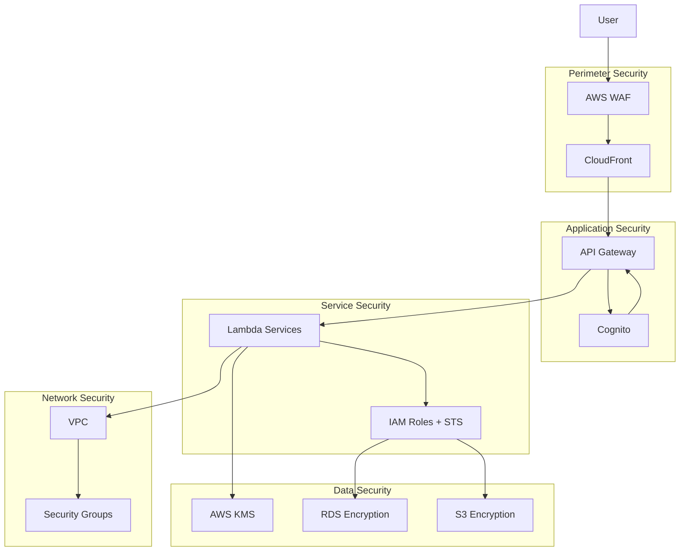
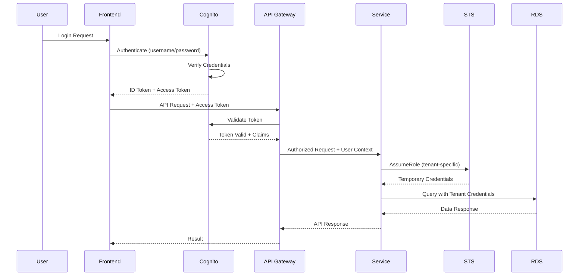
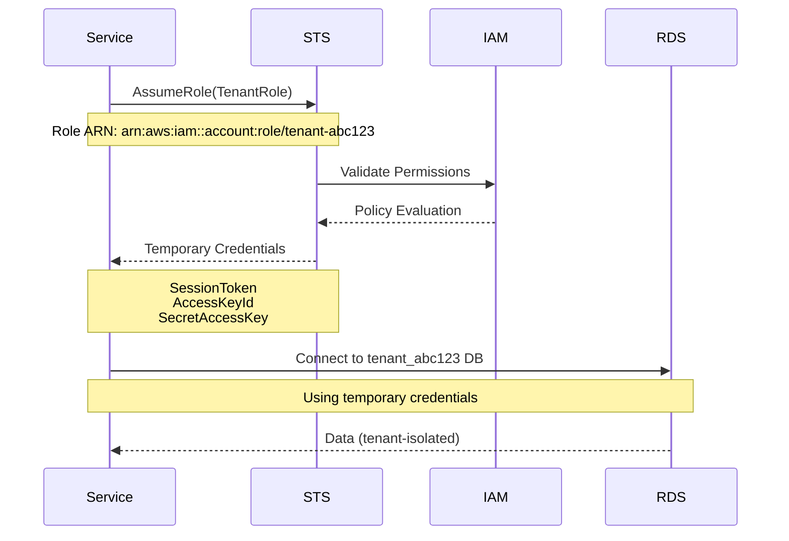
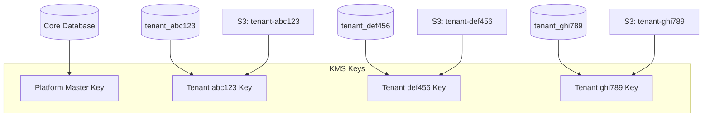
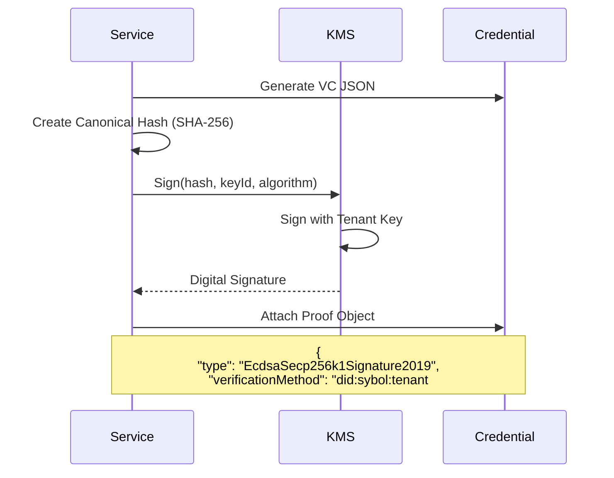
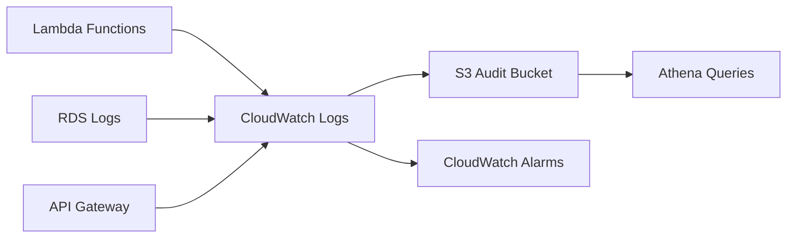
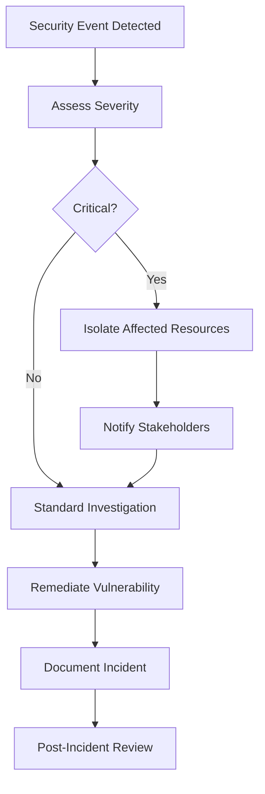

# Security Architecture

## Purpose

This document describes the security model, authentication and authorization mechanisms, encryption strategies, and security best practices implemented in the Sybol platform.

## Context

The Sybol platform handles sensitive identity data and verifiable credentials, requiring enterprise-grade security across multiple layers. The security architecture implements defense-in-depth principles with zero-trust assumptions for all service interactions.

## Security Layers



## Authentication Architecture

### User Authentication

The platform uses **Amazon Cognito** for user authentication with support for multiple identity providers.

#### Authentication Flow



#### Cognito Configuration

**User Pools**:
- **Platform Admin Pool**: For backoffice administration
- **Tenant User Pools**: Per-tenant user management (optional)

**Identity Pools**:
- Federated identity support (Google, Microsoft, SAML)
- IAM role mapping based on user attributes

**Token Configuration**:
```json
{
  "idTokenValidity": 60,
  "accessTokenValidity": 60,
  "refreshTokenValidity": 30,
  "tokenValidityUnits": {
    "idToken": "minutes",
    "accessToken": "minutes",
    "refreshToken": "days"
  }
}
```

**Custom Claims**:
- `tenant_id`: Tenant identifier for multi-tenant routing
- `user_role`: Role-based access control
- `permissions`: Fine-grained permission array

### Service-to-Service Authentication

Internal service communication uses **IAM authentication** with:
- Lambda execution roles
- Resource-based policies
- STS temporary credentials

## Authorization Model

### Role-Based Access Control (RBAC)

The platform implements RBAC at multiple levels:

#### Platform-Level Roles

| Role | Permissions |
|------|------------|
| **SuperAdmin** | Full platform access, tenant management, infrastructure provisioning |
| **Admin** | Tenant administration, user management, configuration |
| **Support** | Read-only access for troubleshooting |

#### Tenant-Level Roles

| Role | Permissions |
|------|------------|
| **TenantAdmin** | Full tenant configuration, user management |
| **Issuer** | Credential issuance, template management |
| **Verifier** | Credential verification only |
| **Viewer** | Read-only access to credentials |

### Tenant Isolation via STS

Each tenant has dedicated IAM roles assumed via STS for database and resource access:



#### Tenant Role Policy Example

```json
{
  "Version": "2012-10-17",
  "Statement": [
    {
      "Effect": "Allow",
      "Action": [
        "rds-db:connect"
      ],
      "Resource": [
        "arn:aws:rds-db:region:account:dbuser:cluster-id/tenant_abc123"
      ]
    },
    {
      "Effect": "Allow",
      "Action": [
        "kms:Decrypt",
        "kms:Encrypt",
        "kms:GenerateDataKey",
        "kms:Sign",
        "kms:Verify"
      ],
      "Resource": [
        "arn:aws:kms:region:account:key/tenant-abc123-key-id"
      ]
    },
    {
      "Effect": "Allow",
      "Action": [
        "s3:GetObject",
        "s3:PutObject"
      ],
      "Resource": [
        "arn:aws:s3:::tenant-abc123-bucket/*"
      ]
    }
  ]
}
```

### Resource-Level Permissions

API Gateway enforces resource-level permissions:

```javascript
// Lambda authorizer function
async function authorize(event) {
  const token = extractToken(event);
  const claims = await verifyToken(token);
  const tenantId = claims.tenant_id;
  const userRole = claims.user_role;
  
  // Check resource access
  const resource = event.pathParameters.credentialId;
  const hasAccess = await checkResourceAccess(
    tenantId, 
    userRole, 
    resource
  );
  
  return generatePolicy(claims.sub, hasAccess ? 'Allow' : 'Deny', event.methodArn);
}
```

## Encryption Strategy

### Encryption at Rest

**AWS KMS-Based Encryption**:

| Resource | Encryption Method | Key Management |
|----------|------------------|----------------|
| **RDS Databases** | AES-256 database encryption | Customer-managed KMS key per tenant |
| **S3 Buckets** | SSE-KMS | Customer-managed KMS key per tenant |
| **Lambda Environment Variables** | KMS encryption | Service-managed key |
| **EBS Volumes** | EBS encryption | AWS-managed key |
| **CloudWatch Logs** | Log group encryption | Customer-managed KMS key |

**KMS Key Architecture**:



**Key Rotation**:
- Automatic key rotation enabled (365 days)
- Manual rotation capability for security incidents
- Audit trail via CloudTrail

### Encryption in Transit

**TLS Configuration**:
- Minimum TLS 1.2 (TLS 1.3 preferred)
- Strong cipher suites only
- Certificate management via AWS Certificate Manager (ACM)

**Service Endpoints**:
- API Gateway: HTTPS only
- CloudFront: HTTPS redirect enforced
- RDS: SSL/TLS required for all connections
- Lambda to RDS: TLS within VPC

### Credential Signing

Verifiable credentials are signed using tenant-specific KMS keys:

**Signature Algorithm Support**:
- **ECDSA**: ES256 (secp256r1), ES384, ES512
- **RSA**: RS256, RS384, RS512

**Signing Process**:



## Network Security

### VPC Configuration

**Subnet Architecture**:
- **Public Subnets**: API Gateway VPC endpoints, NAT Gateway (optional)
- **Private Subnets**: Lambda functions, RDS instances
- **Isolated Subnets**: Future reserved for compliance zones

**Security Groups**:

| Security Group | Purpose | Inbound Rules |
|----------------|---------|---------------|
| **Lambda SG** | Lambda function network access | None (outbound only) |
| **RDS SG** | Database access | Port 5432 from Lambda SG only |
| **VPC Endpoint SG** | AWS service endpoints | Port 443 from Lambda SG |

**Network ACLs**:
- Default allow for intra-VPC traffic
- Explicit deny rules for known threat IPs (via AWS WAF integration)

### API Gateway Security

**Throttling**:
```json
{
  "defaultThrottle": {
    "rateLimit": 1000,
    "burstLimit": 2000
  },
  "perTenantThrottle": {
    "rateLimit": 100,
    "burstLimit": 200
  }
}
```

**API Keys**:
- Required for programmatic access
- Rotated every 90 days
- Scoped to tenant and usage plan

**WAF Rules**:
- SQL injection protection
- Cross-site scripting (XSS) protection
- Rate-based rules per IP
- Geo-blocking (optional)

## Secrets Management

### AWS Secrets Manager

All sensitive configuration stored in Secrets Manager:

| Secret Type | Rotation Period | Access |
|-------------|----------------|--------|
| **Database Credentials** | 90 days | Lambda execution roles only |
| **API Keys (external services)** | 180 days | Specific service roles |
| **Webhook Signing Keys** | Manual (on compromise) | Propagate service only |
| **OAuth Client Secrets** | Manual | Cognito integration |

### Environment Variables

Lambda functions receive encrypted environment variables:

```javascript
{
  "DB_HOST": "encrypted_value",
  "TENANT_ROUTING_ENABLED": "true",
  "KMS_KEY_ID_PARAM": "/sybol/tenant/{tenantId}/kms-key"
}
```

Decryption happens at runtime using Lambda execution role.

## Audit and Compliance

### Audit Logging

**CloudTrail**:
- All API calls logged
- Multi-region trail enabled
- Log file integrity validation
- S3 log bucket with MFA delete

**Application Audit Logs**:
- Database table: `audit_logs` (core), `issuance_audit` (tenant)
- Logged events: credential issuance, revocation, verification, access
- Retention: 2 years hot storage, 7 years archive

**Log Aggregation**:


### Compliance Support

| Standard | Implementation |
|----------|----------------|
| **eIDAS 2.0** | Qualified electronic signatures via PAdES Lambda, audit trails |
| **GDPR** | Data encryption, right to erasure, data portability, audit logs |
| **SOC 2** | Access controls, encryption, audit logging, incident response |
| **ISO 27001** | Security policies, risk management, continuous monitoring |

### Security Monitoring

**CloudWatch Alarms**:
- Failed authentication attempts (threshold: 10 in 5 minutes)
- Unauthorized API access attempts
- KMS key usage anomalies
- Database connection failures

**GuardDuty**:
- Continuous threat detection
- Automated responses via Lambda

**Security Hub**:
- Centralized security findings
- Compliance posture dashboard

## Incident Response

### Security Incident Workflow



### Automated Responses

| Event | Automated Action |
|-------|------------------|
| **Multiple Failed Logins** | Temporary IP block, account lock after 5 attempts |
| **Suspicious KMS Usage** | CloudWatch alarm, SNS notification to security team |
| **Database Connection Anomaly** | Lambda function suspension, security group update |
| **WAF Rule Trigger** | IP block for 1 hour, log to security SIEM |

## Security Best Practices

### Development Security

- **Code Scanning**: Automated SAST with SonarQube
- **Dependency Scanning**: npm audit, Snyk integration
- **Secrets Detection**: git-secrets pre-commit hooks
- **Container Scanning**: ECR image scanning enabled

### Operational Security

- **Least Privilege**: All IAM roles follow least privilege principle
- **MFA Required**: All admin console access requires MFA
- **Session Management**: Automatic session timeout after 60 minutes
- **Key Rotation**: Automated rotation for all secrets and keys

### Tenant Security

- **Data Isolation**: Database-per-tenant ensures complete data separation
- **Encryption Isolation**: Tenant-specific KMS keys prevent cross-tenant decryption
- **Network Isolation**: Security groups prevent inter-tenant communication
- **Backup Isolation**: Independent backup and restore per tenant

## References

- [System Overview](system-overview.md) - Platform architecture context
- [Multi-Tenancy](multi-tenancy.md) - Tenant isolation patterns
- [Data Architecture](data-architecture.md) - Database encryption strategy
- [Deployment Architecture](deployment-architecture.md) - Network security configuration
