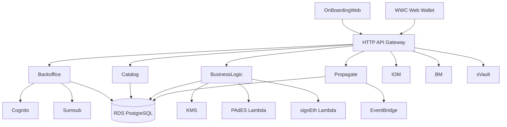

# System Overview

## Purpose

This document summarizes the architecture that is verifiable in the current Sybol repository. It intentionally distinguishes between implemented components, partially wired components, and roadmap material described elsewhere.

## Context

Sybol is built as a multi-tenant credential platform with React frontends, Node.js/Express services, AWS Cognito for identity, PostgreSQL on RDS for data, AWS KMS for signing-related operations, and EventBridge for part of the cross-tenant propagation flow.

The repository supports these actor groups:

- Issuers operating credential and catalog workflows in the wallet web app
- Tenant users progressing through onboarding and KYB
- Receiving tenants or counterparties in propagation and contact flows
- Platform operators provisioning base infrastructure and tenant-specific resources

## High-Level Architecture

## Implemented Components

| Component | Role in the system | Evidence in repo |
| --------- | ------------------ | ---------------- |
| `webApps/wwc` | Main wallet-style application for credential, presentation, contact, catalog, and delegation flows | React app plus service layer calling `/api/bo`, `/api/bl`, `/api/catalog`, `/api/ps` |
| `webApps/OnBoardingWeb` | Onboarding and KYB user journey | React app with registration, MFA step, KYB screens, Sumsub-related flows |
| `services/backoffice` | KYB, DID document, and email APIs | Express app exposing `/api/bo/*` |
| `services/businessLogic` | Credential and presentation domain logic | Express app exposing `/api/bl/*` |
| `services/catalog` | Catalog of documents, claims, forms, and compliance regions | Express app exposing `/api/catalog/*` |
| `services/propagate` | Cross-tenant delivery and EventBridge publishing | Express app exposing `/api/ps/*` plus EventBridge handler |
| `services/svault` | KMS-backed crypto service for JWT and blockchain operations | Service README and package manifest |
| `infraestructure/CoreInfra` | Base AWS resources | CDK stack provisioning VPC, RDS, Cognito, Identity Pool, Lambda and HTTP API |
| `infraestructure/ClientInfra` | Tenant provisioning | CDK stack and scripts for tenant IAM roles, tenant DB creation, and tenant setup |
| `lambdas/PAdES` and `lambdas/signEth` | Signing helpers | Dedicated Lambda projects |

## Data and Control Flows

### Credential and Presentation Flow

1. The WWC application calls the `businessLogic` API under `/api/bl/*`.
2. `businessLogic` persists tenant-scoped data in PostgreSQL.
3. `businessLogic` validates issuer and subject identity through the backoffice DID document endpoints.
4. Where signing is required, it uses AWS KMS and the dedicated signing helpers.
5. Cross-tenant transfer can continue through the `propagate` service.

### Tenant Onboarding Flow

1. The onboarding web application manages registration, legal acceptance, MFA step progression, and KYB screens.
2. KYB token generation and webhook processing are handled by `services/backoffice` with Sumsub.
3. Tenant infrastructure is provisioned separately through the `ClientInfra` CDK stack and shell scripts.

## AWS Footprint Verified in Code

### Present in `CoreInfra`

- VPC and security groups
- RDS PostgreSQL 15.8
- Cognito User Pool and User Pool Client
- Cognito Identity Pool with a basic authenticated role
- HTTP API Gateway with JWT authorizer
- Lambda integration for selected services

### Present in service code or supporting projects

- AWS KMS
- AWS Secrets Manager
- AWS STS
- Amazon EventBridge
- Sumsub integration

### Not currently provisioned by the checked CDK stack

- CloudFront distributions
- S3 frontend hosting
- AWS WAF
- Multi-AZ RDS configuration
- Read replicas

These may exist operationally outside the current IaC, but they are not represented in the reviewed infrastructure code and should not be described as active defaults in architecture summaries.

## Multi-Tenant Model

The current repository implements a mixed model aligned with the technical-functional document:

- Shared base infrastructure in `CoreInfra`
- Tenant-specific IAM roles and databases created through `ClientInfra`
- Tenant-aware backend access using Cognito claims and STS-based role assumption patterns
- DID document usage to resolve counterpart tenant information for propagation and contact workflows

## Current Limitations and Pending Wiring

- The changelog records newer `businessLogic` and `propagate` routes that still require API Gateway route updates in `CoreInfra`.
- The onboarding application includes MFA journey state, but the base Cognito stack does not configure MFA enforcement.
- Several docs still describe frontend delivery through CloudFront and S3 even though the current CDK stack does not provision those resources.

## References

- [Component Architecture](component-architecture.md)
- [Project Overview](../overview/project-overview.md)
- [Repository Structure](../development/repository-structure.md)
- [Current State Audit](../current-state-audit.md)
