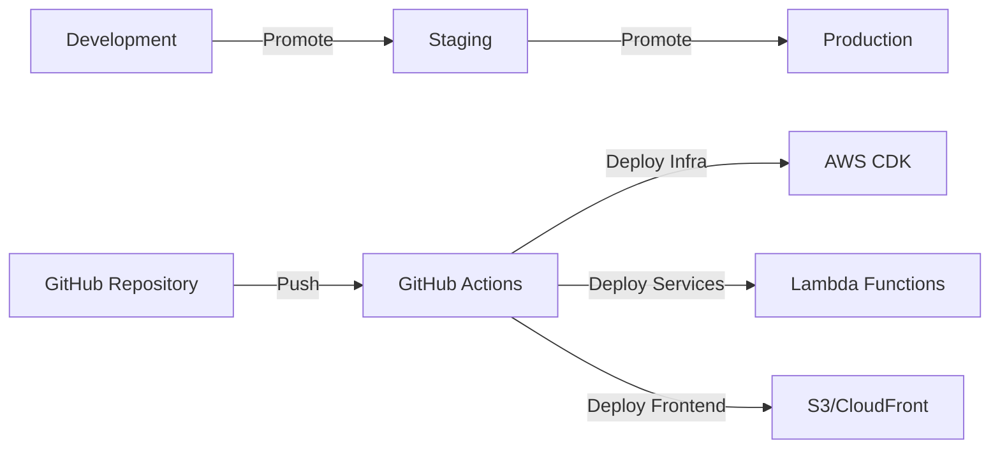

# Deployment Procedures

## Purpose

This document provides procedures for deploying infrastructure, services, and applications in the Sybol platform using CI/CD pipelines and manual processes.

## Context

Sybol uses a combination of AWS CDK for infrastructure-as-code, container-based Lambda deployments, and S3/CloudFront for frontend hosting. Deployments follow a progression from development to staging to production environments.

---

## Deployment Architecture



---

## Environment Configuration

| Environment | Purpose | Deployment Method | Approval Required |
|------------|---------|-------------------|-------------------|
| Development | Active development and testing | Automatic on push to `develop` | No |
| Staging | Pre-production validation | Automatic on push to `staging` | No |
| Production | Live tenant workloads | Manual trigger from `main` | Yes (2 approvers) |

---

## Infrastructure Deployment

### CDK Stack Management

Infrastructure is defined using AWS CDK in TypeScript.

#### Directory Structure

```
infraestructure/
├── CoreInfra/          # Shared core infrastructure
│   ├── bin/
│   ├── lib/
│   │   ├── cognito-stack.ts
│   │   ├── rds-stack.ts
│   │   ├── vpc-stack.ts
│   │   ├── lambda-stack.ts
│   │   └── apigateway-stack.ts
│   └── cdk.json
└── ClientInfra/        # Per-tenant infrastructure
    ├── bin/
    ├── lib/
    │   ├── cloudfront-stack.ts
    │   ├── iam-stack.ts
    │   └── kms-stack.ts
    └── cdk.json
```

### Deploy Core Infrastructure

Core infrastructure is deployed once and rarely updated.

#### Prerequisites

```bash
# Install dependencies
cd infraestructure/CoreInfra
npm install

# Configure AWS credentials
export AWS_PROFILE=sybol-admin
export AWS_REGION=eu-west-1
```

#### Synthesize CloudFormation Templates

```bash
# Generate CloudFormation templates
cdk synth

# Review changes
cdk diff
```

#### Deploy Core Stacks

```bash
# Deploy all core stacks
cdk deploy --all --require-approval never

# Or deploy individual stacks
cdk deploy CoreInfra-VPC-Stack
cdk deploy CoreInfra-RDS-Stack
cdk deploy CoreInfra-Cognito-Stack
cdk deploy CoreInfra-Lambda-Stack
cdk deploy CoreInfra-APIGateway-Stack
```

#### Verify Deployment

```bash
# List deployed stacks
cdk list

# Get stack outputs
aws cloudformation describe-stacks \
  --stack-name CoreInfra-APIGateway-Stack \
  --query 'Stacks[0].Outputs'
```

### Deploy Client Infrastructure

Client infrastructure is deployed per tenant.

#### Configure Tenant Parameters

```bash
cd infraestructure/ClientInfra

# Set tenant-specific parameters
export TENANT_ID=repsol
export TENANT_DOMAIN=repsol.staging.wallet.sybol.id
export ENVIRONMENT=staging
```

#### Deploy Tenant Stacks

```bash
# Synthesize with tenant context
cdk synth -c tenantId=$TENANT_ID -c domain=$TENANT_DOMAIN

# Deploy tenant stacks
cdk deploy --all \
  -c tenantId=$TENANT_ID \
  -c domain=$TENANT_DOMAIN \
  -c environment=$ENVIRONMENT
```

### Update Existing Stacks

When infrastructure changes are required:

```bash
# Review changes
cdk diff CoreInfra-Lambda-Stack

# Deploy with change confirmation
cdk deploy CoreInfra-Lambda-Stack --require-approval broadening
```

### Destroy Infrastructure

⚠️ **Dangerous operation** - Use with extreme caution.

```bash
# Destroy tenant infrastructure
cdk destroy --all -c tenantId=$TENANT_ID

# Destroy core infrastructure (requires all tenants removed first)
cdk destroy --all
```

---

## Lambda Service Deployment

Lambda functions use container images stored in ECR.

### Build Lambda Container Images

#### Directory Structure

```
services/
├── backoffice/
│   ├── Dockerfile
│   ├── package.json
│   └── src/
├── businesslogic/
├── propagate/
└── catalog/
```

#### Build Script

```bash
#!/bin/bash
# Deploy script: deploy/deployServices.sh

SERVICE=$1  # backoffice, businesslogic, propagate, catalog
REGION=${AWS_REGION:-eu-west-1}
ACCOUNT_ID=$(aws sts get-caller-identity --query Account --output text)
ECR_REPO="${ACCOUNT_ID}.dkr.ecr.${REGION}.amazonaws.com/sybol/${SERVICE}"

# Authenticate Docker with ECR
aws ecr get-login-password --region $REGION | \
  docker login --username AWS --password-stdin $ECR_REPO

# Build image
cd services/${SERVICE}
docker build -t sybol/${SERVICE}:latest .

# Tag image
docker tag sybol/${SERVICE}:latest ${ECR_REPO}:latest
docker tag sybol/${SERVICE}:latest ${ECR_REPO}:$(git rev-parse --short HEAD)

# Push both tags
docker push ${ECR_REPO}:latest
docker push ${ECR_REPO}:$(git rev-parse --short HEAD)

echo "Deployed ${SERVICE} - Image: ${ECR_REPO}:$(git rev-parse --short HEAD)"
```

#### Deploy All Services

```bash
# Deploy all Lambda services
./deploy/deployServices.sh backoffice
./deploy/deployServices.sh businesslogic
./deploy/deployServices.sh propagate
./deploy/deployServices.sh catalog
```

### Update Lambda Function Image

#### Automatic Update (after ECR push)

Lambda automatically pulls latest image if configured with `latest` tag.

#### Manual Update

```bash
# Update specific Lambda function
aws lambda update-function-code \
  --function-name backoffice \
  --image-uri ${ACCOUNT_ID}.dkr.ecr.eu-west-1.amazonaws.com/sybol/backoffice:$(git rev-parse --short HEAD)

# Wait for update to complete
aws lambda wait function-updated \
  --function-name backoffice

# Verify new image
aws lambda get-function \
  --function-name backoffice \
  --query 'Code.ImageUri'
```

### Update Lambda Configuration

#### Update Environment Variables

```bash
# Update environment variables
aws lambda update-function-configuration \
  --function-name businesslogic \
  --environment Variables="{
    DB_HOST=sybol-cluster.cluster-xxxxx.eu-west-1.rds.amazonaws.com,
    DB_PORT=5432,
    NEW_VARIABLE=new_value
  }"
```

#### Update Memory or Timeout

```bash
# Increase memory allocation
aws lambda update-function-configuration \
  --function-name propagate \
  --memory-size 1024 \
  --timeout 60
```

### Rollback Lambda Deployment

```bash
# List previous image versions
aws ecr describe-images \
  --repository-name sybol/businesslogic \
  --query 'sort_by(imageDetails,&imagePushedAt)[-5:].[imageDigest,imageTags]'

# Rollback to specific version
aws lambda update-function-code \
  --function-name businesslogic \
  --image-uri ${ACCOUNT_ID}.dkr.ecr.eu-west-1.amazonaws.com/sybol/businesslogic:abc1234
```

---

## Frontend Deployment

Frontend applications are built React SPAs deployed to S3 and served via CloudFront.

### Build Frontend

```bash
cd webApps/wwc

# Install dependencies
npm install

# Configure environment
cat > .env.production <<EOF
REACT_APP_TENANT_ID=${TENANT_ID}
REACT_APP_API_URL=https://api.sybol.id
REACT_APP_COGNITO_USER_POOL_ID=${USER_POOL_ID}
REACT_APP_COGNITO_CLIENT_ID=${APP_CLIENT_ID}
REACT_APP_REGION=eu-west-1
EOF

# Build production bundle
npm run build
```

### Deploy to S3

```bash
#!/bin/bash
# Deploy script for frontend

TENANT_ID=$1
BUCKET="sybol-statics"
PREFIX="wwc-staging/${TENANT_ID}"

# Sync build files (with long cache for assets)
aws s3 sync build/ s3://${BUCKET}/${PREFIX}/ \
  --delete \
  --cache-control "public, max-age=31536000, immutable" \
  --exclude "index.html" \
  --exclude "*.map"

# Upload index.html with no-cache
aws s3 cp build/index.html s3://${BUCKET}/${PREFIX}/index.html \
  --cache-control "public, max-age=0, must-revalidate" \
  --content-type "text/html"

echo "Frontend deployed to s3://${BUCKET}/${PREFIX}/"
```

### Invalidate CloudFront Cache

```bash
# Get distribution ID for tenant
DISTRIBUTION_ID=$(aws cloudfront list-distributions \
  --query "DistributionList.Items[?Aliases.Items[?contains(@, '${TENANT_ID}')]].Id" \
  --output text)

# Create cache invalidation
aws cloudfront create-invalidation \
  --distribution-id $DISTRIBUTION_ID \
  --paths "/*"

# Check invalidation status
aws cloudfront get-invalidation \
  --distribution-id $DISTRIBUTION_ID \
  --id INVALIDATION_ID
```

### Frontend Rollback

```bash
# S3 versioning must be enabled for rollback

# List object versions
aws s3api list-object-versions \
  --bucket sybol-statics \
  --prefix wwc-staging/${TENANT_ID}/index.html

# Restore previous version
aws s3api copy-object \
  --bucket sybol-statics \
  --copy-source sybol-statics/wwc-staging/${TENANT_ID}/index.html?versionId=VERSION_ID \
  --key wwc-staging/${TENANT_ID}/index.html

# Invalidate CloudFront
aws cloudfront create-invalidation \
  --distribution-id $DISTRIBUTION_ID \
  --paths "/index.html"
```

---

## GitHub Actions CI/CD

### Workflow Configuration

#### Core Infrastructure Deployment

`.github/workflows/deploy-core-infra.yml`

```yaml
name: Deploy Core Infrastructure

on:
  push:
    branches: [main]
    paths:
      - 'infraestructure/CoreInfra/**'
  workflow_dispatch:

jobs:
  deploy:
    runs-on: ubuntu-latest
    environment: production
    steps:
      - uses: actions/checkout@v3
      
      - name: Configure AWS credentials
        uses: aws-actions/configure-aws-credentials@v2
        with:
          aws-access-key-id: ${{ secrets.AWS_ACCESS_KEY_ID }}
          aws-secret-access-key: ${{ secrets.AWS_SECRET_ACCESS_KEY }}
          aws-region: eu-west-1
      
      - name: Setup Node.js
        uses: actions/setup-node@v3
        with:
          node-version: '18'
      
      - name: Install CDK
        run: npm install -g aws-cdk
      
      - name: Deploy Core Infrastructure
        working-directory: infraestructure/CoreInfra
        run: |
          npm install
          cdk deploy --all --require-approval never
```

#### Lambda Service Deployment

`.github/workflows/deploy-lambda-services.yml`

```yaml
name: Deploy Lambda Services

on:
  push:
    branches: [main, staging, develop]
    paths:
      - 'services/**'
  workflow_dispatch:
    inputs:
      service:
        description: 'Service to deploy (or all)'
        required: true
        default: 'all'

jobs:
  deploy:
    runs-on: ubuntu-latest
    strategy:
      matrix:
        service: [backoffice, businesslogic, propagate, catalog]
    steps:
      - uses: actions/checkout@v3
      
      - name: Configure AWS credentials
        uses: aws-actions/configure-aws-credentials@v2
        with:
          aws-access-key-id: ${{ secrets.AWS_ACCESS_KEY_ID }}
          aws-secret-access-key: ${{ secrets.AWS_SECRET_ACCESS_KEY }}
          aws-region: eu-west-1
      
      - name: Login to Amazon ECR
        id: login-ecr
        uses: aws-actions/amazon-ecr-login@v1
      
      - name: Build and push Docker image
        env:
          ECR_REGISTRY: ${{ steps.login-ecr.outputs.registry }}
          ECR_REPOSITORY: sybol/${{ matrix.service }}
          IMAGE_TAG: ${{ github.sha }}
        run: |
          cd services/${{ matrix.service }}
          docker build -t $ECR_REGISTRY/$ECR_REPOSITORY:$IMAGE_TAG .
          docker tag $ECR_REGISTRY/$ECR_REPOSITORY:$IMAGE_TAG $ECR_REGISTRY/$ECR_REPOSITORY:latest
          docker push $ECR_REGISTRY/$ECR_REPOSITORY:$IMAGE_TAG
          docker push $ECR_REGISTRY/$ECR_REPOSITORY:latest
      
      - name: Update Lambda function
        run: |
          aws lambda update-function-code \
            --function-name ${{ matrix.service }} \
            --image-uri ${{ steps.login-ecr.outputs.registry }}/sybol/${{ matrix.service }}:${{ github.sha }}
```

#### Frontend Deployment

`.github/workflows/deploy-frontend.yml`

```yaml
name: Deploy Frontend

on:
  push:
    branches: [main, staging]
    paths:
      - 'webApps/wwc/**'
  workflow_dispatch:
    inputs:
      tenant_id:
        description: 'Tenant ID to deploy'
        required: true

jobs:
  deploy:
    runs-on: ubuntu-latest
    steps:
      - uses: actions/checkout@v3
      
      - name: Setup Node.js
        uses: actions/setup-node@v3
        with:
          node-version: '18'
      
      - name: Build frontend
        working-directory: webApps/wwc
        env:
          REACT_APP_API_URL: ${{ secrets.API_URL }}
          REACT_APP_COGNITO_USER_POOL_ID: ${{ secrets.COGNITO_USER_POOL_ID }}
          REACT_APP_COGNITO_CLIENT_ID: ${{ secrets.COGNITO_CLIENT_ID }}
        run: |
          npm install
          npm run build
      
      - name: Configure AWS credentials
        uses: aws-actions/configure-aws-credentials@v2
        with:
          aws-access-key-id: ${{ secrets.AWS_ACCESS_KEY_ID }}
          aws-secret-access-key: ${{ secrets.AWS_SECRET_ACCESS_KEY }}
          aws-region: eu-west-1
      
      - name: Deploy to S3
        run: |
          aws s3 sync webApps/wwc/build/ \
            s3://sybol-statics/wwc-staging/${{ github.event.inputs.tenant_id }}/ \
            --delete \
            --cache-control "public, max-age=31536000, immutable" \
            --exclude "index.html"
          
          aws s3 cp webApps/wwc/build/index.html \
            s3://sybol-statics/wwc-staging/${{ github.event.inputs.tenant_id }}/index.html \
            --cache-control "public, max-age=0, must-revalidate"
      
      - name: Invalidate CloudFront
        run: |
          DIST_ID=$(aws cloudfront list-distributions \
            --query "DistributionList.Items[?Aliases.Items[?contains(@, '${{ github.event.inputs.tenant_id }}')]].Id" \
            --output text)
          
          aws cloudfront create-invalidation \
            --distribution-id $DIST_ID \
            --paths "/*"
```

### Manual Workflow Triggers

```bash
# Trigger core infrastructure deployment
gh workflow run deploy-core-infra.yml

# Trigger specific service deployment
gh workflow run deploy-lambda-services.yml -f service=businesslogic

# Trigger frontend deployment for tenant
gh workflow run deploy-frontend.yml -f tenant_id=repsol
```

---

## Database Migrations

### Schema Changes

#### Create Migration Script

```sql
-- migrations/V001__add_credential_metadata.sql

BEGIN;

-- Add new column
ALTER TABLE credentials 
  ADD COLUMN metadata JSONB DEFAULT '{}'::jsonb;

-- Add index
CREATE INDEX idx_credentials_metadata ON credentials USING GIN (metadata);

-- Update existing rows
UPDATE credentials SET metadata = '{}'::jsonb WHERE metadata IS NULL;

COMMIT;
```

#### Execute Migration

```bash
# Development environment
psql -h sybol-cluster-dev.cluster-xxxxx.eu-west-1.rds.amazonaws.com \
     -U repsol_admin \
     -d tenant_repsol \
     -f migrations/V001__add_credential_metadata.sql

# Verify migration
psql -h sybol-cluster-dev.cluster-xxxxx.eu-west-1.rds.amazonaws.com \
     -U repsol_admin \
     -d tenant_repsol \
     -c "\d credentials"
```

#### Rollback Migration

```sql
-- rollback/V001__add_credential_metadata.sql

BEGIN;

-- Drop index
DROP INDEX IF EXISTS idx_credentials_metadata;

-- Drop column
ALTER TABLE credentials DROP COLUMN IF EXISTS metadata;

COMMIT;
```

### Apply Migration to All Tenants

```bash
#!/bin/bash
# Script: apply-migration-all-tenants.sh

MIGRATION_FILE=$1
CLUSTER_ENDPOINT="sybol-cluster.cluster-xxxxx.eu-west-1.rds.amazonaws.com"

# Get list of tenant databases
TENANTS=$(psql -h $CLUSTER_ENDPOINT -U postgres -d postgres -tAc \
  "SELECT datname FROM pg_database WHERE datname LIKE 'tenant_%'")

# Apply migration to each tenant
for TENANT in $TENANTS; do
  echo "Applying migration to $TENANT..."
  
  # Extract tenant ID
  TENANT_ID=${TENANT#tenant_}
  
  # Get admin username
  ADMIN_USER="${TENANT_ID}_admin"
  
  # Execute migration
  psql -h $CLUSTER_ENDPOINT -U $ADMIN_USER -d $TENANT -f $MIGRATION_FILE
  
  if [ $? -eq 0 ]; then
    echo "✓ Migration applied to $TENANT"
  else
    echo "✗ Migration failed for $TENANT"
    exit 1
  fi
done

echo "Migration completed for all tenants"
```

---

## Blue-Green Deployment

For zero-downtime deployments of Lambda functions.

### Strategy

1. Deploy new version with alias
2. Split traffic between versions
3. Monitor metrics
4. Complete cutover or rollback

### Implementation

```bash
# Publish new Lambda version
NEW_VERSION=$(aws lambda publish-version \
  --function-name businesslogic \
  --query 'Version' \
  --output text)

echo "Published version: $NEW_VERSION"

# Update BLUE alias to new version
aws lambda update-alias \
  --function-name businesslogic \
  --name BLUE \
  --function-version $NEW_VERSION

# Configure weighted routing (90% old, 10% new)
aws lambda update-alias \
  --function-name businesslogic \
  --name LIVE \
  --function-version $((NEW_VERSION - 1)) \
  --routing-config "AdditionalVersionWeights={\"$NEW_VERSION\"=0.1}"

# Monitor for 10 minutes
sleep 600

# Check CloudWatch metrics for errors
ERROR_RATE=$(aws cloudwatch get-metric-statistics \
  --namespace AWS/Lambda \
  --metric-name Errors \
  --dimensions Name=FunctionName,Value=businesslogic \
  --start-time $(date -u -d '10 minutes ago' +%Y-%m-%dT%H:%M:%S) \
  --end-time $(date -u +%Y-%m-%dT%H:%M:%S) \
  --period 600 \
  --statistics Sum \
  --query 'Datapoints[0].Sum' \
  --output text)

if [ "$ERROR_RATE" -lt 5 ]; then
  echo "Metrics look good, completing cutover..."
  
  # Route 100% traffic to new version
  aws lambda update-alias \
    --function-name businesslogic \
    --name LIVE \
    --function-version $NEW_VERSION \
    --routing-config '{}'
  
  echo "Deployment completed successfully"
else
  echo "Error rate too high, rolling back..."
  
  # Route 100% traffic back to old version
  aws lambda update-alias \
    --function-name businesslogic \
    --name LIVE \
    --function-version $((NEW_VERSION - 1)) \
    --routing-config '{}'
  
  echo "Rollback completed"
  exit 1
fi
```

---

## Environment Promotion

### Dev → Staging Promotion

```bash
#!/bin/bash
# Promote from development to staging

# Tag release
git tag -a v1.2.3 -m "Release v1.2.3"
git push origin v1.2.3

# Merge to staging branch
git checkout staging
git merge develop --no-ff -m "Promote v1.2.3 to staging"
git push origin staging

# Trigger staging deployment
gh workflow run deploy-lambda-services.yml --ref staging
```

### Staging → Production Promotion

```bash
#!/bin/bash
# Promote from staging to production (requires approval)

# Create pull request
gh pr create \
  --base main \
  --head staging \
  --title "Release v1.2.3 to Production" \
  --body "Promoting staging to production. Includes:
- Feature X
- Bug fix Y
- Performance improvements"

# After approval and merge, deployment triggers automatically
```

---

## Rollback Procedures

### Immediate Rollback Checklist

When production issues require immediate rollback:

- [ ] Identify affected components (Lambda, frontend, database)
- [ ] Notify team in incident channel
- [ ] Execute rollback procedure
- [ ] Verify service restoration
- [ ] Document incident
- [ ] Schedule post-mortem

### Lambda Rollback

```bash
# Quick rollback to previous version
aws lambda update-alias \
  --function-name businesslogic \
  --name LIVE \
  --function-version $((CURRENT_VERSION - 1))
```

### Frontend Rollback

```bash
# Restore previous S3 version (requires versioning enabled)
./scripts/rollback-frontend.sh repsol 1
```

### Database Rollback

```bash
# Execute rollback migration
psql -h $CLUSTER -U $USER -d $DATABASE -f rollback/V001.sql
```

---

## Deployment Checklist

### Pre-Deployment

- [ ] Code reviewed and approved
- [ ] Tests passing in CI/CD
- [ ] Database migrations prepared and tested
- [ ] Rollback plan documented
- [ ] Deployment window scheduled
- [ ] Stakeholders notified

### During Deployment

- [ ] Monitor CloudWatch metrics
- [ ] Check error rates in dashboards
- [ ] Verify API health endpoints
- [ ] Test critical user flows
- [ ] Monitor RDS connections

### Post-Deployment

- [ ] Smoke tests completed
- [ ] Metrics within normal ranges
- [ ] No error spikes detected
- [ ] User acceptance testing passed
- [ ] Documentation updated
- [ ] Deployment recorded in changelog

---

## References

- [Infrastructure Setup](infrastructure-setup.md)
- [Monitoring Guide](monitoring.md)
- [Troubleshooting Guide](troubleshooting.md)
- [AWS CDK Documentation](https://docs.aws.amazon.com/cdk/)
- [GitHub Actions Documentation](https://docs.github.com/actions)
