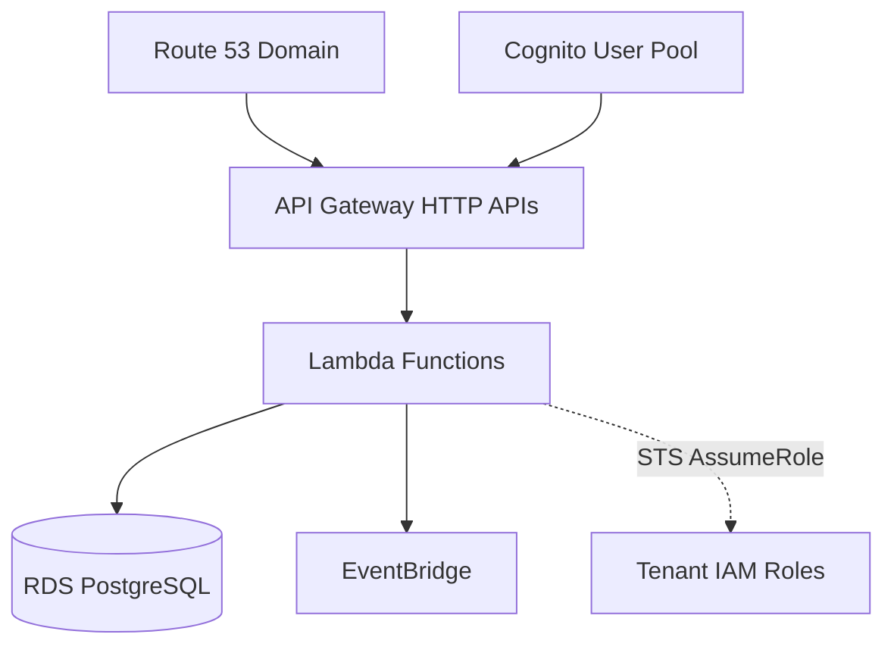

# Infrastructure Setup

## Purpose

This document provides step-by-step procedures for deploying the core shared infrastructure of the Sybol multi-tenant platform on AWS.

## Context

The core infrastructure is deployed once and shared across all tenants. It includes authentication, database, networking, compute, and API gateway services. This setup must be completed before onboarding any tenants.

---

## Prerequisites

Before starting infrastructure deployment, ensure the following requirements are met:

| Requirement | Description |
|------------|-------------|
| AWS Account | Active AWS account with administrative access |
| AWS CLI | Installed and configured with credentials |
| AWS Permissions | IAM permissions for: Route 53, Cognito, RDS, VPC, Lambda, ECR, API Gateway, EventBridge, Secrets Manager, KMS |
| Domain | Domain name purchased or ready to register |
| PostgreSQL Client | `psql` client installed for database setup |
| Docker | Docker installed for Lambda container images |
| CDK (Optional) | AWS CDK installed if using infrastructure-as-code approach |

---

## Architecture Overview



---

## Step 1: Domain Registration and Route 53

### 1.1 Register Domain

1. Navigate to **AWS Console** → **Route 53** → **Registered domains**
2. Click **Register domain**
3. Search for and select your domain (e.g., `sybol.id`)
4. Complete registration information
5. Confirm purchase

### 1.2 Create Hosted Zone

The hosted zone is automatically created during domain registration.

1. Navigate to **Route 53** → **Hosted zones**
2. Verify hosted zone exists for your domain
3. Note the **Hosted Zone ID** and **Name servers**

**Record the following information:**

```
Domain: sybol.id
Hosted Zone ID: Z1234567890ABC
Name servers: ns-xxx.awsdns-xx.com (list all 4)
```

⚠️ **Important:** Do not create DNS records yet. Subdomain records will be created during:
- API Gateway custom domain setup
- Tenant onboarding process

**Verification Checklist:**

- [ ] Domain registered and active
- [ ] Hosted zone created
- [ ] Name servers documented
- [ ] Domain status shows "Registered"

---

## Step 2: Cognito Authentication

### 2.1 Create User Pool

#### Configure Sign-In Experience

1. Navigate to **AWS Console** → **Cognito** → **User pools**
2. Click **Create user pool**

**Sign-in options** (cannot be changed after creation):

| Setting | Value |
|---------|-------|
| Sign-in identifiers | Email only |
| Self-registration | Disabled |
| Required attributes | email |

3. Click **Next**

#### Configure Security Requirements

**Password policy:**

```
Mode: Cognito defaults
Minimum length: 8 characters
Requirements: 1 number, 1 special character, 1 uppercase, 1 lowercase
```

**Multi-factor authentication:**

```
MFA enforcement: Optional MFA
MFA methods: Authenticator apps (TOTP)
```

**User account recovery:**

```
Recovery method: Email only
```

4. Click **Next**

#### Configure Sign-Up Experience

**Verification settings:**

| Setting | Value |
|---------|-------|
| Auto verification | Enabled |
| Attributes to verify | Email |
| Verification on attribute change | Send email, verify new email |

**Custom attributes** (⚠️ cannot be changed after creation):

Add two custom attributes:

**Attribute 1:**
```
Name: tenant_id
Type: String
Min length: 3
Max length: 100
Mutable: No
```

**Attribute 2:**
```
Name: role
Type: String
Min length: 4
Max length: 50
Mutable: No
```

5. Click **Next**

#### Integrate Application

**User pool configuration:**

```
User pool name: sybol-user-pool
Hosted UI: Disabled (not required)
```

**App client configuration:**

| Setting | Value |
|---------|-------|
| App client name | sybol-app-client |
| Client type | Public client |
| Client secret | Don't generate |
| Authentication flows | ALLOW_USER_SRP_AUTH, ALLOW_REFRESH_TOKEN_AUTH |

**Token expiration (recommended):**

```
Refresh token: 30 days
Access token: 15 minutes
ID token: 15 minutes
```

6. Click **Next**
7. Review all settings
8. Click **Create user pool**

⏱️ Creation takes 1-2 minutes.

**Record the following information:**

```
User Pool ID: eu-west-1_XXXXXXXXX
User Pool ARN: arn:aws:cognito-idp:eu-west-1:ACCOUNT_ID:userpool/eu-west-1_XXXXXXXXX
App Client ID: 1234567890abcdefghij
Region: eu-west-1
```

### 2.2 Create Identity Pool

1. Navigate to **Cognito** → **Identity pools**
2. Click **Create identity pool**

**Configuration:**

| Setting | Value |
|---------|-------|
| Identity pool name | sybol-identity-pool |
| Unauthenticated access | Disabled |
| Authentication providers | Cognito User Pool |
| User pool ID | eu-west-1_XXXXXXXXX |
| App client ID | 1234567890abcdefghij |
| Basic (classic) flow | Disabled (use enhanced flow only) |

3. Create new IAM roles:
   - **Authenticated role name:** `Cognito_sybol_Auth_Role`

4. Click **Create**

**Record the following information:**

```
Identity Pool ID: eu-west-1:aaaa-bbbb-cccc-dddd-eeee
Auth Role ARN: arn:aws:iam::ACCOUNT_ID:role/Cognito_sybol_Auth_Role
```

**Verification Checklist:**

- [ ] User pool created with custom attributes
- [ ] App client configured with SRP authentication
- [ ] Identity pool created
- [ ] IAM roles generated
- [ ] All IDs and ARNs documented

---

## Step 3: VPC and Networking

### 3.1 Create VPC

1. Navigate to **AWS Console** → **VPC** → **Your VPCs**
2. Click **Create VPC**

**Configuration:**

```
Name: sybol-vpc
IPv4 CIDR block: 10.0.0.0/16
IPv6 CIDR block: No IPv6
Tenancy: Default
```

3. Click **Create VPC**

**Record the following information:**

```
VPC ID: vpc-xxxxx
CIDR: 10.0.0.0/16
```

### 3.2 Create Public Subnets

Create two public subnets for high availability across availability zones.

#### Subnet 1

1. Navigate to **VPC** → **Subnets** → **Create subnet**

**Configuration:**

```
VPC: sybol-vpc
Subnet name: sybol-public-subnet-1a
Availability Zone: eu-west-1a
IPv4 CIDR block: 10.0.1.0/24
```

2. Click **Create subnet**

#### Subnet 2

Repeat for second availability zone:

```
Subnet name: sybol-public-subnet-1b
Availability Zone: eu-west-1b
IPv4 CIDR block: 10.0.2.0/24
```

**Record the following information:**

```
Subnet 1 ID: subnet-1a-xxxxx (10.0.1.0/24, eu-west-1a)
Subnet 2 ID: subnet-1b-xxxxx (10.0.2.0/24, eu-west-1b)
```

### 3.3 Create Internet Gateway

1. Navigate to **VPC** → **Internet Gateways** → **Create internet gateway**

**Configuration:**

```
Name: sybol-igw
```

2. Click **Create internet gateway**
3. Select the created IGW
4. Click **Actions** → **Attach to VPC**
5. Select `sybol-vpc`
6. Click **Attach internet gateway**

**Record the following information:**

```
Internet Gateway ID: igw-xxxxx
Attached to: sybol-vpc
```

### 3.4 Configure Route Table

1. Navigate to **VPC** → **Route Tables**
2. Locate the default route table for `sybol-vpc`
3. Select it and click **Edit routes**
4. Add route:

```
Destination: 0.0.0.0/0
Target: Internet Gateway (sybol-igw)
```

5. Click **Save changes**

6. Click **Subnet associations** tab
7. Click **Edit subnet associations**
8. Select both public subnets
9. Click **Save associations**

### 3.5 Enable Auto-Assign Public IP

For each subnet:

1. Select subnet → **Actions** → **Edit subnet settings**
2. Enable **Auto-assign public IPv4 address**
3. Click **Save**

### 3.6 Create Security Groups

#### Security Group: internal-sg

1. Navigate to **EC2** → **Security Groups** → **Create security group**

**Configuration:**

```
Name: internal-sg
Description: Internal access within VPC
VPC: sybol-vpc
```

**Inbound rules:**

```bash
Type: All traffic
Source: 10.0.0.0/16
Description: Allow all traffic from VPC
```

**Outbound rules:**

```bash
Type: All traffic
Destination: 0.0.0.0/0
Description: Allow all outbound traffic
```

2. Click **Create security group**

**Record the following information:**

```
Internal SG: sg-internal123
```

#### Security Group: lambda-sg

Create security group for Lambda functions:

```
Name: lambda-sg
Description: Security group for Lambda functions
VPC: sybol-vpc
```

**Inbound rules:** None

**Outbound rules:**

```bash
Type: All traffic
Destination: 0.0.0.0/0
Description: Allow all outbound traffic
```

**Record the following information:**

```
Lambda SG: sg-lambda123
```

#### Security Group: rds-sg

Create security group for RDS database:

```
Name: rds-sg
Description: PostgreSQL access for RDS cluster
VPC: sybol-vpc
```

**Inbound rules:**

| Type | Port | Source | Description |
|------|------|--------|-------------|
| PostgreSQL | 5432 | sg-lambda123 | Allow Lambda access |
| PostgreSQL | 5432 | sg-internal123 | Allow internal VPC access |
| PostgreSQL | 5432 | [IP]/32 | Maintenance IP (add as needed) |

**Outbound rules:** None

**Record the following information:**

```
RDS SG: sg-rds123
Maintenance IPs: [List of configured IPs]
```

**Verification Checklist:**

- [ ] VPC created with CIDR 10.0.0.0/16
- [ ] Two public subnets in different AZs
- [ ] Internet Gateway attached to VPC
- [ ] Route table configured with internet route
- [ ] Auto-assign public IP enabled on subnets
- [ ] Three security groups created (internal-sg, lambda-sg, rds-sg)

---

## Step 4: RDS PostgreSQL Database

### 4.1 Create RDS Cluster

1. Navigate to **AWS Console** → **RDS** → **Databases**
2. Click **Create database**

**Configuration:**

| Setting | Value |
|---------|-------|
| Engine | PostgreSQL |
| Version | PostgreSQL 17.4 |
| Template | Production |
| Deployment | Serverless v2 |
| Cluster identifier | sybol-cluster |
| Master username | postgres |
| Master password | [Generate secure password or use Secrets Manager] |

**Serverless v2 scaling:**

```
Minimum ACUs: 0.5
Maximum ACUs: 2 (adjust based on load)
```

**Connectivity:**

| Setting | Value |
|---------|-------|
| VPC | sybol-vpc |
| Subnet group | Create new (selects both public subnets) |
| Public access | No |
| VPC security group | rds-sg |

**Additional configuration:**

| Setting | Value |
|---------|-------|
| Initial database | postgres |
| Backup retention | 7 days |
| Encryption | Enabled (default AWS KMS) |
| IAM database authentication | Enabled |
| Performance Insights | Enabled (recommended) |
| Enhanced monitoring | Enabled (60 seconds recommended) |

3. Click **Create database**

⏱️ Creation takes 5-10 minutes.

**Record the following information:**

```
Cluster Endpoint: sybol-cluster.cluster-xxxxx.eu-west-1.rds.amazonaws.com
Reader Endpoint: sybol-cluster.cluster-ro-xxxxx.eu-west-1.rds.amazonaws.com
Port: 5432
Master User: postgres
Master Password: [Store in Secrets Manager]
Security Groups: rds-sg, internal-sg
```

### 4.2 Store Master Password in Secrets Manager

1. Navigate to **AWS Secrets Manager** → **Store a new secret**
2. Select **Credentials for RDS database**
3. Enter username and password
4. Select database: `sybol-cluster`
5. Secret name: `rds/master-credentials`
6. Click **Store**

### 4.3 Create Backoffice Database

#### Connect to Cluster

From a bastion host or EC2 instance in the VPC:

```bash
psql -h sybol-cluster.cluster-xxxxx.eu-west-1.rds.amazonaws.com \
     -U postgres \
     -p 5432 \
     -d postgres
```

#### Create Database and Users

```sql
-- Create backoffice database
CREATE DATABASE backofficedev;

-- Connect to database
\c backofficedev

-- Revoke public access (CRITICAL for security)
REVOKE CONNECT ON DATABASE backofficedev FROM PUBLIC;
REVOKE ALL ON SCHEMA public FROM PUBLIC;

-- Create sybol_admin user (admin for system + tenant sybol)
CREATE USER sybol_admin WITH PASSWORD 'GENERATE_SECURE_PASSWORD';

-- Grant full permissions to sybol_admin (ONLY user with write access)
GRANT CONNECT ON DATABASE backofficedev TO sybol_admin;
GRANT ALL PRIVILEGES ON DATABASE backofficedev TO sybol_admin;
GRANT ALL PRIVILEGES ON SCHEMA public TO sybol_admin;

-- Permissions on existing tables
GRANT ALL PRIVILEGES ON ALL TABLES IN SCHEMA public TO sybol_admin;
GRANT ALL PRIVILEGES ON ALL SEQUENCES IN SCHEMA public TO sybol_admin;
GRANT ALL PRIVILEGES ON ALL FUNCTIONS IN SCHEMA public TO sybol_admin;

-- Permissions on future tables
ALTER DEFAULT PRIVILEGES IN SCHEMA public GRANT ALL ON TABLES TO sybol_admin;
ALTER DEFAULT PRIVILEGES IN SCHEMA public GRANT ALL ON SEQUENCES TO sybol_admin;
ALTER DEFAULT PRIVILEGES IN SCHEMA public GRANT ALL ON FUNCTIONS TO sybol_admin;

-- Verify users
\du

-- Verify PUBLIC has no access
\l+ backofficedev
```

#### Execute Schema

```sql
-- Execute backoffice schema as sybol_admin
\i /path/to/services/backoffice/database/schema.sql

-- Verify tables created
\dt

-- Verify table ownership (should be sybol_admin)
\dt+
```

**Expected tables:**
- `did_documents`
- `did_keys`
- `catalog_entries`
- `catalog_claims`

**Store credentials in Secrets Manager:**

```bash
aws secretsmanager create-secret \
  --name backoffice/admin-password \
  --secret-string '{"username":"sybol_admin","password":"ACTUAL_PASSWORD"}'
```

**Record the following information:**

```
Database: backofficedev
Owner: postgres
Write access user: sybol_admin (ONLY user with write access)
Password location: Secrets Manager - backoffice/admin-password
```

### 4.4 Create Catalog Database

```sql
-- Connect to postgres
\c postgres

-- Create catalog database
CREATE DATABASE catalog;

-- Connect to database
\c catalog

-- Revoke public access (CRITICAL for security)
REVOKE CONNECT ON DATABASE catalog FROM PUBLIC;
REVOKE ALL ON SCHEMA public FROM PUBLIC;

-- Create catalog service user (READ ONLY)
CREATE USER catalog WITH PASSWORD 'GENERATE_SECURE_PASSWORD';

-- Grant READ-ONLY permissions to catalog user
GRANT CONNECT ON DATABASE catalog TO catalog;
GRANT USAGE ON SCHEMA public TO catalog;
GRANT SELECT ON ALL TABLES IN SCHEMA public TO catalog;

-- Permissions on future tables (READ ONLY)
ALTER DEFAULT PRIVILEGES IN SCHEMA public GRANT SELECT ON TABLES TO catalog;

-- Grant full permissions to sybol_admin
GRANT CONNECT ON DATABASE catalog TO sybol_admin;
GRANT ALL PRIVILEGES ON DATABASE catalog TO sybol_admin;
GRANT ALL PRIVILEGES ON SCHEMA public TO sybol_admin;

-- Permissions on existing tables
GRANT ALL PRIVILEGES ON ALL TABLES IN SCHEMA public TO sybol_admin;
GRANT ALL PRIVILEGES ON ALL SEQUENCES IN SCHEMA public TO sybol_admin;
GRANT ALL PRIVILEGES ON ALL FUNCTIONS IN SCHEMA public TO sybol_admin;

-- Permissions on future tables
ALTER DEFAULT PRIVILEGES IN SCHEMA public GRANT ALL ON TABLES TO sybol_admin;
ALTER DEFAULT PRIVILEGES IN SCHEMA public GRANT ALL ON SEQUENCES TO sybol_admin;
ALTER DEFAULT PRIVILEGES IN SCHEMA public GRANT ALL ON FUNCTIONS TO sybol_admin;

-- Verify users
\du catalog
\du sybol_admin
```

#### Execute Schema

```sql
-- Execute catalog schema as sybol_admin
\i /path/to/services/catalog/database/schema.sql

-- Verify tables
\dt

-- Verify permissions
\z
```

**Store credentials in Secrets Manager:**

```bash
aws secretsmanager create-secret \
  --name catalog/service-password \
  --secret-string '{"username":"catalog","password":"ACTUAL_PASSWORD"}'
```

**Record the following information:**

```
Database: catalog
Service user: catalog (READ ONLY)
Admin user: sybol_admin (WRITE access)
Password location: Secrets Manager - catalog/service-password
```

### 4.5 Create propagate_system User

The `propagate_system` user has READ+WRITE access to ALL tenant databases but NO access to core databases.

```sql
-- Connect to postgres
\c postgres

-- Create propagate_system user
CREATE USER propagate_system WITH PASSWORD 'GENERATE_SECURE_PASSWORD';

-- Verify user created
\du propagate_system
```

**Store credentials in Secrets Manager:**

```bash
aws secretsmanager create-secret \
  --name rds/propagate-system-password \
  --secret-string '{"username":"propagate_system","password":"ACTUAL_PASSWORD"}'
```

**Record the following information:**

```
User: propagate_system
Purpose: Write access to all tenant databases
Access: NO access to catalog or backofficedev
Password location: Secrets Manager - rds/propagate-system-password
```

⚠️ **Important:** The `propagate_system` user will be granted permissions to each tenant database during tenant onboarding.

**Verification Checklist:**

- [ ] RDS cluster created and available
- [ ] Master password stored in Secrets Manager
- [ ] backofficedev database created
- [ ] catalog database created
- [ ] sybol_admin user created with write access
- [ ] catalog user created with read-only access
- [ ] propagate_system user created
- [ ] All passwords stored in Secrets Manager
- [ ] PUBLIC access revoked from all databases
- [ ] Schemas executed successfully

---

## Step 5: IAM Policies for STS AssumeRole

Lambda functions need permission to assume tenant-specific IAM roles via STS.

### 5.1 Create STS AssumeRole Policy

1. Navigate to **IAM** → **Policies** → **Create policy**
2. Select **JSON** tab
3. Enter the following policy:

```json
{
  "Version": "2012-10-17",
  "Statement": [
    {
      "Effect": "Allow",
      "Action": "sts:AssumeRole",
      "Resource": "arn:aws:iam::ACCOUNT_ID:role/TenantRole-*"
    }
  ]
}
```

4. Replace `ACCOUNT_ID` with your AWS account ID
5. Click **Next**
6. Policy name: `LambdaAssumeTenantRolesPolicy`
7. Description: `Allows Lambda functions to assume tenant-specific IAM roles`
8. Click **Create policy**

**Record the following information:**

```
Policy Name: LambdaAssumeTenantRolesPolicy
Policy ARN: arn:aws:iam::ACCOUNT_ID:policy/LambdaAssumeTenantRolesPolicy
```

⚠️ **Note:** This policy will be attached to Lambda execution roles in Step 6.

---

## Step 6: Lambda Functions and ECR

### 6.1 Create ECR Repositories

Create private ECR repositories for Lambda container images.

For each service (backoffice, businesslogic, propagate, catalog):

```bash
# Create ECR repository
aws ecr create-repository \
  --repository-name sybol/backoffice \
  --region eu-west-1

aws ecr create-repository \
  --repository-name sybol/businesslogic \
  --region eu-west-1

aws ecr create-repository \
  --repository-name sybol/propagate \
  --region eu-west-1

aws ecr create-repository \
  --repository-name sybol/catalog \
  --region eu-west-1
```

**Record the following information:**

```
ECR Repositories:
- sybol/backoffice: ACCOUNT_ID.dkr.ecr.eu-west-1.amazonaws.com/sybol/backoffice
- sybol/businesslogic: ACCOUNT_ID.dkr.ecr.eu-west-1.amazonaws.com/sybol/businesslogic
- sybol/propagate: ACCOUNT_ID.dkr.ecr.eu-west-1.amazonaws.com/sybol/propagate
- sybol/catalog: ACCOUNT_ID.dkr.ecr.eu-west-1.amazonaws.com/sybol/catalog
```

### 6.2 Build and Push Docker Images

For each Lambda service:

```bash
# Authenticate Docker with ECR
aws ecr get-login-password --region eu-west-1 | \
  docker login --username AWS --password-stdin \
  ACCOUNT_ID.dkr.ecr.eu-west-1.amazonaws.com

# Build image (example for backoffice)
cd services/backoffice
docker build -t sybol/backoffice:latest .

# Tag image
docker tag sybol/backoffice:latest \
  ACCOUNT_ID.dkr.ecr.eu-west-1.amazonaws.com/sybol/backoffice:latest

# Push image
docker push ACCOUNT_ID.dkr.ecr.eu-west-1.amazonaws.com/sybol/backoffice:latest
```

Repeat for `businesslogic`, `propagate`, and `catalog` services.

### 6.3 Create Lambda Functions

#### Create backoffice Lambda

1. Navigate to **AWS Console** → **Lambda** → **Create function**
2. Select **Container image**

**Configuration:**

| Setting | Value |
|---------|-------|
| Function name | backoffice |
| Container image URI | ACCOUNT_ID.dkr.ecr.eu-west-1.amazonaws.com/sybol/backoffice:latest |
| Architecture | x86_64 |

3. Click **Create function**

**Configure function settings:**

1. **Configuration** → **General configuration** → **Edit**

```
Memory: 512 MB
Timeout: 30 seconds
```

2. **Configuration** → **VPC** → **Edit**

```
VPC: sybol-vpc
Subnets: sybol-public-subnet-1a, sybol-public-subnet-1b
Security groups: lambda-sg
```

3. **Configuration** → **Environment variables** → **Edit**

Add required environment variables:

```
DB_HOST=sybol-cluster.cluster-xxxxx.eu-west-1.rds.amazonaws.com
DB_PORT=5432
DB_NAME=backofficedev
DB_USER_SECRET=backoffice/admin-password
AWS_REGION=eu-west-1
```

4. **Configuration** → **Permissions**

Note the execution role ARN (e.g., `backoffice-role-xxxxx`)

5. Attach additional policies to execution role:

Navigate to **IAM** → **Roles** → Find execution role → **Add permissions**

Add managed policies:
- `AWSLambdaVPCAccessExecutionRole`
- `SecretsManagerReadWrite`
- `AmazonRDSDataFullAccess`

6. **Configure CloudWatch Logs retention:**

Navigate to **CloudWatch** → **Log groups** → `/aws/lambda/backoffice`

**Actions** → **Edit retention setting** → **7 days**

#### Create businesslogic Lambda

Repeat Step 6.3 with the following differences:

```
Function name: businesslogic
Container image: sybol/businesslogic:latest
Environment variables:
  - DB_USER_SECRET=tenant/{tenantId}/admin-password (dynamic)
  - All other env vars same as backoffice
```

**Attach STS policy to execution role:**

Navigate to **IAM** → **Roles** → `businesslogic-role-xxxxx` → **Add permissions**

Attach policy: `LambdaAssumeTenantRolesPolicy` (created in Step 5)

#### Create propagate Lambda

```
Function name: propagate
Container image: sybol/propagate:latest
Memory: 512 MB
Timeout: 30 seconds
VPC: sybol-vpc
Environment variables:
  - DB_USER_SECRET=rds/propagate-system-password
  - All other env vars same as backoffice
```

**Attach STS policy to execution role:**

Attach policy: `LambdaAssumeTenantRolesPolicy`

#### Create catalog Lambda

```
Function name: catalog
Container image: sybol/catalog:latest
Environment variables:
  - DB_NAME=catalog
  - DB_USER_SECRET=catalog/service-password
  - All other env vars same as backoffice
```

**Record the following information:**

```
Lambda Functions:
- backoffice: arn:aws:lambda:eu-west-1:ACCOUNT_ID:function:backoffice
- businesslogic: arn:aws:lambda:eu-west-1:ACCOUNT_ID:function:businesslogic
- propagate: arn:aws:lambda:eu-west-1:ACCOUNT_ID:function:propagate
- catalog: arn:aws:lambda:eu-west-1:ACCOUNT_ID:function:catalog

Execution Roles:
- backoffice-role-xxxxx
- businesslogic-role-xxxxx (has STS AssumeRole policy)
- propagate-role-xxxxx (has STS AssumeRole policy)
- catalog-role-xxxxx
```

**Verification Checklist:**

- [ ] Four ECR repositories created
- [ ] Docker images built and pushed to ECR
- [ ] Four Lambda functions created from container images
- [ ] VPC configuration applied to all functions
- [ ] Environment variables configured
- [ ] Execution roles have required permissions
- [ ] businesslogic and propagate have STS AssumeRole policy
- [ ] CloudWatch Logs retention set to 7 days

---

## Step 7: API Gateway

### 7.1 Create Backoffice HTTP API

1. Navigate to **AWS Console** → **API Gateway** → **Create API**
2. Select **HTTP API** → **Build**

**Configuration:**

```
API name: backoffice-api
Description: Backoffice API for DID document management
```

3. Click **Next**

#### Add Routes

Skip route creation for now, click **Next**

#### Define Stages

```
Stage name: $default (auto-deploy)
```

4. Click **Next**
5. Review and click **Create**

**Record the following information:**

```
API ID: abcd1234
Invoke URL: https://abcd1234.execute-api.eu-west-1.amazonaws.com
```

### 7.2 Create Main HTTP API

Repeat Step 7.1 with:

```
API name: sybol-api
Description: Main API for business logic, propagate, and catalog services
```

**Record the following information:**

```
API ID: efgh5678
Invoke URL: https://efgh5678.execute-api.eu-west-1.amazonaws.com
```

### 7.3 Create JWT Authorizer

The authorizer validates JWT tokens from Cognito User Pool.

1. Select `sybol-api`
2. Navigate to **Authorization** → **Manage authorizers**
3. Click **Create**

**Configuration:**

| Setting | Value |
|---------|-------|
| Authorizer type | JWT |
| Name | cognito-authorizer |
| Identity source | $request.header.Authorization |
| Issuer URL | https://cognito-idp.eu-west-1.amazonaws.com/eu-west-1_XXXXXXXXX |
| Audience | App Client ID from Cognito |

4. Click **Create**

Repeat for `backoffice-api`.

**Record the following information:**

```
Authorizer ID: auth123
Name: cognito-authorizer
```

### 7.4 Configure Routes and Integrations

#### Backoffice API Routes

1. Select `backoffice-api` → **Routes** → **Create**

**Route configuration:**

```
Method: ANY
Path: /{proxy+}
Integration: backoffice Lambda function
Authorization: cognito-authorizer
```

2. Click **Create**

#### Main API Routes

1. Select `sybol-api` → **Routes** → **Create**

Create three routes:

**Route 1: Business Logic**
```
Method: ANY
Path: /api/bl/{proxy+}
Integration: businesslogic Lambda function
Authorization: cognito-authorizer
```

**Route 2: Propagate Service**
```
Method: ANY
Path: /api/ps/{proxy+}
Integration: propagate Lambda function
Authorization: cognito-authorizer
```

**Route 3: Catalog Service**
```
Method: ANY
Path: /api/catalog/{proxy+}
Integration: catalog Lambda function
Authorization: cognito-authorizer
```

### 7.5 Custom Domains (Optional)

#### Create ACM Certificate

1. Navigate to **AWS Certificate Manager** (us-east-1 region)
2. **Request certificate**
3. Enter domains:
   ```
   backoffice.sybol.id
   api.sybol.id
   ```
4. Select **DNS validation**
5. Click **Request**
6. Create validation records in Route 53

⏱️ Validation takes 5-15 minutes.

#### Configure Custom Domains

1. In API Gateway, navigate to **Custom domain names** → **Create**

**Configuration for backoffice:**

```
Domain name: backoffice.sybol.id
ACM certificate: Select validated certificate
```

2. Add **API mapping:**

```
API: backoffice-api
Stage: $default
Path: (empty)
```

3. Click **Create**

**Configuration for main API:**

```
Domain name: api.sybol.id
ACM certificate: Select validated certificate
API mapping:
  - API: sybol-api
  - Stage: $default
  - Path: (empty)
```

#### Update Route 53

1. Navigate to **Route 53** → **Hosted zones** → `sybol.id`
2. Create A records:

**Record 1:**
```
Name: backoffice.sybol.id
Type: A - Alias
Alias target: API Gateway domain (auto-populated)
```

**Record 2:**
```
Name: api.sybol.id
Type: A - Alias
Alias target: API Gateway domain (auto-populated)
```

**Record the following information:**

```
Backoffice API URL: https://backoffice.sybol.id
Main API URL: https://api.sybol.id
```

**Verification Checklist:**

- [ ] Two HTTP APIs created
- [ ] JWT authorizer configured with Cognito
- [ ] Routes created for all Lambda functions
- [ ] Integrations configured
- [ ] Custom domains configured (if applicable)
- [ ] Route 53 records created
- [ ] APIs accessible via HTTPS

---

## Step 8: EventBridge Setup

EventBridge enables cross-tenant asynchronous communication.

### 8.1 Create Event Bus

1. Navigate to **AWS Console** → **EventBridge** → **Event buses**
2. Click **Create event bus**

**Configuration:**

```
Name: sybol-event-bus
Description: Event bus for cross-tenant messaging
```

3. Click **Create**

**Record the following information:**

```
Event Bus Name: sybol-event-bus
Event Bus ARN: arn:aws:events:eu-west-1:ACCOUNT_ID:event-bus/sybol-event-bus
```

### 8.2 Configure Event Rules

#### Propagate Service Event Rule

1. Navigate to **EventBridge** → **Rules** → **Create rule**

**Configuration:**

```
Name: propagate-events
Event bus: sybol-event-bus
Rule type: Rule with an event pattern
```

**Event pattern:**

```json
{
  "source": ["sybol.propagate"],
  "detail-type": ["credential.issued", "presentation.requested"]
}
```

**Target:**

```
Target type: AWS service
Select a target: Lambda function
Function: propagate
```

2. Click **Create rule**

### 8.3 Grant Lambda Permissions to Publish Events

Update Lambda execution roles to include EventBridge permissions.

For each Lambda that publishes events (businesslogic, propagate):

1. Navigate to **IAM** → **Roles** → Select execution role
2. **Add permissions** → **Create inline policy**

**Policy:**

```json
{
  "Version": "2012-10-17",
  "Statement": [
    {
      "Effect": "Allow",
      "Action": [
        "events:PutEvents"
      ],
      "Resource": "arn:aws:events:eu-west-1:ACCOUNT_ID:event-bus/sybol-event-bus"
    }
  ]
}
```

3. Policy name: `EventBridgePublishPolicy`
4. Click **Create policy**

**Verification Checklist:**

- [ ] Event bus created
- [ ] Event rules configured
- [ ] Lambda functions have permission to publish events
- [ ] Event targets configured correctly

---

## Step 9: Verification and Testing

### 9.1 Infrastructure Verification

Verify all core infrastructure components are deployed and functional:

| Component | Verification Method | Expected Result |
|-----------|---------------------|-----------------|
| Route 53 | Check hosted zone | Domain active, name servers configured |
| Cognito | Test user pool | Can create test user, obtain tokens |
| RDS | Connect via psql | Databases created, users configured |
| VPC | Check subnets and routing | Internet connectivity verified |
| Lambda | Test invocation | Functions execute successfully |
| API Gateway | Send test request | Routes return responses |
| EventBridge | Test event publishing | Events delivered to targets |

### 9.2 Connectivity Testing

#### Test Lambda to RDS

Invoke Lambda function and verify database connectivity:

```bash
aws lambda invoke \
  --function-name catalog \
  --payload '{"action":"health-check"}' \
  response.json

cat response.json
```

Expected response: Database connection successful

#### Test API Gateway

```bash
# Obtain Cognito token (requires test user)
aws cognito-idp initiate-auth \
  --auth-flow USER_SRP_AUTH \
  --client-id YOUR_APP_CLIENT_ID \
  --auth-parameters USERNAME=test@example.com,SRP_A=...

# Test API with token
curl -H "Authorization: Bearer YOUR_JWT_TOKEN" \
  https://api.sybol.id/api/catalog/health
```

Expected response: 200 OK

### 9.3 Create Test Cognito User

Create a test user to verify authentication flow:

```bash
aws cognito-idp admin-create-user \
  --user-pool-id eu-west-1_XXXXXXXXX \
  --username test@example.com \
  --user-attributes \
    Name=email,Value=test@example.com \
    Name=custom:tenant_id,Value=sybol \
    Name=custom:role,Value=admin \
  --temporary-password TempPass123! \
  --message-action SUPPRESS
```

### 9.4 Security Validation

Verify security configurations:

- [ ] RDS is not publicly accessible
- [ ] Lambda functions in VPC with appropriate security groups
- [ ] Secrets Manager stores all passwords
- [ ] IAM roles follow least privilege principle
- [ ] API Gateway requires JWT authorization
- [ ] CloudWatch Logs encrypted at rest
- [ ] RDS encryption enabled
- [ ] VPC flow logs enabled (optional but recommended)

---

## Troubleshooting

### Lambda Cannot Connect to RDS

**Symptom:** Lambda functions timeout when accessing database

**Solutions:**
1. Verify Lambda is in correct VPC and subnets
2. Check security group rules allow Lambda SG to reach RDS SG on port 5432
3. Verify RDS security group inbound rules include Lambda SG
4. Check Lambda has AWSLambdaVPCAccessExecutionRole policy

### API Gateway Returns 401 Unauthorized

**Symptom:** All API requests return 401 even with valid token

**Solutions:**
1. Verify JWT authorizer configuration
2. Check Issuer URL matches Cognito User Pool
3. Verify Audience matches App Client ID
4. Ensure token is passed in Authorization header
5. Check token is not expired

### ECR Push Fails

**Symptom:** Docker push to ECR fails with authentication error

**Solutions:**
1. Re-authenticate Docker:
   ```bash
   aws ecr get-login-password --region eu-west-1 | \
     docker login --username AWS --password-stdin \
     ACCOUNT_ID.dkr.ecr.eu-west-1.amazonaws.com
   ```
2. Verify IAM permissions include ECR push access
3. Check repository exists and name is correct

### RDS Connection Timeout

**Symptom:** Cannot connect to RDS from bastion host

**Solutions:**
1. Verify bastion host is in VPC with internal-sg security group
2. Check RDS security group allows connections from internal-sg
3. Verify RDS is in same VPC
4. Check network ACLs are not blocking traffic

---

## Next Steps

After completing core infrastructure setup:

1. **Review Configuration:** Verify all recorded information is accurate and stored securely
2. **Document Credentials:** Ensure all passwords are in Secrets Manager
3. **Backup Configuration:** Export and save infrastructure configuration
4. **Proceed to Tenant Onboarding:** Follow [tenant-onboarding.md](tenant-onboarding.md) to create first tenant

---

## References

- [Tenant Onboarding Guide](tenant-onboarding.md)
- [Deployment Procedures](deployment-procedures.md)
- [Security Architecture](../architecture/security-architecture.md)
- [Multi-Tenancy Design](../architecture/multi-tenancy.md)
