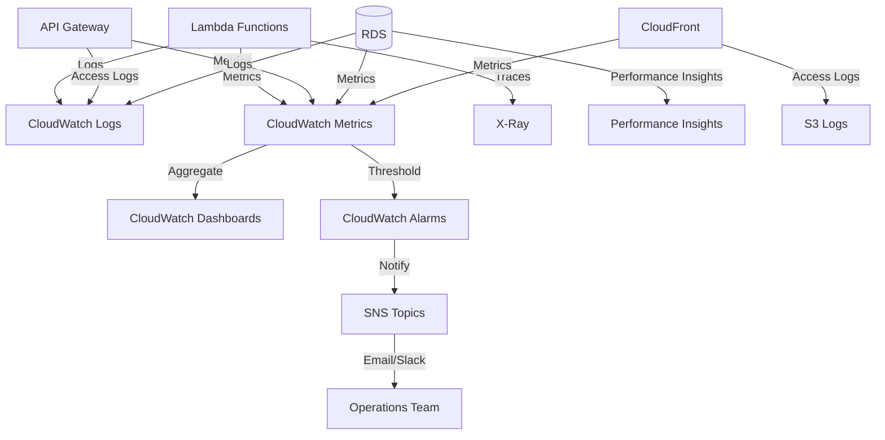

# Monitoring and Observability

## Purpose

This document describes monitoring, logging, and observability practices for the Sybol multi-tenant platform using AWS CloudWatch, X-Ray, and related services.

## Context

Effective monitoring enables early detection of issues, performance optimization, and capacity planning. The platform uses CloudWatch Logs, Metrics, Dashboards, and Alarms to provide comprehensive visibility into system health.

---

## Monitoring Architecture



---

## CloudWatch Logs

### Log Groups Structure

| Service | Log Group | Retention |
|---------|-----------|-----------|
| Backoffice Lambda | /aws/lambda/backoffice | 7 days |
| Business Logic Lambda | /aws/lambda/businesslogic | 7 days |
| Propagate Lambda | /aws/lambda/propagate | 7 days |
| Catalog Lambda | /aws/lambda/catalog | 7 days |
| API Gateway (Backoffice) | /aws/apigateway/backoffice-api | 14 days |
| API Gateway (Main) | /aws/apigateway/sybol-api | 14 days |
| RDS PostgreSQL | /aws/rds/cluster/sybol-cluster/postgresql | 7 days |

### Configure Log Retention

```bash
# Set retention for Lambda log groups
for FUNCTION in backoffice businesslogic propagate catalog; do
  aws logs put-retention-policy \
    --log-group-name /aws/lambda/$FUNCTION \
    --retention-in-days 7
done

# Set retention for API Gateway
aws logs put-retention-policy \
  --log-group-name /aws/apigateway/sybol-api \
  --retention-in-days 14
```

### Enable API Gateway Logging

```bash
# Create CloudWatch Logs role for API Gateway
aws iam create-role \
  --role-name APIGatewayCloudWatchLogsRole \
  --assume-role-policy-document '{
    "Version": "2012-10-17",
    "Statement": [{
      "Effect": "Allow",
      "Principal": {"Service": "apigateway.amazonaws.com"},
      "Action": "sts:AssumeRole"
    }]
  }'

# Attach policy
aws iam attach-role-policy \
  --role-name APIGatewayCloudWatchLogsRole \
  --policy-arn arn:aws:iam::aws:policy/service-role/AmazonAPIGatewayPushToCloudWatchLogs

# Set account-level API Gateway logging role
aws apigateway update-account \
  --patch-operations op=replace,path=/cloudwatchRoleArn,value=arn:aws:iam::ACCOUNT_ID:role/APIGatewayCloudWatchLogsRole

# Enable logging for specific API stage
aws apigatewayv2 update-stage \
  --api-id abcd1234 \
  --stage-name $default \
  --access-log-settings '{
    "DestinationArn": "arn:aws:logs:eu-west-1:ACCOUNT_ID:log-group:/aws/apigateway/sybol-api",
    "Format": "$context.requestId $context.error.message $context.error.messageString"
  }'
```

### Log Query Examples

#### Lambda Errors

```
# CloudWatch Insights query for Lambda errors
fields @timestamp, @message, @logStream
| filter @message like /ERROR/
| sort @timestamp desc
| limit 100
```

#### API Gateway 5xx Errors

```
# Query for server errors
fields @timestamp, requestId, status, error.message
| filter status >= 500
| stats count() by status, error.message
```

#### Slow Database Queries

```
# Query Lambda logs for slow RDS queries
fields @timestamp, @message
| filter @message like /query took/
| parse @message "query took * ms" as duration
| filter duration > 1000
| sort duration desc
```

#### Tenant-Specific Logs

```
# Filter logs by tenant ID
fields @timestamp, @message
| filter @message like /tenant_id: repsol/
| sort @timestamp desc
| limit 50
```

---

## CloudWatch Metrics

### Key Metrics to Monitor

#### Lambda Function Metrics

| Metric | Description | Alert Threshold |
|--------|-------------|----------------|
| Invocations | Number of function invocations | N/A (baseline) |
| Errors | Number of errors | > 5 in 5 minutes |
| Duration | Execution time | p99 > 5000ms |
| Throttles | Throttled invocations | > 0 |
| ConcurrentExecutions | Concurrent executions | > 80% of reserved concurrency |
| DeadLetterErrors | Failed async invocations | > 0 |

#### API Gateway Metrics

| Metric | Description | Alert Threshold |
|--------|-------------|----------------|
| Count | Total API requests | N/A (baseline) |
| 4XXError | Client errors | > 10% of requests |
| 5XXError | Server errors | > 1% of requests |
| Latency | Response time | p95 > 2000ms |
| IntegrationLatency | Backend latency | p95 > 1500ms |

#### RDS Metrics

| Metric | Description | Alert Threshold |
|--------|-------------|----------------|
| CPUUtilization | CPU usage percentage | > 80% |
| DatabaseConnections | Active connections | > 80% of max_connections |
| FreeableMemory | Available memory | < 1 GB |
| ReadLatency | Read operation latency | > 50ms |
| WriteLatency | Write operation latency | > 100ms |
| ACUUtilization | Serverless capacity utilization | > 90% |

#### CloudFront Metrics

| Metric | Description | Alert Threshold |
|--------|-------------|----------------|
| Requests | Total requests | N/A (baseline) |
| BytesDownloaded | Data transferred | Monitor for cost |
| 4xxErrorRate | Client error rate | > 5% |
| 5xxErrorRate | Server error rate | > 1% |
| OriginLatency | S3 origin latency | p95 > 500ms |

### Custom Metrics

#### Publish Custom Metrics from Lambda

```python
# Python Lambda function publishing custom metrics
import boto3
from datetime import datetime

cloudwatch = boto3.client('cloudwatch')

def publish_metric(metric_name, value, unit='Count', tenant_id=None):
    dimensions = [{'Name': 'Environment', 'Value': 'production'}]
    
    if tenant_id:
        dimensions.append({'Name': 'TenantId', 'Value': tenant_id})
    
    cloudwatch.put_metric_data(
        Namespace='Sybol/Application',
        MetricData=[{
            'MetricName': metric_name,
            'Value': value,
            'Unit': unit,
            'Timestamp': datetime.utcnow(),
            'Dimensions': dimensions
        }]
    )

# Usage example
def lambda_handler(event, context):
    tenant_id = event['tenant_id']
    
    # Business logic...
    
    # Publish custom metrics
    publish_metric('CredentialsIssued', 1, 'Count', tenant_id)
    publish_metric('CredentialIssuanceDuration', 234, 'Milliseconds', tenant_id)
```

#### Query Custom Metrics

```bash
# Get credential issuance count per tenant
aws cloudwatch get-metric-statistics \
  --namespace Sybol/Application \
  --metric-name CredentialsIssued \
  --dimensions Name=TenantId,Value=repsol \
  --start-time 2024-03-01T00:00:00Z \
  --end-time 2024-03-10T23:59:59Z \
  --period 86400 \
  --statistics Sum
```

---

## CloudWatch Dashboards

### Service Health Dashboard

Create comprehensive dashboards for service monitoring.

#### Dashboard JSON Template

```json
{
  "widgets": [
    {
      "type": "metric",
      "properties": {
        "title": "Lambda Invocations",
        "metrics": [
          ["AWS/Lambda", "Invocations", {"stat": "Sum"}],
          [".", "Errors", {"stat": "Sum"}]
        ],
        "period": 300,
        "region": "eu-west-1",
        "yAxis": {"left": {"label": "Count"}}
      }
    },
    {
      "type": "metric",
      "properties": {
        "title": "Lambda Duration (p99)",
        "metrics": [
          ["AWS/Lambda", "Duration", {"stat": "p99"}]
        ],
        "period": 300,
        "region": "eu-west-1",
        "yAxis": {"left": {"label": "Milliseconds"}}
      }
    },
    {
      "type": "metric",
      "properties": {
        "title": "API Gateway Requests",
        "metrics": [
          ["AWS/ApiGateway", "Count", {"stat": "Sum"}],
          [".", "5XXError", {"stat": "Sum"}],
          [".", "4XXError", {"stat": "Sum"}]
        ],
        "period": 300,
        "region": "eu-west-1"
      }
    },
    {
      "type": "metric",
      "properties": {
        "title": "RDS Connections",
        "metrics": [
          ["AWS/RDS", "DatabaseConnections", {"stat": "Average"}]
        ],
        "period": 300,
        "region": "eu-west-1"
      }
    }
  ]
}
```

#### Create Dashboard via CLI

```bash
# Create service health dashboard
aws cloudwatch put-dashboard \
  --dashboard-name Sybol-Service-Health \
  --dashboard-body file://dashboards/service-health.json
```

### Tenant-Specific Dashboard

Monitor metrics for individual tenants.

```json
{
  "widgets": [
    {
      "type": "metric",
      "properties": {
        "title": "Credentials Issued - Repsol",
        "metrics": [
          ["Sybol/Application", "CredentialsIssued", {
            "stat": "Sum",
            "dimensions": {"TenantId": "repsol"}
          }]
        ],
        "period": 3600,
        "region": "eu-west-1"
      }
    },
    {
      "type": "metric",
      "properties": {
        "title": "API Latency - Repsol",
        "metrics": [
          ["AWS/ApiGateway", "Latency", {
            "stat": "p95",
            "dimensions": {"TenantId": "repsol"}
          }]
        ],
        "period": 300,
        "region": "eu-west-1"
      }
    }
  ]
}
```

### Create Dashboards in Console

1. Navigate to **CloudWatch** → **Dashboards** → **Create dashboard**
2. Name: `Sybol-Service-Health`
3. Add widgets:
   - **Line graph:** Lambda invocations and errors
   - **Line graph:** Lambda duration percentiles
   - **Number:** Current error rate
   - **Line graph:** API Gateway latency
   - **Line graph:** RDS CPU and memory
   - **Log insights widget:** Recent errors

---

## CloudWatch Alarms

### Lambda Function Alarms

#### High Error Rate Alarm

```bash
# Create alarm for Lambda errors
aws cloudwatch put-metric-alarm \
  --alarm-name businesslogic-high-error-rate \
  --alarm-description "Alert when businesslogic Lambda has high error rate" \
  --metric-name Errors \
  --namespace AWS/Lambda \
  --statistic Sum \
  --period 300 \
  --threshold 5 \
  --comparison-operator GreaterThanThreshold \
  --evaluation-periods 1 \
  --dimensions Name=FunctionName,Value=businesslogic \
  --alarm-actions arn:aws:sns:eu-west-1:ACCOUNT_ID:ops-alerts
```

#### High Duration Alarm

```bash
# Create alarm for slow Lambda execution
aws cloudwatch put-metric-alarm \
  --alarm-name propagate-high-duration \
  --alarm-description "Alert when propagate Lambda is slow" \
  --metric-name Duration \
  --namespace AWS/Lambda \
  --statistic Average \
  --period 300 \
  --threshold 5000 \
  --comparison-operator GreaterThanThreshold \
  --evaluation-periods 2 \
  --dimensions Name=FunctionName,Value=propagate \
  --alarm-actions arn:aws:sns:eu-west-1:ACCOUNT_ID:ops-alerts
```

#### Throttling Alarm

```bash
# Create alarm for Lambda throttling
aws cloudwatch put-metric-alarm \
  --alarm-name businesslogic-throttled \
  --alarm-description "Alert when Lambda is throttled" \
  --metric-name Throttles \
  --namespace AWS/Lambda \
  --statistic Sum \
  --period 60 \
  --threshold 0 \
  --comparison-operator GreaterThanThreshold \
  --evaluation-periods 1 \
  --dimensions Name=FunctionName,Value=businesslogic \
  --alarm-actions arn:aws:sns:eu-west-1:ACCOUNT_ID:ops-critical
```

### API Gateway Alarms

#### High 5xx Error Rate

```bash
# Create alarm for API server errors
aws cloudwatch put-metric-alarm \
  --alarm-name api-high-5xx-errors \
  --alarm-description "Alert when API has high 5xx error rate" \
  --metric-name 5XXError \
  --namespace AWS/ApiGateway \
  --statistic Sum \
  --period 300 \
  --threshold 10 \
  --comparison-operator GreaterThanThreshold \
  --evaluation-periods 1 \
  --dimensions Name=ApiId,Value=abcd1234 \
  --alarm-actions arn:aws:sns:eu-west-1:ACCOUNT_ID:ops-critical
```

### RDS Alarms

#### High CPU Utilization

```bash
# Create alarm for high RDS CPU
aws cloudwatch put-metric-alarm \
  --alarm-name rds-high-cpu \
  --alarm-description "Alert when RDS CPU is high" \
  --metric-name CPUUtilization \
  --namespace AWS/RDS \
  --statistic Average \
  --period 300 \
  --threshold 80 \
  --comparison-operator GreaterThanThreshold \
  --evaluation-periods 2 \
  --dimensions Name=DBClusterIdentifier,Value=sybol-cluster \
  --alarm-actions arn:aws:sns:eu-west-1:ACCOUNT_ID:ops-alerts
```

#### High Database Connections

```bash
# Create alarm for connection pool exhaustion
aws cloudwatch put-metric-alarm \
  --alarm-name rds-high-connections \
  --alarm-description "Alert when RDS connections are high" \
  --metric-name DatabaseConnections \
  --namespace AWS/RDS \
  --statistic Average \
  --period 60 \
  --threshold 80 \
  --comparison-operator GreaterThanThreshold \
  --evaluation-periods 3 \
  --dimensions Name=DBClusterIdentifier,Value=sybol-cluster \
  --alarm-actions arn:aws:sns:eu-west-1:ACCOUNT_ID:ops-critical
```

#### Low Freeable Memory

```bash
# Create alarm for low RDS memory
aws cloudwatch put-metric-alarm \
  --alarm-name rds-low-memory \
  --alarm-description "Alert when RDS memory is low" \
  --metric-name FreeableMemory \
  --namespace AWS/RDS \
  --statistic Average \
  --period 300 \
  --threshold 1073741824 \
  --comparison-operator LessThanThreshold \
  --evaluation-periods 2 \
  --dimensions Name=DBClusterIdentifier,Value=sybol-cluster \
  --alarm-actions arn:aws:sns:eu-west-1:ACCOUNT_ID:ops-alerts
```

### Composite Alarms

Combine multiple alarms to reduce false positives.

```bash
# Create composite alarm for service health
aws cloudwatch put-composite-alarm \
  --alarm-name sybol-service-degraded \
  --alarm-description "Alert when multiple service health indicators are degraded" \
  --alarm-rule "ALARM(businesslogic-high-error-rate) OR ALARM(api-high-5xx-errors) OR ALARM(rds-high-connections)" \
  --alarm-actions arn:aws:sns:eu-west-1:ACCOUNT_ID:ops-critical
```

---

## SNS Alert Topics

### Create Alert Topics

```bash
# Create critical alerts topic
aws sns create-topic --name ops-critical

# Create warning alerts topic
aws sns create-topic --name ops-alerts

# Subscribe email addresses
aws sns subscribe \
  --topic-arn arn:aws:sns:eu-west-1:ACCOUNT_ID:ops-critical \
  --protocol email \
  --notification-endpoint ops-team@sybol.id

aws sns subscribe \
  --topic-arn arn:aws:sns:eu-west-1:ACCOUNT_ID:ops-alerts \
  --protocol email \
  --notification-endpoint monitoring@sybol.id
```

### Integrate with Slack

```bash
# Create Lambda function for Slack integration
# (Requires Lambda function that posts to Slack webhook)

aws sns subscribe \
  --topic-arn arn:aws:sns:eu-west-1:ACCOUNT_ID:ops-critical \
  --protocol lambda \
  --notification-endpoint arn:aws:lambda:eu-west-1:ACCOUNT_ID:function:slack-notifier
```

---

## X-Ray Tracing

### Enable X-Ray on Lambda

```bash
# Enable active tracing on Lambda functions
aws lambda update-function-configuration \
  --function-name businesslogic \
  --tracing-config Mode=Active
```

### Add X-Ray SDK to Lambda Code

#### Python

```python
from aws_xray_sdk.core import xray_recorder
from aws_xray_sdk.core import patch_all

# Patch all supported libraries
patch_all()

@xray_recorder.capture('process_credential')
def process_credential(credential_data):
    # Business logic
    pass

def lambda_handler(event, context):
    with xray_recorder.in_subsegment('database_query') as subsegment:
        # Database operations
        subsegment.put_annotation('tenant_id', event['tenant_id'])
        subsegment.put_metadata('query_params', event['params'])
```

### Query X-Ray Traces

```bash
# Get trace summaries for errors
aws xray get-trace-summaries \
  --start-time $(date -u -d '1 hour ago' +%s) \
  --end-time $(date -u +%s) \
  --filter-expression 'error = true'

# Get service graph
aws xray get-service-graph \
  --start-time $(date -u -d '1 hour ago' +%s) \
  --end-time $(date -u +%s)
```

---

## RDS Performance Insights

### Enable Performance Insights

```bash
# Enable Performance Insights on RDS cluster
aws rds modify-db-cluster \
  --db-cluster-identifier sybol-cluster \
  --enable-performance-insights \
  --performance-insights-retention-period 7
```

### Key Metrics in Performance Insights

| Metric | Description | Investigation Action |
|--------|-------------|---------------------|
| DB Load | Number of active sessions | Identify if load exceeds capacity |
| Top SQL | Queries consuming most time | Optimize slow queries |
| Wait Events | What queries are waiting for | Identify bottlenecks (locks, I/O) |
| Top Hosts | Clients generating most load | Identify problematic services |

---

## Cost Monitoring

### Enable Cost Allocation Tags

```bash
# Tag resources for cost tracking
aws resourcegroupstaggingapi tag-resources \
  --resource-arn-list \
    arn:aws:lambda:eu-west-1:ACCOUNT_ID:function:businesslogic \
  --tags Environment=production,Service=businesslogic,CostCenter=engineering
```

### Create Cost Budget

```bash
# Create monthly budget alert
aws budgets create-budget \
  --account-id ACCOUNT_ID \
  --budget file://budget.json
```

**budget.json:**

```json
{
  "BudgetName": "Sybol-Monthly-Budget",
  "BudgetLimit": {
    "Amount": "1000",
    "Unit": "USD"
  },
  "TimeUnit": "MONTHLY",
  "BudgetType": "COST",
  "CostFilters": {
    "Service": ["Amazon RDS", "AWS Lambda", "Amazon CloudFront"]
  }
}
```

---

## Monitoring Checklist

### Daily Checks

- [ ] Review CloudWatch dashboard for anomalies
- [ ] Check alarm status (no unacknowledged alarms)
- [ ] Review error rates in Lambda and API Gateway
- [ ] Verify RDS database connections within normal range

### Weekly Checks

- [ ] Review X-Ray traces for performance bottlenecks
- [ ] Analyze CloudWatch Logs Insights for error patterns
- [ ] Check RDS Performance Insights for slow queries
- [ ] Review CloudFront cache hit ratio
- [ ] Monitor cost trends in Cost Explorer

### Monthly Checks

- [ ] Review and optimize CloudWatch Logs retention
- [ ] Analyze long-term metric trends
- [ ] Review and update alarm thresholds
- [ ] Capacity planning based on growth trends
- [ ] Cost optimization review

---

## References

- [Troubleshooting Guide](troubleshooting.md)
- [Deployment Procedures](deployment-procedures.md)
- [AWS CloudWatch Documentation](https://docs.aws.amazon.com/cloudwatch/)
- [AWS X-Ray Documentation](https://docs.aws.amazon.com/xray/)
- [RDS Performance Insights](https://docs.aws.amazon.com/AmazonRDS/latest/UserGuide/USER_PerfInsights.html)
