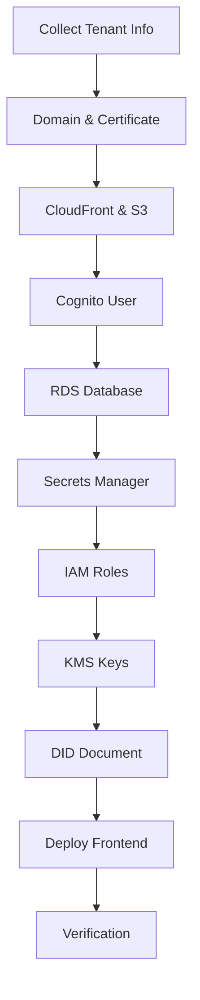

# Tenant Onboarding

## Purpose

This document provides step-by-step procedures for provisioning a new tenant in the Sybol multi-tenant platform.

## Context

The tenant onboarding process creates isolated resources for each customer including frontend hosting, database, IAM roles, encryption keys, and DID infrastructure. This process is executed once per tenant and requires core infrastructure to be deployed first.

---

## Prerequisites

Before onboarding a tenant, ensure:

| Requirement | Reference |
|------------|-----------|
| Core infrastructure deployed | [infrastructure-setup.md](infrastructure-setup.md) |
| Core databases operational | backofficedev, catalog |
| Lambda functions deployed | backoffice, businesslogic, propagate, catalog |
| API Gateway configured | JWT authorizer active |
| Access to RDS cluster | psql client configured |
| Tenant information collected | Tenant ID, domain, admin email |

---

## Tenant Information Template

Collect the following information before starting:

```
Tenant ID: [lowercase alphanumeric, e.g., repsol]
Tenant Domain: [e.g., repsol.staging.wallet.sybol.id]
Admin Email: [e.g., admin@repsol.com]
Admin Role: admin
Environment: staging/production
```

**Example for this guide:**
```
Tenant ID: repsol
Domain: repsol.staging.wallet.sybol.id
Admin Email: admin@repsol.com
Role: admin
```

---

## Onboarding Workflow



---

## Step 1: Domain and SSL Certificate

### 1.1 Create Subdomain in Route 53

1. Navigate to **AWS Console** → **Route 53** → **Hosted zones**
2. Select `sybol.id` hosted zone
3. Click **Create record**

**Configuration:**

```
Record name: repsol.staging.wallet
Record type: A - IPv4 address
Value: 1.2.3.4 (temporary - will update with CloudFront)
TTL: 300 seconds
```

4. Click **Create records**

**Record the following information:**

```
Full Domain: repsol.staging.wallet.sybol.id
Record Type: A
```

### 1.2 Request ACM Certificate

⚠️ **Important:** CloudFront requires certificates in us-east-1 region.

1. Navigate to **AWS Certificate Manager** (switch to **us-east-1** region)
2. Click **Request certificate**
3. Select **Request a public certificate**

**Configuration:**

```
Domain name: repsol.staging.wallet.sybol.id
Validation method: DNS validation
Key algorithm: RSA 2048
```

4. Click **Request**

### 1.3 Validate Certificate

1. In the certificate details, note the CNAME record details
2. Click **Create records in Route 53**
3. Verify the CNAME record is created in the hosted zone
4. Wait for certificate status to become **Issued**

⏱️ Validation typically takes 5-15 minutes.

**Record the following information:**

```
Certificate ARN: arn:aws:acm:us-east-1:ACCOUNT_ID:certificate/xxxxx-xxxxx
Status: Issued
Region: us-east-1
```

**Verification Checklist:**

- [ ] Subdomain record created in Route 53
- [ ] ACM certificate requested in us-east-1
- [ ] DNS validation record created
- [ ] Certificate status is "Issued"

---

## Step 2: CloudFront and S3

### 2.1 Create S3 Bucket

1. Navigate to **AWS Console** → **S3** → **Create bucket**

**Configuration:**

```
Bucket name: repsol-staging-wallet-frontend
Region: eu-west-1
Block all public access: Enabled (CloudFront will access via OAC)
Bucket Versioning: Disabled
Default encryption: Server-side encryption with Amazon S3 managed keys (SSE-S3)
```

2. Click **Create bucket**

**Record the following information:**

```
Bucket Name: repsol-staging-wallet-frontend
Region: eu-west-1
ARN: arn:aws:s3:::repsol-staging-wallet-frontend
```

### 2.2 Create CloudFront Distribution

1. Navigate to **AWS Console** → **CloudFront** → **Create distribution**

**Origin settings:**

| Setting | Value |
|---------|-------|
| Origin domain | repsol-staging-wallet-frontend.s3.eu-west-1.amazonaws.com |
| Origin path | (empty) |
| Name | S3-repsol-frontend |
| Origin access | Origin access control (OAC) |
| Origin access control | Create new OAC |

2. Click **Create control setting**

**OAC settings:**

```
Name: repsol-frontend-oac
Signing behavior: Sign requests (recommended)
Origin type: S3
```

3. Click **Create**

**Default cache behavior:**

| Setting | Value |
|---------|-------|
| Viewer protocol policy | Redirect HTTP to HTTPS |
| Allowed HTTP methods | GET, HEAD, OPTIONS, PUT, POST, PATCH, DELETE |
| Cache key and origin requests | CachingOptimized |
| Origin request policy | CORS-S3Origin |

**Settings:**

| Setting | Value |
|---------|-------|
| Price class | Use only North America and Europe |
| Alternate domain names (CNAMEs) | repsol.staging.wallet.sybol.id |
| Custom SSL certificate | Select certificate from Step 1.2 |
| Default root object | index.html |
| Standard logging | Off (or configure if needed) |

4. Click **Create distribution**

⏱️ Distribution deployment takes 10-15 minutes.

**Record the following information:**

```
Distribution ID: E123456789ABCD
Domain name: d111111abcdef8.cloudfront.net
Status: Enabled
```

### 2.3 Update S3 Bucket Policy

CloudFront provides the bucket policy to allow OAC access.

1. Copy the policy statement shown in the banner
2. Navigate to **S3** → Select bucket → **Permissions** → **Bucket policy**
3. Enter the following policy:

```json
{
  "Version": "2012-10-17",
  "Statement": [
    {
      "Effect": "Allow",
      "Principal": {
        "Service": "cloudfront.amazonaws.com"
      },
      "Action": "s3:GetObject",
      "Resource": "arn:aws:s3:::repsol-staging-wallet-frontend/*",
      "Condition": {
        "StringEquals": {
          "AWS:SourceArn": "arn:aws:cloudfront::ACCOUNT_ID:distribution/E123456789ABCD"
        }
      }
    }
  ]
}
```

4. Click **Save changes**

### 2.4 Configure Error Pages for SPA Routing

Single Page Applications need custom error responses for client-side routing.

1. Navigate to CloudFront distribution → **Error pages** tab
2. Click **Create custom error response**

**Error response 1:**

```
HTTP error code: 403
Customize error response: Yes
Response page path: /index.html
HTTP response code: 200
```

**Error response 2:**

```
HTTP error code: 404
Customize error response: Yes
Response page path: /index.html
HTTP response code: 200
```

3. Click **Create**

### 2.5 Update Route 53 Record

Update the temporary A record to point to CloudFront.

1. Navigate to **Route 53** → **Hosted zones** → `sybol.id`
2. Select record `repsol.staging.wallet.sybol.id`
3. Click **Edit record**

**Configuration:**

```
Record type: A
Alias: Enabled
Route traffic to: Alias to CloudFront distribution
Distribution: d111111abcdef8.cloudfront.net
Evaluate target health: No
```

4. Click **Save changes**

**Verification Checklist:**

- [ ] S3 bucket created
- [ ] CloudFront distribution deployed
- [ ] OAC configured and bucket policy updated
- [ ] Custom error responses configured for SPA
- [ ] Route 53 A record points to CloudFront
- [ ] HTTPS access works: https://repsol.staging.wallet.sybol.id

---

## Step 3: Cognito User

### 3.1 Create Tenant Admin User

1. Navigate to **AWS Console** → **Cognito** → **User pools**
2. Select `sybol-user-pool`
3. Navigate to **Users** tab → **Create user**

**Configuration:**

| Setting | Value |
|---------|-------|
| Username | admin@repsol.com |
| Email address | admin@repsol.com |
| Email verified | Marked as verified |
| Send email invitation | Enabled |
| Temporary password | Auto-generate (or set custom) |

⚠️ **Critical: Custom Attributes**

These attributes MUST be set correctly:

```
custom:tenant_id = repsol
custom:role = admin
```

4. Click **Create user**

**Record the following information:**

```
Username: admin@repsol.com
Email: admin@repsol.com
Tenant ID: repsol
Role: admin
User Status: FORCE_CHANGE_PASSWORD
```

### 3.2 Create Additional Users (Optional)

For read-only or additional admin users:

**Reader user example:**

```
Username: reader@repsol.com
Email: reader@repsol.com
custom:tenant_id = repsol
custom:role = reader
```

### 3.3 Verify User Configuration

1. Check user appears in Users list
2. Verify custom attributes are set correctly
3. Confirm invitation email sent
4. Test login flow (user must change password on first login)

**Verification Checklist:**

- [ ] Admin user created
- [ ] Custom attributes tenant_id and role set correctly
- [ ] Email invitation sent
- [ ] User can authenticate and change password

---

## Step 4: RDS Database Configuration

### 4.1 Create Tenant Database

Connect to RDS cluster:

```bash
psql -h sybol-cluster.cluster-xxxxx.eu-west-1.rds.amazonaws.com \
     -U postgres \
     -p 5432 \
     -d postgres
```

Create database with tenant naming convention:

```sql
-- Database name MUST follow pattern: tenant_{tenantId}
CREATE DATABASE tenant_repsol;

-- Connect to new database
\c tenant_repsol

-- CRITICAL: Revoke public access
REVOKE CONNECT ON DATABASE tenant_repsol FROM PUBLIC;
REVOKE ALL ON SCHEMA public FROM PUBLIC;

-- Verify database created
\l tenant_repsol

-- Verify PUBLIC has no access
\l+ tenant_repsol
```

**Record the following information:**

```
Database Name: tenant_repsol
Owner: postgres
Public Access: Revoked
```

### 4.2 Create Tenant Database Users

⚠️ **Important:** User naming must follow pattern `{tenantId}_admin` and `{tenantId}_user` for automatic policy compliance.

```sql
-- Connect to tenant database
\c tenant_repsol

-- Create admin user (read/write access)
CREATE USER repsol_admin WITH PASSWORD 'GENERATE_SECURE_PASSWORD_1';

-- Create reader user (read-only access)
CREATE USER repsol_user WITH PASSWORD 'GENERATE_SECURE_PASSWORD_2';

-- Verify users created
\du repsol_admin
\du repsol_user
```

**Generate secure passwords:**

```bash
# Generate strong passwords
openssl rand -base64 32  # For repsol_admin
openssl rand -base64 32  # For repsol_user
```

**Record the following information:**

```
Admin User: repsol_admin
Admin Password: [SECURE_PASSWORD_1]
Reader User: repsol_user
Reader Password: [SECURE_PASSWORD_2]
```

### 4.3 Configure Admin User Permissions

Grant full permissions to admin user for tenant database:

```sql
-- Connect to tenant database
\c tenant_repsol

-- Grant connection and database privileges
GRANT CONNECT ON DATABASE tenant_repsol TO repsol_admin;
GRANT ALL PRIVILEGES ON DATABASE tenant_repsol TO repsol_admin;
GRANT ALL PRIVILEGES ON SCHEMA public TO repsol_admin;

-- Permissions on existing tables
GRANT ALL PRIVILEGES ON ALL TABLES IN SCHEMA public TO repsol_admin;
GRANT ALL PRIVILEGES ON ALL SEQUENCES IN SCHEMA public TO repsol_admin;
GRANT ALL PRIVILEGES ON ALL FUNCTIONS IN SCHEMA public TO repsol_admin;

-- Permissions on future tables
ALTER DEFAULT PRIVILEGES IN SCHEMA public GRANT ALL ON TABLES TO repsol_admin;
ALTER DEFAULT PRIVILEGES IN SCHEMA public GRANT ALL ON SEQUENCES TO repsol_admin;
ALTER DEFAULT PRIVILEGES IN SCHEMA public GRANT ALL ON FUNCTIONS TO repsol_admin;

-- Verify permissions
\z
```

### 4.4 Configure Reader User Permissions

Grant read-only permissions to reader user:

```sql
-- Connect to tenant database
\c tenant_repsol

-- Grant connection and schema usage
GRANT CONNECT ON DATABASE tenant_repsol TO repsol_user;
GRANT USAGE ON SCHEMA public TO repsol_user;

-- Permissions on existing tables (SELECT only)
GRANT SELECT ON ALL TABLES IN SCHEMA public TO repsol_user;

-- Permissions on future tables (SELECT only)
ALTER DEFAULT PRIVILEGES IN SCHEMA public GRANT SELECT ON TABLES TO repsol_user;

-- Verify permissions
\z
```

### 4.5 Grant Access to propagate_system User

The `propagate_system` user needs write access to all tenant databases:

```sql
-- Connect to tenant database
\c tenant_repsol

-- Grant connection and schema usage
GRANT CONNECT ON DATABASE tenant_repsol TO propagate_system;
GRANT USAGE ON SCHEMA public TO propagate_system;
```

⚠️ **Note:** Write permissions for `propagate_system` will be granted after schema execution in Step 4.7.

### 4.6 Execute Database Schema

Copy and execute the business logic schema:

```bash
# Copy schema to bastion host
scp services/businessLogic/database/schema.sql \
    ec2-user@bastion:/tmp/tenant_repsol_schema.sql
```

Execute schema as admin user:

```sql
-- Connect as tenant admin
\c tenant_repsol repsol_admin

-- Execute schema
\i /tmp/tenant_repsol_schema.sql

-- Verify tables created
\dt

-- Expected tables:
-- credentials
-- credential_status
-- presentations
-- presentation_status
-- presentation_requests
-- presentation_request_status
-- contacts
-- events
-- delegates
```

### 4.7 Grant propagate_system Write Permissions

After tables are created, grant write permissions to propagate_system:

```sql
-- Connect to tenant database
\c tenant_repsol

-- Grant write permissions on all tables
GRANT SELECT, INSERT, UPDATE, DELETE ON ALL TABLES IN SCHEMA public TO propagate_system;
GRANT USAGE, SELECT ON ALL SEQUENCES IN SCHEMA public TO propagate_system;

-- Grant permissions on future tables
ALTER DEFAULT PRIVILEGES IN SCHEMA public 
  GRANT SELECT, INSERT, UPDATE, DELETE ON TABLES TO propagate_system;
ALTER DEFAULT PRIVILEGES IN SCHEMA public 
  GRANT USAGE, SELECT ON SEQUENCES TO propagate_system;

-- Verify permissions
\z
```

### 4.8 Grant Read Access to Catalog and Backoffice

Tenant users need read access to core databases:

```sql
-- Grant catalog read access to tenant admin
\c catalog
GRANT CONNECT ON DATABASE catalog TO repsol_admin;
GRANT USAGE ON SCHEMA public TO repsol_admin;
GRANT SELECT ON ALL TABLES IN SCHEMA public TO repsol_admin;
ALTER DEFAULT PRIVILEGES IN SCHEMA public GRANT SELECT ON TABLES TO repsol_admin;

-- Grant catalog read access to tenant reader
GRANT CONNECT ON DATABASE catalog TO repsol_user;
GRANT USAGE ON SCHEMA public TO repsol_user;
GRANT SELECT ON ALL TABLES IN SCHEMA public TO repsol_user;
ALTER DEFAULT PRIVILEGES IN SCHEMA public GRANT SELECT ON TABLES TO repsol_user;

-- Grant backoffice read access to tenant admin
\c backofficedev
GRANT CONNECT ON DATABASE backofficedev TO repsol_admin;
GRANT USAGE ON SCHEMA public TO repsol_admin;
GRANT SELECT ON ALL TABLES IN SCHEMA public TO repsol_admin;
ALTER DEFAULT PRIVILEGES IN SCHEMA public GRANT SELECT ON TABLES TO repsol_admin;

-- Grant backoffice read access to tenant reader
GRANT CONNECT ON DATABASE backofficedev TO repsol_user;
GRANT USAGE ON SCHEMA public TO repsol_user;
GRANT SELECT ON ALL TABLES IN SCHEMA public TO repsol_user;
ALTER DEFAULT PRIVILEGES IN SCHEMA public GRANT SELECT ON TABLES TO repsol_user;
```

**Verification Checklist:**

- [ ] Tenant database created following naming convention
- [ ] Admin and reader users created
- [ ] Admin has read/write permissions on tenant database
- [ ] Reader has read-only permissions on tenant database
- [ ] propagate_system has write access to tenant database
- [ ] Tenant users have read access to catalog database
- [ ] Tenant users have read access to backoffice database
- [ ] Schema executed successfully
- [ ] All tables created

---

## Step 5: Secrets Manager

### 5.1 Store Admin Database Credentials

1. Navigate to **AWS Console** → **Secrets Manager** → **Store a new secret**
2. Select **Other type of secret**

**Secret configuration:**

```json
{
  "username": "repsol_admin",
  "password": "ACTUAL_SECURE_PASSWORD_1",
  "host": "sybol-cluster.cluster-xxxxx.eu-west-1.rds.amazonaws.com",
  "port": 5432,
  "database": "tenant_repsol"
}
```

**Secret name:** `tenant/repsol/admin-password`

**Description:** Database credentials for repsol tenant admin user

3. Configure automatic rotation: **Disable** (manual rotation recommended)
4. Click **Store**

**Record the following information:**

```
Secret Name: tenant/repsol/admin-password
Secret ARN: arn:aws:secretsmanager:eu-west-1:ACCOUNT_ID:secret:tenant/repsol/admin-password-xxxxx
```

### 5.2 Store Reader Database Credentials

Repeat Step 5.1 for reader user:

**Secret value:**

```json
{
  "username": "repsol_user",
  "password": "ACTUAL_SECURE_PASSWORD_2",
  "host": "sybol-cluster.cluster-xxxxx.eu-west-1.rds.amazonaws.com",
  "port": 5432,
  "database": "tenant_repsol"
}
```

**Secret name:** `tenant/repsol/reader-password`

**Record the following information:**

```
Secret Name: tenant/repsol/reader-password
Secret ARN: arn:aws:secretsmanager:eu-west-1:ACCOUNT_ID:secret:tenant/repsol/reader-password-xxxxx
```

**Verification Checklist:**

- [ ] Admin credentials stored in Secrets Manager
- [ ] Reader credentials stored in Secrets Manager
- [ ] Secret names follow naming convention
- [ ] JSON format includes all required fields

---

## Step 6: IAM Tenant Roles

### 6.1 Create Admin IAM Role

1. Navigate to **AWS Console** → **IAM** → **Roles** → **Create role**
2. Select **Custom trust policy**

**Trust policy:**

```json
{
  "Version": "2012-10-17",
  "Statement": [
    {
      "Effect": "Allow",
      "Principal": {
        "AWS": [
          "arn:aws:iam::ACCOUNT_ID:role/Cognito_sybol_Auth_Role",
          "arn:aws:iam::ACCOUNT_ID:role/businesslogic-role-xxxxx",
          "arn:aws:iam::ACCOUNT_ID:role/propagate-role-xxxxx"
        ]
      },
      "Action": "sts:AssumeRole"
    }
  ]
}
```

3. Click **Next**
4. Skip policy attachment (will add inline policy)
5. **Role name:** `TenantRole-repsol-admin`
6. Click **Create role**

### 6.2 Add Inline Permissions Policy

1. Select `TenantRole-repsol-admin` role
2. **Permissions** tab → **Add permissions** → **Create inline policy**
3. Select **JSON** tab

**Permissions policy:**

```json
{
  "Version": "2012-10-17",
  "Statement": [
    {
      "Effect": "Allow",
      "Action": [
        "secretsmanager:GetSecretValue",
        "secretsmanager:DescribeSecret"
      ],
      "Resource": [
        "arn:aws:secretsmanager:eu-west-1:ACCOUNT_ID:secret:tenant/repsol/admin-password-*"
      ]
    },
    {
      "Effect": "Allow",
      "Action": [
        "kms:Decrypt",
        "kms:DescribeKey"
      ],
      "Resource": "arn:aws:kms:eu-west-1:ACCOUNT_ID:key/*",
      "Condition": {
        "StringEquals": {
          "kms:RequestAlias": "alias/tenant/repsol/admin-jwt"
        }
      }
    }
  ]
}
```

4. **Policy name:** `TenantRepsol Admin Permissions`
5. Click **Create policy**

**Record the following information:**

```
Role Name: TenantRole-repsol-admin
Role ARN: arn:aws:iam::ACCOUNT_ID:role/TenantRole-repsol-admin
```

### 6.3 Create Reader IAM Role

Repeat Steps 6.1-6.2 for reader role:

**Role name:** `TenantRole-repsol-reader`

**Trust policy:** Same as admin (allows same principals)

**Permissions policy:** Update resource ARNs:

```json
{
  "Version": "2012-10-17",
  "Statement": [
    {
      "Effect": "Allow",
      "Action": [
        "secretsmanager:GetSecretValue",
        "secretsmanager:DescribeSecret"
      ],
      "Resource": [
        "arn:aws:secretsmanager:eu-west-1:ACCOUNT_ID:secret:tenant/repsol/reader-password-*"
      ]
    },
    {
      "Effect": "Allow",
      "Action": [
        "kms:Decrypt",
        "kms:DescribeKey"
      ],
      "Resource": "arn:aws:kms:eu-west-1:ACCOUNT_ID:key/*",
      "Condition": {
        "StringEquals": {
          "kms:RequestAlias": "alias/tenant/repsol/reader-jwt"
        }
      }
    }
  ]
}
```

**Record the following information:**

```
Role Name: TenantRole-repsol-reader
Role ARN: arn:aws:iam::ACCOUNT_ID:role/TenantRole-repsol-reader
```

**Verification Checklist:**

- [ ] Admin IAM role created
- [ ] Reader IAM role created
- [ ] Trust policies allow Cognito and Lambda roles
- [ ] Inline policies grant Secrets Manager access
- [ ] Inline policies grant KMS access (will configure in Step 7)
- [ ] Role names follow naming convention

---

## Step 7: KMS Keys for JWT Signing

### 7.1 Create Admin KMS Key

1. Navigate to **AWS Console** → **KMS** → **Customer managed keys** → **Create key**

**Key configuration:**

| Setting | Value |
|---------|-------|
| Key type | Asymmetric |
| Key usage | Sign and verify |
| Key spec | ECC_NIST_P256 |

2. Click **Next**

**Labels:**

```
Alias: tenant/repsol/admin-jwt
Description: JWT signing key for repsol tenant admin role
```

3. Click **Next**

**Key administrators:** Select appropriate IAM users/roles

4. Click **Next**

**Key usage permissions:**

Select `TenantRole-repsol-admin` role

5. Click **Next**
6. Review and click **Finish**

**Record the following information:**

```
Key ID: 12345678-1234-1234-1234-123456789012
Key ARN: arn:aws:kms:eu-west-1:ACCOUNT_ID:key/12345678-1234-1234-1234-123456789012
Alias: tenant/repsol/admin-jwt
```

### 7.2 Update KMS Key Policy

Edit the key policy to restrict access to tenant role only:

```json
{
  "Version": "2012-10-17",
  "Statement": [
    {
      "Sid": "Enable IAM User Permissions",
      "Effect": "Allow",
      "Principal": {
        "AWS": "arn:aws:iam::ACCOUNT_ID:root"
      },
      "Action": "kms:*",
      "Resource": "*"
    },
    {
      "Sid": "Allow use of the key for signing",
      "Effect": "Allow",
      "Principal": {
        "AWS": "arn:aws:iam::ACCOUNT_ID:role/TenantRole-repsol-admin"
      },
      "Action": [
        "kms:Sign",
        "kms:Verify",
        "kms:DescribeKey",
        "kms:GetPublicKey"
      ],
      "Resource": "*"
    }
  ]
}
```

### 7.3 Create Reader KMS Key

Repeat Steps 7.1-7.2 for reader role:

**Alias:** `tenant/repsol/reader-jwt`

**Key usage permissions:** Select `TenantRole-repsol-reader`

**Key policy:** Update principal to `TenantRole-repsol-reader`

**Record the following information:**

```
Key ID: 87654321-4321-4321-4321-210987654321
Key ARN: arn:aws:kms:eu-west-1:ACCOUNT_ID:key/87654321-4321-4321-4321-210987654321
Alias: tenant/repsol/reader-jwt
```

**Verification Checklist:**

- [ ] Admin KMS key created with ECC_NIST_P256
- [ ] Reader KMS key created with ECC_NIST_P256
- [ ] Keys configured for sign and verify operations
- [ ] Key aliases follow naming convention
- [ ] Key policies restrict access to respective tenant roles
- [ ] IAM role inline policies updated with KMS permissions

---

## Step 8: DID Document Registration

### 8.1 Register DID Document

Call the backoffice API to create a DID document for the tenant:

```bash
# Obtain admin JWT token
TOKEN=$(aws cognito-idp admin-initiate-auth \
  --user-pool-id eu-west-1_XXXXXXXXX \
  --client-id YOUR_APP_CLIENT_ID \
  --auth-flow ADMIN_NO_SRP_AUTH \
  --auth-parameters USERNAME=admin@repsol.com,PASSWORD=PASSWORD \
  --query 'AuthenticationResult.IdToken' \
  --output text)

# Create DID document
curl -X POST https://backoffice.sybol.id/did-document \
  -H "Authorization: Bearer $TOKEN" \
  -H "Content-Type: application/json" \
  -d '{
    "tenant_id": "repsol",
    "kms_key_id": "12345678-1234-1234-1234-123456789012"
  }'
```

**Expected response:**

```json
{
  "did": "did:sybol:123e4567-e89b-12d3-a456-426614174000",
  "document": {
    "@context": ["https://www.w3.org/ns/did/v1"],
    "id": "did:sybol:123e4567-e89b-12d3-a456-426614174000",
    "verificationMethod": [{
      "id": "did:sybol:123e4567-e89b-12d3-a456-426614174000#key-1",
      "type": "EcdsaSecp256r1VerificationKey2019",
      "controller": "did:sybol:123e4567-e89b-12d3-a456-426614174000",
      "publicKeyJwk": {
        "kty": "EC",
        "crv": "P-256",
        "x": "...",
        "y": "..."
      }
    }]
  }
}
```

**Record the following information:**

```
DID: did:sybol:123e4567-e89b-12d3-a456-426614174000
Verification Method ID: did:sybol:123e4567-e89b-12d3-a456-426614174000#key-1
KMS Key Reference: 12345678-1234-1234-1234-123456789012
```

### 8.2 Verify DID Document in Database

Connect to backoffice database and verify:

```sql
\c backofficedev

SELECT * FROM did_documents WHERE tenant_id = 'repsol';
SELECT * FROM did_keys WHERE tenant_id = 'repsol';
```

**Verification Checklist:**

- [ ] DID document created successfully
- [ ] DID format is did:sybol:{uuid}
- [ ] Verification method references KMS key
- [ ] Document stored in backofficedev database
- [ ] Public key extracted from KMS

---

## Step 9: Frontend Deployment

### 9.1 Build Frontend Application

```bash
# Navigate to frontend workspace
cd webApps/wwc

# Install dependencies
npm install

# Configure tenant-specific settings
export REACT_APP_TENANT_ID=repsol
export REACT_APP_API_URL=https://api.sybol.id
export REACT_APP_COGNITO_USER_POOL_ID=eu-west-1_XXXXXXXXX
export REACT_APP_COGNITO_CLIENT_ID=1234567890abcdefghij

# Build production bundle
npm run build
```

### 9.2 Deploy to S3

```bash
# Sync build files to S3 bucket
aws s3 sync build/ s3://repsol-staging-wallet-frontend/ \
  --delete \
  --cache-control "public, max-age=31536000, immutable" \
  --exclude "index.html"

# Upload index.html with no-cache
aws s3 cp build/index.html s3://repsol-staging-wallet-frontend/index.html \
  --cache-control "public, max-age=0, must-revalidate"
```

### 9.3 Invalidate CloudFront Cache

```bash
# Create invalidation for all paths
aws cloudfront create-invalidation \
  --distribution-id E123456789ABCD \
  --paths "/*"
```

⏱️ Invalidation typically takes 1-2 minutes.

### 9.4 Verify Deployment

1. Access tenant URL: https://repsol.staging.wallet.sybol.id
2. Verify login page loads
3. Test authentication with admin user credentials
4. Verify frontend connects to API successfully

**Verification Checklist:**

- [ ] Frontend built successfully
- [ ] Static files uploaded to S3
- [ ] CloudFront cache invalidated
- [ ] HTTPS access works
- [ ] Login page loads correctly
- [ ] Authentication successful
- [ ] API connectivity verified

---

## Step 10: Final Verification

### 10.1 End-to-End Testing

Execute comprehensive testing to verify tenant is fully operational:

| Test | Verification Method | Expected Result |
|------|---------------------|-----------------|
| Domain resolution | `nslookup repsol.staging.wallet.sybol.id` | Resolves to CloudFront |
| HTTPS certificate | Browser check | Valid certificate, no warnings |
| Frontend loading | Access URL | Application loads |
| User authentication | Login with admin credentials | Successful login |
| JWT token generation | Check browser dev tools | Token contains tenant_id and role claims |
| Database connectivity | Query from application | Data retrieval successful |
| API authorization | Call protected endpoint | 200 OK with data |
| DID resolution | Query DID document | Returns valid document |

### 10.2 Security Validation

Verify security configurations:

- [ ] S3 bucket blocks all public access
- [ ] CloudFront requires HTTPS
- [ ] Database not publicly accessible
- [ ] IAM roles follow least privilege
- [ ] KMS keys restricted to tenant roles only
- [ ] Secrets Manager stores all credentials
- [ ] Cognito enforces strong passwords
- [ ] MFA recommended for admin users

### 10.3 Tenant Resource Inventory

Document all created resources:

```
Tenant ID: repsol
Environment: staging

DNS:
- Domain: repsol.staging.wallet.sybol.id
- Certificate: arn:aws:acm:us-east-1:ACCOUNT_ID:certificate/xxxxx

CDN & Storage:
- CloudFront Distribution: E123456789ABCD
- S3 Bucket: repsol-staging-wallet-frontend

Identity:
- Cognito User: admin@repsol.com (repsol/admin)

Database:
- Database: tenant_repsol
- Admin User: repsol_admin
- Reader User: repsol_user

Secrets:
- tenant/repsol/admin-password
- tenant/repsol/reader-password

IAM:
- TenantRole-repsol-admin
- TenantRole-repsol-reader

Encryption:
- KMS Key (admin): 12345678-1234-1234-1234-123456789012
- KMS Key (reader): 87654321-4321-4321-4321-210987654321

DID:
- DID: did:sybol:123e4567-e89b-12d3-a456-426614174000
```

---

## Troubleshooting

### CloudFront Returns 403 Forbidden

**Symptom:** Accessing tenant domain returns AccessDenied error

**Solutions:**
1. Verify S3 bucket policy allows CloudFront OAC
2. Check CloudFront distribution status is "Enabled"
3. Confirm OAC is created and selected in origin settings
4. Verify files exist in S3 bucket
5. Check default root object is set to `index.html`

### Cognito User Cannot Login

**Symptom:** Authentication fails with invalid credentials

**Solutions:**
1. Verify user status is CONFIRMED (not FORCE_CHANGE_PASSWORD)
2. Check custom attributes tenant_id and role are set
3. Verify email is confirmed
4. Try password reset
5. Check Cognito App Client authentication flows include SRP

### Lambda Cannot Access Tenant Database

**Symptom:** API returns 500 error, Lambda logs show database connection timeout

**Solutions:**
1. Verify Lambda execution role can assume tenant IAM role
2. Check Secrets Manager secret name matches expected format
3. Verify tenant database credentials are correct
4. Check Lambda has STS AssumeRole policy attached
5. Verify tenant IAM role trust policy includes Lambda execution role

### KMS Key Access Denied

**Symptom:** API returns error signing JWT with KMS key

**Solutions:**
1. Verify tenant IAM role has KMS permissions in inline policy
2. Check KMS key policy allows tenant role to sign
3. Verify KMS key alias matches expected format
4. Check conditional access in IAM policy matches key alias
5. Ensure key is enabled and not scheduled for deletion

### DID Document Creation Fails

**Symptom:** POST to /did-document returns error

**Solutions:**
1. Verify JWT token is valid and includes tenant_id claim
2. Check KMS key ID is correct
3. Verify backoffice Lambda has write access to backoffice database
4. Check sybol_admin user has INSERT permissions
5. Verify tenant_id matches Cognito custom attribute

---

## Rollback Procedure

If tenant onboarding fails and needs to be rolled back:

### 1. Delete CloudFront Distribution

```bash
# Disable distribution first
aws cloudfront update-distribution \
  --id E123456789ABCD \
  --if-match ETAG \
  --distribution-config file://disabled-config.json

# Wait for deployment (check status)
aws cloudfront get-distribution --id E123456789ABCD

# Delete distribution
aws cloudfront delete-distribution \
  --id E123456789ABCD \
  --if-match NEW_ETAG
```

### 2. Delete S3 Bucket

```bash
# Empty bucket
aws s3 rm s3://repsol-staging-wallet-frontend --recursive

# Delete bucket
aws s3 rb s3://repsol-staging-wallet-frontend
```

### 3. Delete KMS Keys

```bash
# Schedule key deletion (minimum 7 days)
aws kms schedule-key-deletion \
  --key-id 12345678-1234-1234-1234-123456789012 \
  --pending-window-in-days 7
```

### 4. Delete IAM Roles

```bash
# Detach inline policies first
aws iam delete-role-policy \
  --role-name TenantRole-repsol-admin \
  --policy-name "TenantRepsol-Admin-Permissions"

# Delete role
aws iam delete-role --role-name TenantRole-repsol-admin
```

### 5. Delete Secrets

```bash
aws secretsmanager delete-secret \
  --secret-id tenant/repsol/admin-password \
  --force-delete-without-recovery
```

### 6. Delete Database and Users

```sql
\c postgres

-- Revoke all permissions first
REVOKE ALL ON DATABASE tenant_repsol FROM repsol_admin;
REVOKE ALL ON DATABASE tenant_repsol FROM repsol_user;

-- Drop database
DROP DATABASE tenant_repsol;

-- Drop users
DROP USER repsol_admin;
DROP USER repsol_user;
```

### 7. Delete Cognito User

```bash
aws cognito-idp admin-delete-user \
  --user-pool-id eu-west-1_XXXXXXXXX \
  --username admin@repsol.com
```

### 8. Delete Route 53 Records

Delete subdomain A record and certificate validation CNAME records.

### 9. Delete ACM Certificate

Certificate can only be deleted after CloudFront distribution no longer references it.

---

## Next Steps

After successful tenant onboarding:

1. **Provide Access:** Share login credentials with tenant admin
2. **User Training:** Schedule onboarding session for tenant users
3. **Monitoring Setup:** Configure CloudWatch dashboards for tenant-specific metrics
4. **Documentation:** Update tenant inventory spreadsheet
5. **Backup Verification:** Ensure tenant database included in backup strategy

---

## References

- [Infrastructure Setup](infrastructure-setup.md)
- [Deployment Procedures](deployment-procedures.md)
- [Monitoring Guide](monitoring.md)
- [Troubleshooting Guide](troubleshooting.md)
- [Multi-Tenancy Architecture](../architecture/multi-tenancy.md)
