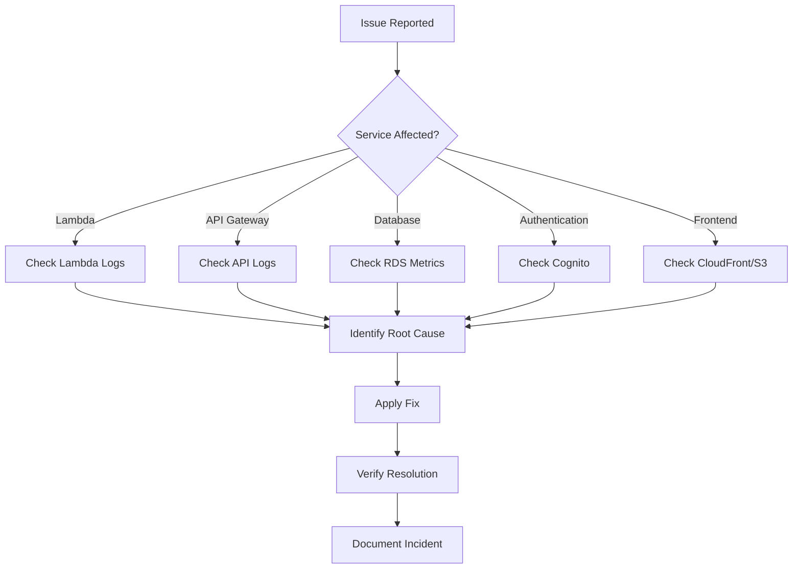

# Troubleshooting Guide

## Purpose

This document provides diagnostic procedures and solutions for common operational issues in the Sybol multi-tenant platform.

## Context

Quick identification and resolution of issues is critical for maintaining service reliability. This guide covers common problems across Lambda, RDS, API Gateway, Cognito, and other AWS services.

---

## General Diagnostic Approach



---

## Lambda Function Issues

### Issue: Lambda Function Timeout

**Symptoms:**
- Users report slow responses or timeouts
- Lambda duration consistently near timeout limit (30s)
- CloudWatch shows timeouts in metrics

**Diagnosis:**

```bash
# Check Lambda duration metrics
aws cloudwatch get-metric-statistics \
  --namespace AWS/Lambda \
  --metric-name Duration \
  --dimensions Name=FunctionName,Value=businesslogic \
  --start-time $(date -u -d '1 hour ago' +%Y-%m-%dT%H:%M:%S) \
  --end-time $(date -u +%Y-%m-%dT%H:%M:%S) \
  --period 300 \
  --statistics Average,Maximum

# Check recent timeout errors in logs
aws logs filter-log-events \
  --log-group-name /aws/lambda/businesslogic \
  --filter-pattern "Task timed out" \
  --start-time $(date -u -d '1 hour ago' +%s)000
```

**Common Causes:**

1. **Database connection delays**
2. **External API calls hanging**
3. **Large data processing**
4. **Cold start delays**

**Solutions:**

```bash
# 1. Increase timeout
aws lambda update-function-configuration \
  --function-name businesslogic \
  --timeout 60

# 2. Increase memory (improves CPU)
aws lambda update-function-configuration \
  --function-name businesslogic \
  --memory-size 1024

# 3. Enable provisioned concurrency (eliminate cold starts)
aws lambda put-provisioned-concurrency-config \
  --function-name businesslogic \
  --provisioned-concurrent-executions 2 \
  --qualifier LIVE
```

**Code-level fixes:**

```python
# Add timeouts to external calls
import requests

response = requests.get(
    external_api_url,
    timeout=5  # 5 second timeout
)

# Optimize database queries
# Use connection pooling
# Batch operations instead of individual requests
```

### Issue: Lambda Cold Starts

**Symptoms:**
- First request after period of inactivity is slow
- Intermittent slow responses
- Duration spikes in CloudWatch

**Diagnosis:**

```bash
# Check cold start frequency
aws logs filter-log-events \
  --log-group-name /aws/lambda/businesslogic \
  --filter-pattern "REPORT" \
  --start-time $(date -u -d '1 hour ago' +%s)000 | \
  grep "Init Duration"
```

**Solutions:**

```bash
# 1. Enable provisioned concurrency
aws lambda put-provisioned-concurrency-config \
  --function-name businesslogic \
  --provisioned-concurrent-executions 2 \
  --qualifier LIVE

# 2. Increase memory (faster cold starts)
aws lambda update-function-configuration \
  --function-name businesslogic \
  --memory-size 1024

# 3. Use Lambda SnapStart (Java functions only)
aws lambda update-function-configuration \
  --function-name businesslogic \
  --snap-start ApplyOn=PublishedVersions
```

**Alternative: Scheduled warm-up**

```bash
# Create EventBridge rule to ping Lambda every 5 minutes
aws events put-rule \
  --name lambda-warmup \
  --schedule-expression "rate(5 minutes)" \
  --state ENABLED

aws events put-targets \
  --rule lambda-warmup \
  --targets "Id"="1","Arn"="arn:aws:lambda:eu-west-1:ACCOUNT_ID:function:businesslogic","Input"='{"warmup": true}'
```

### Issue: Lambda Out of Memory

**Symptoms:**
- Function terminates with "Runtime exited with error: signal: killed"
- CloudWatch shows memory usage at limit

**Diagnosis:**

```bash
# Check memory usage
aws logs filter-log-events \
  --log-group-name /aws/lambda/propagate \
  --filter-pattern "REPORT" \
  --start-time $(date -u -d '1 hour ago' +%s)000 | \
  grep "Max Memory Used"
```

**Solutions:**

```bash
# Increase memory allocation
aws lambda update-function-configuration \
  --function-name propagate \
  --memory-size 1024
```

**Code-level fixes:**

```python
# Process data in chunks instead of loading all at once
def process_large_dataset(data):
    chunk_size = 1000
    for i in range(0, len(data), chunk_size):
        chunk = data[i:i+chunk_size]
        process_chunk(chunk)
        # Memory freed after each chunk

# Use generators instead of lists
def read_large_file():
    with open('large_file.json') as f:
        for line in f:  # Generator, not loading entire file
            yield json.loads(line)
```

### Issue: Lambda Cannot Connect to RDS

**Symptoms:**
- Database connection timeouts
- "Could not connect to database" errors
- Lambda logs show connection failures

**Diagnosis:**

```bash
# Check Lambda VPC configuration
aws lambda get-function-configuration \
  --function-name businesslogic \
  --query 'VpcConfig'

# Check security group rules
aws ec2 describe-security-groups \
  --group-ids sg-lambda123 sg-rds123
```

**Common Causes:**

1. Lambda not in VPC
2. Security group rules blocking connection
3. RDS cluster not accessible from Lambda's subnets
4. NAT Gateway missing (Lambda in private subnet)

**Solutions:**

```bash
# 1. Add Lambda to VPC
aws lambda update-function-configuration \
  --function-name businesslogic \
  --vpc-config SubnetIds=subnet-1a-xxxxx,subnet-1b-xxxxx,SecurityGroupIds=sg-lambda123

# 2. Update RDS security group to allow Lambda
aws ec2 authorize-security-group-ingress \
  --group-id sg-rds123 \
  --protocol tcp \
  --port 5432 \
  --source-group sg-lambda123

# 3. Verify network connectivity with test function
# Deploy a test Lambda that simply tries to connect to RDS
```

**Test connectivity:**

```python
import psycopg2

def lambda_handler(event, context):
    try:
        conn = psycopg2.connect(
            host=os.environ['DB_HOST'],
            port=5432,
            database='catalog',
            user='catalog',
            password=os.environ['DB_PASSWORD'],
            connect_timeout=5
        )
        conn.close()
        return {'statusCode': 200, 'body': 'Connection successful'}
    except Exception as e:
        return {'statusCode': 500, 'body': str(e)}
```

### Issue: Lambda Throttling

**Symptoms:**
- API returns 429 Too Many Requests
- Users report intermittent failures
- CloudWatch shows Throttles metric > 0

**Diagnosis:**

```bash
# Check throttling metrics
aws cloudwatch get-metric-statistics \
  --namespace AWS/Lambda \
  --metric-name Throttles \
  --dimensions Name=FunctionName,Value=businesslogic \
  --start-time $(date -u -d '1 hour ago' +%Y-%m-%dT%H:%M:%S) \
  --end-time $(date -u +%Y-%m-%dT%H:%M:%S) \
  --period 300 \
  --statistics Sum

# Check current concurrency limits
aws lambda get-function-concurrency \
  --function-name businesslogic
```

**Solutions:**

```bash
# 1. Increase reserved concurrency
aws lambda put-function-concurrency \
  --function-name businesslogic \
  --reserved-concurrent-executions 50

# 2. Request account concurrency limit increase
# AWS Support → Service limit increase for Lambda concurrent executions

# 3. Implement exponential backoff in client
```

---

## RDS Database Issues

### Issue: High Database Connection Count

**Symptoms:**
- "Too many connections" errors
- New connections fail
- Connection count metric near max_connections

**Diagnosis:**

```sql
-- Check current connections
SELECT 
  datname,
  usename,
  count(*) as connection_count,
  state
FROM pg_stat_activity
GROUP BY datname, usename, state
ORDER BY connection_count DESC;

-- Check max connections limit
SHOW max_connections;

-- Identify idle connections
SELECT 
  pid,
  usename,
  datname,
  state,
  now() - state_change as idle_time
FROM pg_stat_activity
WHERE state = 'idle'
ORDER BY idle_time DESC;
```

**Solutions:**

```sql
-- 1. Kill idle connections
SELECT pg_terminate_backend(pid)
FROM pg_stat_activity
WHERE state = 'idle'
  AND now() - state_change > interval '5 minutes';

-- 2. Set statement timeout
ALTER DATABASE tenant_repsol SET statement_timeout = '30s';

-- 3. Set idle connection timeout
ALTER DATABASE tenant_repsol SET idle_in_transaction_session_timeout = '5min';
```

**Application-level fixes:**

```python
# Use connection pooling
import psycopg2.pool

# Create connection pool (do this once, not per request)
connection_pool = psycopg2.pool.SimpleConnectionPool(
    minconn=1,
    maxconn=10,
    host=db_host,
    database=db_name,
    user=db_user,
    password=db_password
)

def lambda_handler(event, context):
    # Get connection from pool
    conn = connection_pool.getconn()
    
    try:
        # Use connection
        cursor = conn.cursor()
        cursor.execute("SELECT * FROM credentials")
        # ...
    finally:
        # Always return connection to pool
        connection_pool.putconn(conn)
```

### Issue: Slow Database Queries

**Symptoms:**
- High API latency
- RDS CPU utilization spiking
- Performance Insights shows slow queries

**Diagnosis:**

```sql
-- Find slow queries
SELECT 
  query,
  mean_exec_time,
  calls,
  total_exec_time
FROM pg_stat_statements
ORDER BY mean_exec_time DESC
LIMIT 10;

-- Check for missing indexes
SELECT 
  schemaname,
  tablename,
  attname,
  n_distinct,
  correlation
FROM pg_stats
WHERE schemaname = 'public'
  AND tablename = 'credentials'
ORDER BY n_distinct DESC;

-- Check table bloat
SELECT 
  schemaname,
  tablename,
  pg_size_pretty(pg_total_relation_size(schemaname||'.'||tablename)) as size
FROM pg_tables
WHERE schemaname = 'public'
ORDER BY pg_total_relation_size(schemaname||'.'||tablename) DESC;
```

**Solutions:**

```sql
-- 1. Add missing indexes
CREATE INDEX idx_credentials_tenant_id ON credentials(tenant_id);
CREATE INDEX idx_credentials_status ON credentials(status);

-- 2. Analyze tables to update statistics
ANALYZE credentials;

-- 3. Vacuum tables to reclaim space
VACUUM ANALYZE credentials;

-- 4. Create composite indexes for common queries
CREATE INDEX idx_credentials_tenant_status ON credentials(tenant_id, status);
```

**Query optimization:**

```sql
-- Before: Slow query
SELECT * FROM credentials WHERE tenant_id = 'repsol';

-- After: Optimized query (only select needed columns)
SELECT id, credential_data, created_at 
FROM credentials 
WHERE tenant_id = 'repsol' 
  AND status = 'active'
LIMIT 100;

-- Use EXPLAIN to analyze query plan
EXPLAIN ANALYZE 
SELECT id, credential_data 
FROM credentials 
WHERE tenant_id = 'repsol';
```

### Issue: RDS Storage Full

**Symptoms:**
- Writes failing
- CloudWatch alarm for FreeStorageSpace
- RDS status shows storage-full

**Diagnosis:**

```bash
# Check storage metrics
aws cloudwatch get-metric-statistics \
  --namespace AWS/RDS \
  --metric-name FreeStorageSpace \
  --dimensions Name=DBClusterIdentifier,Value=sybol-cluster \
  --start-time $(date -u -d '24 hours ago' +%Y-%m-%dT%H:%M:%S) \
  --end-time $(date -u +%Y-%m-%dT%H:%M:%S) \
  --period 3600 \
  --statistics Average

# Check database sizes
psql -c "
SELECT 
  datname,
  pg_size_pretty(pg_database_size(datname)) as size
FROM pg_database
ORDER BY pg_database_size(datname) DESC;"
```

**Immediate solution:**

```bash
# Increase storage (Aurora auto-scales, but can manually increase)
aws rds modify-db-cluster \
  --db-cluster-identifier sybol-cluster \
  --allocated-storage 200 \
  --apply-immediately
```

**Long-term solutions:**

```sql
-- 1. Clean up old data
DELETE FROM events WHERE created_at < NOW() - INTERVAL '90 days';

-- 2. Archive old data
INSERT INTO archived_events SELECT * FROM events WHERE created_at < NOW() - INTERVAL '90 days';
DELETE FROM events WHERE created_at < NOW() - INTERVAL '90 days';

-- 3. Vacuum to reclaim space
VACUUM FULL events;

-- 4. Drop unused indexes
DROP INDEX IF EXISTS old_unused_index;
```

---

## API Gateway Issues

### Issue: API Returns 403 Forbidden with Valid Token

**Symptoms:**
- Authentication appears successful
- API returns 403 Forbidden
- CloudWatch shows "Unauthorized" in authorizer logs

**Diagnosis:**

```bash
# Check JWT authorizer configuration
aws apigatewayv2 get-authorizers \
  --api-id abcd1234

# Test token manually
TOKEN="eyJhbGc..." # Your JWT token

# Decode token to verify claims
echo $TOKEN | cut -d'.' -f2 | base64 -d | jq .

# Check authorizer logs
aws logs filter-log-events \
  --log-group-name /aws/apigateway/sybol-api \
  --filter-pattern "Unauthorized"
```

**Common Causes:**

1. Token expired
2. Issuer URL mismatch in authorizer
3. Audience (client ID) mismatch
4. Token signature invalid

**Solutions:**

```bash
# 1. Verify authorizer configuration
aws apigatewayv2 get-authorizer \
  --api-id abcd1234 \
  --authorizer-id auth123

# 2. Update issuer URL if incorrect
aws apigatewayv2 update-authorizer \
  --api-id abcd1234 \
  --authorizer-id auth123 \
  --jwt-configuration Issuer=https://cognito-idp.eu-west-1.amazonaws.com/eu-west-1_XXXXXXXXX,Audience=1234567890abcdefghij

# 3. Check token expiration
# Ensure client refreshes token before expiry
```

### Issue: High API Latency

**Symptoms:**
- Slow response times reported by users
- API Gateway Latency metric elevated
- Integration latency high

**Diagnosis:**

```bash
# Check API Gateway latency metrics
aws cloudwatch get-metric-statistics \
  --namespace AWS/ApiGateway \
  --metric-name Latency \
  --dimensions Name=ApiId,Value=abcd1234 \
  --start-time $(date -u -d '1 hour ago' +%Y-%m-%dT%H:%M:%S) \
  --end-time $(date -u +%Y-%m-%dT%H:%M:%S) \
  --period 300 \
  --statistics Average,p95,p99

# Check integration latency (backend)
aws cloudwatch get-metric-statistics \
  --namespace AWS/ApiGateway \
  --metric-name IntegrationLatency \
  --dimensions Name=ApiId,Value=abcd1234 \
  --start-time $(date -u -d '1 hour ago' +%Y-%m-%dT%H:%M:%S) \
  --end-time $(date -u +%Y-%m-%dT%H:%M:%S) \
  --period 300 \
  --statistics Average,p95,p99
```

**Solutions:**

If integration latency is high → Problem is in Lambda/backend
If API latency >> integration latency → Problem is in API Gateway

```bash
# 1. Enable caching for frequently accessed data
aws apigatewayv2 update-stage \
  --api-id abcd1234 \
  --stage-name $default \
  --route-settings '{"GET /api/catalog/entries": {"DataTraceEnabled": false, "ThrottlingBurstLimit": 500, "ThrottlingRateLimit": 100}}'

# 2. Optimize Lambda (see Lambda troubleshooting section)

# 3. Consider using API Gateway REST API instead of HTTP API for built-in caching
```

### Issue: API Gateway 5xx Errors

**Symptoms:**
- Users receive 500/502/503/504 errors
- 5XXError metric elevated

**Diagnosis:**

```bash
# Check error types
aws logs filter-log-events \
  --log-group-name /aws/apigateway/sybol-api \
  --filter-pattern "5??" \
  --start-time $(date -u -d '1 hour ago' +%s)000
```

**Error codes:**

| Code | Meaning | Typical Cause |
|------|---------|---------------|
| 500 | Internal Server Error | Lambda threw unhandled exception |
| 502 | Bad Gateway | Lambda returned invalid response format |
| 503 | Service Unavailable | Lambda throttled or unavailable |
| 504 | Gateway Timeout | Lambda execution exceeded timeout |

**Solutions:**

```bash
# For 500: Fix Lambda error handling
# For 502: Fix Lambda response format
# For 503: Increase Lambda concurrency
# For 504: Increase Lambda timeout or optimize code
```

---

## Cognito Issues

### Issue: Users Cannot Login

**Symptoms:**
- Login fails with "Incorrect username or password"
- User confirms credentials are correct

**Diagnosis:**

```bash
# Check user status
aws cognito-idp admin-get-user \
  --user-pool-id eu-west-1_XXXXXXXXX \
  --username user@example.com

# Check for account lockout
aws cognito-idp admin-list-user-auth-events \
  --user-pool-id eu-west-1_XXXXXXXXX \
  --username user@example.com
```

**User status meanings:**

| Status | Description | Solution |
|--------|-------------|----------|
| FORCE_CHANGE_PASSWORD | New user must change password | User needs to complete password change flow |
| CONFIRMED | Normal active state | Check password is correct |
| UNCONFIRMED | Email not verified | Resend verification email |
| RESET_REQUIRED | Admin reset password | User must complete password reset |
| COMPROMISED | AWS detected compromise | Contact AWS support |

**Solutions:**

```bash
# 1. Reset user password
aws cognito-idp admin-set-user-password \
  --user-pool-id eu-west-1_XXXXXXXXX \
  --username user@example.com \
  --password "NewTemporaryPassword123!" \
  --permanent

# 2. Resend verification email
aws cognito-idp admin-create-user \
  --user-pool-id eu-west-1_XXXXXXXXX \
  --username user@example.com \
  --message-action RESEND

# 3. Enable user account if disabled
aws cognito-idp admin-enable-user \
  --user-pool-id eu-west-1_XXXXXXXXX \
  --username user@example.com
```

### Issue: Token Missing Custom Attributes

**Symptoms:**
- JWT token does not include tenant_id or role claims
- Application cannot determine tenant context

**Diagnosis:**

```bash
# Check user attributes
aws cognito-idp admin-get-user \
  --user-pool-id eu-west-1_XXXXXXXXX \
  --username user@example.com \
  --query 'UserAttributes'
```

**Cause:**

Custom attributes not set on user or not included in token.

**Solutions:**

```bash
# 1. Set custom attributes
aws cognito-idp admin-update-user-attributes \
  --user-pool-id eu-west-1_XXXXXXXXX \
  --username user@example.com \
  --user-attributes \
    Name=custom:tenant_id,Value=repsol \
    Name=custom:role,Value=admin

# 2. Verify App Client includes custom attributes in tokens
# This is configured in User Pool → App integration → App client settings
```

---

## CloudFront and S3 Issues

### Issue: CloudFront Returns 403 AccessDenied

**Symptoms:**
- Accessing tenant URL shows "Access Denied"
- CloudFront returns 403 error

**Diagnosis:**

```bash
# Check S3 bucket policy
aws s3api get-bucket-policy \
  --bucket repsol-staging-wallet-frontend

# Check CloudFront OAC configuration
aws cloudfront get-distribution-config \
  --id E123456789ABCD
```

**Common Causes:**

1. S3 bucket policy doesn't allow CloudFront OAC
2. Files don't exist in S3
3. CloudFront origin configured incorrectly

**Solutions:**

```bash
# 1. Update S3 bucket policy
aws s3api put-bucket-policy \
  --bucket repsol-staging-wallet-frontend \
  --policy file://cloudfront-oac-policy.json

# 2. Verify files exist
aws s3 ls s3://repsol-staging-wallet-frontend/

# 3. Upload index.html if missing
aws s3 cp index.html s3://repsol-staging-wallet-frontend/

# 4. Invalidate CloudFront cache
aws cloudfront create-invalidation \
  --distribution-id E123456789ABCD \
  --paths "/*"
```

### Issue: Frontend Shows Old Version After Deployment

**Symptoms:**
- New deployment completed
- Users still see old version of application

**Cause:**

CloudFront cache not invalidated.

**Solutions:**

```bash
# 1. Create cache invalidation
aws cloudfront create-invalidation \
  --distribution-id E123456789ABCD \
  --paths "/*"

# 2. Set proper cache headers on S3 objects
aws s3 cp s3://repsol-staging-wallet-frontend/index.html \
  s3://repsol-staging-wallet-frontend/index.html \
  --cache-control "max-age=0, no-cache" \
  --metadata-directive REPLACE

# 3. Use versioned file names for assets
# e.g., main.abc123.js instead of main.js
```

---

## KMS Issues

### Issue: KMS Access Denied When Signing

**Symptoms:**
- API returns error signing JWT
- CloudWatch logs show "Access Denied" for KMS operation

**Diagnosis:**

```bash
# Check IAM role permissions
aws iam get-role-policy \
  --role-name TenantRole-repsol-admin \
  --policy-name TenantRepsol-Admin-Permissions

# Check KMS key policy
aws kms get-key-policy \
  --key-id 12345678-1234-1234-1234-123456789012 \
  --policy-name default
```

**Solutions:**

```bash
# 1. Update IAM role policy to include KMS permissions
aws iam put-role-policy \
  --role-name TenantRole-repsol-admin \
  --policy-name TenantRepsol-Admin-Permissions \
  --policy-document file://updated-policy.json

# 2. Update KMS key policy to allow role
aws kms put-key-policy \
  --key-id 12345678-1234-1234-1234-123456789012 \
  --policy-name default \
  --policy file://kms-key-policy.json
```

---

## EventBridge Issues

### Issue: Events Not Delivered to Target

**Symptoms:**
- Events published but not received by Lambda
- EventBridge metrics show FailedInvocations

**Diagnosis:**

```bash
# Check event rule status
aws events describe-rule \
  --name propagate-events

# Check rule targets
aws events list-targets-by-rule \
  --rule propagate-events

# Check dead letter queue
aws sqs receive-message \
  --queue-url https://sqs.eu-west-1.amazonaws.com/ACCOUNT_ID/eventbridge-dlq
```

**Solutions:**

```bash
# 1. Verify event pattern matches published events
aws events put-rule \
  --name propagate-events \
  --event-pattern '{"source": ["sybol.propagate"], "detail-type": ["credential.issued"]}'

# 2. Verify Lambda has permissions to be invoked by EventBridge
aws lambda add-permission \
  --function-name propagate \
  --statement-id EventBridgeInvoke \
  --action lambda:InvokeFunction \
  --principal events.amazonaws.com \
  --source-arn arn:aws:events:eu-west-1:ACCOUNT_ID:rule/propagate-events

# 3. Add dead letter queue for failed invocations
aws events put-targets \
  --rule propagate-events \
  --targets "Id"="1","Arn"="arn:aws:lambda:...","DeadLetterConfig"="Arn=arn:aws:sqs:..."
```

---

## General Debugging Techniques

### Enable Debug Logging

```python
# In Lambda function
import logging
import os

# Set log level from environment variable
log_level = os.environ.get('LOG_LEVEL', 'INFO')
logger = logging.getLogger()
logger.setLevel(log_level)

def lambda_handler(event, context):
    logger.debug(f"Received event: {json.dumps(event)}")
    logger.info("Processing request")
    # ...
```

```bash
# Update Lambda environment variable
aws lambda update-function-configuration \
  --function-name businesslogic \
  --environment Variables="{LOG_LEVEL=DEBUG}"
```

### Use AWS X-Ray for Tracing

```python
from aws_xray_sdk.core import xray_recorder

@xray_recorder.capture('process_credential')
def process_credential(credential_data):
    xray_recorder.put_annotation('tenant_id', credential_data['tenant_id'])
    # Processing logic
```

### Test Locally with SAM CLI

```bash
# Test Lambda function locally
sam local invoke businesslogic \
  --event test-event.json \
  --env-vars env.json
```

---

## Escalation Procedures

### When to Escalate

Escalate to AWS Support when:
- [ ] Service outage affecting multiple tenants
- [ ] AWS service degradation suspected
- [ ] Data loss occurred
- [ ] Security incident detected
- [ ] Unable to resolve after 2 hours

### Support Case Information

Include in support case:
```
- AWS Account ID
- Affected service(s)
- Region
- Timeline of issue
- Error messages and logs
- CloudWatch dashboard links
- Steps already taken
- Business impact
```

---

## References

- [Infrastructure Setup](infrastructure-setup.md)
- [Monitoring Guide](monitoring.md)
- [Deployment Procedures](deployment-procedures.md)
- [AWS Lambda Troubleshooting](https://docs.aws.amazon.com/lambda/latest/dg/lambda-troubleshooting.html)
- [Amazon RDS Troubleshooting](https://docs.aws.amazon.com/AmazonRDS/latest/UserGuide/CHAP_Troubleshooting.html)
