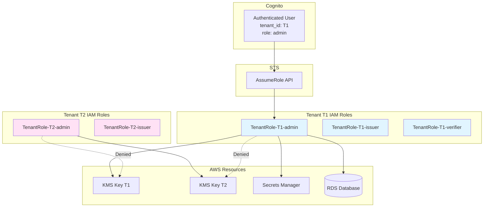
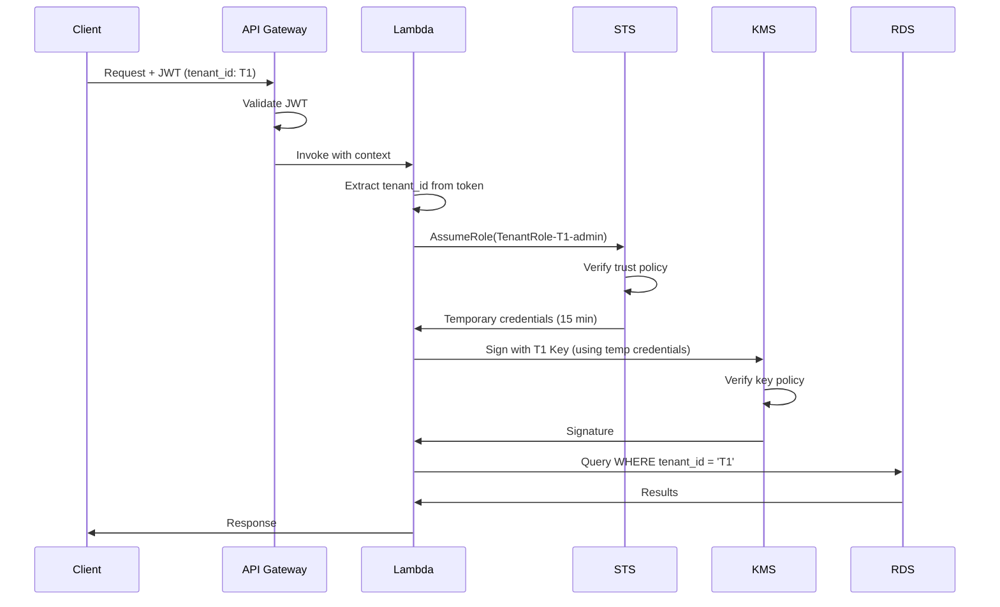
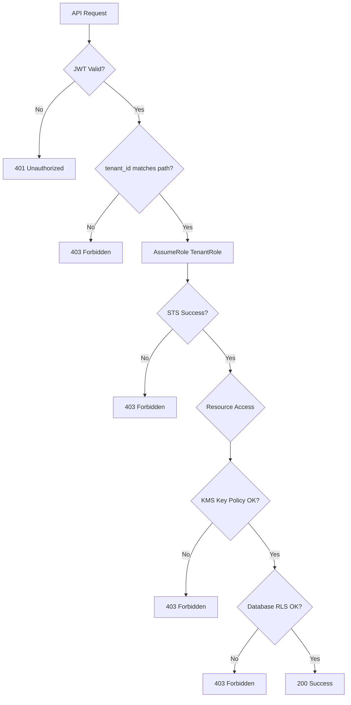

# Authorization

## Purpose

This document describes the authorization mechanisms in Sybol, focusing on AWS Security Token Service (STS) integration, tenant-specific IAM roles, and multi-tenant isolation enforcement. It covers the complete authorization flow from API request to resource access.

## Context

Sybol implements authorization using AWS IAM roles with STS temporary credentials. Each tenant has dedicated IAM roles that enforce least privilege access to AWS resources. This approach ensures strong tenant isolation while maintaining operational efficiency.

## Authorization Architecture

### Multi-Tenant IAM Model



### Role Naming Convention

Tenant roles follow strict naming:

```
TenantRole-{tenantId}-{roleName}
```

Examples:
- `TenantRole-acme-corp-admin`
- `TenantRole-acme-corp-issuer`
- `TenantRole-acme-corp-verifier`
- `TenantRole-globex-inc-admin`

## STS AssumeRole Pattern

### Authorization Flow



### AssumeRole Request

Lambda execution role assumes tenant role:

```javascript
const AWS = require('aws-sdk');
const sts = new AWS.STS();

async function assumeTenantRole(tenantId, roleName) {
  const roleArn = `arn:aws:iam::${AWS_ACCOUNT_ID}:role/TenantRole-${tenantId}-${roleName}`;
  
  const params = {
    RoleArn: roleArn,
    RoleSessionName: `session-${tenantId}-${Date.now()}`,
    DurationSeconds: 900, // 15 minutes
    Tags: [
      { Key: 'TenantId', Value: tenantId },
      { Key: 'Role', Value: roleName }
    ]
  };
  
  const response = await sts.assumeRole(params).promise();
  
  return {
    accessKeyId: response.Credentials.AccessKeyId,
    secretAccessKey: response.Credentials.SecretAccessKey,
    sessionToken: response.Credentials.SessionToken,
    expiration: response.Credentials.Expiration
  };
}
```

### Session Duration

| Scenario | Duration | Rationale |
|----------|----------|-----------|
| API Request | 15 minutes | Sufficient for request processing |
| Background Job | 1 hour | Longer operations (batch processing) |
| Administrative Operations | 1 hour | Manual tenant management |

## IAM Role Configuration

### Tenant Role Structure

Each tenant has multiple roles based on user permissions:

| Role Name | Purpose | Key Permissions |
|-----------|---------|-----------------|
| admin | Full tenant management | All tenant resources |
| issuer | Issue credentials | Sign with KMS, write credentials |
| verifier | Verify credentials | Read credentials, verify signatures |
| viewer | Read-only access | Read credentials only |

### Trust Policy

Tenant roles trust the Lambda execution role:

```json
{
  "Version": "2012-10-17",
  "Statement": [
    {
      "Effect": "Allow",
      "Principal": {
        "AWS": "arn:aws:iam::ACCOUNT_ID:role/LambdaExecutionRole"
      },
      "Action": "sts:AssumeRole",
      "Condition": {
        "StringEquals": {
          "sts:ExternalId": "sybol-platform-v1"
        }
      }
    }
  ]
}
```

The external ID prevents confused deputy attacks.

### Permission Policy: Admin Role

```json
{
  "Version": "2012-10-17",
  "Statement": [
    {
      "Sid": "KMSAccess",
      "Effect": "Allow",
      "Action": [
        "kms:Sign",
        "kms:Verify",
        "kms:GetPublicKey",
        "kms:DescribeKey"
      ],
      "Resource": "arn:aws:kms:REGION:ACCOUNT:key/tenant-${tenantId}-*"
    },
    {
      "Sid": "SecretsAccess",
      "Effect": "Allow",
      "Action": [
        "secretsmanager:GetSecretValue"
      ],
      "Resource": "arn:aws:secretsmanager:REGION:ACCOUNT:secret:tenant/${tenantId}/*"
    },
    {
      "Sid": "RDSDataAccess",
      "Effect": "Allow",
      "Action": [
        "rds-data:ExecuteStatement",
        "rds-data:BatchExecuteStatement"
      ],
      "Resource": "arn:aws:rds:REGION:ACCOUNT:cluster:sybol-db-cluster",
      "Condition": {
        "StringEquals": {
          "rds-data:TenantId": "${tenantId}"
        }
      }
    }
  ]
}
```

### Permission Policy: Issuer Role

```json
{
  "Version": "2012-10-17",
  "Statement": [
    {
      "Sid": "KMSSignOnly",
      "Effect": "Allow",
      "Action": [
        "kms:Sign",
        "kms:GetPublicKey"
      ],
      "Resource": "arn:aws:kms:REGION:ACCOUNT:key/tenant-${tenantId}-issuer-*"
    },
    {
      "Sid": "SecretsReadOnly",
      "Effect": "Allow",
      "Action": [
        "secretsmanager:GetSecretValue"
      ],
      "Resource": "arn:aws:secretsmanager:REGION:ACCOUNT:secret:tenant/${tenantId}/database-*"
    }
  ]
}
```

### Permission Policy: Verifier Role

```json
{
  "Version": "2012-10-17",
  "Statement": [
    {
      "Sid": "KMSVerifyOnly",
      "Effect": "Allow",
      "Action": [
        "kms:Verify",
        "kms:GetPublicKey"
      ],
      "Resource": "arn:aws:kms:REGION:ACCOUNT:key/tenant-${tenantId}-*"
    }
  ]
}
```

## API Gateway Authorization

### JWT Authorizer Configuration

API Gateway validates JWT tokens before Lambda invocation:

```yaml
Authorizer:
  Type: JWT
  IdentitySource: $request.header.Authorization
  JwtConfiguration:
    Audience:
      - <cognito-app-client-id>
    Issuer: https://cognito-idp.eu-west-1.amazonaws.com/<user-pool-id>
  AuthorizerResultTtlInSeconds: 300
```

### Authorization Context

API Gateway passes claims to Lambda:

```javascript
// Lambda event.requestContext.authorizer.jwt.claims
{
  "sub": "user-uuid",
  "email": "user@example.com",
  "custom:tenant_id": "acme-corp",
  "custom:role": "issuer",
  "custom:organization": "ACME Corporation"
}
```

### Request Authorization Flow

```javascript
exports.handler = async (event) => {
  // Extract tenant context from JWT claims
  const claims = event.requestContext.authorizer.jwt.claims;
  const tenantId = claims['custom:tenant_id'];
  const userRole = claims['custom:role'];
  
  // Extract tenant from path (for validation)
  const pathTenantId = event.pathParameters.tenantId;
  
  // Enforce tenant isolation
  if (tenantId !== pathTenantId) {
    return {
      statusCode: 403,
      body: JSON.stringify({
        error: 'Forbidden',
        message: 'Access denied to other tenant resources'
      })
    };
  }
  
  // Assume tenant role
  const credentials = await assumeTenantRole(tenantId, userRole);
  
  // Create service clients with tenant credentials
  const kms = new AWS.KMS({ credentials });
  const secretsManager = new AWS.SecretsManager({ credentials });
  
  // Execute business logic with tenant-scoped access
  // ...
};
```

## Tenant Isolation Enforcement

### Defense Layers

Authorization enforces tenant isolation at multiple layers:



### Database Row-Level Security (RLS)

PostgreSQL RLS enforces tenant isolation:

```sql
-- Enable RLS on all tenant tables
ALTER TABLE credentials ENABLE ROW LEVEL SECURITY;

-- Policy: Users can only see their tenant's data
CREATE POLICY tenant_isolation_policy ON credentials
  FOR ALL
  USING (tenant_id = current_setting('app.current_tenant_id'));

-- Set tenant context in connection
SET app.current_tenant_id = 'acme-corp';
```

Lambda sets session variable before queries:

```javascript
async function setTenantContext(client, tenantId) {
  await client.query(`SET app.current_tenant_id = '${tenantId}'`);
}
```

### KMS Key Policies

KMS keys restrict access to specific tenant roles:

```json
{
  "Sid": "Enable signing by tenant admin role",
  "Effect": "Allow",
  "Principal": {
    "AWS": "arn:aws:iam::ACCOUNT:role/TenantRole-acme-corp-admin"
  },
  "Action": [
    "kms:Sign",
    "kms:Verify",
    "kms:GetPublicKey"
  ],
  "Resource": "*"
}
```

No wildcards in key policies—each tenant role explicitly listed.

## Privilege Escalation Prevention

### Immutable Role Policies

Tenant roles cannot modify their own permissions:

```json
{
  "Sid": "DenyPolicyChanges",
  "Effect": "Deny",
  "Action": [
    "iam:PutRolePolicy",
    "iam:DeleteRolePolicy",
    "iam:AttachRolePolicy",
    "iam:DetachRolePolicy"
  ],
  "Resource": "arn:aws:iam::*:role/TenantRole-*"
}
```

### STS Session Restrictions

Session policies further restrict assumed role permissions:

```javascript
const sessionPolicy = {
  Version: "2012-10-17",
  Statement: [
    {
      Effect: "Deny",
      Action: "sts:AssumeRole",
      Resource: "*"
    }
  ]
};

const params = {
  RoleArn: roleArn,
  RoleSessionName: sessionName,
  DurationSeconds: 900,
  Policy: JSON.stringify(sessionPolicy) // Inline session policy
};
```

Prevents role chaining and privilege escalation.

### Forbidden Actions

Tenant roles explicitly deny dangerous actions:

| Action | Reason |
|--------|--------|
| `iam:*` | Prevents role modifications |
| `sts:AssumeRole` (to other roles) | Prevents role chaining |
| `kms:ScheduleKeyDeletion` | Prevents key deletion |
| `kms:DisableKey` | Prevents key disabling |
| `secretsmanager:DeleteSecret` | Prevents secret deletion |
| `rds:DeleteDBCluster` | Prevents database deletion |

## Least Privilege Enforcement

### Resource-Scoped Permissions

All permissions scoped to tenant-specific resources:

```json
"Resource": [
  "arn:aws:kms:REGION:ACCOUNT:key/tenant-${tenantId}-*",
  "arn:aws:secretsmanager:REGION:ACCOUNT:secret:tenant/${tenantId}/*"
]
```

No `"Resource": "*"` in tenant role policies.

### Action Minimization

Each role has minimal required actions:

**Issuer role cannot:**
- Verify signatures (read-only operation)
- Delete credentials
- Modify tenant configuration
- Access other tenants' keys

**Verifier role cannot:**
- Sign credentials
- Create credentials
- Modify any resources

### Time-Bound Sessions

All assumed roles expire after 15 minutes:

- Forces re-authentication for long operations
- Limits impact of credential leakage
- Enables rapid response to security incidents

## Authorization Testing

### Test Cases

| Test | Expected Result |
|------|-----------------|
| User A accesses Tenant A resources | Allow |
| User A accesses Tenant B resources | Deny (403) |
| Issuer signs with issuer key | Allow |
| Issuer signs with admin key | Deny (403) |
| Verifier reads credentials | Allow |
| Verifier creates credentials | Deny (403) |
| Expired session credentials | Deny (403) |
| User without tenant_id claim | Deny (403) |

### Testing Procedure

```javascript
// Test tenant isolation
const validToken = generateToken({ tenant_id: 'tenant-a' });
const invalidToken = generateToken({ tenant_id: 'tenant-b' });

// Should succeed
await apiRequest('/api/tenant-a/credentials', validToken);

// Should fail with 403
await apiRequest('/api/tenant-a/credentials', invalidToken);
```

## Monitoring and Alerts

### CloudWatch Metrics

| Metric | Threshold | Action |
|--------|-----------|--------|
| AssumeRole Failures | >10/min | Alert security team |
| Cross-Tenant Access Attempts | Any | Immediate investigation |
| STS Session Durations | >15 min | Check for misconfiguration |
| IAM Policy Changes | Any on tenant roles | Block and alert |

### CloudTrail Events

Critical authorization events logged:

- `AssumeRole` - All tenant role assumptions
- `kms:Sign` - Credential signing operations
- `kms:Verify` - Signature verification
- `secretsmanager:GetSecretValue` - Secret access
- `rds-data:ExecuteStatement` - Database queries

### Audit Log Example

```json
{
  "eventName": "AssumeRole",
  "eventTime": "2026-03-10T10:30:00Z",
  "userIdentity": {
    "type": "AssumedRole",
    "principalId": "LambdaExecutionRole",
    "arn": "arn:aws:sts::ACCOUNT:assumed-role/LambdaExecutionRole/session"
  },
  "requestParameters": {
    "roleArn": "arn:aws:iam::ACCOUNT:role/TenantRole-acme-corp-issuer",
    "roleSessionName": "session-acme-corp-1709982600"
  },
  "responseElements": {
    "credentials": {
      "expiration": "2026-03-10T10:45:00Z"
    }
  }
}
```

## Troubleshooting

### Common Authorization Errors

**Error: AssumeRole failed - AccessDenied**
- Verify Lambda execution role has `sts:AssumeRole` permission
- Check tenant role trust policy includes Lambda execution role
- Verify external ID matches

**Error: Access Denied to KMS Key**
- Verify assumed role is listed in key policy
- Check key ID matches tenant convention
- Ensure key is not disabled

**Error: Tenant ID mismatch (403)**
- Token tenant_id doesn't match path parameter
- Possible token tampering—investigate
- Check application logic for tenant context extraction

## References

- [Authentication](authentication.md) - JWT token generation and validation
- [Cryptography](cryptography.md) - KMS key policies and access
- [Security Overview](security-overview.md) - Multi-tenant security model
- [Security Architecture](../architecture/security-architecture.md) - IAM architecture diagrams
