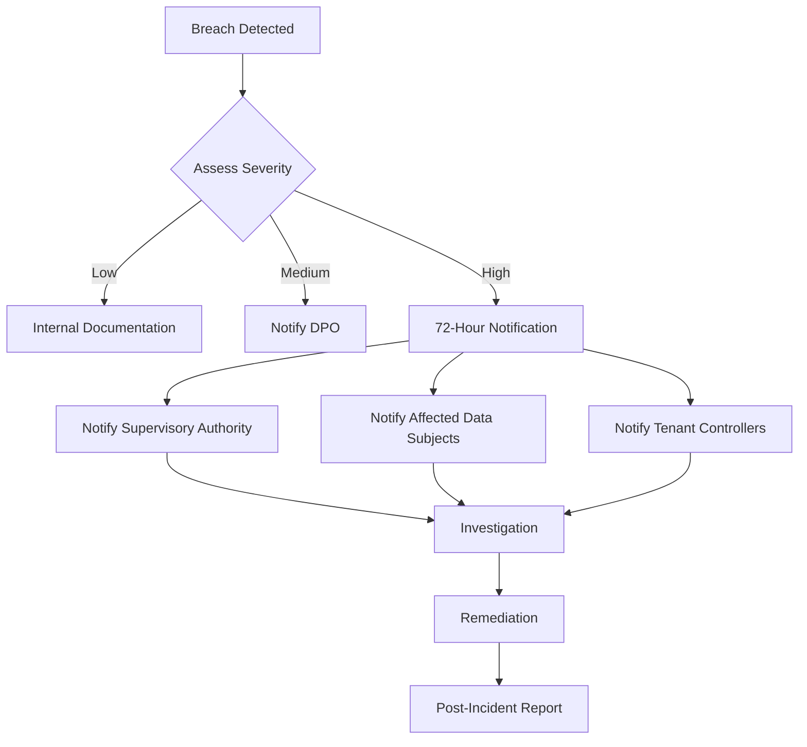
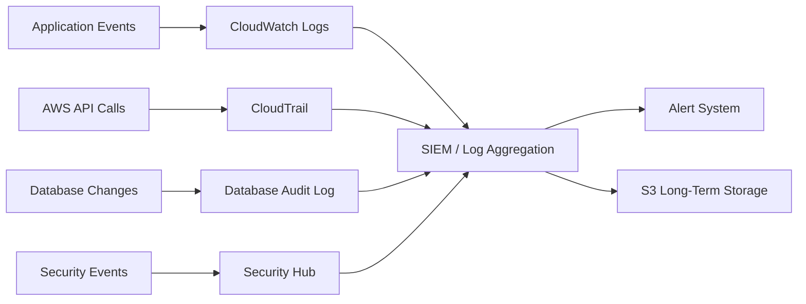

# Compliance

## Purpose

This document describes how Sybol meets regulatory compliance requirements including GDPR (General Data Protection Regulation), eIDAS 2.0 (Electronic Identification, Authentication and Trust Services), and SOC 2 Type II. It details compliance controls, audit procedures, and data handling policies.

## Context

Sybol processes personal identity data for digital credential issuance and verification. The platform must comply with European data protection regulations, electronic signature standards, and international security frameworks.

## GDPR Compliance

### Legal Basis for Processing

| Processing Activity | Legal Basis | Article |
|---------------------|-------------|---------|
| Credential Issuance | Contract performance | Art. 6(1)(b) |
| Identity Verification | Legitimate interest | Art. 6(1)(f) |
| Audit Logging | Legal obligation | Art. 6(1)(c) |
| Marketing Communications | Consent | Art. 6(1)(a) |

### Data Protection Principles

#### 1. Lawfulness, Fairness, and Transparency

**Implementation:**
- Privacy policy published at `/privacy`
- Data processing agreements with tenants
- Clear consent mechanisms for optional processing
- Transparent data retention policies

**Controls:**
- Legal review of all data processing activities
- Privacy notices in multiple languages
- Consent tracking in database

#### 2. Purpose Limitation

**Implementation:**
- Personal data collected only for credential issuance
- No secondary use without consent
- Separate consent for analytics

**Controls:**
```sql
CREATE TABLE consent_records (
  id UUID PRIMARY KEY,
  user_id UUID NOT NULL,
  purpose VARCHAR(50) NOT NULL,
  consent_given BOOLEAN NOT NULL,
  consent_date TIMESTAMP NOT NULL,
  consent_method VARCHAR(20), -- 'explicit', 'implicit', 'withdrawn'
  CONSTRAINT fk_user FOREIGN KEY (user_id) REFERENCES users(id)
);
```

#### 3. Data Minimization

**Implementation:**
- Collect only essential identity attributes
- No storage of documents or images (unless required)
- Credentials contain minimal claims

**Data Collection Matrix:**

| Data Element | Purpose | Required | Retention |
|--------------|---------|----------|-----------|
| Email | User identification | Yes | Account lifetime |
| Full Name | Credential subject | Yes | Per credential policy |
| Date of Birth | Age verification | Context-dependent | Per credential policy |
| Address | Residency proof | Context-dependent | Per credential policy |
| Credential Status | Revocation checking | Yes | 7 years |
| Audit Logs | Security and compliance | Yes | 7 years |

#### 4. Accuracy

**Implementation:**
- Users can update profile information
- Email verification required
- Issuers responsible for claim accuracy

**Controls:**
- Email verification within 24 hours
- Profile update API endpoints
- Audit trail of profile changes

#### 5. Storage Limitation

**Retention Policies:**

```javascript
const RETENTION_POLICIES = {
  activeUsers: 'indefinite', // While account active
  inactiveUsers: '3 years', // After last login
  deletedUsers: '30 days', // Soft delete period
  credentials: '7 years', // eIDAS requirement
  auditLogs: '7 years', // Legal requirement
  sessionLogs: '90 days', // Security analysis
  backups: '30 days' // Disaster recovery
};
```

**Automated Deletion:**

```javascript
// Daily cron job
async function enforceRetentionPolicies() {
  const now = new Date();
  
  // Delete soft-deleted users after 30 days
  await db.query(`
    DELETE FROM users
    WHERE status = 'deleted'
    AND deleted_at < NOW() - INTERVAL '30 days'
  `);
  
  // Archive inactive users after 3 years
  await db.query(`
    UPDATE users
    SET status = 'archived'
    WHERE status = 'active'
    AND last_login_at < NOW() - INTERVAL '3 years'
  `);
  
  // Delete old session logs
  await db.query(`
    DELETE FROM session_logs
    WHERE created_at < NOW() - INTERVAL '90 days'
  `);
}
```

#### 6. Integrity and Confidentiality

**Encryption:**
- TLS 1.2+ for data in transit
- KMS encryption for data at rest
- Field-level encryption for PII

**Access Control:**
- Role-based access control (RBAC)
- Multi-factor authentication for privileged accounts
- Audit logging of all data access

### Data Subject Rights

#### Right of Access (Art. 15)

Users can request all personal data:

```javascript
// GET /api/users/{userId}/data-export
async function exportUserData(userId, tenantId) {
  const user = await db.getUserProfile(userId);
  const credentials = await db.getUserCredentials(userId, tenantId);
  const auditLogs = await db.getUserAuditLogs(userId);
  
  return {
    exportDate: new Date().toISOString(),
    profile: {
      email: user.email,
      name: user.name,
      createdAt: user.created_at,
      lastLogin: user.last_login_at
    },
    credentials: credentials.map(c => ({
      id: c.id,
      type: c.type,
      issuedAt: c.issued_at,
      status: c.status
    })),
    processingActivities: auditLogs,
    dataSharing: await getDataSharingRecords(userId)
  };
}
```

**Response Time:** Within 30 days of request.

#### Right to Rectification (Art. 16)

Users can correct inaccurate data:

```javascript
// PUT /api/users/{userId}/profile
async function updateUserProfile(userId, updates) {
  // Audit trail
  await db.logProfileUpdate(userId, updates);
  
  // Update profile
  await db.query(`
    UPDATE users
    SET email = COALESCE($1, email),
        name = COALESCE($2, name),
        updated_at = NOW()
    WHERE id = $3
  `, [updates.email, updates.name, userId]);
  
  // Notify affected credentials
  await notifyCredentialIssuers(userId, updates);
}
```

#### Right to Erasure (Art. 17)

Full deletion of personal data:

```javascript
// DELETE /api/users/{userId}
async function deleteUser(userId, tenantId) {
  await db.transaction(async (tx) => {
    // 1. Anonymize user record
    await tx.query(`
      UPDATE users
      SET email = 'deleted-' || id || '@deleted.local',
          name = 'Deleted User',
          status = 'deleted',
          deleted_at = NOW()
      WHERE id = $1
    `, [userId]);
    
    // 2. Revoke all credentials
    await tx.query(`
      UPDATE credentials
      SET status = 'revoked',
          revocation_reason = 'user_deletion'
      WHERE subject_id = $1 AND tenant_id = $2
    `, [userId, tenantId]);
    
    // 3. Anonymize audit logs (keep for compliance)
    await tx.query(`
      UPDATE audit_logs
      SET user_id = NULL,
          user_email = 'deleted@deleted.local'
      WHERE user_id = $1
    `, [userId]);
    
    // 4. Delete session tokens
    await tx.query(`
      DELETE FROM sessions WHERE user_id = $1
    `, [userId]);
    
    // 5. Schedule Cognito deletion
    await scheduleIdentityDeletion(userId);
  });
}
```

**Exceptions:**
- Audit logs retained (anonymized)
- Credential revocation records retained
- Legal hold data not deleted

#### Right to Data Portability (Art. 20)

Export in machine-readable format:

```javascript
async function exportCredentialsPortable(userId, tenantId) {
  const credentials = await db.getUserCredentials(userId, tenantId);
  
  return credentials.map(c => ({
    '@context': ['https://www.w3.org/2018/credentials/v1'],
    type: ['VerifiableCredential'],
    credentialSubject: c.subject,
    issuer: c.issuer_did,
    issuanceDate: c.issued_at,
    expirationDate: c.expires_at,
    proof: c.proof
  }));
}
```

Format: W3C Verifiable Credentials (JSON-LD)

#### Right to Object (Art. 21)

Users can opt out of:
- Marketing communications
- Analytics and profiling
- Automated decision-making

```javascript
async function updateConsentPreferences(userId, preferences) {
  await db.query(`
    INSERT INTO consent_records (user_id, purpose, consent_given, consent_date)
    VALUES ($1, 'marketing', $2, NOW()),
           ($1, 'analytics', $3, NOW())
    ON CONFLICT (user_id, purpose) DO UPDATE
    SET consent_given = EXCLUDED.consent_given,
        consent_date = EXCLUDED.consent_date
  `, [userId, preferences.marketing, preferences.analytics]);
}
```

### Data Processing Agreements (DPA)

Sybol acts as **Data Processor** for tenants (Controllers):

**Key DPA Terms:**
- Processing scope limited to credential issuance
- No processing for own purposes
- Subprocessors: AWS (cloud infrastructure)
- Data subject rights assistance
- Breach notification within 24 hours
- Data return/deletion upon termination

### Data Breach Response



**Notification Template:**

```
Subject: Data Breach Notification - [Incident ID]

Dear [Data Protection Authority / User],

We are writing to inform you of a personal data breach that occurred on [DATE].

Nature of Breach: [Description]
Data Categories Affected: [List]
Approximate Number of Data Subjects: [Count]
Likely Consequences: [Assessment]
Measures Taken: [Remediation steps]
Contact Point: dpo@sybol.identity

We will provide updates as the investigation progresses.

Sincerely,
Sybol Data Protection Officer
```

## eIDAS 2.0 Compliance

### Trust Service Provider (TSP) Requirements

Sybol acts as a **Qualified Trust Service Provider** for electronic signatures:

| Requirement | Implementation | Evidence |
|-------------|----------------|----------|
| Secure Signature Creation Device | KMS HSM (FIPS 140-2 Level 3) | AWS KMS certification |
| Signature Creation Data | ECC_NIST_P256 private keys | Key specifications |
| Identification of Signatory | Cognito authentication + MFA | Authentication logs |
| Signature Policy | W3C Verifiable Credentials | Credential schema |
| Time Stamping | RFC 3161 timestamp tokens | Timestamp validation |
| Audit Trail | CloudTrail immutable logs | 7-year retention |

### Qualified Electronic Signatures (QES)

**Signature Format:**
```json
{
  "@context": ["https://www.w3.org/2018/credentials/v1"],
  "type": ["VerifiableCredential"],
  "credentialSubject": { ... },
  "issuer": "did:web:sybol.identity/tenants/acme-corp",
  "issuanceDate": "2026-03-10T10:30:00Z",
  "proof": {
    "type": "EcdsaSecp256r1Signature2019",
    "created": "2026-03-10T10:30:00Z",
    "verificationMethod": "did:web:sybol.identity/tenants/acme-corp#key-1",
    "proofPurpose": "assertionMethod",
    "jws": "eyJhbGc...signature"
  },
  "timestamp": {
    "tsr": "base64-encoded-timestamp-response",
    "type": "RFC3161TimeStampToken"
  }
}
```

### Signature Validation

Per eIDAS Article 32, validation includes:

1. **Signature Integrity**
   - Verify cryptographic signature with public key
   - Ensure no modification after signing

2. **Certificate Validity**
   - Verify issuer DID document
   - Check key not expired or revoked

3. **Time Stamp Validity**
   - Verify RFC 3161 timestamp
   - Ensure signed before certificate expiration

4. **Format Conformance**
   - W3C Verifiable Credentials format
   - JSON-LD context validation

### Long-Term Signature Preservation

Signatures remain valid after key expiration:

```javascript
async function archiveSignatureValidation(credentialId) {
  // Archive validation data at time of signing
  const validation = {
    credentialId,
    signatureAlgorithm: 'ECDSA_SHA_256',
    publicKey: await kms.getPublicKey(keyId),
    certificateChain: await getDIDDocument(issuerDID),
    timestamp: await getTimestamp(credentialId),
    validationTime: new Date().toISOString(),
    validationStatus: 'valid'
  };
  
  await s3.putObject({
    Bucket: 'sybol-signature-archive',
    Key: `${tenantId}/${credentialId}/validation.json`,
    Body: JSON.stringify(validation),
    StorageClass: 'GLACIER' // Long-term archival
  }).promise();
}
```

Retention: Minimum 7 years after signature expiration.

## SOC 2 Type II Compliance

### Trust Service Criteria

#### Security

**CC6.1: Logical and Physical Access Controls**

| Control | Implementation |
|---------|----------------|
| Least Privilege | IAM roles with minimal permissions |
| Multi-Factor Authentication | Required for admin access |
| Password Policy | 12+ chars, complexity requirements |
| Session Management | 1-hour token expiration |
| Physical Security | AWS data center controls |

**CC6.6: Encryption**

- TLS 1.2+ for all network communication
- KMS encryption for data at rest
- Encrypted backups in S3

**CC6.7: System Operations**

- Automated deployment via CDK
- Infrastructure as code (version controlled)
- Rollback procedures documented

#### Availability

**A1.1: System Availability**

| Metric | Target | Actual (Last 12 Months) |
|--------|--------|------------------------|
| Uptime SLA | 99.9% | 99.95% |
| RTO (Recovery Time) | 4 hours | 2 hours (average) |
| RPO (Recovery Point) | 1 hour | 15 minutes |

**A1.2: Backup and Recovery**

```javascript
const BACKUP_POLICY = {
  database: {
    frequency: 'continuous', // Point-in-time recovery
    retention: '30 days',
    replication: 'Multi-AZ'
  },
  configuration: {
    frequency: 'on-change',
    retention: 'indefinite',
    location: 'Git repository'
  },
  keys: {
    frequency: 'N/A', // KMS keys not exportable
    retention: 'Metadata backed up daily',
    location: 'S3 with versioning'
  }
};
```

#### Processing Integrity

**PI1.1: Input Validation**

All API inputs validated against JSON schemas:

```javascript
const credentialSchema = {
  type: 'object',
  required: ['type', 'credentialSubject'],
  properties: {
    type: { type: 'array', items: { type: 'string' } },
    credentialSubject: { type: 'object' },
    expirationDate: { type: 'string', format: 'date-time' }
  },
  additionalProperties: false
};
```

**PI1.2: Transaction Logging**

All credential operations logged:

```sql
CREATE TABLE credential_audit (
  audit_id UUID PRIMARY KEY,
  credential_id UUID NOT NULL,
  operation VARCHAR(20) NOT NULL, -- 'issued', 'verified', 'revoked'
  performed_by UUID NOT NULL,
  performed_at TIMESTAMP NOT NULL,
  ip_address INET,
  user_agent TEXT,
  result VARCHAR(20) NOT NULL -- 'success', 'failure'
);
```

#### Confidentiality

**C1.1: Confidential Information Protection**

| Data Category | Protection Mechanism |
|---------------|---------------------|
| PII | Field-level encryption |
| Credentials | Database encryption + TLS |
| API Keys | Secrets Manager |
| Session Tokens | Memory-only storage |
| Private Keys | KMS HSM |

**C1.2: Data Disposal**

Secure deletion of confidential data:

```javascript
async function secureDeleteSecret(secretId) {
  // Immediate deletion without recovery window
  await secretsManager.deleteSecret({
    SecretId: secretId,
    ForceDeleteWithoutRecovery: true
  }).promise();
  
  // Verify deletion
  await verifySecretDeleted(secretId);
}
```

#### Privacy

**P1.1: Notice and Consent**

Privacy notice provided at:
- Account creation
- First credential issuance
- API integration setup

**P2.1: Data Retention and Disposal**

See GDPR Storage Limitation policies above.

### SOC 2 Audit Evidence

Annual audits collect evidence:

| Control | Evidence Type | Collection Method |
|---------|---------------|-------------------|
| Access Controls | CloudTrail logs | Automated export |
| Encryption | KMS key policies | Infrastructure scan |
| Backups | RDS snapshots | Automated inventory |
| Monitoring | CloudWatch alarms | Configuration export |
| Incident Response | Incident tickets | Ticketing system export |

## Audit Logging

### Comprehensive Logging Strategy



### Critical Events Logged

| Event Category | Events | Retention |
|----------------|--------|-----------|
| Authentication | Login, logout, MFA changes, password resets | 7 years |
| Authorization | Role assumptions, permission denials | 7 years |
| Credential Operations | Issue, verify, revoke | 7 years |
| Key Operations | Sign, verify, key access | 7 years |
| Configuration Changes | IAM, security groups, key policies | 7 years |
| Data Access | PII queries, data exports | 7 years |
| Admin Actions | User creation, tenant onboarding | 7 years |

### Log Integrity

CloudTrail log file integrity validation:

```bash
aws cloudtrail validate-logs \
  --trail-arn arn:aws:cloudtrail:region:account:trail/sybol-trail \
  --start-time 2026-03-01T00:00:00Z \
  --end-time 2026-03-10T23:59:59Z
```

Logs stored in S3 with:
- Versioning enabled
- MFA delete required
- Object lock (WORM)

## Compliance Monitoring

### Automated Compliance Checks

```javascript
// Daily compliance scan
async function runComplianceChecks() {
  const results = {
    encryption: await checkEncryptionCompliance(),
    accessControls: await checkAccessControlCompliance(),
    logging: await checkLoggingCompliance(),
    backups: await checkBackupCompliance(),
    retention: await checkRetentionCompliance()
  };
  
  // Generate compliance report
  await generateComplianceReport(results);
  
  // Alert on failures
  const failures = Object.entries(results)
    .filter(([_, result]) => !result.passing);
  
  if (failures.length > 0) {
    await alertComplianceTeam(failures);
  }
}
```

### Compliance Dashboard Metrics

| Metric | Current | Target |
|--------|---------|--------|
| Encryption Coverage | 100% | 100% |
| MFA Enrollment (Admins) | 100% | 100% |
| Audit Log Completeness | 100% | 100% |
| Backup Success Rate | 99.9% | 99% |
| Incident Response Time | <1 hour | <4 hours |
| Data Subject Request Response | 15 days avg | <30 days |

## Incident Response Plan

### Incident Classification

| Severity | Definition | Response Time | Escalation |
|----------|------------|---------------|------------|
| Critical | Data breach, system compromise | 15 minutes | CEO, CISO, DPO |
| High | Unauthorized access attempt, service outage | 1 hour | CISO, Operations Lead |
| Medium | Failed compliance check, anomalous activity | 4 hours | Security Team |
| Low | Policy violation, minor configuration drift | 24 hours | Operations Team |

### Response Procedures

1. **Detection** (Automated alerts)
2. **Containment** (Isolate affected systems)
3. **Investigation** (Forensic analysis)
4. **Remediation** (Fix vulnerability)
5. **Recovery** (Restore service)
6. **Post-Incident** (Root cause analysis, lessons learned)

### Communication Plan

- **Internal:** Slack #security-incidents channel
- **Customers:** Email within 24 hours for high/critical
- **Regulators:** Within 72 hours for GDPR breaches
- **Public:** Press release if >10,000 users affected

## Third-Party Compliance

### Subprocessors

| Service Provider | Service | Data Processed | Compliance |
|------------------|---------|----------------|------------|
| AWS | Cloud infrastructure | All data | ISO 27001, SOC 2, GDPR-compliant |
| Cloudflare | CDN, DDoS protection | Request metadata | GDPR-compliant |

### Vendor Risk Assessment

Annual reviews of subprocessors:
- Security certifications
- Incident history
- SLA compliance
- Data protection agreements

## References

- [Security Overview](security-overview.md) - Overall security architecture
- [Authentication](authentication.md) - Identity management
- [Authorization](authorization.md) - Access control mechanisms
- [Cryptography](cryptography.md) - Encryption and signing
- [Monitoring](../operations/monitoring.md) - Operational monitoring
- [Incident Response](../operations/troubleshooting.md) - Detailed incident procedures
