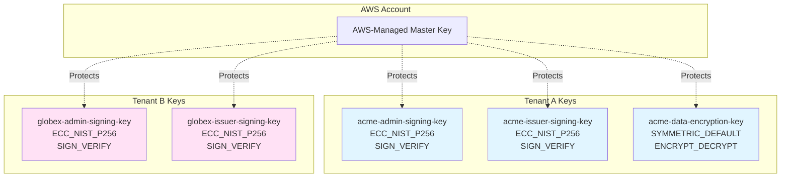
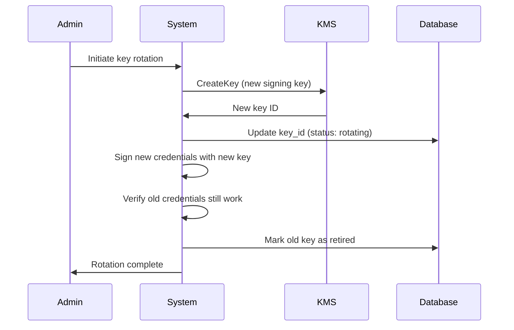

# Cryptography

## Purpose

This document describes the cryptographic architecture of Sybol, including AWS Key Management Service (KMS) configuration, signing operations, key management procedures, and encryption strategies. It covers both asymmetric keys for digital signatures and symmetric keys for data encryption.

## Context

Sybol uses cryptographic signatures to create verifiable credentials according to W3C standards. All private keys are stored in AWS KMS hardware security modules (HSMs), ensuring compliance with eIDAS 2.0 requirements for qualified electronic signatures.

## KMS Architecture

### Key Hierarchy



### Key Types and Purposes

| Key Type | Spec | Usage | Tenant Keys |
|----------|------|-------|-------------|
| Asymmetric Signing | ECC_NIST_P256 | Sign verifiable credentials | Per tenant, per role |
| Asymmetric Signing | RSA_2048 | Legacy support (deprecated) | Migration only |
| Symmetric Encryption | AES_256 | Encrypt sensitive data at rest | Per tenant |
| Symmetric Encryption | AWS-managed | Encrypt backups, logs | Shared |

## Asymmetric Keys for Signing

### Key Specification: ECC_NIST_P256

Elliptic Curve Cryptography chosen for:

| Attribute | Value | Rationale |
|-----------|-------|-----------|
| Key Spec | ECC_NIST_P256 | eIDAS 2.0 compliance |
| Key Usage | SIGN_VERIFY | Digital signatures only |
| Signature Algorithm | ECDSA_SHA_256 | W3C recommended |
| Key Size | 256 bits | Equivalent to RSA-3072 security |
| Performance | ~1ms signing | Fast signature generation |
| Key Storage | FIPS 140-2 Level 3 HSM | Hardware security module |

### Key Naming Convention

```
{tenantId}-{role}-signing-key
```

Examples:
- `acme-corp-admin-signing-key`
- `acme-corp-issuer-signing-key`
- `globex-inc-verifier-signing-key`

### Key Creation

Keys created during tenant onboarding:

```javascript
const AWS = require('aws-sdk');
const kms = new AWS.KMS();

async function createTenantSigningKey(tenantId, role) {
  const params = {
    Description: `Signing key for tenant ${tenantId} role ${role}`,
    KeyUsage: 'SIGN_VERIFY',
    KeySpec: 'ECC_NIST_P256',
    Origin: 'AWS_KMS',
    MultiRegion: false,
    Tags: [
      { TagKey: 'TenantId', TagValue: tenantId },
      { TagKey: 'Role', TagValue: role },
      { TagKey: 'Purpose', TagValue: 'CredentialSigning' },
      { TagKey: 'Compliance', TagValue: 'eIDAS2.0' }
    ]
  };
  
  const result = await kms.createKey(params).promise();
  const keyId = result.KeyMetadata.KeyId;
  
  // Create alias for easier reference
  await kms.createAlias({
    AliasName: `alias/${tenantId}-${role}-signing-key`,
    TargetKeyId: keyId
  }).promise();
  
  // Apply key policy
  await applyKeyPolicy(keyId, tenantId, role);
  
  return keyId;
}
```

### Key Policies

Each signing key has a restrictive policy:

```json
{
  "Version": "2012-10-17",
  "Statement": [
    {
      "Sid": "Enable IAM User Permissions",
      "Effect": "Allow",
      "Principal": {
        "AWS": "arn:aws:iam::ACCOUNT_ID:root"
      },
      "Action": "kms:*",
      "Resource": "*"
    },
    {
      "Sid": "Allow tenant role to sign",
      "Effect": "Allow",
      "Principal": {
        "AWS": "arn:aws:iam::ACCOUNT_ID:role/TenantRole-acme-corp-issuer"
      },
      "Action": [
        "kms:Sign",
        "kms:GetPublicKey",
        "kms:DescribeKey"
      ],
      "Resource": "*",
      "Condition": {
        "StringEquals": {
          "kms:KeySpec": "ECC_NIST_P256",
          "kms:SigningAlgorithm": "ECDSA_SHA_256"
        }
      }
    },
    {
      "Sid": "Allow all roles to verify",
      "Effect": "Allow",
      "Principal": {
        "AWS": "arn:aws:iam::ACCOUNT_ID:role/TenantRole-acme-corp-*"
      },
      "Action": [
        "kms:Verify",
        "kms:GetPublicKey"
      ],
      "Resource": "*"
    },
    {
      "Sid": "Deny key deletion",
      "Effect": "Deny",
      "Principal": {
        "AWS": "*"
      },
      "Action": [
        "kms:ScheduleKeyDeletion",
        "kms:DeleteAlias"
      ],
      "Resource": "*"
    }
  ]
}
```

## Credential Signing Workflow

### JWT Signing with KMS

Sybol signs verifiable credentials as JWTs:

```javascript
async function signCredentialJWT(payload, tenantId, roleKeyId) {
  // 1. Create JWT header and payload
  const header = {
    alg: 'ES256',
    typ: 'JWT',
    kid: roleKeyId // KMS key ID
  };
  
  const encodedHeader = base64UrlEncode(JSON.stringify(header));
  const encodedPayload = base64UrlEncode(JSON.stringify(payload));
  const message = `${encodedHeader}.${encodedPayload}`;
  
  // 2. Create message digest
  const crypto = require('crypto');
  const digest = crypto.createHash('sha256').update(message).digest();
  
  // 3. Sign with KMS
  const kms = new AWS.KMS({ credentials: tenantCredentials });
  const signResult = await kms.sign({
    KeyId: roleKeyId,
    Message: digest,
    MessageType: 'DIGEST',
    SigningAlgorithm: 'ECDSA_SHA_256'
  }).promise();
  
  // 4. Format signature for JWT (convert DER to raw R||S)
  const rawSignature = derToRawSignature(signResult.Signature);
  const encodedSignature = base64UrlEncode(rawSignature);
  
  // 5. Construct JWT
  return `${message}.${encodedSignature}`;
}
```

### Signature Verification

```javascript
async function verifyCredentialJWT(jwt, expectedKeyId) {
  const [encodedHeader, encodedPayload, encodedSignature] = jwt.split('.');
  
  // 1. Decode header and validate key ID
  const header = JSON.parse(base64UrlDecode(encodedHeader));
  if (header.kid !== expectedKeyId) {
    throw new Error('Key ID mismatch');
  }
  
  // 2. Recreate message digest
  const message = `${encodedHeader}.${encodedPayload}`;
  const digest = crypto.createHash('sha256').update(message).digest();
  
  // 3. Convert signature back to DER format
  const rawSignature = base64UrlDecode(encodedSignature);
  const derSignature = rawToDerSignature(rawSignature);
  
  // 4. Verify with KMS
  const kms = new AWS.KMS({ credentials: tenantCredentials });
  const verifyResult = await kms.verify({
    KeyId: expectedKeyId,
    Message: digest,
    MessageType: 'DIGEST',
    Signature: derSignature,
    SigningAlgorithm: 'ECDSA_SHA_256'
  }).promise();
  
  if (!verifyResult.SignatureValid) {
    throw new Error('Invalid signature');
  }
  
  // 5. Return decoded payload
  return JSON.parse(base64UrlDecode(encodedPayload));
}
```

### DID Document Signing

DID documents signed for integrity:

```javascript
async function signDIDDocument(didDocument, tenantId, keyId) {
  const canonicalized = canonicalizeJson(didDocument);
  const digest = crypto.createHash('sha256').update(canonicalized).digest();
  
  const kms = new AWS.KMS({ credentials: tenantCredentials });
  const signResult = await kms.sign({
    KeyId: keyId,
    Message: digest,
    MessageType: 'DIGEST',
    SigningAlgorithm: 'ECDSA_SHA_256'
  }).promise();
  
  return {
    ...didDocument,
    proof: {
      type: 'EcdsaSecp256r1Signature2019',
      created: new Date().toISOString(),
      verificationMethod: `did:web:sybol.identity/tenants/${tenantId}#keys-1`,
      proofPurpose: 'assertionMethod',
      jws: base64UrlEncode(signResult.Signature)
    }
  };
}
```

## Public Key Distribution

### KMS GetPublicKey

Public keys retrieved from KMS:

```javascript
async function getPublicKey(keyId) {
  const kms = new AWS.KMS();
  const result = await kms.getPublicKey({
    KeyId: keyId
  }).promise();
  
  return {
    keyId: result.KeyId,
    publicKey: result.PublicKey, // DER-encoded
    keyUsage: result.KeyUsage,
    keySpec: result.KeySpec,
    signingAlgorithms: result.SigningAlgorithms
  };
}
```

### JWK Format Conversion

Convert KMS public key to JSON Web Key:

```javascript
function publicKeyToJWK(kmsPubKey, keyId) {
  // Parse DER-encoded public key
  const asn1 = forge.asn1.fromDer(kmsPubKey.toString('binary'));
  const publicKey = forge.pki.publicKeyFromAsn1(asn1);
  
  // Extract x, y coordinates
  const point = publicKey.point;
  const x = point.x.toByteArray();
  const y = point.y.toByteArray();
  
  return {
    kty: 'EC',
    crv: 'P-256',
    x: base64UrlEncode(Buffer.from(x)),
    y: base64UrlEncode(Buffer.from(y)),
    use: 'sig',
    alg: 'ES256',
    kid: keyId
  };
}
```

### Public Key Endpoint

Expose tenant public keys via API:

```
GET /api/tenants/{tenantId}/keys

Response:
{
  "keys": [
    {
      "kty": "EC",
      "crv": "P-256",
      "x": "MKBCTNIcKUSDii11ySs3526iDZ8AiTo7Tu6KPAqv7D4",
      "y": "4Etl6SRW2YiLUrN5vfvVHuhp7x8PxltmWWlbbM4IFyM",
      "use": "sig",
      "kid": "acme-corp-issuer-signing-key",
      "alg": "ES256"
    }
  ]
}
```

## Symmetric Encryption

### Data Encryption Keys (DEK)

Sensitive data encrypted with tenant-specific keys:

```javascript
async function createDataEncryptionKey(tenantId) {
  const kms = new AWS.KMS();
  
  const result = await kms.createKey({
    Description: `Data encryption key for tenant ${tenantId}`,
    KeyUsage: 'ENCRYPT_DECRYPT',
    KeySpec: 'SYMMETRIC_DEFAULT', // AES-256-GCM
    Tags: [
      { TagKey: 'TenantId', TagValue: tenantId },
      { TagKey: 'Purpose', TagValue: 'DataEncryption' }
    ]
  }).promise();
  
  return result.KeyMetadata.KeyId;
}
```

### Envelope Encryption

Large payloads use envelope encryption:

```javascript
async function encryptSensitiveData(plaintext, tenantDataKeyId) {
  const kms = new AWS.KMS();
  
  // 1. Generate data key
  const dataKeyResult = await kms.generateDataKey({
    KeyId: tenantDataKeyId,
    KeySpec: 'AES_256'
  }).promise();
  
  const plaintextKey = dataKeyResult.Plaintext;
  const encryptedKey = dataKeyResult.CiphertextBlob;
  
  // 2. Encrypt data with plaintext key
  const cipher = crypto.createCipheriv('aes-256-gcm', plaintextKey, iv);
  const encrypted = Buffer.concat([
    cipher.update(plaintext, 'utf8'),
    cipher.final()
  ]);
  const authTag = cipher.getAuthTag();
  
  // 3. Return encrypted data + encrypted key
  return {
    encryptedData: encrypted.toString('base64'),
    encryptedKey: encryptedKey.toString('base64'),
    iv: iv.toString('base64'),
    authTag: authTag.toString('base64')
  };
}
```

### Decryption

```javascript
async function decryptSensitiveData(envelope, tenantDataKeyId) {
  const kms = new AWS.KMS();
  
  // 1. Decrypt data key with KMS
  const decryptResult = await kms.decrypt({
    CiphertextBlob: Buffer.from(envelope.encryptedKey, 'base64'),
    KeyId: tenantDataKeyId
  }).promise();
  
  const plaintextKey = decryptResult.Plaintext;
  
  // 2. Decrypt data with plaintext key
  const decipher = crypto.createDecipheriv(
    'aes-256-gcm',
    plaintextKey,
    Buffer.from(envelope.iv, 'base64')
  );
  decipher.setAuthTag(Buffer.from(envelope.authTag, 'base64'));
  
  const decrypted = Buffer.concat([
    decipher.update(Buffer.from(envelope.encryptedData, 'base64')),
    decipher.final()
  ]);
  
  return decrypted.toString('utf8');
}
```

## Key Rotation

### Automatic Key Rotation

KMS automatic rotation enabled:

```javascript
async function enableKeyRotation(keyId) {
  const kms = new AWS.KMS();
  
  await kms.enableKeyRotation({
    KeyId: keyId
  }).promise();
}
```

Rotation behavior:
- Enabled for symmetric keys only
- Rotates annually
- Old key material retained for decryption
- New material used for encryption
- Transparent to applications

### Manual Signing Key Rotation

Asymmetric keys require manual rotation:



### Rotation Procedure

1. **Pre-rotation validation**
   - Verify tenant operational
   - Backup current key ID
   - Notify tenant of rotation

2. **Create new key**
   ```javascript
   const newKeyId = await createTenantSigningKey(tenantId, role);
   ```

3. **Update configuration**
   ```sql
   UPDATE tenant_configuration
   SET signing_key_id = 'new-key-id',
       previous_key_id = 'old-key-id',
       key_rotation_date = NOW()
   WHERE tenant_id = 'acme-corp';
   ```

4. **Grace period**
   - Both keys valid for 30 days
   - New signatures use new key
   - Old signatures still verifiable

5. **Retire old key**
   ```javascript
   await kms.disableKey({ KeyId: oldKeyId }).promise();
   ```

### Rotation Schedule

| Key Type | Rotation Frequency | Method |
|----------|-------------------|--------|
| Signing Keys (Production) | Annually | Manual |
| Signing Keys (Development) | Not required | N/A |
| Data Encryption Keys | Annually | Automatic |
| AWS-Managed Keys | Annually | Automatic |

## Key Backup and Recovery

### KMS Key Material

KMS keys cannot be exported:
- Private keys never leave HSM
- Key material managed by AWS
- No customer backup required

### Key Metadata Backup

Key IDs and policies backed up:

```javascript
async function backupKeyMetadata(tenantId) {
  const kms = new AWS.KMS();
  
  // List all tenant keys
  const aliases = await kms.listAliases().promise();
  const tenantAliases = aliases.Aliases.filter(a => 
    a.AliasName.includes(tenantId)
  );
  
  const keyMetadata = [];
  for (const alias of tenantAliases) {
    const key = await kms.describeKey({ KeyId: alias.TargetKeyId }).promise();
    const policy = await kms.getKeyPolicy({ 
      KeyId: alias.TargetKeyId,
      PolicyName: 'default'
    }).promise();
    
    keyMetadata.push({
      alias: alias.AliasName,
      keyId: alias.TargetKeyId,
      keySpec: key.KeyMetadata.KeySpec,
      keyUsage: key.KeyMetadata.KeyUsage,
      creationDate: key.KeyMetadata.CreationDate,
      policy: JSON.parse(policy.Policy)
    });
  }
  
  // Store in S3 with encryption
  await s3.putObject({
    Bucket: 'sybol-key-backups',
    Key: `${tenantId}/key-metadata-${Date.now()}.json`,
    Body: JSON.stringify(keyMetadata, null, 2),
    ServerSideEncryption: 'aws:kms'
  }).promise();
}
```

### Disaster Recovery

In case of key loss:
1. Key material irrecoverable (HSM-backed)
2. Restore key IDs from backup
3. Create new keys with same policies
4. Re-sign all credentials
5. Update DID documents with new keys

## Performance Considerations

### Signing Performance

| Operation | Latency | Throughput |
|-----------|---------|------------|
| KMS Sign | 1-2ms | 1,000 TPS per key |
| KMS Verify | 1-2ms | 1,000 TPS per key |
| GetPublicKey | <1ms | Cacheable |

### Optimization Strategies

1. **Cache public keys**
   - Public keys change rarely
   - Cache for 24 hours
   - Validate on cache miss

2. **Batch signing**
   - Sign multiple credentials in parallel
   - Use Promise.all() for concurrency
   - Respect KMS rate limits

3. **Regional keys**
   - Use KMS in same region as Lambda
   - Avoid cross-region calls
   - Reduce latency

## Security Best Practices

### Key Management

- ✓ Never export private keys
- ✓ Use separate keys per tenant and role
- ✓ Enable CloudTrail logging for all key operations
- ✓ Rotate keys annually
- ✓ Deny key deletion in production
- ✓ Use key policies to enforce least privilege
- ✓ Tag all keys with tenant and purpose

### Signing Operations

- ✓ Validate input before signing
- ✓ Include timestamp in signed data
- ✓ Use message digests (not raw messages)
- ✓ Verify signature algorithm in JWT header
- ✓ Implement signature expiration
- ✓ Log all signing operations

### Monitoring

- ✓ Alert on key policy changes
- ✓ Alert on key disabling/deletion attempts
- ✓ Monitor signing rate per tenant
- ✓ Track signature verification failures
- ✓ Audit key access patterns

## References

- [Authorization](authorization.md) - KMS key policies and access control
- [Security Overview](security-overview.md) - Cryptographic controls
- [Compliance](compliance.md) - eIDAS 2.0 requirements
- [Tenant Onboarding](../operations/tenant-onboarding.md) - Key creation procedures
