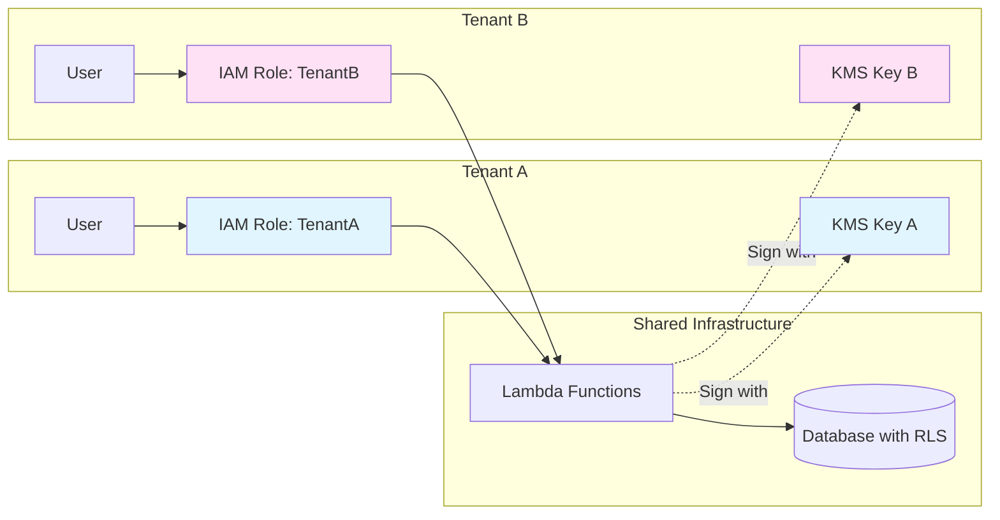
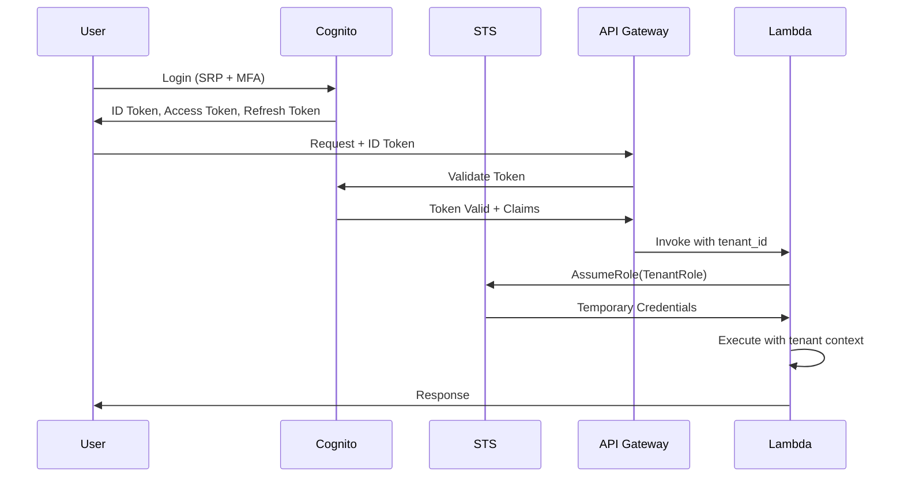

# Security Overview

## Purpose

This document provides a comprehensive overview of the security architecture, principles, and controls implemented in the Sybol platform. It establishes the foundation for understanding the platform's security model and serves as the entry point for security-related documentation.

## Context

Sybol is a multi-tenant SaaS platform for digital identity and verifiable credentials management. The platform handles sensitive identity data and cryptographic operations, requiring strong security controls, tenant isolation, and regulatory compliance.

## Threat Model

### Assets

| Asset | Description | Sensitivity |
|-------|-------------|-------------|
| Verifiable Credentials | Digital identity credentials signed by issuers | Critical |
| Private Keys | KMS asymmetric keys for credential signing | Critical |
| User Identity Data | PII stored in Cognito and RDS | High |
| Tenant Secrets | Database credentials, API keys | High |
| Authentication Tokens | JWT tokens for API access | High |
| DID Documents | Decentralized identifier documents | Medium |

### Threat Actors

| Actor Type | Capability | Motivation |
|------------|-----------|------------|
| External Attacker | Network access, API exploitation | Data theft, service disruption |
| Malicious Tenant | Valid credentials, authorized access | Cross-tenant data access |
| Compromised User | Stolen credentials | Unauthorized operations |
| Insider Threat | Platform access | Data exfiltration |

### Attack Vectors

1. **Cross-Tenant Data Access**
   - Threat: Tenant A accesses Tenant B's data
   - Control: Tenant isolation via STS roles and database RLS

2. **Credential Theft**
   - Threat: Stolen authentication tokens
   - Control: Short-lived tokens, MFA, session management

3. **Privilege Escalation**
   - Threat: User gains unauthorized role permissions
   - Control: Immutable IAM policies, STS session restrictions

4. **Cryptographic Key Compromise**
   - Threat: Private key exposure
   - Control: KMS hardware security modules, key policies

5. **API Exploitation**
   - Threat: Authentication bypass, injection attacks
   - Control: JWT authorizers, input validation, rate limiting

6. **Infrastructure Access**
   - Threat: Unauthorized AWS resource access
   - Control: VPC isolation, security groups, least privilege IAM

## Security Principles

### Defense in Depth

Multiple layers of security controls protect assets:

- Network layer: VPC, security groups, subnet isolation
- Authentication layer: Cognito with MFA
- Authorization layer: STS-based tenant IAM roles
- Application layer: Input validation, business logic enforcement
- Data layer: Encryption at rest and in transit
- Audit layer: CloudTrail, CloudWatch logging

### Least Privilege

Access is granted on a minimal basis:

- IAM roles scoped to specific resources and actions
- Tenant roles enforce data access boundaries
- Service principals have minimal required permissions
- No broad wildcard permissions in production

### Zero Trust

No implicit trust within the network:

- Every request authenticated and authorized
- Tenant context validated on each operation
- Service-to-service authentication required
- No trust based on network location

### Separation of Duties

Critical operations require multiple controls:

- Key creation separated from key usage
- Administrative roles separated from application roles
- Audit logs immutable and centralized

## Security Controls

### Preventive Controls

| Control | Mechanism | Coverage |
|---------|-----------|----------|
| Authentication | AWS Cognito with SRP | All user access |
| Multi-Factor Authentication | TOTP | High-privilege accounts |
| Authorization | STS AssumeRole with tenant isolation | All API requests |
| Encryption at Rest | KMS with per-tenant keys | All sensitive data |
| Encryption in Transit | TLS 1.2+ | All network communication |
| Network Isolation | VPC with security groups | Infrastructure layer |
| Input Validation | Schema validation, sanitization | All API inputs |

### Detective Controls

| Control | Mechanism | Coverage |
|---------|-----------|----------|
| Audit Logging | CloudTrail, CloudWatch Logs | All API calls and events |
| Security Monitoring | CloudWatch Alarms | Anomalous behavior |
| Failed Login Tracking | Cognito advanced security | Authentication attempts |
| Resource Configuration Monitoring | AWS Config | Infrastructure drift |

### Corrective Controls

| Control | Mechanism | Purpose |
|---------|-----------|---------|
| Automated Response | Lambda-based remediation | Security event handling |
| Incident Response Plan | Documented procedures | Breach containment |
| Backup and Recovery | Automated RDS snapshots | Data restoration |
| Session Revocation | Token invalidation | Compromised credential response |

## Trust Boundaries

```mermaid
graph TD
    subgraph Internet
        User[User Browser]
        ExtAPI[External API Consumers]
    end
    
    subgraph AWS Cloud
        subgraph VPC
            subgraph Public Subnet
                APIGW[API Gateway]
                Lambda[Lambda Functions]
            end
            subgraph Private Data
                RDS[(RDS Database)]
                Secrets[Secrets Manager]
            end
        end
        
        subgraph AWS Services
            Cognito[Cognito User Pool]
            KMS[KMS Keys]
            STS[AWS STS]
            CloudTrail[CloudTrail]
        end
    end
    
    User -->|TLS 1.2+| APIGW
    ExtAPI -->|TLS 1.2+ + JWT| APIGW
    APIGW -->|JWT Validation| Cognito
    APIGW -->|Invoke| Lambda
    Lambda -->|AssumeRole| STS
    Lambda -->|Query with RLS| RDS
    Lambda -->|Get Secret| Secrets
    Lambda -->|Sign/Verify| KMS
    Lambda -.->|Audit Log| CloudTrail
```

### Boundary 1: Internet → API Gateway
- Control: TLS encryption, rate limiting, WAF
- Authentication: JWT tokens issued by Cognito
- Risk: DDoS, credential theft

### Boundary 2: API Gateway → Lambda
- Control: IAM execution roles, VPC security groups
- Authorization: JWT authorizer validation
- Risk: Unauthorized function invocation

### Boundary 3: Lambda → AWS Services
- Control: IAM policies, resource policies
- Encryption: TLS for service calls
- Risk: Privilege escalation

### Boundary 4: Lambda → RDS
- Control: VPC security groups, database authentication
- Authorization: Row-level security by tenant_id
- Risk: SQL injection, cross-tenant access

## Security Architecture

### Multi-Tenant Isolation Model

Sybol implements a **pool model** with **logical isolation**:

- Shared infrastructure and database
- Tenant-specific IAM roles for authorization
- Row-level security (RLS) in database
- Tenant-specific KMS keys for cryptographic operations

### Authentication Flow

## Regulatory Requirements

### GDPR (General Data Protection Regulation)

| Requirement | Implementation |
|-------------|----------------|
| Data Protection by Design | Encryption, access controls, minimal data collection |
| Right to Access | API endpoints for data export |
| Right to Erasure | Tenant deletion procedures |
| Data Portability | JSON/JWS credential export |
| Consent Management | User consent tracking in database |
| Breach Notification | Incident response within 72 hours |
| Data Processing Agreement | Documented in tenant contracts |

### eIDAS 2.0 (Electronic Identification, Authentication and Trust Services)

| Requirement | Implementation |
|-------------|----------------|
| Qualified Electronic Signatures | ECC_NIST_P256 keys in KMS |
| Signature Creation Data | Private keys in HSM (KMS) |
| Signature Policy | W3C Verifiable Credentials format |
| Time Stamping | RFC 3161 timestamp tokens |
| Audit Trail | Immutable CloudTrail logs |

### SOC 2 Type II

| Trust Service Category | Controls |
|------------------------|----------|
| Security | Access controls, encryption, monitoring |
| Availability | High availability architecture, backups |
| Processing Integrity | Input validation, transaction logging |
| Confidentiality | Encryption, access restrictions |
| Privacy | Data minimization, consent management |

## Security Responsibilities

### Sybol Platform (Service Provider)

- Infrastructure security (AWS account, VPC, services)
- Application security (code, APIs, authentication)
- Encryption key management (KMS keys)
- Security monitoring and incident response
- Compliance certifications

### Tenant (Customer)

- User access management (onboarding, offboarding)
- Password policy enforcement
- MFA enrollment
- Data classification and handling procedures
- Credential issuance policies

## Security Roadmap

### Current State

- ✓ Cognito authentication with MFA
- ✓ STS-based multi-tenant authorization
- ✓ KMS asymmetric keys for signing
- ✓ VPC isolation with security groups
- ✓ Encryption at rest and in transit
- ✓ CloudTrail audit logging

### Planned Enhancements

- [ ] Web Application Firewall (WAF) integration
- [ ] DDoS protection (AWS Shield Advanced)
- [ ] Penetration testing program
- [ ] Security Information and Event Management (SIEM)
- [ ] Automated vulnerability scanning
- [ ] Key rotation automation
- [ ] Advanced threat detection (GuardDuty)

## References

- [Authentication](authentication.md) - Cognito implementation details
- [Authorization](authorization.md) - IAM and tenant isolation
- [Cryptography](cryptography.md) - KMS and signing operations
- [Compliance](compliance.md) - Regulatory compliance details
- [Security Architecture](../architecture/security-architecture.md) - Detailed architecture diagrams
- [Monitoring](../operations/monitoring.md) - Security monitoring procedures
