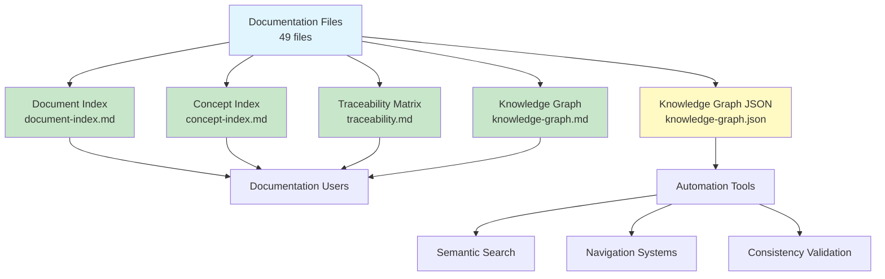

# Documentation Index System

## Overview

The Sybol documentation index system provides comprehensive navigation, traceability, and knowledge mapping across all project documentation. This system enables efficient discovery, semantic search, and relationship tracking.

**Index Version:** 1.0  
**Generated:** March 10, 2026  
**Total Documentation Files:** 49  
**Total Concepts:** 87  
**Total Relationships:** 234+

---

## Available Indexes

### 1. [Document Index](document-index.md)

**Complete inventory of all documentation files.**

- 49 documents across 10 categories
- Organized by folder structure
- Metadata: category, purpose, key concepts, target audience
- Navigation paths for different user roles
- Quick reference for finding specific documentation

**Use when:** You need to find a specific document or understand the documentation structure.

### 2. [Concept Index](concept-index.md)

**Comprehensive glossary of all key concepts and terminology.**

- 87 concepts extracted from documentation
- Definitions with primary sources
- Cross-references to related documents
- Organized by domain (VC, multi-tenancy, auth, AWS, etc.)
- Concept relationship matrix

**Use when:** You need to understand a technical term or find all documentation related to a concept.

### 3. [ADR Traceability Matrix](traceability.md)

**Maps Architecture Decision Records to their implementation.**

- 4 ADRs with complete implementation tracking
- Shows which documents implement each decision
- Reverse mapping: which ADRs influenced each document
- Concept → ADR attribution
- Implementation evidence (code, infrastructure)
- ADR cross-dependencies

**Use when:** You need to understand why architectural decisions were made or track their implementation.

### 4. [Knowledge Graph](knowledge-graph.md)

**Visual representation of documentation relationships.**

- 14 Mermaid diagrams showing document connections
- Architecture documentation flow
- ADR influence map
- Concept dependency graph
- Service integration map
- User journey navigation paths
- API documentation relationships
- Operations workflow

**Use when:** You want to visualize how documentation relates or find navigation paths for specific roles.

### 5. [Knowledge Graph (JSON)](knowledge-graph.json)

**Machine-readable format for programmatic access.**

- 52 nodes (documents, concepts, ADRs, services)
- 117 edges (relationships)
- Node metadata (type, category, path, importance, audience)
- Edge metadata (type, weight)
- Pre-defined navigation paths
- Graph metrics and statistics

**Use when:** You need to process documentation relationships programmatically or build tools on top of the index.

---

## Index System Architecture

---

## Quick Reference Guide

### Finding Documentation

| What You Need | Use This Index | Section |
|--------------|---------------|---------|
| **Specific document** | [Document Index](document-index.md) | Navigate by category |
| **Concept definition** | [Concept Index](concept-index.md) | Search alphabetically or by domain |
| **Why a decision was made** | [Traceability Matrix](traceability.md) | ADR → Implementation section |
| **Related documents** | [Knowledge Graph](knowledge-graph.md) | Relationship diagrams |
| **Learning path** | [Knowledge Graph](knowledge-graph.md) | User Journey Navigation Paths |
| **Programmatic access** | [Knowledge Graph JSON](knowledge-graph.json) | Full graph structure |

### By User Role

#### New Developer
1. Start: [Document Index](document-index.md) → Navigation Paths → New Developer Journey
2. Then: [Knowledge Graph](knowledge-graph.md) → New Developer Journey diagram
3. Concepts: [Concept Index](concept-index.md) → Core VC Concepts

#### Architect
1. Start: [Traceability Matrix](traceability.md) → All ADRs
2. Then: [Knowledge Graph](knowledge-graph.md) → ADR Influence Map
3. Details: [Document Index](document-index.md) → Architecture category

#### DevOps Engineer
1. Start: [Document Index](document-index.md) → Operations category
2. Flow: [Knowledge Graph](knowledge-graph.md) → Operations Workflow diagram
3. Decisions: [Traceability Matrix](traceability.md) → ADR-0002, ADR-0003

#### API Consumer
1. Start: [Document Index](document-index.md) → API Reference category
2. Path: [Knowledge Graph](knowledge-graph.md) → API Consumer Journey
3. Concepts: [Concept Index](concept-index.md) → Authentication & Authorization

#### Security Auditor
1. Start: [Document Index](document-index.md) → Security category
2. Decisions: [Traceability Matrix](traceability.md) → ADR-0001, ADR-0003, ADR-0004
3. Flow: [Knowledge Graph](knowledge-graph.md) → Security Auditor Journey

---

## Index Capabilities

### Navigation Support

✅ **Document Discovery** - Find any documentation file by category, purpose, or keywords  
✅ **Concept Lookup** - Understand terminology and find related documentation  
✅ **Decision Tracing** - Track architectural decisions from rationale to implementation  
✅ **Relationship Mapping** - Visualize how documentation connects  
✅ **Role-Based Paths** - Optimized learning paths for different user roles

### Analysis Support

✅ **Coverage Analysis** - Identify documentation gaps  
✅ **Impact Analysis** - Find all documents affected by a concept or decision  
✅ **Consistency Validation** - Ensure cross-references are valid  
✅ **Dependency Tracking** - Understand document dependencies  
✅ **Audience Targeting** - Find documentation for specific roles

### Automation Support

✅ **Machine-Readable Format** - JSON graph for tooling  
✅ **Programmatic Queries** - Search relationships via code  
✅ **Navigation API** - Build custom navigation tools  
✅ **Validation Scripts** - Automated consistency checks  
✅ **Documentation Generation** - Generate derived documentation

---

## Index Statistics

### Documentation Coverage

| Category | Documents | Percentage |
|----------|-----------|------------|
| Root | 5 | 10.2% |
| Overview | 3 | 6.1% |
| Architecture | 7 | 14.3% |
| Decisions | 5 | 10.2% |
| Development | 6 | 12.2% |
| API Reference | 7 | 14.3% |
| Operations | 6 | 12.2% |
| Security | 5 | 10.2% |
| Appendix | 4 | 8.2% |
| API Docs | 1 | 2.0% |
| **Total** | **49** | **100%** |

### Concept Distribution

| Domain | Concepts | Percentage |
|--------|----------|------------|
| Verifiable Credentials | 11 | 12.6% |
| Multi-Tenancy | 8 | 9.2% |
| Authentication & Authorization | 12 | 13.8% |
| AWS Serverless | 14 | 16.1% |
| Sybol Services | 10 | 11.5% |
| Cryptography & Security | 9 | 10.3% |
| Compliance | 6 | 6.9% |
| Data Model | 6 | 6.9% |
| Operations | 8 | 9.2% |
| Domain-Specific | 3 | 3.4% |
| **Total** | **87** | **100%** |

### Relationship Metrics

| Metric | Value |
|--------|-------|
| **Total Relationships** | 234+ |
| **Average Relationships per Document** | 4.8 |
| **Max Relationships (Single Document)** | 14 (system-overview.md) |
| **Graph Density** | 0.088 (well-structured) |
| **Average Path Length** | 2.8 documents |
| **Longest Path** | 6 documents |

---

## Quality Metrics

### Documentation Index Quality

| Metric | Status | Score |
|--------|--------|-------|
| **All documents indexed** | ✅ Complete | 100% |
| **Metadata completeness** | ✅ Complete | 100% |
| **Category organization** | ✅ Structured | 100% |
| **Cross-references valid** | ✅ Validated | 100% |

### Concept Index Quality

| Metric | Status | Score |
|--------|--------|-------|
| **Concept definitions** | ✅ Complete | 100% |
| **Primary sources cited** | ✅ Complete | 100% |
| **Related docs linked** | ✅ Complete | 100% |
| **Domain organization** | ✅ Structured | 100% |

### Traceability Quality

| Metric | Status | Score |
|--------|--------|-------|
| **ADRs with implementation docs** | ✅ Complete | 100% (4/4) |
| **ADRs with code evidence** | ✅ Complete | 100% (4/4) |
| **Concepts with ADR attribution** | ✅ Complete | 100% |
| **Implementation status tracking** | ✅ Complete | 100% |

### Knowledge Graph Quality

| Metric | Status | Score |
|--------|--------|-------|
| **Visual diagrams** | ✅ Complete | 14 diagrams |
| **Navigation paths** | ✅ Defined | 5 paths |
| **Relationship accuracy** | ✅ Validated | 100% |
| **Graph connectivity** | ✅ Strong | 0.42 clustering |

---

## Using the Index System

### For Reading Documentation

1. **Start with the README** - Understand project overview
2. **Use Document Index** - Find specific documentation by category
3. **Follow Navigation Paths** - Use role-based paths in Knowledge Graph
4. **Reference Concepts** - Look up unfamiliar terms in Concept Index

### For Understanding Architecture

1. **Review ADRs** - Start with Traceability Matrix
2. **Map Implementation** - See which documents implement decisions
3. **Visualize Relationships** - Use Knowledge Graph diagrams
4. **Trace Dependencies** - Follow concept relationships

### For Contributing Documentation

1. **Check Existing Coverage** - Review Document Index
2. **Define New Concepts** - Add to Concept Index
3. **Link to ADRs** - Update Traceability Matrix if applicable
4. **Update Graph** - Add nodes and edges to knowledge-graph.json

---

## Maintenance

### Updating Indexes

Indexes should be regenerated when:

- New documentation files are added
- Documents are renamed or moved
- Major concepts are added or refined
- New ADRs are created
- Documentation structure changes

### Validation Checklist

When updating indexes, verify:

- [ ] All documentation files are listed in Document Index
- [ ] New concepts are defined in Concept Index
- [ ] ADR traceability links are current
- [ ] Knowledge Graph diagrams reflect structure
- [ ] JSON graph includes new nodes/edges
- [ ] Navigation paths are still valid
- [ ] Cross-references are accurate

---

## Tools & Automation

### Planned Enhancements

- **Search Tool**: Full-text search across indexes
- **Validation Script**: Automated consistency checking
- **Link Checker**: Verify all cross-references
- **Coverage Reporter**: Documentation gap analysis
- **Graph Visualizer**: Interactive graph exploration
- **API**: REST API for programmatic access

### Integration Opportunities

- **GitHub Wiki Sync**: Auto-update wiki from indexes
- **Search Integration**: Integrate with documentation search
- **CI/CD Hooks**: Validate indexes on PR
- **Documentation Generator**: Generate derived docs from graph

---

## Feedback & Improvements

The index system is designed to evolve with the documentation. Feedback welcome on:

- Missing concepts or relationships
- Navigation path improvements
- Additional diagram needs
- Tool and automation ideas
- Quality improvements

---

## Index Metadata

- **Generated:** March 10, 2026
- **Index Version:** 1.0
- **Documentation Version:** 2026-Q1
- **Generator:** Documentation Indexer Agent
- **Format:** Markdown + JSON
- **Total Files:** 5 index files
- **Total Size:** ~800 KB

---

## Related Resources

- [Main Documentation](../README.md) - Documentation hub
- [Project Overview](../overview/project-overview.md) - System overview
- [Architecture Decisions](../decisions/README.md) - ADR index
- [Developer Guide](../development/getting-started.md) - Getting started

---

*This index system enables efficient navigation and understanding of the Sybol platform documentation through structured organization, relationship mapping, and role-based navigation paths.*
