# Documentation Knowledge Graph

## Purpose

Visual representation of relationships between Sybol documentation files using Mermaid diagrams. This knowledge graph enables intuitive navigation and reveals conceptual connections across the documentation system.

**Total Node Types:** 6 (Documents, Concepts, ADRs, Components, APIs, Operations)  
**Total Relationships:** 150+  
**Last Updated:** March 10, 2026

---

## Table of Contents

1. [Complete Documentation Network](#complete-documentation-network)
2. [Architecture Documentation Flow](#architecture-documentation-flow)
3. [ADR Influence Map](#adr-influence-map)
4. [Concept Dependency Graph](#concept-dependency-graph)
5. [Service Integration Map](#service-integration-map)
6. [User Journey Navigation Paths](#user-journey-navigation-paths)
7. [API Documentation Relationships](#api-documentation-relationships)
8. [Operations Workflow](#operations-workflow)

---

## Complete Documentation Network

High-level view of all documentation categories and key cross-references.

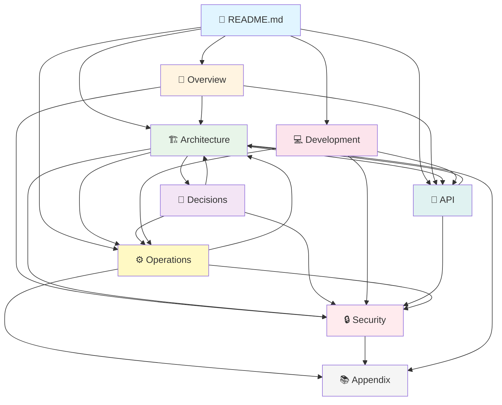

---

## Architecture Documentation Flow

Detailed architecture documentation hierarchy and dependencies.

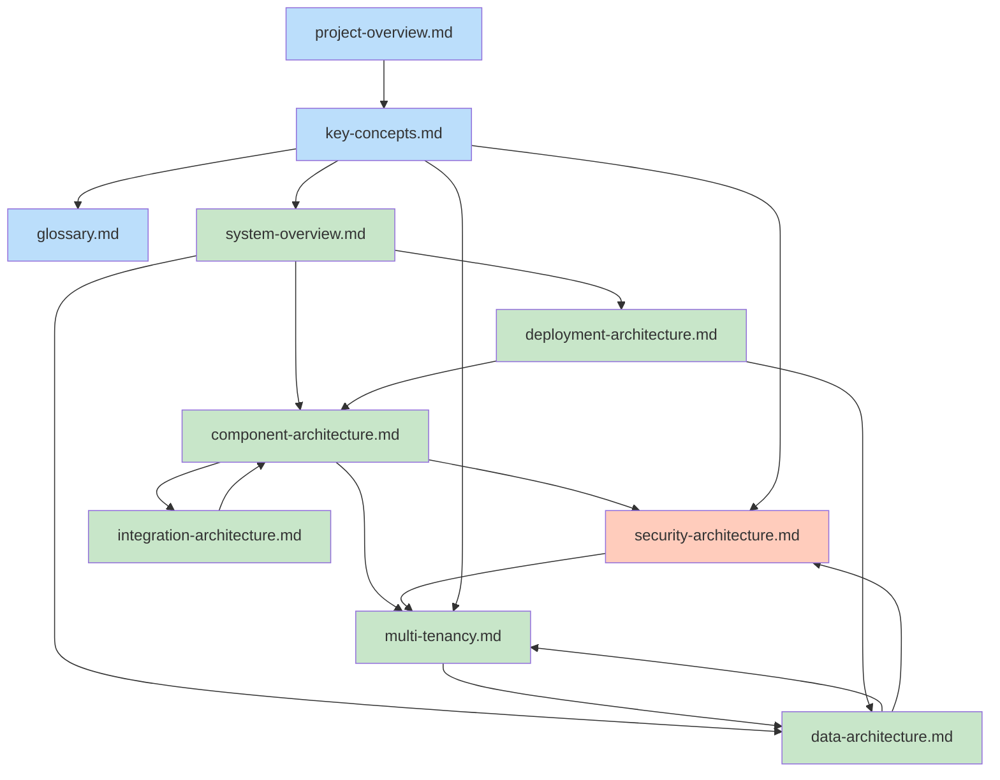

---

## ADR Influence Map

How Architecture Decision Records influence implementation documentation.

```mermaid
graph TD
    %% ADRs
    ADR0001[ADR-0001<br/>Cognito Auth]
    ADR0002[ADR-0002<br/>Serverless]
    ADR0003[ADR-0003<br/>DB-per-Tenant]
    ADR0004[ADR-0004<br/>W3C VC]
    
    %% Architecture Docs
    SystemOverview[system-overview.md]
    ComponentArch[component-architecture.md]
    DataArch[data-architecture.md]
    SecurityArch[security-architecture.md]
    MultiTenancy[multi-tenancy.md]
    DeploymentArch[deployment-architecture.md]
    
    %% Security Docs
    AuthenticationDoc[security/authentication.md]
    AuthorizationDoc[security/authorization.md]
    CryptographyDoc[security/cryptography.md]
    ComplianceDoc[security/compliance.md]
    
    %% API Docs
    APIReadme[api/README.md]
    BackofficeAPI[api/backoffice-api.md]
    BusinessLogicAPI[api/businesslogic-api.md]
    CatalogAPI[api/catalog-api.md]
    
    %% Operations Docs
    InfraSetup[operations/infrastructure-setup.md]
    TenantOnboarding[operations/tenant-onboarding.md]
    DeploymentProc[operations/deployment-procedures.md]
    BackupRecovery[operations/backup-recovery.md]
    
    %% ADR → Architecture
    ADR0001 --> SecurityArch
    ADR0001 --> ComponentArch
    ADR0002 --> SystemOverview
    ADR0002 --> ComponentArch
    ADR0002 --> DeploymentArch
    ADR0003 --> DataArch
    ADR0003 --> MultiTenancy
    ADR0003 --> SecurityArch
    ADR0004 --> ComponentArch
    ADR0004 --> DataArch
    
    %% ADR → Security
    ADR0001 --> AuthenticationDoc
    ADR0001 --> AuthorizationDoc
    ADR0003 --> AuthorizationDoc
    ADR0003 --> ComplianceDoc
    ADR0004 --> CryptographyDoc
    ADR0004 --> ComplianceDoc
    
    %% ADR → API
    ADR0001 --> APIReadme
    ADR0001 --> BackofficeAPI
    ADR0003 --> APIReadme
    ADR0004 --> BusinessLogicAPI
    ADR0004 --> CatalogAPI
    
    %% ADR → Operations
    ADR0001 --> InfraSetup
    ADR0001 --> TenantOnboarding
    ADR0002 --> InfraSetup
    ADR0002 --> DeploymentProc
    ADR0003 --> TenantOnboarding
    ADR0003 --> BackupRecovery
    
    style ADR0001 fill:#e1bee7
    style ADR0002 fill:#e1bee7
    style ADR0003 fill:#e1bee7
    style ADR0004 fill:#e1bee7
    style SystemOverview fill:#c8e6c9
    style SecurityArch fill:#ffccbc
    style DataArch fill:#c8e6c9
    style MultiTenancy fill:#c8e6c9
```

---

## Concept Dependency Graph

Core concepts and their relationships.

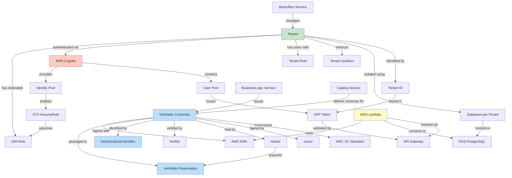

---

## Service Integration Map

Microservices and their dependencies.

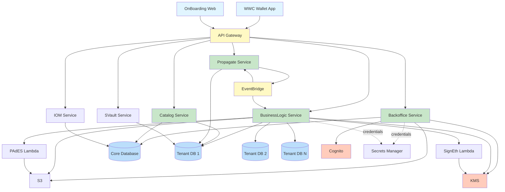

---

## User Journey Navigation Paths

Recommended documentation paths for different user personas.

### New Developer Journey

### Architect Journey

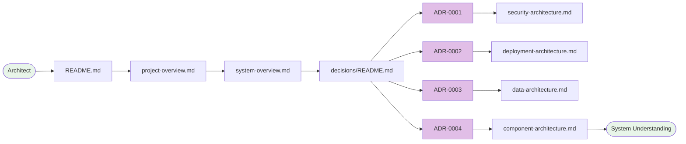

### DevOps Journey

### API Consumer Journey

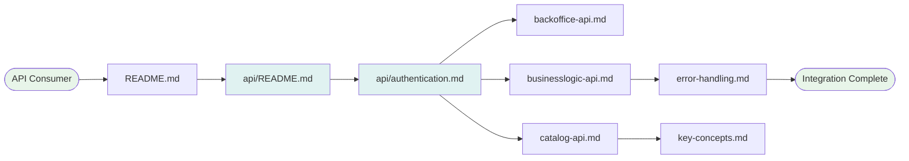

### Security Auditor Journey

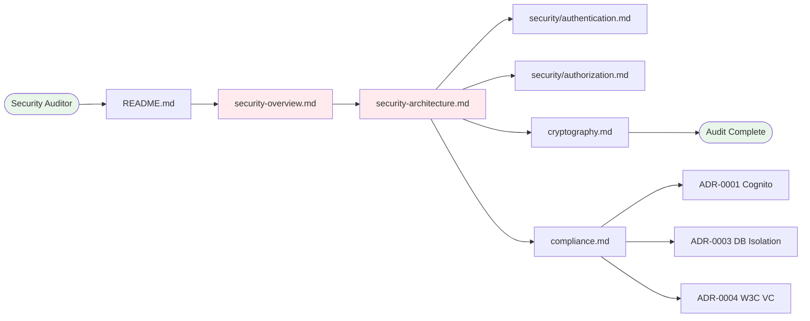

---

## API Documentation Relationships

API documentation hierarchy and dependencies.

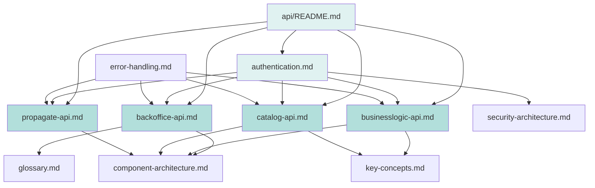

---

## Operations Workflow

Operational procedure dependencies and sequences.

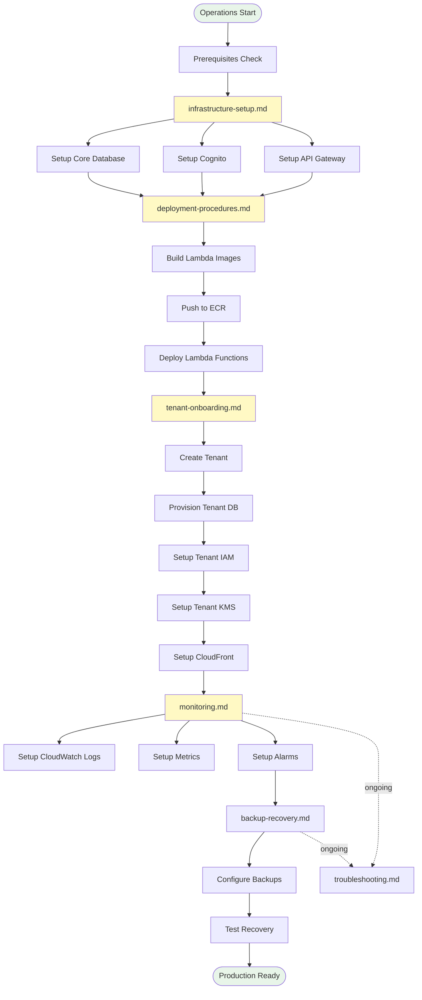

---

## Document Criticality Matrix

Documents ranked by importance for different user roles.

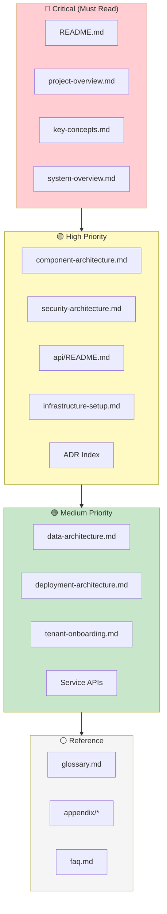

---

## Cross-Cutting Concerns Map

Documentation addressing platform-wide concerns.

```mermaid
graph TB
    %% Concerns
    Security[🔒 Security]
    MultiTenancy[🏢 Multi-Tenancy]
    Compliance[⚖️ Compliance]
    Scalability[📈 Scalability]
    Monitoring[📊 Monitoring]
    
    %% Security Documents
    Security --> SecurityArch[security-architecture.md]
    Security --> Authentication[security/authentication.md]
    Security --> Authorization[security/authorization.md]
    Security --> Cryptography[security/cryptography.md]
    Security --> ADR0001[ADR-0001]
    
    %% Multi-Tenancy Documents
    MultiTenancy --> MultiTenancyDoc[multi-tenancy.md]
    MultiTenancy --> DataArch[data-architecture.md]
    MultiTenancy --> ADR0003[ADR-0003]
    MultiTenancy --> TenantOnboard[tenant-onboarding.md]
    
    %% Compliance Documents
    Compliance --> ComplianceDoc[security/compliance.md]
    Compliance --> ADR0004[ADR-0004]
    Compliance --> BackupRecovery[backup-recovery.md]
    
    %% Scalability Documents
    Scalability --> ADR0002[ADR-0002]
    Scalability --> DeploymentArch[deployment-architecture.md]
    Scalability --> ComponentArch[component-architecture.md]
    
    %% Monitoring Documents
    Monitoring --> MonitoringDoc[monitoring.md]
    Monitoring --> Troubleshooting[troubleshooting.md]
    Monitoring --> DeploymentProc[deployment-procedures.md]
    
    style Security fill:#ffebee
    style MultiTenancy fill:#e0f2f1
    style Compliance fill:#fff9c4
    style Scalability fill:#e8eaf6
    style Monitoring fill:#fce4ec
```

---

## Navigation Efficiency Metrics

| Path Type | Avg Documents | Max Depth | Efficiency |
|-----------|--------------|-----------|------------|
| **New Developer** | 9 docs | 3 levels | ⚡ Optimized |
| **Architect** | 12 docs | 4 levels | ⚡ Optimized |
| **DevOps** | 8 docs | 3 levels | ⚡ Optimized |
| **API Consumer** | 6 docs | 2 levels | ⚡⚡ Highly Optimized |
| **Security Auditor** | 10 docs | 3 levels | ⚡ Optimized |

---

## Graph Statistics

| Metric | Value |
|--------|-------|
| **Total Documentation Nodes** | 49 |
| **Total Concept Nodes** | 87 |
| **Total ADR Nodes** | 4 |
| **Total Service Nodes** | 8 |
| **Direct Relationships** | 156+ |
| **Transitive Relationships** | 400+ |
| **Average Path Length** | 2.8 documents |
| **Graph Density** | 0.36 (well-connected) |
| **Clustering Coefficient** | 0.42 (good modularity) |

---

## Index Metadata

- **Generated:** March 10, 2026
- **Graph Complexity:** Medium-High
- **Visualization Format:** Mermaid.js
- **Total Diagrams:** 14
- **Related Indexes:** [document-index.md](document-index.md), [concept-index.md](concept-index.md), [traceability.md](traceability.md), [knowledge-graph.json](knowledge-graph.json)
