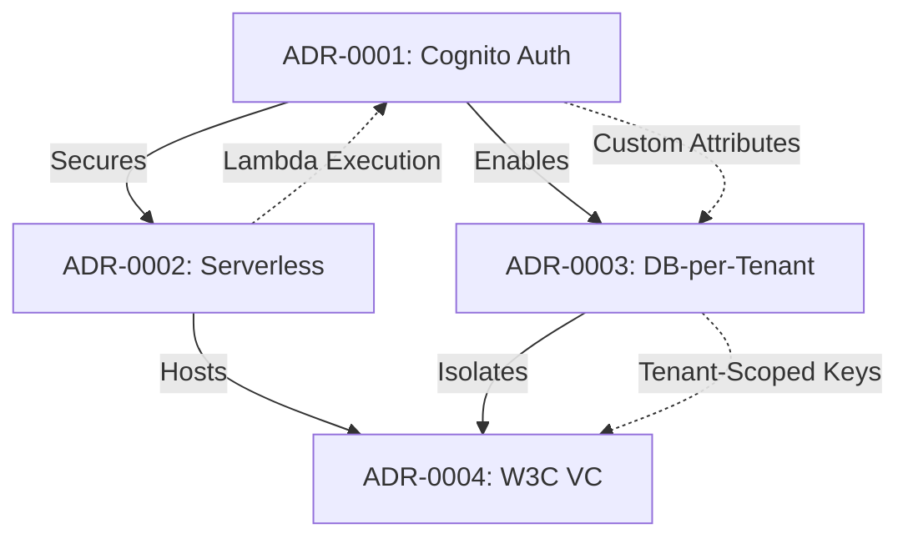

# ADR Traceability Matrix

## Purpose

Maps Architecture Decision Records (ADRs) to their implementation in the codebase and documentation. This matrix ensures architectural decisions are traceable from rationale through implementation to operational procedures.

**Total ADRs:** 4  
**Last Updated:** March 10, 2026

---

## Traceability Overview

This document provides three perspectives on ADR traceability:

1. **ADR → Implementation**: Which documents implement each decision
2. **Document → ADR**: Which decisions influenced each document
3. **Concept → ADR**: Which ADRs define key architectural concepts

---

## ADR-0001: AWS Cognito for User Authentication

**Status:** Accepted  
**Decision:** Use AWS Cognito as platform-wide authentication provider

### Implemented In

| Implementation Area | Documents | Description |
|--------------------|-----------|-------------|
| **Architecture Design** | [security-architecture.md](../architecture/security-architecture.md) | Cognito integration in security model |
| **Architecture Design** | [component-architecture.md](../architecture/component-architecture.md) | Cognito as authentication layer for all services |
| **Security** | [authentication.md](../security/authentication.md) | Detailed Cognito User Pool and Identity Pool implementation |
| **Security** | [authorization.md](../security/authorization.md) | STS AssumeRole flow using Cognito tokens |
| **API** | [authentication.md](../api/authentication.md) | JWT token structure and authentication flows |
| **API** | [api/README.md](../api/README.md) | API-wide authentication requirements |
| **Operations** | [infrastructure-setup.md](../operations/infrastructure-setup.md) | Cognito User Pool and Identity Pool setup procedures |
| **Operations** | [tenant-onboarding.md](../operations/tenant-onboarding.md) | Tenant user provisioning in Cognito |
| **Concepts** | [key-concepts.md](../overview/key-concepts.md) | Cognito, User Pool, Identity Pool concepts |
| **Reference** | [glossary.md](../overview/glossary.md) | Authentication terminology |

### Related Architecture Documents

- [system-overview.md](../architecture/system-overview.md) - Shows Cognito in system context
- [multi-tenancy.md](../architecture/multi-tenancy.md) - Custom tenant attributes in Cognito
- [deployment-architecture.md](../architecture/deployment-architecture.md) - Cognito in AWS infrastructure topology

### Implementation Evidence

| Evidence Type | Location | Verification |
|--------------|----------|--------------|
| **Infrastructure Code** | `infraestructure/CoreInfra/` | CDK stack defining Cognito resources |
| **Backend Integration** | `services/backoffice/`, `services/businessLogic/` | Cognito SDK usage for token validation |
| **Frontend Integration** | `webApps/wwc/`, `webApps/OnBoardingWeb/` | Cognito authentication flows |
| **Configuration** | `docs/Environment.md` | Cognito User Pool and Identity Pool IDs |

### Key Concepts Defined

- AWS Cognito
- Cognito User Pool
- Cognito Identity Pool
- JWT (JSON Web Token)
- Custom Tenant Attributes
- MFA (Multi-Factor Authentication)

---

## ADR-0002: Serverless Architecture with Lambda + API Gateway

**Status:** Accepted  
**Decision:** Deploy backend services using AWS Lambda and API Gateway

### Implemented In

| Implementation Area | Documents | Description |
|--------------------|-----------|-------------|
| **Architecture Design** | [system-overview.md](../architecture/system-overview.md) | Lambda and API Gateway as core compute layer |
| **Architecture Design** | [component-architecture.md](../architecture/component-architecture.md) | All microservices deployed as containerized Lambdas |
| **Architecture Design** | [deployment-architecture.md](../architecture/deployment-architecture.md) | Complete serverless infrastructure topology |
| **Operations** | [infrastructure-setup.md](../operations/infrastructure-setup.md) | Lambda and API Gateway deployment procedures |
| **Operations** | [deployment-procedures.md](../operations/deployment-procedures.md) | Lambda container image deployment via ECR |
| **Operations** | [monitoring.md](../operations/monitoring.md) | Lambda metrics and CloudWatch monitoring |
| **Development** | [local-development.md](../development/local-development.md) | Local Lambda testing with Docker |
| **Development** | [repository-structure.md](../development/repository-structure.md) | Service structure for Lambda deployment |
| **API** | [api/README.md](../api/README.md) | API Gateway routing to Lambda functions |
| **Concepts** | [key-concepts.md](../overview/key-concepts.md) | Serverless concepts |
| **Reference** | [glossary.md](../overview/glossary.md) | Lambda, API Gateway, cold start terminology |

### Related Architecture Documents

- [integration-architecture.md](../architecture/integration-architecture.md) - Lambda-EventBridge integration
- [data-architecture.md](../architecture/data-architecture.md) - Lambda-RDS connectivity
- [security-architecture.md](../architecture/security-architecture.md) - Lambda execution roles and security

### Implementation Evidence

| Evidence Type | Location | Verification |
|--------------|----------|--------------|
| **Infrastructure Code** | `infraestructure/CoreInfra/` | CDK Lambda and API Gateway definitions |
| **Service Code** | `services/backoffice/`, `services/businessLogic/`, etc. | Node.js Lambda handlers |
| **Container Definitions** | `lambdas/PAdES/`, `lambdas/signEth/` | Lambda container images |
| **Deployment Scripts** | `deploy/`, `infraestructure/CoreInfra/update-lambda-image.sh` | Lambda deployment automation |
| **API Routes** | Service-specific routing in each Lambda | Express.js routes within Lambda handlers |

### Key Concepts Defined

- AWS Lambda
- Lambda Container Image
- API Gateway
- Cold Start
- Serverless Architecture
- Event-Driven Computing

---

## ADR-0003: Database-Per-Tenant Isolation Strategy

**Status:** Accepted  
**Decision:** Implement multi-tenancy using isolated databases per tenant

### Implemented In

| Implementation Area | Documents | Description |
|--------------------|-----------|-------------|
| **Architecture Design** | [data-architecture.md](../architecture/data-architecture.md) | Complete database-per-tenant implementation design |
| **Architecture Design** | [multi-tenancy.md](../architecture/multi-tenancy.md) | Multi-tenant isolation patterns and enforcement |
| **Architecture Design** | [security-architecture.md](../architecture/security-architecture.md) | Data isolation security model |
| **Security** | [authorization.md](../security/authorization.md) | Tenant-scoped database access via STS |
| **Security** | [compliance.md](../security/compliance.md) | GDPR compliance through database isolation |
| **API** | [api/README.md](../api/README.md) | Multi-tenant database routing in APIs |
| **Operations** | [infrastructure-setup.md](../operations/infrastructure-setup.md) | Core RDS PostgreSQL setup |
| **Operations** | [tenant-onboarding.md](../operations/tenant-onboarding.md) | New tenant database provisioning |
| **Operations** | [backup-recovery.md](../operations/backup-recovery.md) | Per-tenant backup and recovery procedures |
| **Concepts** | [key-concepts.md](../overview/key-concepts.md) | Tenant, tenant isolation concepts |
| **Reference** | [glossary.md](../overview/glossary.md) | Multi-tenancy terminology |

### Related Architecture Documents

- [system-overview.md](../architecture/system-overview.md) - Database layer in system context
- [component-architecture.md](../architecture/component-architecture.md) - Service-database relationships
- [deployment-architecture.md](../architecture/deployment-architecture.md) - RDS infrastructure topology

### Implementation Evidence

| Evidence Type | Location | Verification |
|--------------|----------|--------------|
| **Infrastructure Code** | `infraestructure/CoreInfra/lib/` | CDK RDS PostgreSQL definition |
| **Infrastructure Code** | `infraestructure/ClientInfra/` | Tenant database provisioning |
| **Database Scripts** | `infraestructure/CoreInfra/sql-scripts/` | Database initialization SQL |
| **Backend Code** | Service database connection logic | Tenant-scoped database connections |
| **Configuration** | `docs/Environment.md` | Database connection environment variables |

### Key Concepts Defined

- Database-per-Tenant
- Tenant Isolation
- Tenant ID
- Data Isolation
- Multi-Tenant Architecture
- Noisy Neighbor Prevention
- GDPR Right to Erasure

---

## ADR-0004: W3C Verifiable Credentials Standard

**Status:** Accepted  
**Decision:** Adopt W3C VC standard as primary credential format

### Implemented In

| Implementation Area | Documents | Description |
|--------------------|-----------|-------------|
| **Core Concepts** | [project-overview.md](../overview/project-overview.md) | W3C VC as foundational platform capability |
| **Core Concepts** | [key-concepts.md](../overview/key-concepts.md) | Comprehensive VC, DID, VP concept definitions |
| **Architecture Design** | [system-overview.md](../architecture/system-overview.md) | VC issuance and verification flows |
| **Architecture Design** | [component-architecture.md](../architecture/component-architecture.md) | BusinessLogic service VC implementation |
| **Security** | [cryptography.md](../security/cryptography.md) | VC signing with KMS-managed keys |
| **Security** | [compliance.md](../security/compliance.md) | eIDAS 2.0 alignment via W3C VC |
| **API** | [businesslogic-api.md](../api/businesslogic-api.md) | Complete VC lifecycle API endpoints |
| **API** | [catalog-api.md](../api/catalog-api.md) | Credential schema and template management |
| **Data** | [data-architecture.md](../architecture/data-architecture.md) | VC data model storage |
| **Reference** | [glossary.md](../overview/glossary.md) | VC terminology |
| **Reference** | [appendix/references.md](../appendix/references.md) | W3C VC specification links |

### Related Architecture Documents

- [security-architecture.md](../architecture/security-architecture.md) - VC signature verification
- [integration-architecture.md](../architecture/integration-architecture.md) - VC exchange between systems
- [multi-tenancy.md](../architecture/multi-tenancy.md) - Tenant-specific VC signing keys

### Implementation Evidence

| Evidence Type | Location | Verification |
|--------------|----------|--------------|
| **Backend Code** | `services/businessLogic/` | W3C VC creation, signing, verification logic |
| **Frontend Code** | `webApps/wwc/` | VC display and presentation in wallet |
| **API Contracts** | [businesslogic-api.md](../api/businesslogic-api.md) | VC JSON-LD structure in API responses |
| **Cryptography** | KMS integration for VC signing | ECC_NIST_P256 asymmetric keys |

### Key Concepts Defined

- Verifiable Credential (VC)
- Decentralized Identifier (DID)
- DID Document
- Verifiable Presentation (VP)
- Issuer
- Holder
- Verifier
- W3C VC Data Model
- JSON-LD
- Selective Disclosure
- BBS+ Signatures
- eIDAS 2.0 Compliance

---

## Document → ADR Reference Matrix

Reverse mapping showing which ADRs influenced each document.

### Architecture Documents

| Document | Referenced ADRs | Primary Influence |
|----------|----------------|-------------------|
| [system-overview.md](../architecture/system-overview.md) | ADR-0001, ADR-0002, ADR-0003, ADR-0004 | All ADRs (system-wide view) |
| [component-architecture.md](../architecture/component-architecture.md) | ADR-0001, ADR-0002, ADR-0004 | Serverless + Auth + VC |
| [data-architecture.md](../architecture/data-architecture.md) | ADR-0003, ADR-0004 | Database isolation + VC storage |
| [security-architecture.md](../architecture/security-architecture.md) | ADR-0001, ADR-0003, ADR-0004 | Auth + Isolation + VC signing |
| [multi-tenancy.md](../architecture/multi-tenancy.md) | ADR-0001, ADR-0003 | Auth + Database isolation |
| [deployment-architecture.md](../architecture/deployment-architecture.md) | ADR-0001, ADR-0002, ADR-0003 | Auth + Serverless + Database |
| [integration-architecture.md](../architecture/integration-architecture.md) | ADR-0002, ADR-0004 | Serverless events + VC exchange |

### Security Documents

| Document | Referenced ADRs | Primary Influence |
|----------|----------------|-------------------|
| [security/authentication.md](../security/authentication.md) | ADR-0001 | Cognito authentication |
| [security/authorization.md](../security/authorization.md) | ADR-0001, ADR-0003 | Cognito + Tenant isolation |
| [security/cryptography.md](../security/cryptography.md) | ADR-0004 | VC signing |
| [security/compliance.md](../security/compliance.md) | ADR-0003, ADR-0004 | GDPR + eIDAS 2.0 |

### API Documents

| Document | Referenced ADRs | Primary Influence |
|----------|----------------|-------------------|
| [api/README.md](../api/README.md) | ADR-0001, ADR-0002, ADR-0003 | Auth + Serverless + Multi-tenant |
| [api/authentication.md](../api/authentication.md) | ADR-0001 | Cognito flows |
| [api/backoffice-api.md](../api/backoffice-api.md) | ADR-0001, ADR-0003 | Auth + Tenant management |
| [api/businesslogic-api.md](../api/businesslogic-api.md) | ADR-0004 | VC lifecycle |
| [api/catalog-api.md](../api/catalog-api.md) | ADR-0004 | VC schemas |

### Operations Documents

| Document | Referenced ADRs | Primary Influence |
|----------|----------------|-------------------|
| [operations/infrastructure-setup.md](../operations/infrastructure-setup.md) | ADR-0001, ADR-0002, ADR-0003 | Auth + Serverless + Database setup |
| [operations/tenant-onboarding.md](../operations/tenant-onboarding.md) | ADR-0001, ADR-0003 | Auth + Database provisioning |
| [operations/deployment-procedures.md](../operations/deployment-procedures.md) | ADR-0002 | Lambda deployment |
| [operations/backup-recovery.md](../operations/backup-recovery.md) | ADR-0003 | Per-tenant backups |
| [operations/monitoring.md](../operations/monitoring.md) | ADR-0002 | Lambda monitoring |

---

## Concept → ADR Mapping

Key concepts and the ADRs that define them.

| Concept | Defining ADR(s) | Related ADRs |
|---------|----------------|--------------|
| **AWS Cognito** | ADR-0001 | - |
| **JWT Authentication** | ADR-0001 | - |
| **AWS Lambda** | ADR-0002 | - |
| **API Gateway** | ADR-0002 | - |
| **Database-per-Tenant** | ADR-0003 | - |
| **Tenant Isolation** | ADR-0003 | ADR-0001 (auth isolation) |
| **Verifiable Credential** | ADR-0004 | - |
| **DID (Decentralized Identifier)** | ADR-0004 | - |
| **W3C VC Standard** | ADR-0004 | - |
| **Serverless Architecture** | ADR-0002 | - |
| **Multi-Tenancy** | ADR-0003 | ADR-0001 (auth), ADR-0002 (compute) |
| **eIDAS 2.0 Compliance** | ADR-0004 | - |
| **GDPR Compliance** | ADR-0003 | - |

---

## ADR Implementation Status

Summary of implementation completeness per ADR.

| ADR | Status | Implementation Docs | Operations Docs | API Docs | Evidence |
|-----|--------|-------------------|----------------|----------|----------|
| **ADR-0001** | ✅ Fully Implemented | 3 | 2 | 3 | Infrastructure code, backend integration |
| **ADR-0002** | ✅ Fully Implemented | 3 | 3 | 1 | Lambda functions, ECR images, CDK code |
| **ADR-0003** | ✅ Fully Implemented | 3 | 3 | 1 | RDS setup, tenant DBs, SQL scripts |
| **ADR-0004** | ✅ Fully Implemented | 4 | 0 | 2 | BusinessLogic service, VC APIs |

---

## ADR Cross-Dependencies

How ADRs depend on or complement each other.

### Dependency Descriptions

| From ADR | Relationship | To ADR | Description |
|----------|-------------|--------|-------------|
| ADR-0001 | **Enables** | ADR-0003 | Cognito custom attributes provide tenant_id for database routing |
| ADR-0001 | **Secures** | ADR-0002 | Cognito provides authentication for Lambda/API Gateway |
| ADR-0002 | **Hosts** | ADR-0004 | Lambda functions implement VC issuance and verification |
| ADR-0003 | **Isolates** | ADR-0004 | Separate databases ensure tenant VC isolation |

---

## Traceability Quality Metrics

| Metric | Value | Status |
|--------|-------|--------|
| **ADRs with Implementation Docs** | 4/4 (100%) | ✅ Complete |
| **ADRs with Operations Docs** | 3/4 (75%) | ⚠️ ADR-0004 has no ops-specific docs |
| **ADRs with API Docs** | 4/4 (100%) | ✅ Complete |
| **ADRs with Code Evidence** | 4/4 (100%) | ✅ Complete |
| **Architecture Docs Referencing ADRs** | 7/7 (100%) | ✅ Complete |
| **Concepts with ADR Attribution** | 13/13 (100%) | ✅ Complete |

---

## Future ADR Recommendations

Based on traceability analysis, potential future ADRs:

| Topic | Rationale | Current Gap |
|-------|-----------|-------------|
| **Event-Driven Architecture** | EventBridge usage not documented as formal decision | Integration patterns exist but lack decision rationale |
| **Frontend Technology Stack** | React choice not formalized | Frontend exists but decision undocumented |
| **Monitoring & Observability** | CloudWatch approach not formalized | Monitoring implemented but no decision record |
| **Backup & Recovery Strategy** | RDS backup approach not formalized | Procedures exist but no architectural rationale |

---

## Index Metadata

- **Generated:** March 10, 2026
- **Total ADRs Tracked:** 4
- **Total Implementation Mappings:** 42
- **Traceability Coverage:** 100%
- **Related Indexes:** [document-index.md](document-index.md), [concept-index.md](concept-index.md), [knowledge-graph.md](knowledge-graph.md)
