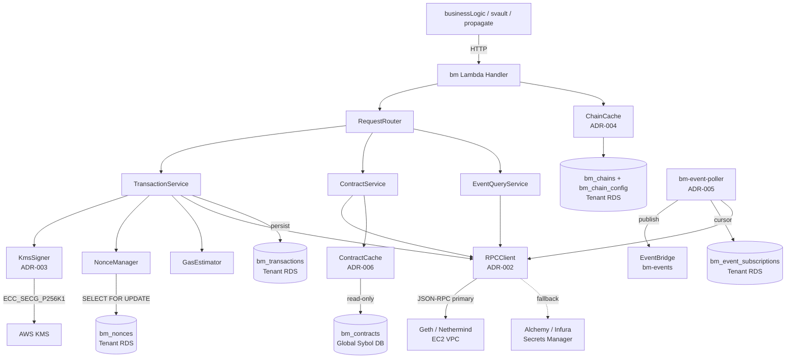

# BM Service — Blockchain Manager: EVM Connector Specification

**Version:** 0.2 (Architecture-complete)  
**Date:** 2026-03-16  
**Status:** ✅ Architecture decisions complete — implementation pending  
**Owner:** IGM

---

## Table of Contents

1. [Overview](#1-overview)
2. [Scope](#2-scope)
3. [Stakeholders & Context](#3-stakeholders--context)
4. [Functional Requirements](#4-functional-requirements)
5. [Non-Functional Requirements](#5-non-functional-requirements)
6. [Architecture Overview](#6-architecture-overview)
7. [API Design](#7-api-design)
8. [Supported Chains](#8-supported-chains)
9. [Security Model](#9-security-model)
10. [Error Handling & Retry Strategy](#10-error-handling--retry-strategy)
11. [Configuration & Environment Variables](#11-configuration--environment-variables)
12. [Observability](#12-observability)
13. [Open Questions & Decision Log](#13-open-questions--decision-log)

---

## 1. Overview

The **BM (Blockchain Manager) service** is an internal connector that provides a unified, chain-agnostic interface for interacting with EVM-compatible blockchains from within the Sybol platform.

It encapsulates all on-chain concerns — transaction lifecycle, smart contract calls, event indexing, and wallet/signer management — behind a clean HTTP API consumed by other Sybol services (e.g. `businessLogic`, `svault`, `propagate`).

### 1.1 Goals

- Abstract EVM complexity away from business-logic services.
- Support multiple EVM-compatible networks from a single deployment.
- Provide deterministic, auditable transaction submission with status tracking.
- Be tenant-aware: each tenant may operate on different chains or contracts.

### 1.2 Non-Goals

- Does **not** implement business-level credential logic (that lives in `businessLogic`).
- Does **not** manage user identity or authentication (delegated to Cognito / backoffice).
- Does **not** support non-EVM chains (Bitcoin, Solana, etc.) in this version.

> Non-EVM chains are explicitly **out of scope for v1**. Future support requires a dedicated ADR and separate connector architecture.

---

## 2. Scope

| In Scope | Out of Scope |
|---|---|
| EVM read operations (call, getLogs, getBlock) | Non-EVM blockchains |
| EVM write operations (sendTransaction, sendRawTransaction) | Blockchain node operation / infrastructure |
| Smart contract function invocation (ABI-based) | NFT marketplace features |
| Transaction receipt polling & confirmation | On-chain governance |
| Event log subscription / polling | Cross-chain bridging |
| Multi-chain routing (chain registry) | DeFi integrations |
| Tenant-scoped chain configuration | — |
| Transaction signing via configurable signer backend | — |

<!-- NOTE: Review scope with product team. Add or remove rows as needed. -->

---

## 3. Stakeholders & Context

| Role | Name | Notes |
|---|---|---|
| Service owner | TBD | — |
| Consumers | `businessLogic`, `svault`, `propagate` | Internal HTTP callers |
| Security reviewer | TBD | Key management sign-off required |
| Infra | CoreInfra team | Lambda + ECR deployment |

### 3.1 Integration Context

The bm service sits in the infrastructure layer. It is called by business services and it calls out to EVM nodes/RPCs.

```
businessLogic / svault / propagate
         │  (internal HTTP)
         ▼
    ┌─────────┐
    │   bm    │  ← Blockchain Manager (this service)
    └─────────┘
         │  (JSON-RPC / WebSocket)
         ▼
  EVM Node / RPC Provider
  (Ethereum, Polygon, Base, …)
```

> **Resolved:** bm is invoked **synchronously over HTTP** by its callers. Transaction submission returns 202 Accepted with `txHash` immediately (fire-and-track). Real-time event notification is handled asynchronously by the `bm-event-poller` Lambda (ADR-005) — callers do not maintain persistent connections.

---

## 4. Functional Requirements

### 4.1 Chain Connectivity

| ID | Requirement |
|---|---|
| FR-01 | The service MUST support connecting to multiple EVM-compatible chains simultaneously. |
| FR-02 | Chain configurations (RPC URL, chain ID, native currency) MUST be managed without code changes. |
| FR-03 | The service MUST validate the chain ID returned by the RPC against the expected config to prevent chain confusion attacks. |

<!-- NOTE: Define the initial set of supported chains. See §8. -->

### 4.2 Transaction Submission

| ID | Requirement |
|---|---|
| FR-10 | The service MUST accept a transaction payload and submit it to the target chain. |
| FR-11 | The service MUST manage nonce sequencing per signer address per chain to avoid nonce collisions. |
| FR-12 | The service MUST estimate gas unless an explicit gas limit is provided by the caller. |
| FR-13 | The service MUST support EIP-1559 fee model (maxFeePerGas / maxPriorityFeePerGas) where supported by the chain. |
| FR-14 | The service SHOULD support legacy gas pricing as fallback for chains not supporting EIP-1559. |
| FR-15 | The service MUST return a transaction hash immediately after broadcast (fire-and-track pattern). |

> **Resolved (ADR-005):** **Fire-and-track pattern adopted.** `POST /api/bm/transactions` returns 202 Accepted with `txHash` immediately. Callers poll `GET /api/bm/transactions/:txHash` for status, or consume EventBridge events emitted by `bm-event-poller`.

### 4.3 Transaction Status & Receipt Tracking

| ID | Requirement |
|---|---|
| FR-20 | The service MUST provide an endpoint to query transaction status by hash and chain. |
| FR-21 | The service MUST track confirmations relative to a configurable confirmation threshold per chain. |
| FR-22 | The service MUST expose receipt data (block number, logs, gas used, status) once confirmed. |
| FR-23 | The service MUST handle transaction replacement (same nonce, higher gas) and detect stuck transactions. |

> **Stuck transaction policy:** A transaction is considered stuck when no receipt arrives within `TX_STUCK_TIMEOUT_BLOCKS` blocks (default: 20). A replacement is submitted with the same nonce at `gasPrice × 1.15`. Maximum 2 bump attempts; after that status is set to `failed`.

> **Resolved — persistence (ADR-004):** Transaction state is persisted in the **tenant's RDS PostgreSQL** database (`bm_transactions` table). Schema: `(tx_hash, chain_id, nonce, signer_ref, status, gas_bump_count, submitted_at, confirmed_at, receipt_json)`. Lambda ephemeral memory holds no durable state.

### 4.4 Smart Contract Interaction

| ID | Requirement |
|---|---|
| FR-30 | The service MUST support encoding/decoding contract calls using ABI definitions. |
| FR-31 | The service MUST allow read calls (`call`) without signing. |
| FR-32 | The service MUST allow write calls (`sendTransaction`) with signing. |
| FR-33 | ABI definitions MUST be registered and versioned outside of request payloads. |

> **Resolved (ADR-006):** ABI definitions stored in `bm_contracts` table in Sybol's **global** PostgreSQL database. Tenants resolve contracts via `GET /api/bm/contracts/:contractRef/:chainId`. Registration and versioning managed by the `backoffice` service (`POST /api/bo/contracts`). Lambda caches resolved contracts in-memory with `CONTRACT_CACHE_TTL_SECONDS` TTL.

### 4.5 Event Log Querying

| ID | Requirement |
|---|---|
| FR-40 | The service MUST support querying historical event logs by contract address, event signature, and block range. |
| FR-41 | The service SHOULD support real-time event notification to callers (push or poll). |
| FR-42 | Event log results MUST be raw (decoded or raw bytes) — interpretation is the caller's responsibility. |

> **Resolved (ADR-005):** **Server-side polling loop.** Dedicated `bm-event-poller` Lambda on EventBridge Scheduler (`rate(1 minute)`). Per-subscription cursors in `bm_event_subscriptions` (tenant DB). Events published to EventBridge custom bus `bm-events`. At-least-once delivery; consumers deduplicate on `txHash-logIndex`.

### 4.6 Wallet / Signer Management

| ID | Requirement |
|---|---|
| FR-50 | The service MUST support at least one signing backend (raw private key, KMS, HSM). |
| FR-51 | Private key material MUST NOT be logged, returned in API responses, or stored in plaintext. |
| FR-52 | Each tenant SHOULD be able to map to a distinct signing identity (address). |
| FR-53 | The service MUST expose the public address for a configured signer without exposing key material. |

> **Resolved (ADR-003):** **AWS KMS (`ECC_SECG_P256K1`)** is the sole runtime signing backend. Key origins: `HD_IMPORTED` (BIP-44 offline derivation → `ImportKeyMaterial`, raw key wiped) or `KMS_NATIVE` (`CreateKey` directly in KMS). `KmsSigner extends ethers.AbstractSigner`; DER→compact signature conversion at sign time. All KMS operations auditable via CloudTrail.

---

## 5. Non-Functional Requirements

### 5.1 Performance

| ID | Requirement |
|---|---|
| NFR-01 | Read operations (call, getLogs) MUST respond within 2 seconds (P95) under normal load. |
| NFR-02 | Transaction submission (broadcast) MUST respond within 3 seconds (P95). |
| NFR-03 | The service MUST handle at least TBD concurrent requests per Lambda instance. |

<!-- NOTE: Define load profile after reviewing expected transaction throughput from business team. -->

### 5.2 Reliability

| ID | Requirement |
|---|---|
| NFR-10 | RPC call failures MUST be retried with exponential backoff up to a configurable limit. |
| NFR-11 | The service MUST implement circuit-breaker behavior per RPC provider to prevent cascading failures. |
| NFR-12 | Fallback to a secondary RPC provider MUST be possible per chain when the primary is unavailable. |

> **Resolved (ADR-002):** **Hybrid strategy** — self-hosted Geth/Nethermind (EC2, same VPC) as `rpc_primary` for critical chains; Alchemy/Infura (API key via Secrets Manager) as automatic `rpc_fallback`. Circuit-breaker per provider; block-lag health check on 60 s EventBridge schedule. Fallback activations tracked via `bm.rpc.fallback` CloudWatch metric.

### 5.3 Security

| ID | Requirement |
|---|---|
| NFR-20 | All inter-service communication MUST occur over HTTPS / mTLS within AWS VPC. |
| NFR-21 | Key material MUST be stored outside Lambda runtime memory between invocations. |
| NFR-22 | Chain ID MUST always be verified before signing and submitting a transaction (anti-replay). |
| NFR-23 | The service MUST enforce tenant-scoped access — a tenant CANNOT trigger operations on behalf of another tenant. |

### 5.4 Scalability

| ID | Requirement |
|---|---|
| NFR-30 | The service MUST scale horizontally using Lambda concurrency without shared in-process state. |
| NFR-31 | Nonce management MUST be concurrency-safe (atomic increments) when multiple Lambda instances run in parallel. |

> **Resolved:** Nonce state tracked in `bm_nonces` table in the **tenant's RDS PostgreSQL** database. `SELECT ... FOR UPDATE` pessimistic locking ensures atomic allocation across concurrent Lambda instances. RDS Proxy (ADR-004) prevents connection exhaustion. Schema: `(chain_id, signer_ref, next_nonce)`.

### 5.5 Multi-Tenancy

| ID | Requirement |
|---|---|
| NFR-40 | Each tenant MAY operate on a different set of chains. |
| NFR-41 | Each tenant MAY have a distinct signer identity (wallet address). |
| NFR-42 | Tenant context MUST be derived from the authenticated request (JWT claim or internal header). |

---

## 6. Architecture Overview

### 6.1 Component Diagram



### 6.2 Runtime Environment

The service runs as a **containerised AWS Lambda** (Node.js 18), consistent with the rest of the Sybol services platform. It is deployed via ECR and managed by CoreInfra CDK stacks.

> **Resolved:** **Node.js 18** (aligned with all other Sybol services). Upgrade to Node.js 20 LTS tracked as a separate `CoreInfra` task.

### 6.3 Data Flow — Transaction Submission

```
Caller → POST /api/bm/transactions
  → validate request + auth
  → resolve chain config (ChainRegistry)
  → estimate gas
  → acquire nonce (NonceManager)
  → encode & sign tx (SignerBackend)
  → broadcast via RPCClient
  → persist tx record
  → return { txHash, chainId, status: "pending" }

(async) polling / webhook when confirmed
  → update tx record status
  → notify caller if webhook registered
```

> **Resolved (ADR-004):** Transaction records persisted to `bm_transactions` in the tenant's RDS PostgreSQL database. Schema: `(tx_hash, chain_id, nonce, signer_ref, status, gas_bump_count, submitted_at, confirmed_at, receipt_json)`.

---

## 7. API Design

Base path: `/api/bm`

### 7.1 Health Check

```
GET /api/bm/health
→ 200 { status: "healthy", chains: [...connected], timestamp }
```

### 7.2 Transactions

```
POST /api/bm/transactions
  Submit a transaction to a chain.

  Body:
  {
    chainId: number,           // Target chain ID
    to: string,                // Recipient address (contract or EOA)
    data: string,              // Hex-encoded calldata
    value?: string,            // Optional native value (wei, as string)
    gasLimit?: string,         // Optional override; estimated if omitted
    signerRef?: string,        // Reference to signer (tenant-scoped). Default: tenant default signer
    nonce?: number             // Optional override; managed internally if omitted
  }

  Response 202 Accepted:
  {
    txHash: string,
    chainId: number,
    status: "pending",
    submittedAt: string        // ISO 8601
  }
```

```
GET /api/bm/transactions/:txHash?chainId=:chainId
  Query transaction status and receipt.

  Response 200:
  {
    txHash: string,
    chainId: number,
    status: "pending" | "confirmed" | "failed" | "replaced",
    confirmations: number,
    receipt?: {
      blockNumber: number,
      gasUsed: string,
      status: 0 | 1,
      logs: [...RawLog]
    }
  }
```

> **Resolved (ADR-005):** No synchronous wait-for-confirmation mode. Fire-and-track is the adopted pattern. Callers poll `GET /api/bm/transactions/:txHash` or consume EventBridge events via `bm-events` bus.
<!-- NOTE: Add cursor-based pagination for list endpoints. -->

### 7.3 Contract Calls (Read)

```
POST /api/bm/contracts/call
  Execute a read-only (eth_call) on a contract.

  Body:
  {
    chainId: number,
    contractRef: string,       // Reference to registered contract (see §4.4 / ADR-006)
    method: string,            // Function name
    args: any[],               // Arguments (typed per ABI)
    blockTag?: string          // "latest" | "pending" | block number (default: "latest")
  }

  Response 200:
  {
    result: any,               // Decoded return value
    raw: string                // Hex-encoded raw return bytes
  }
```

### 7.4 Contract Calls (Write)

```
POST /api/bm/contracts/send
  Encode a contract write call and submit as transaction.
  Delegates to POST /api/bm/transactions internally.

  Body:
  {
    chainId: number,
    contractRef: string,
    method: string,
    args: any[],
    value?: string,
    signerRef?: string
  }

  Response: same as POST /api/bm/transactions (202 Accepted)
```

### 7.5 Event Logs

```
GET /api/bm/events?chainId=:chainId&contractRef=:ref&event=:eventName&fromBlock=:n&toBlock=:n
  Query historical event logs.

  Response 200:
  {
    events: [
      {
        blockNumber: number,
        txHash: string,
        logIndex: number,
        event: string,
        args: Record<string, any>   // Decoded args per ABI
      }
    ]
  }
```

<!-- NOTE: Add cursor-based pagination for large block ranges. -->

### 7.6 Signer Info

```
GET /api/bm/signers/:signerRef
  Returns public address for a signer reference. No key material exposed.

  Response 200:
  {
    signerRef: string,
    address: string,   // Checksummed EVM address
    chainIds: number[]  // Chains this signer is active on
  }
```

---

## 8. Supported Chains

<!-- NOTE: Fill this table with the target chains for the initial release. -->

| Chain Name | Chain ID | Mainnet/Testnet | Notes |
|---|---|---|---|
| <!-- e.g. Ethereum Mainnet --> | <!-- 1 --> | <!-- Mainnet --> | <!-- … --> |
| <!-- e.g. Polygon PoS --> | <!-- 137 --> | <!-- Mainnet --> | <!-- … --> |
| <!-- e.g. Sepolia --> | <!-- 11155111 --> | <!-- Testnet --> | <!-- … --> |
| <!-- … --> | | | |

> **Pending:** Initial chain set to be confirmed with product/business team, then seeded into `bm_chains` during tenant onboarding (ADR-004). Each chain row captures: `chain_id`, `name`, `native_currency`, `block_time_ms`, `eip1559`, `confirmation_blocks`, `explorer_url`, `rpc_primary`, `rpc_fallback_ref`, `critical`.

---

## 9. Security Model

### 9.1 Authentication & Authorization

- The bm service is an **internal service** — it is not exposed directly to the internet.
- Callers MUST present a valid **internal service token** (format TBD — JWT or IAM role-based).
- Tenant context is extracted from the caller's token and enforced in every operation.

> **Pending:** Internal auth mechanism to be aligned with the existing pattern in `businessLogic` (JWT from Cognito). To be confirmed before implementation and captured as a follow-up ADR if a new pattern is required.

### 9.2 Key Management

> **Resolved (ADR-003):** AWS KMS (`ECC_SECG_P256K1`) is the sole runtime signing backend. Key origins: `HD_IMPORTED` (offline BIP-44 derivation → `ImportKeyMaterial`, raw key wiped) or `KMS_NATIVE` (`CreateKey`). `KmsSigner extends ethers.AbstractSigner`; DER→compact conversion at sign time. Deletion protection enforced (30-day pending window). All operations auditable via CloudTrail.

Key requirements:
- Private keys MUST NEVER appear in logs, environment variables in plaintext, or API responses.
- Key material at rest MUST be encrypted.
- Access to signing operations MUST be auditable.

### 9.3 Chain Replay Protection

- Every transaction MUST include a valid `chainId` in the signature (EIP-155).
- The service MUST validate `chainId` against the registered config before signing.

### 9.4 Input Validation

- All addresses MUST be validated as checksummed EIP-55 format before use.
- ABI-encoded calldata MUST be validated against the registered ABI before submission.
- Block ranges for event queries MUST be bounded to prevent runaway RPC calls.

---

## 10. Error Handling & Retry Strategy

### 10.1 Error Taxonomy

| Error Class | HTTP Status | Description |
|---|---|---|
| `INVALID_REQUEST` | 400 | Malformed input, failed validation |
| `CHAIN_NOT_SUPPORTED` | 400 | Requested chainId not in registry |
| `SIGNER_NOT_FOUND` | 404 | signerRef does not exist for tenant |
| `CONTRACT_NOT_FOUND` | 404 | contractRef not registered |
| `RPC_ERROR` | 502 | Upstream RPC returned an error |
| `RPC_TIMEOUT` | 504 | Upstream RPC did not respond in time |
| `NONCE_CONFLICT` | 409 | Nonce management conflict |
| `INSUFFICIENT_FUNDS` | 422 | Signer wallet has insufficient balance |
| `TX_REVERTED` | 422 | Transaction submitted but reverted on-chain |
| `INTERNAL_ERROR` | 500 | Unexpected internal error |

### 10.2 Retry Policy

<!-- NOTE: Define exact retry counts, backoff parameters, and which errors are retryable. -->

| Condition | Retryable? | Strategy |
|---|---|---|
| RPC network timeout | Yes | Exponential backoff, max 3 retries |
| RPC rate limit (429) | Yes | Backoff + jitter |
| Transaction broadcast fail (nonce too low) | Yes (re-fetch nonce) | Single retry with nonce refresh |
| Transaction reverted | No | Propagate error to caller |
| Invalid request | No | Return 400 immediately |

---

## 11. Configuration & Environment Variables

<!-- NOTE: All sensitive values (RPC URLs with API keys, private keys) MUST be stored in AWS Secrets Manager or Parameter Store — NOT in environment variables in plaintext. -->

| Variable | Description | Required | Example |
|---|---|---|---|
| `NODE_ENV` | Runtime environment | Yes | `production` |
| `LOG_LEVEL` | Logging verbosity | No | `info` |
| `TENANT_DB_SECRET_ARN` | Secrets Manager ARN for tenant RDS credentials (`bm_chains`, `bm_nonces`, `bm_transactions`, `bm_event_subscriptions`) | Yes | `arn:aws:secretsmanager:…` |
| `GLOBAL_DB_SECRET_ARN` | Secrets Manager ARN for read-only global Sybol DB credentials (`bm_contracts`) | Yes | `arn:aws:secretsmanager:…` |
| `SIGNER_BACKEND` | Signing backend type (ADR-003) | Yes | `kms` |
| `KMS_KEY_REGION` | AWS region for KMS key operations | Yes | `eu-west-1` |
| `CHAIN_CACHE_TTL_SECONDS` | TTL for in-memory chain config cache (ADR-004) | No | `300` |
| `CONTRACT_CACHE_TTL_SECONDS` | TTL for in-memory contract registry cache (ADR-006) | No | `300` |
| `EVENT_BUS_NAME` | EventBridge bus name for the event poller (ADR-005) | Yes | `bm-events` |
| `TX_STUCK_TIMEOUT_BLOCKS` | Blocks before a transaction is considered stuck | No | `20` |
| `DEFAULT_CONFIRMATION_BLOCKS` | Default confirmation threshold (overridden per chain in `bm_chains`) | No | `2` |
| `RPC_TIMEOUT_MS` | RPC call timeout in milliseconds | No | `5000` |
| `RPC_MAX_RETRIES` | Max RPC retry attempts before triggering fallback (ADR-002) | No | `3` |

<!-- NOTE: Expand this table as implementation decisions are made. -->

---

## 12. Observability

### 12.1 Logging

- Structured JSON logs via the shared logger pattern (consistent with `businessLogic`).
- Every transaction submission MUST log: `{ tenantId, chainId, txHash, signerAddress, gasEstimate, nonce }`.
- NEVER log: private keys, raw signatures, RPC API keys.

### 12.2 Metrics (CloudWatch)

<!-- NOTE: Define specific metric names and dimensions once the observability stack is confirmed. -->

| Metric | Description |
|---|---|
| `bm.tx.submitted` | Count of transactions submitted |
| `bm.tx.confirmed` | Count of transactions confirmed |
| `bm.tx.failed` | Count of failed transactions |
| `bm.rpc.latency` | RPC call latency histogram |
| `bm.rpc.errors` | Count of RPC errors by type |
| `bm.tx.confirmationTime` | Time from submission to confirmation |
| `bm.poller.lag_blocks` | Block lag per active subscription — alert when > 100 blocks (ADR-005) |
| `bm.rpc.fallback` | Count of RPC fallback provider activations per chain (ADR-002) |

### 12.3 Tracing

- AWS X-Ray traces MUST be enabled for all Lambda invocations.
- Trace context MUST be propagated to RPC client spans.

---

## 13. Open Questions & Decision Log

The following decisions are captured in dedicated ADRs under `services/bm/docs/decisions/`.

| Ref | Question | ADR | Status | Decision |
|---|---|---|---|---|
| Q1 | Which EVM client library? | [ADR-001](decisions/0001-evm-client-library.md) | ✅ Accepted | ethers.js v6 |
| Q2 | RPC provider strategy? | [ADR-002](decisions/0002-rpc-provider-strategy.md) | ✅ Accepted | Hybrid: self-hosted Geth/Nethermind (primary) + Alchemy/Infura fallback via Secrets Manager |
| Q3 | Transaction signing & key management? | [ADR-003](decisions/0003-transaction-signing-key-management.md) | ✅ Accepted | AWS KMS `ECC_SECG_P256K1`; `HD_IMPORTED` + `KMS_NATIVE` key origins |
| Q4 | Multi-chain routing & chain registry? | [ADR-004](decisions/0004-multi-chain-abstraction.md) | ✅ Accepted | RDS PostgreSQL per-tenant DB; `bm_chains` + `bm_chain_config` tables |
| Q5 | On-chain event consumption? | [ADR-005](decisions/0005-event-handling-strategy.md) | ✅ Accepted | `bm-event-poller` Lambda on EventBridge Scheduler (1 min); events → `bm-events` bus |
| Q6 | Smart contract ABI storage & resolution? | [ADR-006](decisions/0006-smart-contract-registry.md) | ✅ Accepted | `bm_contracts` in global Sybol DB; write via `backoffice`, read via `bm` API |

> All architecture decisions are accepted. Add new rows if additional ADRs are created during implementation.
