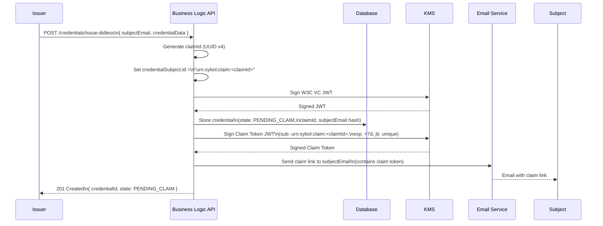

# ADR-0001: DIDless Credential Issuance — Temporary Subject Identification Strategy

**Status:** Accepted

**Date:** 2026-03-16

**Authors:** @architect, @identity-lead

**Deciders:** @cto, @architect, @security-lead, @product-owner

**Related Issues:** #106 (Functional / Identity Flow), EPIC #104

**Depends on:** ADR-0004 (W3C Verifiable Credentials Standard)

---

## Context and Problem Statement

Sybol's credential issuance flow currently requires the credential subject (holder) to have a Decentralized Identifier (DID) **before** a credential can be issued. The `credentialSubject.id` field in a W3C Verifiable Credential must reference a subject identifier.

This constraint creates a blocking dependency: an issuer cannot pre-issue a credential (for example, a diploma, a certification, or an access card) until the subject has completed DID registration. In practice, this means:

- Subjects who have not yet onboarded into a digital wallet cannot receive credentials
- Issuers cannot batch-issue credentials to a population that will onboard later
- Workflows that start on the issuer side (e.g., university generates diplomas before students download a wallet) are blocked

**Question:** How should the system identify a credential subject who does not yet have a DID, so that the credential can be issued immediately and later claimed once the subject creates their DID?

---

## Decision Drivers

- **Issuer autonomy:** Issuers must be able to initiate and complete credential issuance without depending on subject onboarding
- **Subject privacy:** The temporary identifier must not create a correlation vector beyond the claim lifecycle
- **Security:** The claim mechanism must prevent unauthorized parties from claiming a credential
- **W3C Compliance:** The issued credential must remain a valid W3C Verifiable Credential, with the `credentialSubject.id` resolvable after DID binding
- **User experience:** The subject claim process must be simple, requiring no cryptographic expertise
- **Auditability:** There must be a clear audit trail linking the original issuance to the final DID-bound credential
- **Expiry & Revocability:** Unclaimed credentials should be revocable and claim tokens must expire

---

## Considered Options

### Option A: Generated One-Time Password (OTP)

**Description:** The system generates a one-time password or PIN that is shared with the subject out-of-band (email, SMS). The subject provides the OTP to bind their DID to the credential.

**Pros:**
- ✅ Simple implementation
- ✅ Familiar UX pattern for users

**Cons:**
- ❌ Low entropy — susceptible to brute-force if rate limiting fails
- ❌ Does not provide a resolvable credential subject identifier at issuance time
- ❌ Out-of-band channel must be trusted and verified independently
- ❌ No cryptographic binding between the OTP and the credential

---

### Option B: Opaque Unique Identifier (UUID)

**Description:** The system generates a UUID and uses it as the credential subject identifier (`urn:sybol:subject:<uuid>`). The credential is stored in a "pending" state. The claim process maps the UUID to the subject's DID once they register.

**Pros:**
- ✅ Provides a valid, resolvable `credentialSubject.id` at issuance time
- ✅ No subject participation required at issuance
- ✅ Simple to generate and store

**Cons:**
- ❌ UUID alone is not a secure claim mechanism — must be paired with a separate authentication step
- ❌ If the UUID is intercepted, an attacker can associate it with their DID
- ❌ Requires a separate claim-authentication mechanism

---

### Option C: OAuth 2.0 / OIDC Authorization Code Challenge

**Description:** The issuer triggers an OAuth 2.0 authorization challenge. The subject authenticates via the identity provider (IdP) and a code exchange completes the credential binding.

**Pros:**
- ✅ Strong authentication (leverages existing Cognito / OIDC infrastructure)
- ✅ Standard protocol, auditable
- ✅ Can use PKCE to prevent interception

**Cons:**
- ❌ Requires the subject to have an account in the IdP before claim
- ❌ Tightly couples credential issuance to Cognito, reducing future portability
- ❌ More complex flow for subjects unfamiliar with OAuth
- ❌ Does not support subjects who onboard in a different identity system

---

### Option D: Email-Based Claim Token (Signed JWT)

**Description:** The system generates a short-lived, signed JWT claim token tied to the credential. The token is delivered to the subject's verified email address. The subject uses this token to authenticate the claim and bind their DID. The `credentialSubject.id` is set to `urn:sybol:claim:<claimId>` at issuance and updated to the subject's DID upon successful claim.

**Pros:**
- ✅ Email is a well-established, verifiable out-of-band identifier
- ✅ The signed JWT provides cryptographic binding — cannot be forged
- ✅ Time-limited and single-use — token expires and is invalidated after first use
- ✅ No prior DID or wallet registration required from the subject
- ✅ Compatible with W3C VC model (`credentialSubject.id` updated at claim time)
- ✅ Works across wallet providers — subject can use any DID-capable wallet
- ✅ Audit trail: email delivery, token generation, and claim event are all logged
- ✅ Aligns with eIDAS 2.0 "offline issuance then claim" flows

**Cons:**
- ❌ Dependency on email deliverability
- ❌ Subject must have a valid email at issuance time
- ❌ Requires secure token storage and expiry management in the backend

---

### Option E: DID Creation at Issuance Time (Custodial DID)

**Description:** The system creates a temporary `did:key` or `did:peer` on behalf of the subject at issuance time. The subject later transfers or replaces the custodial DID with their own.

**Pros:**
- ✅ The credential is fully DID-bound from the start
- ✅ No changes needed to `credentialSubject.id`

**Cons:**
- ❌ Introduces custodial DID management complexity
- ❌ Creates a key management problem — who holds the private key?
- ❌ DID transfer / rotation is not standardized across wallets
- ❌ Custodial key custody raises security and regulatory concerns (eIDAS 2.0)
- ❌ May violate the self-sovereign principle if the issuer controls the DID

---

## Decision

**Adopt Option D: Email-Based Claim Token (Signed JWT)** as the standard DIDless credential issuance strategy.

At issuance, the `credentialSubject.id` is set to a claim URN (`urn:sybol:claim:<claimId>`). A signed, time-limited JWT claim token is generated and sent to the subject's verified email. Upon DID registration and claim authentication, the system rebinds the credential to the subject's actual DID and transitions the credential from `PENDING_CLAIM` to `ACTIVE`.

Option B (UUID) is used as the internal reference for the claim record, but it is always paired with the Option D token delivery mechanism — it is not exposed directly.

---

## Decision Outcome

The email-based claim token approach was selected because it:

1. **Requires no subject prerequisites** — subjects do not need a wallet, a DID, or a Cognito account before the issuer can complete their side of the issuance
2. **Provides cryptographic claim security** — the signed JWT ensures only the email recipient can initiate the claim
3. **Is W3C compliant** — the credential is valid from the start; `credentialSubject.id` is updated upon binding without re-issuance
4. **Is wallet-agnostic** — any DID-capable wallet that supports the claim endpoint can complete the flow
5. **Aligns with eIDAS 2.0 offline/deferred issuance patterns** being standardised in the EU ARF

---

## Consequences

### Positive

- Issuers can batch-issue credentials before subjects have wallets
- The credential issuance flow is fully decoupled from subject onboarding
- Claim tokens expire, limiting the window for unauthorized claim attempts
- All issuance and claim events are auditable
- The approach scales to any issuer workflow (diplomas, access cards, certifications)

### Negative

- The system must manage `PENDING_CLAIM` credential state, including expiry and revocation
- Email deliverability is an operational dependency
- Claim tokens require secure storage (encrypted at rest, single-use enforcement)
- The `credentialSubject.id` mutation after claim must be logged and must not invalidate existing cryptographic proofs on the credential envelope

---

## Implementation Notes

### Credential Subject Identifier at Issuance

```
credentialSubject.id = "urn:sybol:claim:<claimId>"
```

The `claimId` is a UUID v4, stored in the database alongside the credential record.

### Claim Token Structure (JWT)

```
Header:   { alg: "ES256", kid: "<sybol-claim-issuer-kid>" }
Payload:  {
            iss: "https://api.sybol.eu",
            sub: "urn:sybol:claim:<claimId>",
            aud: "https://api.sybol.eu/credentials/claim",
            iat: <now>,
            exp: <now + 7 days>,
            jti: "<unique token id>",
            credentialId: "<credentialId>",
            email: "<subject email hash (SHA-256)>"
          }
```

### Credential Lifecycle States

| State           | Description                                              |
|-----------------|----------------------------------------------------------|
| `PENDING_CLAIM` | Issued, awaiting subject DID binding via claim token     |
| `ACTIVE`        | Claimed — `credentialSubject.id` bound to subject DID   |
| `EXPIRED_CLAIM` | Claim token expired without being used                   |
| `REVOKED`       | Revoked by issuer before or after claim                  |

### Security Requirements

- Claim tokens must be single-use (invalidated immediately after successful claim)
- Claim tokens must expire after a configurable window (default: 7 days)
- Token generation must use the platform's KMS-backed signing key
- Email must be verified by the issuer at issuance time (not unverified input)
- Rate limiting must be applied to the claim endpoint
- Failed claim attempts must be logged and alert on threshold breach

---

## Mermaid Diagram: DIDless Issuance Flow (Temporary Identification)


