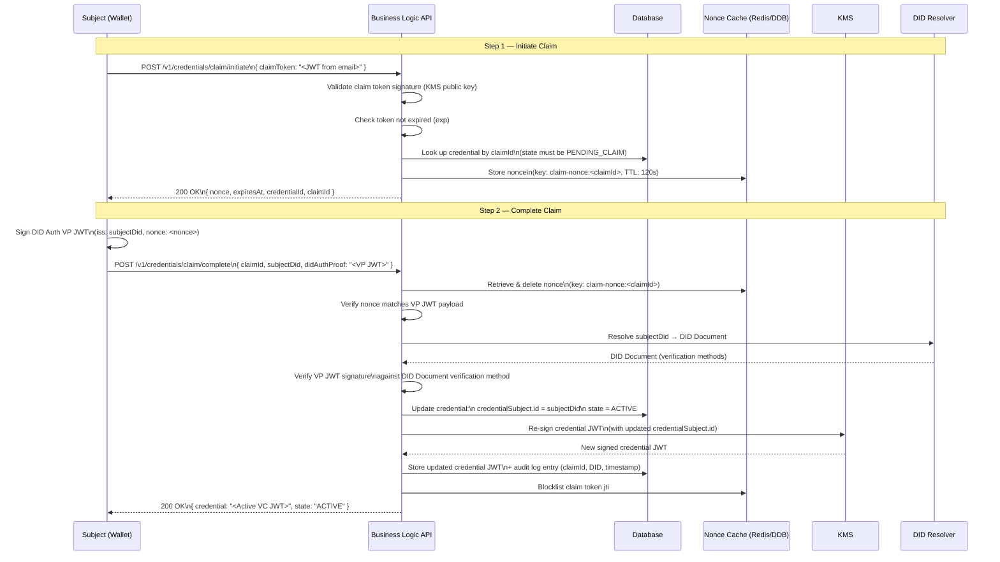
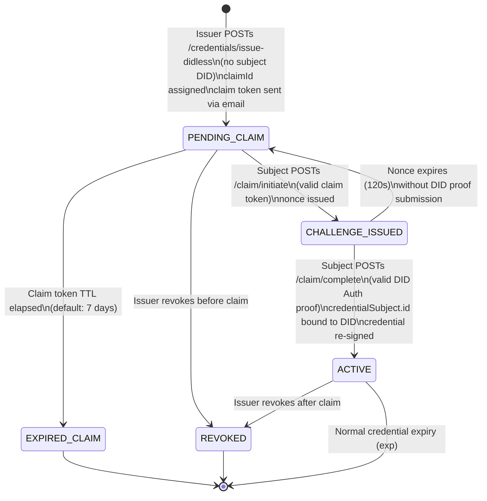

# ADR-0002: DIDless Credential Claim and DID Binding Flow

**Status:** Accepted

**Date:** 2026-03-16

**Authors:** @architect, @identity-lead

**Deciders:** @cto, @architect, @security-lead, @product-owner

**Related Issues:** #106 (Functional / Identity Flow), EPIC #104

**Depends on:** ADR-0001 (DIDless Credential Issuance — Temporary Subject Identification Strategy), ADR-0004 (W3C Verifiable Credentials Standard)

---

## Context and Problem Statement

Following ADR-0001, credentials can be issued to subjects who do not yet have a DID, using a claim token delivered via email. The credential is stored in `PENDING_CLAIM` state with `credentialSubject.id = "urn:sybol:claim:<claimId>"`.

This ADR addresses the second part of the DIDless flow: **how does the subject, once they have created a DID, claim the credential and bind it to their DID?**

The claim flow must satisfy several constraints:

- The subject's identity must be authenticated before the credential is released
- The cryptographic claim token (from ADR-0001) must be validated
- The credential's `credentialSubject.id` must be updated from the claim URN to the subject's actual DID
- The original issuer signature on the credential must remain verifiable
- The process must be simple enough for non-technical users to complete in a wallet UI
- The claim can only succeed once — re-use of claim tokens must be prevented

**Question:** What is the end-to-end flow for a DIDless subject to claim a pre-issued credential and bind it to their DID?

---

## Decision Drivers

- **Security:** Only the intended subject (email recipient) can claim the credential
- **Self-sovereignty:** The subject must control the DID used to bind the credential — the issuer cannot dictate the DID method or value
- **Simplicity:** The claim flow must work from a standard wallet or web browser without deep technical knowledge
- **Wallet interoperability:** The claim endpoint must be wallet-agnostic
- **Auditability:** The claim event must be fully logged with timestamp, DID, and credential identifier
- **Atomicity:** Claim binding must be atomic — either fully completed or fully rolled back
- **Non-repudiation:** The subject proves DID ownership at claim time via a cryptographic DID Auth challenge

---

## Considered Options

### Option A: Direct Token Submission with DID Proof

**Description:** The subject submits the claim token alongside a signed DID Authentication proof in a single HTTP request. The platform validates both and binds the credential.

**Pros:**
- ✅ Simple, single-round-trip flow
- ✅ No redirect required — usable from wallet deep links
- ✅ DID Auth proof provides cryptographic ownership verification

**Cons:**
- ❌ Requires the wallet to support constructing and signing a DID Auth proof in the same request
- ❌ Some wallets may not support inline DID Auth assertions

---

### Option B: OpenID Connect for Verifiable Credentials (OID4VCI) Deferred Issuance

**Description:** Use the OID4VCI (OpenID for Verifiable Credential Issuance) specification's Deferred Credential Endpoint. The claim token is used as a `pre-authorized_code` to obtain the credential via the standard OID4VCI deferred issuance flow.

**Pros:**
- ✅ Fully standardized (OIDF / EBSI alignment)
- ✅ Native support in compliant EUDI Wallet implementations
- ✅ eIDAS 2.0 aligned
- ✅ Long-term interoperability with European wallet ecosystem
- ✅ Supports both immediate and deferred issuance in one protocol

**Cons:**
- ❌ Requires full OID4VCI implementation (higher engineering effort)
- ❌ Not yet required for Phase 1
- ❌ Subjects need an OID4VCI-compatible wallet to use this path

---

### Option C: QR Code Scan from Wallet

**Description:** The system generates a QR code that the subject scans with their wallet. The wallet decodes the claim URL, submits the claim token, and provides DID proof.

**Pros:**
- ✅ Excellent UX on mobile wallets
- ✅ No manual URL entry

**Cons:**
- ❌ QR codes have limited data capacity — token must be short or base64 encoded
- ❌ Does not add security beyond Option A; it is a UX layer, not a distinct protocol
- ❌ QR code approach still requires the same backend claim validation flow

---

### Option D: Two-Step Authenticated Claim (Selected)

**Description:** A two-step claim flow designed for security and wallet-agnosticism:

1. **Step 1 — Token Validation & DID Auth Challenge:** The subject presents the claim token. The platform validates the token and responds with a `nonce`-based DID Auth challenge.
2. **Step 2 — DID Proof Submission:** The subject signs the challenge with their DID's private key (producing a DID Auth assertion / VP) and submits it. The platform verifies the DID proof, confirms ownership, and:
   - Updates `credentialSubject.id` to the subject's DID
   - Marks the claim token as used (single-use enforcement)
   - Transitions the credential from `PENDING_CLAIM` to `ACTIVE`
   - Returns the credential JWT to the subject

**Pros:**
- ✅ Separates token validation from DID ownership proof — cleaner security model
- ✅ Nonce prevents replay attacks
- ✅ Works with any DID method (did:web, did:key, did:peer, did:ethr)
- ✅ Can be exposed as a deep link URL for wallet integration
- ✅ Can be extended to OID4VCI in Phase 2 without replacing core logic
- ✅ Replay protection via nonce + single-use token

**Cons:**
- ❌ Requires two HTTP round-trips (acceptable given the security benefit)
- ❌ Nonce must be stored server-side with short TTL (2 minutes)

---

## Decision

**Adopt Option D: Two-Step Authenticated Claim** as the DIDless credential claim and DID binding flow for Phase 1.

**Additionally:** Plan the migration path to Option B (OID4VCI Deferred Issuance) for Phase 2, ensuring the Phase 1 claim API is structured to be replaceable without changing the credential issuance side.

---

## Decision Outcome

The two-step authenticated claim flow was selected because it:

1. **Decouples token validation from DID ownership proof** — a subject who loses their wallet can re-authenticate without re-issuing the credential
2. **Provides replay attack protection** via server-side nonce with short TTL
3. **Is wallet-agnostic** — any DID-capable wallet can implement the two-call flow
4. **Preserves the path to OID4VCI** — the internal credential state machine and DID binding logic remains the same; only the outer protocol changes in Phase 2
5. **Achieves non-repudiation** — the subject's DID Auth assertion is logged and stored as evidence of the claim event

---

## Consequences

### Positive

- Credentials issued to DIDless subjects can be claimed by any compliant wallet without re-issuance
- The claim flow is secure against token interception and replay
- The system supports the full credential lifecycle: issuance → pending → claimed → revoked
- The architecture is forward-compatible with OID4VCI deferred issuance (Phase 2)

### Negative

- Server-side nonce storage adds a short-lived cache/storage requirement (Redis or DynamoDB TTL table)
- Two HTTP round-trips are required per claim operation
- The `credentialSubject.id` mutation must be version-controlled in the database (old claim URN retained in audit log)

---

## Implementation Notes

### Claim API Endpoints

| Method | Path | Description |
|--------|------|-------------|
| `POST` | `/v1/credentials/claim/initiate` | Step 1: Validate claim token, return DID Auth challenge (nonce) |
| `POST` | `/v1/credentials/claim/complete` | Step 2: Verify DID Auth proof, bind DID, return active credential |

### Step 1 — Initiate Claim Request

```
POST /v1/credentials/claim/initiate
{
  "claimToken": "<signed JWT claim token from email>"
}
```

**Response (200 OK):**
```json
{
  "challenge": {
    "nonce": "<cryptographically random nonce>",
    "expiresAt": "<ISO-8601 timestamp, now + 2 minutes>",
    "credentialId": "<credentialId>",
    "claimId": "<claimId>"
  }
}
```

### Step 2 — Complete Claim Request

```
POST /v1/credentials/claim/complete
{
  "claimId": "<claimId>",
  "subjectDid": "did:web:wallet.example.com:users:alice",
  "didAuthProof": "<Verifiable Presentation JWT signed by subject DID key, containing nonce>"
}
```

**Response (200 OK):**
```json
{
  "credential": "<signed W3C VC JWT with credentialSubject.id = subject DID>",
  "credentialId": "<credentialId>",
  "state": "ACTIVE"
}
```

### DID Auth Proof Requirements

The `didAuthProof` must be a W3C Verifiable Presentation JWT:

- `vp.type` must include `"VerifiablePresentation"`
- `nonce` claim in the JWT payload must match the server-issued nonce
- `iss` must equal the `subjectDid`
- JWT must be signed with the verification method referenced in the DID document
- VP must be verifiable against a resolvable DID document

### Credential Re-signing

Upon successful claim:

1. The credential record is updated: `credentialSubject.id` → subject DID
2. The credential JWT is **re-signed** by the issuer's KMS key with the updated subject DID
3. The original claim URN and claim event are retained in the audit log
4. The claim token `jti` is added to the used-token blocklist
5. The nonce is invalidated

> **Note:** Re-signing is required because the `credentialSubject.id` field is part of the signed payload. The issuer re-signing upon verified claim is architecturally equivalent to the issuer countersigning a binding event, and must be logged as such.

### Nonce Storage

Nonces must be stored with a TTL of **120 seconds** using a fast key-value store (Redis or DynamoDB with TTL). The key is `claim-nonce:<claimId>` and the value is `{ nonce, credentialId, createdAt }`.

### Security Requirements

- DID Auth proof `nonce` must be verified server-side against stored nonce (not trusted from client)
- Nonce must be single-use — deleted immediately upon first successful verification
- Claim token `jti` must be added to a blocklist upon completion (TTL = original token expiry)
- DID document resolution must use a trusted resolver (no client-provided DID documents)
- All claim events (initiate, complete, failure) must be logged to the audit service

---

## Mermaid Diagram: DIDless Credential Claim and DID Binding Flow



---

## Full DIDless Lifecycle Diagram


