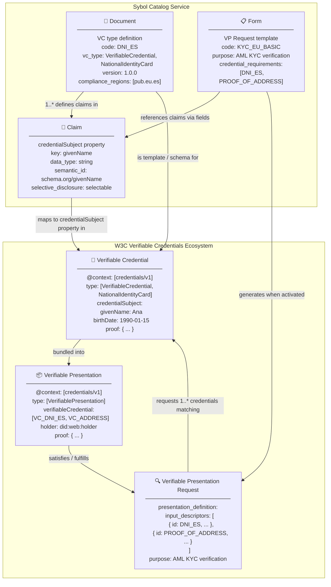

# Catalog Service — Data Model Specification v2.0

**Status:** Draft  
**Version:** 2.0.0  
**Date:** 2024-Q1  
**Authors:** @architect, @data-lead  
**Related ADR:** [ADR-0006 – Catalog W3C Data Model Alignment](../../docs/decisions/0006-catalog-w3c-data-model-alignment.md)  
**Schemas:** [document.schema.json](schemas/document.schema.json) · [claim.schema.json](schemas/claim.schema.json) · [form.schema.json](schemas/form.schema.json)

---

## 1. Purpose

This document formally specifies the data model for the **Sybol Catalog Service v2**, establishing the mapping between the catalog's internal domain entities and the **W3C Verifiable Credentials (VC) Data Model v1.1** ecosystem.

The catalog defines the *structural vocabulary* of the Sybol platform:

- **What can be proven** → via Documents (VC type definitions)
- **What individual data points exist** → via Claims (credentialSubject properties)
- **What data is requested and how** → via Forms (Verifiable Presentation Request templates)

---

## 2. Relationship Diagram



---

## 3. Entity Overview

| Catalog Entity | W3C VC Concept | Role |
|---|---|---|
| **Document** | Verifiable Credential type definition / Credential Schema | Template that defines what a specific VC type looks like |
| **Claim** | `credentialSubject` property | Atomic data point attested within a credential |
| **Form** | Verifiable Presentation Request template | Declares what credentials and claims a verifier needs |
| **Form Section** | Logical grouping within a VP Request | Groups related claims under a thematic heading |
| **Form Field** | Individual claim request within a VP presentation_definition | Maps a Claim to a specific form context with overrides |
| **Compliance Region** | Regulatory scope | Jurisdiction in which a Document or Form is applicable |

---

## 4. Document — Verifiable Credential Type Definition

### 4.1 Conceptual Role

A **Document** is the catalog's representation of a **Verifiable Credential type**. It is not an issued credential — it is the *schema and policy template* that governs how credentials of that type are issued and verified.

When the blockchainManager service issues a VC, it looks up the corresponding Document to:
- Populate `@type` from `document.vc_type`
- Populate `@context` from `document.context`
- Apply `document.issuer_requirements` during verification
- Apply `document.revocation` to create the `credentialStatus` block
- Apply `document.expiry_policy` to compute `expirationDate`

### 4.2 Field Specification

| Field | Type | Required | Description |
|---|---|---|---|
| `id` | UUID | auto | Server-generated primary key |
| `code` | `SCREAMING_SNAKE_CASE` | ✅ | Globally unique identifier. Maps to VC type name. |
| `vc_type` | `string[]` | ✅ | W3C VC `@type` array. First item MUST be `"VerifiableCredential"`. |
| `context` | `(string\|object)[]` | ✅ | JSON-LD `@context`. First item MUST be `"https://www.w3.org/2018/credentials/v1"`. |
| `schema_url` | URI | — | URL of the published credentialSubject JSON Schema (used as `credentialSchema.id`). |
| `version` | semver | ✅ | Schema version. Breaking changes require MAJOR bump. |
| `translations` | `TranslationMap` | ✅ | Multilingual label, description, short_label, issuer_name. |
| `default_lang_code` | BCP 47 | ✅ | Primary language code (must exist in `translations`). |
| `compliance_path` | dot-string | — | Hierarchical compliance path (e.g. `pub.eu.es`). Globally unique. |
| `compliance_regions` | `string[]` | — | IDs of applicable compliance regions (multi-jurisdiction). |
| `state` | enum | ✅ | `draft` → `active` → `deprecated` → `archived`. |
| `issuer_requirements` | object | — | DID methods, trusted issuers, accreditation. |
| `revocation` | object | — | Revocation support and method (`StatusList2021`). |
| `expiry_policy` | object | — | Default validity days, max days, renewable. |
| `selective_disclosure` | boolean | — | Whether BBS+/SD-JWT selective disclosure is supported. |
| `display` | object | — | Wallet card display hints (background_color, text_color, logo). |
| `claims` | `ClaimSummary[]` | read-only | Claims of this document (populated server-side). |

### 4.3 Translation Structure

```json
{
  "translations": {
    "es": {
      "label": "Documento Nacional de Identidad",
      "description": "Documento de identidad emitido por el Ministerio del Interior de España.",
      "short_label": "DNI",
      "issuer_name": "Dirección General de la Policía"
    },
    "en": {
      "label": "National Identity Document",
      "description": "Identity document issued by the Spanish Ministry of Interior.",
      "short_label": "DNI",
      "issuer_name": "Directorate General of the Police"
    }
  },
  "default_lang_code": "es"
}
```

### 4.4 Mapping to Issued Verifiable Credential

```json
{
  "@context": ["https://www.w3.org/2018/credentials/v1", "https://catalog.sybol.io/contexts/v1"],
  "type": ["VerifiableCredential", "NationalIdentityCard"],
  "id": "urn:uuid:...",
  "issuer": { "id": "did:web:issuer.sybol.io" },
  "issuanceDate": "2024-01-15T00:00:00Z",
  "expirationDate": "2034-01-15T00:00:00Z",
  "credentialSchema": {
    "id": "https://catalog.sybol.io/schemas/credentials/DNI_ES/v1.0.0",
    "type": "JsonSchemaValidator2018"
  },
  "credentialStatus": {
    "id": "https://status.sybol.io/lists/1#94567",
    "type": "StatusList2021Entry",
    "statusPurpose": "revocation"
  },
  "credentialSubject": {
    "givenName": "Ana",
    "familyName": "García López",
    "birthDate": "1990-01-15",
    "documentNumber": "12345678Z",
    "nationality": "ESP"
  }
}
```

---

## 5. Claim — Verifiable Credential Subject Property

### 5.1 Conceptual Role

A **Claim** is the catalog's representation of a single property within a credential's `credentialSubject`. Claims are the atomic vocabulary of verifiable data in the Sybol platform.

Each claim:
- Belongs to exactly one Document (its parent credential type)
- Defines the semantic meaning via `semantic_id` (JSON-LD term)
- Declares the `data_type` and `constraints` for validation
- Controls how it participates in selective disclosure
- Provides multilingual labels and help text for UI rendering

### 5.2 Field Specification

| Field | Type | Required | Description |
|---|---|---|---|
| `id` | UUID | auto | Server-generated primary key |
| `document_id` | UUID | ✅ | FK to parent Document |
| `key` | `camelCase` | ✅ | Property name in `credentialSubject`. Unique per document. Immutable. |
| `semantic_id` | URI | — | JSON-LD vocabulary reference (e.g. `schema.org/givenName`). |
| `path` | dot-string | — | Nested path for structured credentialSubject (e.g. `address.streetAddress`). |
| `translations` | `TranslationMap` | ✅ | Multilingual label, description, placeholder, help_text, error_message, unit. |
| `default_lang_code` | BCP 47 | ✅ | Primary language code. |
| `data_type` | enum | ✅ | `string`, `number`, `integer`, `boolean`, `date`, `datetime`, `url`, `email`, `phone`, `image`, `file`, `object`, `array`. |
| `constraints` | object | — | JSON Schema-aligned constraints: minLength, maxLength, minimum, maximum, enum, format. |
| `regex_pattern` | string | — | Additional ECMAScript regex validation. |
| `regex_flags` | string | — | Regex flags (e.g. `i` for case-insensitive). |
| `essential` | boolean | — | Claim MUST be present in every issued VC of this type. |
| `selective_disclosure_policy` | enum | — | `always_disclosed` / `selectable` / `never_disclosed`. |
| `source_type` | enum | — | `issuer_attested` / `self_attested` / `derived`. |
| `display` | object | — | UI hints: widget, icon, format_pattern, multiline. |

### 5.3 Data Type to credentialSubject Mapping

| data_type | XSD Type | JSON type | Example value |
|---|---|---|---|
| `string` | `xsd:string` | `string` | `"Ana"` |
| `number` | `xsd:decimal` | `number` | `72.5` |
| `integer` | `xsd:integer` | `integer` | `30` |
| `boolean` | `xsd:boolean` | `boolean` | `true` |
| `date` | `xsd:date` | `string` (YYYY-MM-DD) | `"1990-01-15"` |
| `datetime` | `xsd:dateTime` | `string` (ISO 8601) | `"2024-01-15T12:00:00Z"` |
| `url` | `xsd:anyURI` | `string` (URI) | `"https://issuer.example.com"` |
| `email` | `xsd:string` + format | `string` | `"ana@example.com"` |
| `phone` | `xsd:string` + format | `string` | `"+34912345678"` |
| `image` | `xsd:anyURI` | `string` (data URI or URL) | `"data:image/jpeg;base64,..."` |
| `file` | `xsd:anyURI` | `string` | `"https://..."` |
| `object` | nested context | `object` | `{ "streetAddress": "...", "city": "..." }` |
| `array` | JSON array | `array` | `["ES", "FR"]` |

### 5.4 Selective Disclosure Policies

| Policy | BBS+ / SD-JWT Behaviour | Use case |
|---|---|---|
| `always_disclosed` | Always included in the proof | Type, issuance date, issuer |
| `selectable` | Holder chooses at presentation time | Name, birthdate, address |
| `never_disclosed` | Never revealed to verifiers | Internal audit fields, raw biometric reference |

### 5.5 Translation Structure

```json
{
  "translations": {
    "es": {
      "label": "Nombre",
      "description": "Nombre de pila del titular.",
      "placeholder": "Ej. Ana",
      "help_text": "Introduzca el nombre tal como aparece en su documento de identidad.",
      "error_message": "El nombre no puede estar vacío."
    },
    "en": {
      "label": "Given Name",
      "description": "First name of the credential subject.",
      "placeholder": "e.g. Ana",
      "help_text": "Enter the name exactly as it appears on your identity document.",
      "error_message": "Given name cannot be empty."
    }
  },
  "default_lang_code": "es"
}
```

---

## 6. Form — Verifiable Presentation Request Template

### 6.1 Conceptual Role

A **Form** is the catalog's representation of a **Verifiable Presentation Request template**. It declares:
- Which Verifiable Credential types are needed (`credential_requirements`)
- Which specific claims within those credentials to collect (`fields` referencing `claims`)
- How to present the collection process to users (sections, labels, help text)
- The regulatory scope (`compliance_regions`)
- The response format (`format_preferences`)

When a Form is *activated*, the service generates a **Verifiable Presentation Request** in DIF Presentation Exchange 2.0 format. When the holder submits a **Verifiable Presentation**, it is validated against the form structure.

### 6.2 Field Specification

| Field | Type | Required | Description |
|---|---|---|---|
| `id` | UUID | auto | Server-generated primary key |
| `code` | `SCREAMING_SNAKE_CASE` | ✅ | Globally unique identifier. Immutable. |
| `version` | semver | — | Schema version for the form structure. |
| `purpose` | string | ✅ | English statement of why data is requested (maps to VP Request `purpose`). |
| `translations` | `TranslationMap` | ✅ | Multilingual label, description, short_label, submit_label, purpose_display. |
| `default_lang_code` | BCP 47 | ✅ | Primary language code. |
| `state` | enum | ✅ | `draft` → `active` → `deprecated` → `archived`. |
| `compliance_regions` | `string[]` | — | Applicable compliance region IDs. |
| `credential_requirements` | `CredentialRequirement[]` | — | VC types required. OR logic via `group`. |
| `format_preferences` | `string[]` | — | Preferred VC proof formats in order. |
| `response_expiry_seconds` | integer | — | VP response validity window. |
| `sections` | `FormSection[]` | — | Ordered sections containing fields. |

### 6.3 Form Section Field Specification

| Field | Type | Required | Description |
|---|---|---|---|
| `id` | UUID | auto | Server-generated |
| `form_id` | UUID | ✅ | FK to parent Form |
| `translations` | `SectionTranslationMap` | ✅ | Multilingual title and description (**NEW**: previously plain strings) |
| `sort_order` | integer | — | Display position |
| `fields` | `FormField[]` | — | Fields in this section |

> ✅ **Breaking change from v1 — APPLIED:** `form_sections.title` and `form_sections.description` are now multilingual JSONB (`translations`) instead of plain `VARCHAR`. Migration scripts in `docs/global/operations/core-setup.md` § 3.3.1.

### 6.4 Form Field Field Specification

| Field | Type | Required | Description |
|---|---|---|---|
| `id` | UUID | auto | Server-generated |
| `form_id` | UUID | ✅ | FK to parent Form |
| `section_id` | UUID | — | Parent section (null = unsectioned) |
| `claim_id` | UUID | ✅ | FK to the Claim this field collects |
| `label_override_translations` | `LabelOverrideMap` | — | Per-language label overrides (**NEW**: was single-language string) |
| `help_text_translations` | `HelpTextMap` | — | Per-language help text overrides (**NEW**) |
| `required` | boolean | — | Field-level required override |
| `or_group_index` | integer | — | OR group: any field in the group satisfies the requirement |
| `origin_reference` | JSONPath | — | Where to extract value from credential |
| `widget_ui` | string | — | UI widget override |
| `constraints_override` | object | — | Partial constraint overrides |
| `sort_order` | integer | — | Display order within section |

> ✅ **Breaking change from v1 — APPLIED:** `form_fields.label_override` (VARCHAR) splits into `label_override_translations` (JSONB). `form_fields.help_text` (TEXT) splits into `help_text_translations` (JSONB). Migration scripts in `docs/global/operations/core-setup.md` § 3.3.1.

### 6.5 Mapping to Verifiable Presentation Request (DIF PE 2.0)

```json
{
  "presentation_definition": {
    "id": "KYC_EU_BASIC",
    "name": "Basic KYC",
    "purpose": "Verify identity for AML compliance under EU Directive 2015/849",
    "format": { "jwt_vc": { "alg": ["ES256"] } },
    "input_descriptors": [
      {
        "id": "DNI_ES",
        "name": "National Identity Document",
        "purpose": "Verify holder identity",
        "constraints": {
          "fields": [
            { "path": ["$.credentialSubject.givenName"], "filter": { "type": "string" } },
            { "path": ["$.credentialSubject.birthDate"], "filter": { "type": "string", "format": "date" } },
            { "path": ["$.credentialSubject.documentNumber"], "filter": { "type": "string" } }
          ]
        }
      }
    ]
  }
}
```

---

## 7. Compliance System

### 7.1 Two Orthogonal Dimensions

The catalog uses two distinct, complementary fields to model compliance, which serve **different semantic purposes** and must not be conflated:

| Field | Answers the question | Example (Spanish DNI) |
|---|---|---|
| `compliance_path` | **Who issues/defines this document?** | `pub.es.policiaNacional` |
| `compliance_regions[]` | **Where is it legally recognized?** | `[eu, eu.es, eu.de, eu.fr, ...]` |

A credential type has exactly **one issuing authority** (one `compliance_path`) but may be **recognized in many jurisdictions** (`compliance_regions` is a list).

### 7.2 Compliance Path — Issuing Authority

`compliance_path` is a globally unique dot-notation string that identifies the **official authority** responsible for defining and issuing this credential type. It is the canonical origin of the document definition.

Format: `{sector}.{country|org}.{authority}`

```
pub.es.policiaNacional        → Spanish Policía Nacional (DNI, Pasaporte)
pub.es.dgt                   → Dirección General de Tráfico (Permiso de Conducir)
pub.eu.eidas                 → EU eIDAS authority (EU Digital Identity)
pub.eu.eba                   → European Banking Authority
priv.es.dgsfp                → Dirección General de Seguros (AML/insurance)
priv.global.iso              → ISO standard credentials
acad.es.aneca                → ANECA (Spanish university degree accreditation)
```

This field enables the platform to:
- Identify the authoritative source when verifying issuer legitimacy
- Group credential types by their issuing authority for directory lookups
- Apply authority-specific verification rules

### 7.3 Compliance Regions — Recognition Scope

Compliance regions form a hierarchical tree managed by the `compliance_regions` table. Both Documents and Forms reference regions via the `compliance_regions[]` field (array of region IDs).

```
world
├── eu (European Union — recognition scope)
│   ├── eu.es (Spain)
│   ├── eu.de (Germany)
│   └── eu.fr (France)
├── latam
│   ├── latam.mx (Mexico)
│   └── latam.ar (Argentina)
└── sectoral
    ├── sectoral.aml-eu (EU AML Directive scope)
    └── sectoral.eidas (eIDAS recognition zone)
```

A Spanish DNI (`compliance_path = pub.es.policiaNacional`) is recognized across the EU as a valid travel and identity document:
```json
"compliance_regions": ["eu", "eu.es", "eu.de", "eu.fr", "eu.it", "sectoral.eidas"]
```

This field enables the platform to:
- Filter which credential types are applicable in a given country or regulatory context
- Apply jurisdiction-specific presentation requirements
- Support cross-border credential usage without changing the issuing authority

---

## 8. Translation System

All translatable entities follow the same **TranslationMap** pattern:

```
{
  "<BCP47-lang-code>": { <translation-entry> },
  ...
}
```

### 8.1 Rules

1. At least one language entry MUST always be present.
2. The language identified by `default_lang_code` is the **canonical version** — it MUST exist.
3. The API returns translated properties depending on a `?lang=` query parameter (falls back to `default_lang_code`).
4. Section and field translations follow the same pattern (JSONB column named `translations`).

### 8.2 Translation objects by entity

| Entity | Keys in translation entry |
|---|---|
| Document | `label`, `description`, `short_label`, `issuer_name` |
| Claim | `label`, `description`, `placeholder`, `help_text`, `error_message`, `unit` |
| Form | `label`, `description`, `short_label`, `submit_label`, `purpose_display` |
| Form Section | `title`, `description` |
| Form Field | _(label_override_translations)_: `label`; _(help_text_translations)_: `help_text` |

---

## 9. Lifecycle States

All first-class entities (Document, Claim, Form) share the same lifecycle:

```
draft ──► active ──► deprecated ──► archived
```

| State | Meaning |
|---|---|
| `draft` | Being designed. Cannot be referenced in productions flows. |
| `active` | Published and usable in production. |
| `deprecated` | Still valid for existing credentials but no longer issued for new ones. |
| `archived` | Permanently retired. References preserved for audit purposes only. |

**Cascade rules:**
- A Form can only move to `active` if all referenced Documents are `active`.
- A Document can only move to `deprecated` if all Forms referencing it also move to `deprecated` or `archived`.

---

## 10. Gaps: v1 → v2 Migration Summary

| Area | v1 | v2 |
|---|---|---|
| Document VC type | Missing | Added `vc_type[]`, `context[]`, `version` |
| Document semantics | Missing | Added `schema_url`, `issuer_requirements`, `revocation`, `expiry_policy`, `selective_disclosure` |
| Document display | Missing | Added `display` (wallet card hints) |
| Document compliance | Single string `compliance_path` | Also added `compliance_regions[]` array |
| Claim semantic linkage | Missing | Added `semantic_id` (JSON-LD vocab), `path` (nested object support) |
| Claim type system | `string,number,date,url,boolean,custom` | Expanded: + `integer`, `datetime`, `email`, `phone`, `image`, `file`, `object`, `array` |
| Claim constraints | `regex_pattern` only | Added full `constraints` object (minLength, maxLength, min, max, enum, format) + `regex_flags` |
| Claim disclosure | Missing | Added `selective_disclosure_policy`, `source_type`, `essential` |
| Claim display | Missing | Added `display` (widget, icon, format_pattern, multiline) |
| Claim translations | `label`, `description` | Added `placeholder`, `help_text`, `error_message`, `unit` |
| Form purpose | Missing | Added `purpose` (EN string, maps to VP Request purpose) |
| Form version | Missing | Added `version` |
| Form compliance | Missing | Added `compliance_regions[]` |
| Form VC linkage | Missing | Added `credential_requirements[]` (DIF PE input_descriptor mapping) |
| Form format | Missing | Added `format_preferences[]` (jwt_vc, ldp_vc, vc+sd-jwt…) |
| Form response expiry | Missing | Added `response_expiry_seconds` |
| Form section i18n | Plain text `title`, `description` (VARCHAR) | Replaced with `translations` JSONB map |
| Form field i18n | Single-lang `label_override` (VARCHAR) | Replaced with `label_override_translations` JSONB + `help_text_translations` JSONB |
| State enum | `draft`, `active`, `archived` | Added `deprecated` state |

---

## 11. Schemas

All three JSON Schemas use **JSON Schema Draft 2020-12** and are versioned independently:

| Schema | Path | Current version |
|---|---|---|
| Document | `services/catalog/docs/schemas/document.schema.json` | `2.0.0` |
| Claim | `services/catalog/docs/schemas/claim.schema.json` | `2.0.0` |
| Form | `services/catalog/docs/schemas/form.schema.json` | `2.0.0` |

> When published, schemas will be available at:  
> `https://catalog.sybol.io/schemas/catalog/{entity}/v{version}`

---

*End of Catalog Data Model Specification v2.0*
