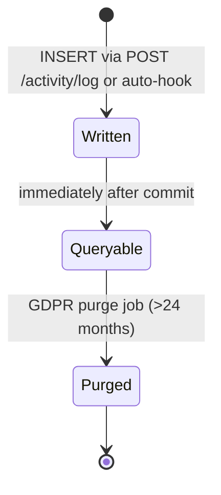

# Wallet Metrics Service Specification

**Version:** 0.1 (Draft)
**Date:** 2026-04-02
**Status:** 🚧 Draft — 3 open questions pending
**Owner:** TBD
**Service:** `businessLogic` (feature addition)
**Branch:** `feature/fileProcess`

---

## Table of Contents

1. [Overview](#1-overview)
2. [Scope](#2-scope)
3. [Stakeholders & Context](#3-stakeholders--context)
4. [Functional Requirements](#4-functional-requirements)
5. [Business Rules](#5-business-rules)
6. [Non-Functional Requirements](#6-non-functional-requirements)
7. [Domain Model](#7-domain-model)
8. [Architecture Overview](#8-architecture-overview)
9. [API Design](#9-api-design)
10. [Data Management](#10-data-management)
11. [Security Model](#11-security-model)
12. [Error Handling & Retry Strategy](#12-error-handling--retry-strategy)
13. [Configuration & Environment Variables](#13-configuration--environment-variables)
14. [Observability](#14-observability)
15. [Edge Cases & Failure Modes](#15-edge-cases--failure-modes)
16. [Acceptance Criteria](#16-acceptance-criteria)
17. [Assumptions](#17-assumptions)
18. [Open Questions & Decision Log](#18-open-questions--decision-log)

---

## 1. Overview

### Goals

- Replace the placeholder `GET /api/bl/activity/metrics/:userId` endpoint with a tenant-scoped, real-data KPI dashboard endpoint that computes four wallet metrics: credentials held, pending presentation requests, active connections, and signatures (placeholder).
- Introduce a persistent `activity_log` table in each tenant's per-tenant PostgreSQL database to capture structured audit events emitted by the `businessLogic` service.
- Expose two new HTTP endpoints — a write endpoint for ingesting activity log entries and a paginated read endpoint for querying them.
- Auto-hook key lifecycle events in the existing credential, presentation, contact, and presentation-request controllers so that significant state changes are recorded automatically to `activity_log`.
- Define six additional future KPIs (not in current delivery scope) to guide the product roadmap.

### Non-Goals

- No new AWS Lambda functions or infrastructure resources are created.
- No OpenAPI YAML contract generation (delegate to `api-designer`).
- No external event emission to EventBridge for activity log entries (out of scope for this feature).
- No caching layer (Redis or otherwise) for metrics responses.
- No real-time push of activity log updates to clients.
- No changes to the `alerts` table or existing alert endpoints.
- Signing ledger implementation (the `signatures` KPI remains a placeholder).

---

## 2. Scope

| In Scope | Out of Scope |
|---|---|
| New DB migration: `activity_log` table (per-tenant) | New Lambda functions or infrastructure changes |
| Replace `GET /api/bl/activity/metrics/:userId` with `GET /api/bl/activity/metrics` (no userId param, tenant-scoped) | OpenAPI / Swagger contract generation |
| New route: `POST /api/bl/activity/log` (ingest) | Redis/cache layer for metrics |
| New route: `GET /api/bl/activity/log` (paginated query) | Real-time WebSocket or push delivery |
| `ActivityModel` updates: `getMetrics()`, `insertLog()`, `queryLog()` | EventBridge integration for activity log |
| Auto-logging hooks in credential, presentation, contact, and presentation-request controllers | Signing ledger implementation |
| Future KPIs documented in §4.3 (not implemented) | Changes to existing `alerts` table or alert endpoints |
| GDPR purge strategy design (see ADR-0011) | Cross-tenant activity log aggregation |
| SQL query sketches for each KPI | Changes to IAM, Cognito, or STS configuration |

---

## 3. Stakeholders & Context

### 3.1 Stakeholders

| Role | Interest |
|---|---|
| Frontend / Dashboard team | Consumes the metrics endpoint; expects stable response shape |
| Tenant companies (end users) | See their own KPI data; privacy requirement — no cross-tenant leakage |
| Backend engineers (businessLogic team) | Implement the feature; own the migration and model changes |
| Security / Compliance | GDPR purge, tenant isolation, no sensitive data in logs |
| Product Owner | Future KPIs roadmap visibility |

### 3.2 Integration Context

```
+---------------------+       X-Id-Token + Authorization
|  Sybol Frontend /   |  ----------------------------------------->  +----------------------------+
|  Dashboard SPA      |                                               |  businessLogic (Express     |
+---------------------+                                               |  on AWS Lambda)            |
                                                                      |  /api/bl/activity/...      |
                                                                      +------------+---------------+
                                                                                   |
                               +----------------------------+                      |  per-tenant pg.Client
                               |  AWS Cognito (JWT issuer)  |                      v
                               +----------------------------+        +----------------------------+
                                                                      |  Per-Tenant RDS PostgreSQL  |
                                                                      |  Tables:                   |
                                                                      |    credentials             |
                                                                      |    credential_status       |
                                                                      |    presentation_requests   |
                                                                      |    presentation_request_   |
                                                                      |      status                |
                                                                      |    presentations           |
                                                                      |    contacts                |
                                                                      |    alerts                  |
                                                                      |    activity_log (NEW)      |
                                                                      +----------------------------+
                               +-----------------------------+
                               |  AWS STS + Secrets Manager  |
                               |  (tenant DB credentials)    |
                               +-----------------------------+
```

### 3.3 Actors & Permissions

| Actor | Type | Permitted Operations |
|---|---|---|
| Authenticated tenant user | Human (via SPA) | `GET /api/bl/activity/metrics`, `GET /api/bl/activity/log`, `POST /api/bl/activity/log` |
| `businessLogic` internal controllers | Internal service code | Write to `activity_log` via `ActivityModel.insertLog()` (auto-logging hooks) |
| Other internal services (future) | Internal service | `POST /api/bl/activity/log` (same Cognito JWT, tenant-scoped) |

All operations are gated behind `requireIdToken` middleware. There is no anonymous or service-account-only path in this feature.

---

## 4. Functional Requirements

### 4.1 Wallet Metrics Endpoint

> **Pending:** ⚠️ FR-11 is partially blocked — the method for resolving the company's DIDs from the authenticated request context is not yet decided. See [ADR-0009](decisions/0009-company-did-resolution-from-auth-context.md).

| ID | Requirement |
|---|---|
| FR-10 | The service MUST expose `GET /api/bl/activity/metrics` (no `:userId` path parameter) authenticated with `requireIdToken`. |
| FR-11 † | The metrics endpoint MUST resolve the set of DIDs associated with the calling tenant before computing credential and presentation-request KPIs. The resolution mechanism is an open architectural question (see ADR-0009). |
| FR-12 | The metrics endpoint MUST return a `credentials` KPI representing the count of credentials where: `payload->>'sub'` matches any of the company's DIDs, `is_deleted = false`, and the latest status in `credential_status` is `active` or `issued`. |
| FR-13 | The metrics endpoint MUST return a `pendingRequests` KPI representing the count of presentation requests where: `payload->>'iss'` matches any of the company's DIDs, the latest status in `presentation_request_status` is `pending`, and no row exists in `presentations` with `payload->>'prOrigin'` equal to the request's `jti`. |
| FR-14 | The metrics endpoint MUST return a `connections` KPI representing the count of rows in `contacts` where `status = 'connected'` and `tenant_id = req.auth.tenantId`. |
| FR-15 | The metrics endpoint MUST return a `signatures` KPI with a random integer in [40, 100] inclusive and `"placeholder": true` in its object, until the signing ledger is implemented. |
| FR-16 † | Each KPI object MUST include `value` (integer), `trend` ("up" \| "down" \| "neutral"), `change` (integer delta vs prior 30-day period or `null`), and `period` ("30d" or `null`). The strategy for computing `trend` and `change` for the non-placeholder KPIs is an open question (see ADR-0010). |
| FR-17 | The response MUST include a top-level `generatedAt` field in ISO 8601 UTC format. |
| FR-18 | All four KPI queries MUST be executed in parallel using `Promise.all` to minimise response latency. |
| FR-19 | The existing route `GET /api/bl/activity/metrics/:userId` MUST be removed or replaced. The `:userId` parameter MUST NOT appear in the new route. |

### 4.2 Activity Log Mechanism

| ID | Requirement |
|---|---|
| FR-20 | The service MUST create a new `activity_log` table in each tenant's per-tenant database via an additive migration (`CREATE TABLE IF NOT EXISTS`). The table schema is defined in §10. |
| FR-21 | The service MUST expose `POST /api/bl/activity/log` authenticated with `requireIdToken`, accepting a structured activity entry and returning `201 { id, createdAt }`. |
| FR-22 | `POST /api/bl/activity/log` MUST validate that `activityType` is one of: `credential`, `presentation`, `connection`, `request`, `system`. |
| FR-23 | `POST /api/bl/activity/log` MUST validate that `action` is one of: `created`, `updated`, `revoked`, `issued`, `accepted`, `rejected`, `connected`, `disconnected`. |
| FR-24 | `POST /api/bl/activity/log` MUST derive `actor_tenant_id` from `req.auth.tenantId`; the caller MUST NOT be able to write an entry for a different tenant. |
| FR-25 | The service MUST expose `GET /api/bl/activity/log` authenticated with `requireIdToken`, returning a paginated list of activity log entries scoped to the calling tenant. |
| FR-26 | `GET /api/bl/activity/log` MUST support the following query parameters: `activityType`, `action`, `source`, `from` (ISO date), `to` (ISO date), `limit` (default 50, max 200), `offset` (default 0). |
| FR-27 | The `businessLogic` service MUST auto-log to `activity_log` on the following lifecycle events: credential created, credential updated, credential revoked; presentation submitted, presentation accepted, presentation rejected; contact connected, contact disconnected; credential request approved, credential request rejected. |
| FR-28 | Auto-logging MUST be non-blocking: failures in the `insertLog` call MUST be caught and logged to the structured logger but MUST NOT cause the primary operation to fail or return a 5xx error. |

### 4.3 Future KPIs (Not in Current Delivery Scope)

The following KPIs are documented here for product roadmap alignment. They are not implemented in this delivery but SHOULD be taken into account when designing the `activity_log` schema to ensure the necessary event data is captured.

| ID | KPI Name | Description |
|---|---|---|
| FR-30 | Credenciales Emitidas (Issuer KPI) | Count of credentials where `payload->>'iss'` matches any company DID and `is_deleted = false`. Mirrors FR-12 from the issuer perspective. |
| FR-31 | Tasa de Aceptacion (Acceptance Rate) | Percentage of presentation requests (last 30 days) that have a matching accepted presentation: `COUNT(accepted presentations) / COUNT(requests issued by company)`. |
| FR-32 | Credenciales por Vencer (Expiring Soon) | Count of credentials held by the company (as holder) whose `payload->>'validUntil'` falls within the next 30 days and whose latest status is `active`. |
| FR-33 | Solicitudes de Credencial Pendientes de Aprobar | Count of rows in `credential_requests` where the company is the issuer and status is `pending`. Requires the `credential_requests` table to be in scope. |
| FR-34 | Indice de Identidad Activa (Identity Health Score) | Composite 0-100 score combining credential freshness, connection count, and activity frequency. Algorithm TBD. |
| FR-35 | Actividad por Tipo (Activity Breakdown) | Distribution of `activity_log` events by `activity_type` over a configurable time window, for dashboard chart rendering. Requires `activity_log` to be populated (FR-20 to FR-28). |

---

## 5. Business Rules

- **BR-01 — Tenant isolation.** Every query against the per-tenant database MUST use the tenant-specific `pg.Client` obtained via `tenantDatabase.getTenantDbConfig(tenantId, userRole, awsCredentials)`. No query may execute against the global Sybol DB or another tenant's database.
- **BR-02 — Metrics are tenant-scoped, not user-scoped.** The metrics endpoint returns aggregated data for the entire tenant organisation, not for an individual user. The `:userId` parameter of the legacy endpoint is removed entirely.
- **BR-03 — Company DID ownership.** A credential counts as "held" (FR-12) only when the credential's `payload->>'sub'` exactly matches one of the company's registered DIDs. Partial or substring matching is not permitted.
- **BR-04 — Pending request definition.** A presentation request is considered "pending" (FR-13) when AND ONLY WHEN both conditions hold simultaneously: its latest status record is `pending`, AND no `presentations` row links back to it via `payload->>'prOrigin'`. A request whose status is `pending` but which has a linked presentation is considered fulfilled and MUST NOT be counted.
- **BR-05 — Activity log immutability.** Entries in `activity_log` are append-only. There is no update or delete endpoint for log entries. GDPR purge is performed at the infrastructure level (see ADR-0011).
- **BR-06 — Enum enforcement.** `activityType` and `action` values in `activity_log` MUST be validated against the allowed enumerations before insert (FR-22, FR-23). Invalid values MUST be rejected with `400 Bad Request`.
- **BR-07 — Non-blocking auto-logging.** Auto-logging hooks (FR-27, FR-28) MUST wrap the `insertLog` call in a `try/catch`. An exception in the log write MUST NOT propagate to the caller and MUST NOT roll back the primary database transaction.
- **BR-08 — Migration additivity.** The `activity_log` migration MUST use `CREATE TABLE IF NOT EXISTS` and MUST NOT modify, truncate, or drop any existing table. Running the migration twice on the same database MUST be idempotent.
- **BR-09 — Signatures KPI placeholder.** Until the signing ledger is implemented, `signatures.value` MUST be a random integer between 40 and 100 inclusive and the response object MUST carry `"placeholder": true`. The `trend`, `change`, and `period` fields for this KPI MUST be `null`.

---

## 6. Non-Functional Requirements

### 6.1 Performance

| ID | Requirement |
|---|---|
| NFR-01 | The `GET /api/bl/activity/metrics` endpoint MUST achieve P95 response time below 200ms under normal load conditions, measured from request receipt to response send within the Lambda execution context. |
| NFR-02 | All KPI sub-queries MUST be issued in parallel via `Promise.all`. No sequential chaining of per-KPI queries is permitted. |
| NFR-03 | Each KPI query MUST be expressible as a single SQL statement with no application-side iteration over rows. |

### 6.2 Reliability

| ID | Requirement |
|---|---|
| NFR-10 | If any individual KPI query fails, the endpoint SHOULD return the successfully computed KPIs and substitute a `null` value with an error marker for the failed KPI, rather than returning a 500 for the entire request. The specific error handling strategy is at the implementor's discretion but must not silently mask failures. |
| NFR-11 | `POST /api/bl/activity/log` writes MUST fail visibly (return 5xx) if the database insert fails. The non-blocking rule (BR-07) applies only to auto-logging hooks, not to the explicit ingest endpoint. |

### 6.3 Security

| ID | Requirement |
|---|---|
| NFR-20 | All three new/modified endpoints MUST be protected by `requireIdToken` middleware without exception. |
| NFR-21 | The `actor_tenant_id` column in `activity_log` MUST always be set from `req.auth.tenantId` server-side. The client MUST NOT be able to supply or override this value. |

### 6.4 Scalability

| ID | Requirement |
|---|---|
| NFR-30 | The `businessLogic` Lambda is stateless; the metrics and activity log endpoints MUST NOT introduce any shared in-process state. |

### 6.5 Multi-Tenancy

| ID | Requirement |
|---|---|
| NFR-40 | Every database operation in this feature MUST use the per-tenant `pg.Client` (obtained via `tenantDatabase.getTenantDbConfig`). The global shared `query()` helper from `connection.js` MUST NOT be used for per-tenant data. |
| NFR-41 | The `activity_log` table exists independently in each tenant's database. Entries created by tenant A are never visible to tenant B. |

### 6.6 Observability

| ID | Requirement |
|---|---|
| NFR-50 | Structured JSON log entries MUST be emitted at `INFO` level on successful metrics computation and at `ERROR` level on any KPI query failure. |
| NFR-51 | Auto-logging hook failures MUST be logged at `WARN` level with sufficient context (tenantId, activityType, action, error message) to allow diagnosis without re-running the operation. |

### 6.7 Compliance

> **Pending:** ⚠️ NFR-60 is blocked pending decision on the GDPR purge strategy — see [ADR-0011](decisions/0011-activity-log-gdpr-purge-strategy.md).

| ID | Requirement |
|---|---|
| NFR-60 † | Activity log entries older than 24 months MUST be purgeable without manual SQL intervention. The mechanism (TTL column + scheduled job vs. partitioning vs. archival) is an open question (see ADR-0011). |
| NFR-61 | The `activity_log` table MUST NOT store raw credential payloads, private keys, or PII beyond what is necessary for audit purposes (actor DID, object ID, action type). |

---

## 7. Domain Model

### 7.1 Key Entities

**ActivityLogEntry** — A single structured audit event written to `activity_log`.

**WalletMetrics** — A computed snapshot of four KPIs for a tenant at a point in time. Not persisted; computed on demand.

**Credential** (existing) — W3C VC stored as signed JWT in the `credentials` table.

**PresentationRequest** (existing) — VP Request issued by the company, stored in `presentation_requests`.

**Contact** (existing) — Social/business connection in the `contacts` table.

### 7.2 Activity Log Entry Lifecycle



Note: there is no intermediate update or soft-delete state. The log is append-only (BR-05).

### 7.3 Allowed Enum Values

**activityType:**
- `credential`
- `presentation`
- `connection`
- `request`
- `system`

**action:**
- `created`
- `updated`
- `revoked`
- `issued`
- `accepted`
- `rejected`
- `connected`
- `disconnected`

### 7.4 Auto-Logging Event Map

| Controller | Event | activityType | action |
|---|---|---|---|
| credentialController | Credential created | `credential` | `created` |
| credentialController | Credential updated | `credential` | `updated` |
| credentialController | Credential revoked | `credential` | `revoked` |
| presentationController | Presentation submitted | `presentation` | `created` |
| presentationController | Presentation accepted | `presentation` | `accepted` |
| presentationController | Presentation rejected | `presentation` | `rejected` |
| contactController | Contact connected | `connection` | `connected` |
| contactController | Contact disconnected | `connection` | `disconnected` |
| credentialRequestController | Request approved | `request` | `accepted` |
| credentialRequestController | Request rejected | `request` | `rejected` |

---

## 8. Architecture Overview

### 8.1 Component Diagram

```
+-------------------------------+
|  Sybol Dashboard SPA          |
+-------------------------------+
          |
          | HTTPS  X-Id-Token + Authorization Bearer
          v
+-------------------------------+
|  API Gateway                  |
|  /api/bl/*                    |
+-------------------------------+
          |
          v
+------------------------------------------------------+
|  businessLogic Lambda (Express.js)                   |
|                                                      |
|  routes/activity.js                                  |
|    GET  /activity/metrics         --> ActivityController.getMetrics()    |
|    POST /activity/log             --> ActivityController.createLog()     |
|    GET  /activity/log             --> ActivityController.queryLog()      |
|                                                      |
|  ActivityModel                                       |
|    getMetrics(auth)                                  |
|    insertLog(auth, entry)                            |
|    queryLog(auth, filters)                           |
|                                                      |
|  Auto-logging hooks (in existing controllers)        |
|    credentialController  --> ActivityModel.insertLog() (non-blocking)   |
|    presentationController --> ActivityModel.insertLog() (non-blocking)  |
|    contactController     --> ActivityModel.insertLog() (non-blocking)   |
|    credentialRequestController --> ActivityModel.insertLog() (NB)       |
+------------------------------------------------------+
          |
          |  per-tenant pg.Client (via tenantDatabase.getTenantDbConfig)
          v
+-------------------------------+
|  Per-Tenant RDS PostgreSQL    |
|  (one DB per tenant)          |
|                               |
|  credentials                  |
|  credential_status            |
|  presentation_requests        |
|  presentation_request_status  |
|  presentations                |
|  contacts                     |
|  activity_log  (NEW)          |
+-------------------------------+
          |
          v
+-------------------------------+
|  AWS STS + Secrets Manager    |
|  (tenant DB credentials)      |
+-------------------------------+
```

### 8.2 Processing Flow — GET /api/bl/activity/metrics (Happy Path)

1. Client sends `GET /api/bl/activity/metrics` with `Authorization` and `X-Id-Token` headers.
2. `requireIdToken` middleware validates the Cognito ID token, extracts `tenantId` and `userRole`, and obtains STS credentials. Sets `req.auth`.
3. `ActivityController.getMetrics(req, res)` is invoked.
4. `ActivityModel.getMetrics(auth)` resolves the company's DID set. The mechanism is subject to ADR-0009.
5. Four KPI queries are issued in parallel via `Promise.all`:
   - **credentials**: COUNT from `credentials` LATERAL-joined to `credential_status` where `payload->>'sub'` IN (company DIDs) AND `is_deleted = false` AND latest status IN (`active`, `issued`).
   - **pendingRequests**: COUNT from `presentation_requests` LATERAL-joined to `presentation_request_status` and LEFT-joined to `presentations` where `payload->>'iss'` IN (company DIDs) AND latest status = `pending` AND no matching presentations row.
   - **connections**: COUNT from `contacts` where `status = 'connected'`.
   - **signatures**: random integer [40, 100], no DB query.
6. Trend/change values are computed per ADR-0010.
7. Response is assembled and returned as `200 { metrics, generatedAt }`.

### 8.3 Processing Flow — POST /api/bl/activity/log (Happy Path)

1. Client (or internal service hook) sends `POST /api/bl/activity/log` with body `{ actorDid, activityType, action, objectId, objectType, description, metadata, source }`.
2. `requireIdToken` validates the token; `req.auth.tenantId` is available.
3. `ActivityController.createLog(req, res)` validates `activityType` and `action` against allowed enums.
4. `ActivityModel.insertLog(auth, entry)` inserts one row into `activity_log` on the tenant's database, with `actor_tenant_id` forced to `req.auth.tenantId`.
5. Returns `201 { id, createdAt }`.

### 8.4 State Model

The metrics endpoint is stateless (read-only). The activity log is append-only (see §7.2).

---

## 9. API Design

**Base path:** `/api/bl`

<!-- NOTE: Full schema in openapi.yaml — run api-designer to generate. -->

### 9.1 GET /api/bl/activity/metrics

**Auth:** `requireIdToken`

**Request:**
```http
GET /api/bl/activity/metrics
Authorization: Bearer <access_token>
X-Id-Token: <id_token>
```

**Response 200:**
```json
{
  "metrics": {
    "credentials": {
      "value": 42,
      "trend": "up",
      "change": 3,
      "period": "30d"
    },
    "pendingRequests": {
      "value": 7,
      "trend": "neutral",
      "change": 0,
      "period": "30d"
    },
    "connections": {
      "value": 15,
      "trend": "up",
      "change": 2,
      "period": "30d"
    },
    "signatures": {
      "value": 73,
      "trend": "neutral",
      "change": null,
      "period": null,
      "placeholder": true
    }
  },
  "generatedAt": "2026-04-06T10:00:00Z"
}
```

> **Pending:** ⚠️ The `trend` and `change` fields for `credentials`, `pendingRequests`, and `connections` depend on the baseline strategy resolved in [ADR-0010](decisions/0010-metrics-trend-baseline-strategy.md). Until ADR-0010 is accepted, the implementation MUST return `"trend": "neutral"` and `"change": null` for these fields.

**Error responses:** `401`, `403`, `500` — see §12.

---

### 9.2 POST /api/bl/activity/log

**Auth:** `requireIdToken`

**Request:**
```http
POST /api/bl/activity/log
Authorization: Bearer <access_token>
X-Id-Token: <id_token>
Content-Type: application/json

{
  "actorDid":     "did:key:z6Mk...",
  "activityType": "credential",
  "action":       "issued",
  "objectId":     "urn:uuid:550e8400-e29b-41d4-a716-446655440000",
  "objectType":   "credentials",
  "description":  "Credential issued to holder",
  "metadata":     { "issuerName": "Acme Corp" },
  "source":       "businessLogic"
}
```

**Required fields:** `activityType`, `action`
**Optional fields:** `actorDid`, `objectId`, `objectType`, `description`, `metadata`, `source`

**Response 201:**
```json
{
  "id": "550e8400-e29b-41d4-a716-446655440001",
  "createdAt": "2026-04-02T10:00:00Z"
}
```

**Error responses:** `400` (invalid enum), `401`, `403`, `500` — see §12.

---

### 9.3 GET /api/bl/activity/log

**Auth:** `requireIdToken`

**Request:**
```http
GET /api/bl/activity/log?activityType=credential&from=2026-03-01&limit=50&offset=0
Authorization: Bearer <access_token>
X-Id-Token: <id_token>
```

**Query Parameters:**

| Parameter | Type | Default | Max | Description |
|---|---|---|---|---|
| `activityType` | string | — | — | Filter by activity type enum |
| `action` | string | — | — | Filter by action enum |
| `source` | string | — | — | Filter by source service name |
| `from` | ISO date | — | — | Inclusive lower bound on `created_at` |
| `to` | ISO date | — | — | Inclusive upper bound on `created_at` |
| `limit` | integer | 50 | 200 | Page size |
| `offset` | integer | 0 | — | Page offset |

**Response 200:**
```json
{
  "data": [
    {
      "id": "550e8400-e29b-41d4-a716-446655440001",
      "actorDid": "did:key:z6Mk...",
      "actorTenantId": "tenant-abc",
      "activityType": "credential",
      "action": "issued",
      "objectId": "urn:uuid:550e...",
      "objectType": "credentials",
      "description": "Credential issued to holder",
      "metadata": {},
      "source": "businessLogic",
      "createdAt": "2026-04-02T10:00:00Z"
    }
  ],
  "meta": {
    "total": 120,
    "limit": 50,
    "offset": 0
  }
}
```

**Error responses:** `400` (invalid date format), `401`, `403`, `500` — see §12.

---

### 9.4 Deprecated Route

The following route MUST be removed as part of this feature:

```
GET /api/bl/activity/metrics/:userId   -- DEPRECATED: replaced by GET /api/bl/activity/metrics
```

---

## 10. Data Management

### 10.1 New Table: activity_log (per-tenant database)

```sql
CREATE TABLE IF NOT EXISTS activity_log (
    id               UUID PRIMARY KEY DEFAULT gen_random_uuid(),
    actor_did        TEXT,
    actor_tenant_id  TEXT              NOT NULL,
    activity_type    TEXT              NOT NULL,
    action           TEXT              NOT NULL,
    object_id        TEXT,
    object_type      TEXT,
    description      TEXT,
    metadata         JSONB,
    source           TEXT,
    created_at       TIMESTAMPTZ       NOT NULL DEFAULT NOW()
);

-- Indexes
CREATE INDEX IF NOT EXISTS idx_activity_log_tenant_created
    ON activity_log (actor_tenant_id, created_at DESC);

CREATE INDEX IF NOT EXISTS idx_activity_log_type_action
    ON activity_log (activity_type, action);

CREATE INDEX IF NOT EXISTS idx_activity_log_object_id
    ON activity_log (object_id);

CREATE INDEX IF NOT EXISTS idx_activity_log_metadata
    ON activity_log USING GIN (metadata);
```

**Notes:**
- Lives in the per-tenant database (not the global Sybol DB).
- Append-only. No UPDATE or DELETE routes are exposed.
- `actor_tenant_id` is always set server-side from `req.auth.tenantId`.
- No `tenant_id` column in addition to `actor_tenant_id` because this table lives inside the tenant's own isolated database; the tenant boundary is enforced at the connection level.

### 10.2 GDPR Purge Consideration

> **Pending:** ⚠️ The mechanism for purging entries older than 24 months is an open question — see [ADR-0011](decisions/0011-activity-log-gdpr-purge-strategy.md).

Until ADR-0011 is resolved, the table schema includes no purge-specific column. The migration MUST NOT be revised to add a purge column without first resolving ADR-0011, since the approach (TTL column, table partitioning, or external job) affects the schema design.

<!-- NOTE: Expand purge mechanism after ADR-0011 is resolved -->

### 10.3 Existing Tables Referenced (No Schema Changes)

All queries in §10.4 read from existing tables. No DDL modifications are made to these tables.

| Table | Purpose in this feature |
|---|---|
| `credentials` | Credential count KPI (FR-12) |
| `credential_status` | Latest status per credential (LATERAL JOIN) |
| `presentation_requests` | Pending request KPI (FR-13) |
| `presentation_request_status` | Latest status per request (LATERAL JOIN) |
| `presentations` | Fulfillment check for pending requests (FR-13) |
| `contacts` | Connection count KPI (FR-14) |

### 10.4 SQL Query Sketches

#### FR-12 — Credentials KPI (Holder Count)

```sql
-- $1 = ARRAY of company DIDs   $2 = tenantId (defensive, table is per-tenant)
SELECT COUNT(*) AS credentials_count
FROM credentials c
CROSS JOIN LATERAL (
    SELECT status
    FROM credential_status cs
    WHERE cs.credential_jti = c.jti
    ORDER BY cs.created_at DESC
    LIMIT 1
) latest_status
WHERE c.payload->>'sub' = ANY($1)
  AND c.is_deleted = false
  AND latest_status.status IN ('active', 'issued');
```

#### FR-13 — Pending Requests KPI (Issuer)

```sql
-- $1 = ARRAY of company DIDs
SELECT COUNT(*) AS pending_requests_count
FROM presentation_requests pr
CROSS JOIN LATERAL (
    SELECT status
    FROM presentation_request_status prs
    WHERE prs.request_jti = pr.jti
    ORDER BY prs.created_at DESC
    LIMIT 1
) latest_status
WHERE pr.payload->>'iss' = ANY($1)
  AND pr.is_deleted = false
  AND latest_status.status = 'pending'
  AND NOT EXISTS (
      SELECT 1
      FROM presentations p
      WHERE p.payload->>'prOrigin' = pr.jti::text
  );
```

#### FR-14 — Connections KPI

```sql
-- No DID resolution needed; contacts are keyed by tenant_id
SELECT COUNT(*) AS connections_count
FROM contacts
WHERE tenant_id = $1
  AND status = 'connected';
```

#### FR-16 — Trend/Change Baseline (Sketch, subject to ADR-0010)

```sql
-- Example: 30d window vs prior 30d window for credentials
-- Current window: NOW() - 30d to NOW()
-- Prior window: NOW() - 60d to NOW() - 30d
-- The specific approach depends on ADR-0010.
-- Placeholder: change = 0, trend = 'neutral' until ADR-0010 is resolved.
```

### 10.5 Migration Strategy

- Migration file location: `services/businessLogic/data/migrations/` (follow existing pattern).
- Migration MUST be idempotent (`CREATE TABLE IF NOT EXISTS`, `CREATE INDEX IF NOT EXISTS`).
- Migration MUST be applied to each tenant's database independently (not the global DB).
- No data backfill is required.
- The migration file MUST be reviewed and approved before merging to main.

---

## 11. Security Model

### 11.1 Authentication

All three endpoints use the existing `requireIdToken` middleware:
1. Validates the Cognito ID token from the `X-Id-Token` header.
2. Extracts `tenantId` and `userRole` from JWT claims.
3. Obtains STS credentials for the tenant's per-tenant database.
4. Populates `req.auth` with `{ tenantId, userRole, awsCredentials, stsCredentials }`.

No additional authentication layer is introduced.

### 11.2 Authorization

- All operations are scoped to the calling tenant via `req.auth.tenantId`. There is no role-based differentiation within a tenant for these endpoints (any authenticated tenant user can read metrics and log entries for their own tenant).
- Future consideration: a restricted role that can only read `GET /activity/log` but not write `POST /activity/log` is not in scope for this delivery.

### 11.3 Tenant Isolation

- All SQL queries execute against the per-tenant database obtained via `tenantDatabase.getTenantDbConfig(tenantId, userRole, awsCredentials)`.
- The `actor_tenant_id` column is set server-side and cannot be overridden by the request body.
- Cross-tenant queries are architecturally impossible at the connection level (each tenant has a separate database).

### 11.4 Input Validation

- `activityType` and `action` are validated against allowed enum sets before insert (FR-22, FR-23).
- `from` and `to` query parameters are validated as ISO 8601 dates before use in SQL.
- `limit` is capped at 200 server-side regardless of the value provided by the caller.
- JSONB `metadata` field is accepted as-is; no schema enforcement beyond valid JSON.

### 11.5 DID Resolution Security

> **Pending:** ⚠️ The security properties of the DID resolution mechanism depend on ADR-0009. If DIDs are sourced from the JWT, they are cryptographically bound to the token. If sourced from a database lookup, the lookup must be scoped to the tenant's own records.

---

## 12. Error Handling & Retry Strategy

### 12.1 Error Taxonomy

| Code | HTTP Status | Description |
|---|---|---|
| `INVALID_ID_TOKEN` | 401 | Missing or malformed `X-Id-Token` header |
| `TOKEN_EXPIRED` | 403 | Cognito ID token has expired |
| `INVALID_TOKEN` | 403 | JWT signature verification failed |
| `MISSING_TENANT_INFO` | 400 | JWT does not contain required `tenant_id` or `role` claims |
| `VALIDATION_ERROR` | 400 | Request body fails enum validation (`activityType`, `action`) or date format validation |
| `INVALID_QUERY_PARAM` | 400 | Query parameter value is out of range or malformed |
| `KPI_QUERY_FAILED` | 500 | One or more KPI sub-queries threw an unhandled exception |
| `LOG_INSERT_FAILED` | 500 | Database insert into `activity_log` failed (explicit ingest endpoint only) |
| `LOG_QUERY_FAILED` | 500 | Database query of `activity_log` failed |
| `DID_RESOLUTION_FAILED` | 500 | Company DID set could not be resolved (see ADR-0009) |
| `SERVICE_UNAVAILABLE` | 503 | Cognito JWKS endpoint unreachable (existing error class from `authHelper`) |

### 12.2 Error Response Shape

All error responses follow the existing `businessLogic` convention:

```json
{
  "success": false,
  "message": "Human-readable description",
  "error": "MACHINE_CODE",
  "details": "<stack trace in development mode only>"
}
```

### 12.3 Retry Policy

| Scenario | Behaviour |
|---|---|
| KPI query transient DB error | No automatic retry. Return error per §12.1. Client may retry the GET. |
| Auto-logging hook failure | Catch and log at WARN. No retry. The primary operation has already completed. |
| Cognito JWKS fetch failure (503) | Existing `authHelper` behaviour; `retryable: true` hint is returned to the client. |
| `POST /activity/log` DB insert failure | Return 500. No automatic retry in the service. Client may retry with idempotency considerations. |

---

## 13. Configuration & Environment Variables

The following environment variables are used by this feature. They are already present in the existing `businessLogic` Lambda configuration unless noted.

| Variable | Description | Required | Example |
|---|---|---|---|
| `COGNITO_USER_POOL_ID` | Cognito User Pool ID for JWT verification | Yes | `eu-west-1_AbCdEfGhI` |
| `COGNITO_CLIENT_ID` | Cognito App Client ID for audience validation | Yes | `3abc123def456` |
| `AWS_REGION` | AWS region for STS and Cognito endpoints | Yes | `eu-west-1` |
| `NODE_ENV` | Runtime environment; controls stack trace exposure | No | `production` |

No new environment variables are introduced by this feature.

<!-- NOTE: Expand after ADR-0009 is resolved, in case DID resolution requires an additional config variable (e.g. a DID registry endpoint or a Cognito custom claim name). -->

---

## 14. Observability

### 14.1 Structured Log Fields

All log entries use the existing `logger` utility (structured JSON). The following fields MUST be present in logs emitted by this feature:

| Field | Type | Description |
|---|---|---|
| `tenantId` | string | Tenant identifier from `req.auth.tenantId` |
| `endpoint` | string | `metrics`, `log-ingest`, or `log-query` |
| `durationMs` | number | Elapsed time in milliseconds |
| `error` | string | Error message (ERROR/WARN level only) |
| `activityType` | string | Present on auto-log WARN entries |
| `action` | string | Present on auto-log WARN entries |
| `objectId` | string | Present on auto-log WARN entries |

### 14.2 CloudWatch Metrics

| Metric Name | Unit | Description |
|---|---|---|
| `WalletMetrics.GetMetricsDurationMs` | Milliseconds | Latency of `GET /activity/metrics` |
| `WalletMetrics.KpiQueryErrors` | Count | Number of individual KPI sub-query failures per invocation |
| `WalletMetrics.ActivityLogInserts` | Count | Successful auto-log inserts per Lambda invocation |
| `WalletMetrics.ActivityLogInsertErrors` | Count | Failed auto-log insert attempts (non-blocking hook failures) |

These metrics are emitted as structured log lines; the existing CloudWatch Logs Insights / Metric Filters infrastructure parses them. No custom metric SDK calls are required.

### 14.3 X-Ray Tracing

No additional X-Ray segments are introduced beyond what is already provided by the existing Lambda X-Ray layer. The parallel `Promise.all` in `getMetrics` SHOULD be annotated with subsegment labels (`credentials-kpi`, `pending-requests-kpi`, `connections-kpi`) if X-Ray instrumentation is added in a future iteration.

---

## 15. Edge Cases & Failure Modes

- **No company DIDs registered.** If the tenant has no DIDs in the resolved DID set (per ADR-0009), the `credentials` and `pendingRequests` KPIs MUST return `0` rather than an error. An empty array passed to `ANY($1)` in PostgreSQL returns no rows cleanly.
- **Empty per-tenant database.** If `credentials`, `presentation_requests`, or `contacts` tables are empty (new tenant), all KPI counts MUST return `0`. The queries use `COUNT(*)` which always returns a row.
- **`credential_status` or `presentation_request_status` table missing a row for a given JTI.** The LATERAL JOIN returns no row; such credentials/requests MUST be excluded from the count (as their status is unknown). This is the correct behavior and MUST be tested.
- **Concurrent auto-logging and explicit ingest.** Two concurrent writes to `activity_log` targeting the same `object_id` MUST NOT conflict. The `id` column uses `gen_random_uuid()` and is the only uniqueness constraint; duplicate entries for the same business event are not prevented at the database level.
- **Invalid `from`/`to` date format in `GET /activity/log`.** If a non-ISO 8601 date is provided, the endpoint MUST return `400 INVALID_QUERY_PARAM` before issuing any SQL.
- **`limit` > 200 in `GET /activity/log`.** The server MUST silently cap the value at 200 without returning an error (consistent with the existing `getAlerts` behavior).
- **Auto-logging hook called without `req.auth` context.** The hook MUST detect the missing auth, emit a WARN log, and skip the insert rather than throwing.
- **`Promise.all` partial failure in `getMetrics`.** If one KPI query throws, `Promise.all` rejects immediately. The implementation SHOULD use `Promise.allSettled` internally to allow partial results, consistent with NFR-10.
- **Lambda cold start under load.** Each invocation opens a new `pg.Client` connection per the existing pattern. Under burst load, connection count may spike. This is a known architectural characteristic of the current service (no connection pooling via RDS Proxy at the application level) and is not addressed in this feature.
- **Metrics endpoint called while migration has not yet run.** If `activity_log` table does not exist, the `POST /activity/log` insert will fail with a PostgreSQL relation-not-found error. The metrics endpoint does not depend on `activity_log` and MUST NOT fail in this scenario.
- **GDPR purge concurrent with query.** A purge job deleting old rows while a `GET /activity/log` is executing MUST NOT cause query errors; PostgreSQL MVCC ensures snapshot isolation.
- **Timeout scenario.** If a KPI sub-query exceeds the Lambda timeout (typically 30s), the Lambda execution is terminated. The client receives a 504 from API Gateway. No explicit query timeout is set in this spec; the implementor SHOULD consider a per-query `statement_timeout` setting on the `pg.Client` to bound latency (not required in this delivery, noted for future improvement).

---

## 16. Acceptance Criteria

- **[FR-10, FR-19]** Given a valid Cognito ID token, when `GET /api/bl/activity/metrics` is called (with no `:userId` segment), then a `200` response is returned with the `metrics` shape defined in §9.1 and a `generatedAt` ISO timestamp.
- **[FR-10, FR-19]** When `GET /api/bl/activity/metrics/:userId` (old route) is called, then a `404` is returned and the route is no longer registered.
- **[FR-12]** Given a tenant with 5 credentials where `payload->>'sub'` matches the company DID and latest status is `active`, when `GET /activity/metrics` is called, then `metrics.credentials.value` equals 5.
- **[FR-13]** Given a tenant with 3 presentation requests where company is issuer, latest status is `pending`, and no linked presentation exists, when `GET /activity/metrics` is called, then `metrics.pendingRequests.value` equals 3.
- **[FR-14]** Given a tenant with 10 contacts and 4 in `connected` status, when `GET /activity/metrics` is called, then `metrics.connections.value` equals 4.
- **[FR-15]** Given any valid request, when `GET /activity/metrics` is called, then `metrics.signatures.value` is an integer between 40 and 100 inclusive, `metrics.signatures.placeholder` is `true`, and `metrics.signatures.change` and `metrics.signatures.period` are `null`.
- **[FR-18]** Given a valid request, when `GET /activity/metrics` is called, then all four KPI sub-queries complete within 200ms P95 (NFR-01), confirming parallel execution.
- **[FR-21, FR-22, FR-23]** When `POST /api/bl/activity/log` is called with `activityType: "credential"` and `action: "issued"`, then a `201` response is returned with `id` (UUID) and `createdAt` (ISO timestamp), and the row appears in `activity_log`.
- **[FR-22, FR-23]** When `POST /api/bl/activity/log` is called with an invalid `activityType` value, then a `400` response is returned with code `VALIDATION_ERROR`.
- **[FR-24]** When `POST /api/bl/activity/log` is called with a request body that includes a different `actor_tenant_id`, then the stored `actor_tenant_id` equals `req.auth.tenantId`, not the value in the body.
- **[FR-25, FR-26]** When `GET /api/bl/activity/log?activityType=credential&limit=10` is called, then only entries with `activity_type = 'credential'` are returned and at most 10 rows are included.
- **[FR-27, FR-28]** When a credential is created via the existing credential controller, then an `activity_log` entry with `activity_type = 'credential'` and `action = 'created'` is inserted, AND the credential creation API response is unaffected by any failure in the log insert.
- **[NFR-40]** When the feature is deployed, no query in the metrics or activity log endpoints uses the global `query()` helper from `connection.js` for per-tenant data operations.
- **[NFR-61]** No credential payload JSON, private key material, or raw PII beyond actor DID appears in the `description` or `metadata` columns of any auto-logged entry.

---

## 17. Assumptions

- **A-01** — The per-tenant PostgreSQL database for each tenant is reachable via `tenantDatabase.getTenantDbConfig(tenantId, userRole, awsCredentials)` without changes to the existing tenant database library.
- **A-02** — The `credentials`, `credential_status`, `presentation_requests`, `presentation_request_status`, `presentations`, and `contacts` tables already exist in each tenant's database with the schema described in §3 of the input definition. No migration is needed for these tables.
- **A-03** — The `gen_random_uuid()` PostgreSQL function is available in all tenant databases (requires PostgreSQL 13+ or the `pgcrypto` extension). If unavailable, the migration will fail — this is a deployment pre-condition.
- **A-04** — The calling tenant's company DID(s) can be resolved at request time without requiring a cross-tenant database call or an external network request that would materially impact the P95 latency target (NFR-01). The exact resolution mechanism is deferred to ADR-0009.
- **A-05** — The Lambda execution role already has the IAM permissions required to call STS and Secrets Manager for all tenant databases that will invoke this feature. No new IAM policies are needed.
- **A-06** — The existing `requireIdToken` middleware and `tenantDatabase` library are thread-safe and can handle the parallel `Promise.all` execution within a single Lambda invocation without connection conflicts.
- **A-07** — The existing controllers (`credentialController`, `presentationController`, `contactController`, `credentialRequestController`) have `req.auth` in scope at the point where the auto-logging hook will be added.
- **A-08** — The `activity_log` table is created once per tenant database via the migration. It is not pre-populated with historical data. Historical events before this feature is deployed are not backfilled.
- **A-09** — The `source` field in `activity_log` entries emitted by auto-logging hooks within `businessLogic` is hardcoded to the string `"businessLogic"`.
- **A-10** — The frontend dashboard team will update the metrics API client to call `GET /api/bl/activity/metrics` (without `:userId`) after this feature is deployed. The old endpoint URL will break existing clients; this is a coordinated cutover.

---

## 18. Open Questions & Decision Log

| Ref | Question | ADR | Status | Decision |
|---|---|---|---|---|
| Q1 | How are the company's DID(s) resolved from the authenticated request context (`req.auth`) at metrics query time? The current `req.auth` object contains `tenantId`, `userRole`, and `awsCredentials` but no DID claim. FR-12 and FR-13 require matching credentials/requests against the company's DIDs. | [ADR-0009](decisions/0009-company-did-resolution-from-auth-context.md) | 🔴 Proposed | — |
| Q2 | What is the baseline strategy for computing `trend` and `change` values for the non-placeholder KPIs (credentials, pendingRequests, connections)? Options include a two-window SQL query per request, a snapshot table, or deferring trend to a future iteration. | [ADR-0010](decisions/0010-metrics-trend-baseline-strategy.md) | 🔴 Proposed | — |
| Q3 | What is the GDPR-compliant purge mechanism for `activity_log` entries older than 24 months? Options include a `purge_after` TTL column with a scheduled Lambda, range partitioning with partition drop, or an external DBA-managed job. The choice affects the `activity_log` DDL. | [ADR-0011](decisions/0011-activity-log-gdpr-purge-strategy.md) | 🔴 Proposed | — |
