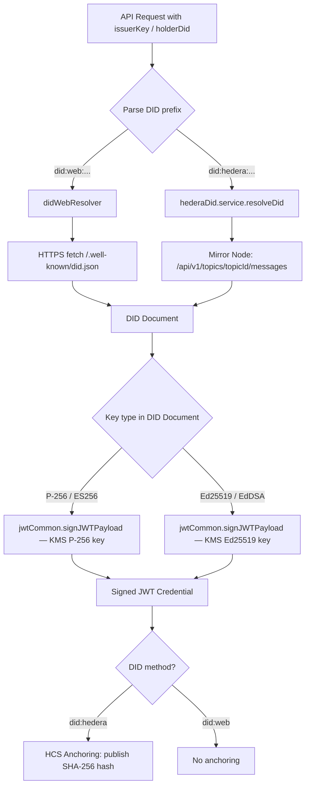
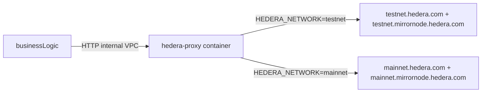
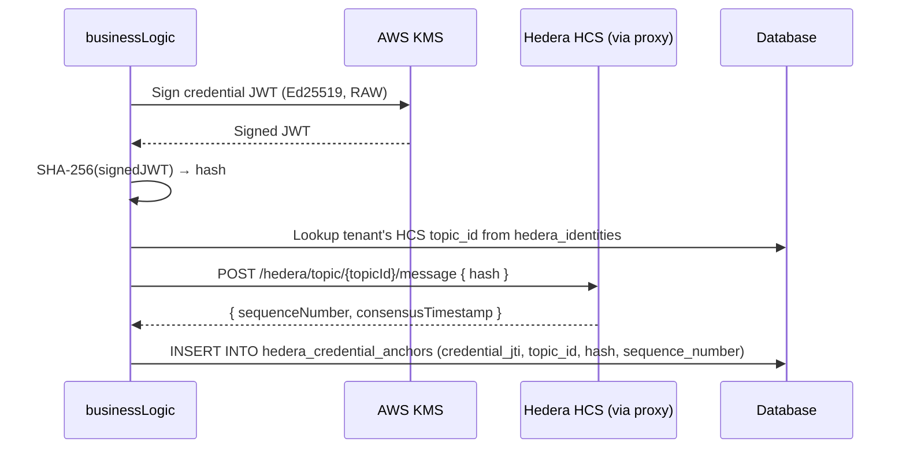

# Hedera DID Integration Service Specification

**Version:** 0.1 (Draft)
**Date:** 2026-04-14
**Status:** 🚧 Draft (until all ADRs accepted)
**Owner:** Equipo Sybol
**Service:** `businessLogic`
**Scope:** Hedera DID method integration — creation, credential issuance, verification, HCS anchoring
**Related issue:** #199 (Multi-method DID integration)
**Branch:** `feature/eddera-poc`

---

## Table of Contents

1. [Overview](#1-overview)
2. [Scope](#2-scope)
3. [Functional Requirements](#3-functional-requirements)
4. [Business Rules](#4-business-rules)
5. [Non-Functional Requirements](#5-non-functional-requirements)
6. [Architecture](#6-architecture)
7. [API Design](#7-api-design)
8. [Data Management](#8-data-management)
9. [HCS Anchoring Flow](#9-hcs-anchoring-flow)
10. [Security](#10-security)
11. [Configuration & Environment Variables](#11-configuration--environment-variables)
12. [Error Handling & Failure Modes](#12-error-handling--failure-modes)
13. [Decision Log](#13-decision-log)
14. [References](#14-references)

---

## 1. Overview

### Goals

- Support `did:hedera` as an alternative DID method alongside the existing `did:web` method within the `businessLogic` service.
- Allow tenants to choose their default DID method (`did:web` or `did:hedera`).
- Enable credential issuance, presentation creation, and verification using both DID methods through a unified multi-method dispatcher.
- Anchor credential hashes to Hedera Consensus Service (HCS) for credentials issued with `did:hedera`.
- Manage Ed25519 key lifecycle via AWS KMS (`ECC_NIST_EDWARDS25519`) across all environments. Legacy Secrets Manager POC keys were force-deleted on 2026-04-16; all Hedera identity keys now live in KMS.

### Non-Goals

- Replace `did:web` — it remains the default DID method for all tenants.
- Blockchain Manager (`services/bm`) integration — Hedera is not an EVM chain and does not belong in the EVM-oriented BM service.
- Production Hedera mainnet deployment — testnet only for the initial delivery; mainnet is a configuration change.
- Smart contracts on Hedera — `did:hedera` uses HCS topics, not smart contracts.
- Frontend/UI changes — separate issue; this SPEC covers the backend API only.
- Universal Resolver public deployment.
- Wallet mobile integration.

---

## 2. Scope

| In Scope | Out of Scope |
|---|---|
| `businessLogic` service modifications only | Other services (`catalog`, `backoffice`, `propagate`) |
| Multi-method DID dispatcher (did:web + did:hedera) | Frontend changes (separate issue) |
| Credential and presentation issuance with `did:hedera` | Mainnet deployment (testnet for now) |
| HCS hash anchoring for did:hedera credentials | DID revocation/deactivation on HCS |
| Key management: Ed25519 via AWS KMS (unified across environments) | Smart contracts on Hedera (HIP-32+) |
| Validator updates to accept both DID formats | Universal Resolver public registration |
| New DB table `hedera_credential_anchors` | Cross-service event emission (EventBridge) |
| `default_did_method` in `tenant_settings` (via `/api/bl/settings`) | HBAR cost optimization |
| Hedera DID setup endpoints (already implemented in POC) | Blockchain Manager refactoring |

---

## 3. Functional Requirements

| ID | Requirement | Priority | Notes |
|---|---|---|---|
| FR-HED-01 | Tenant can set a default DID method (`did:web` or `did:hedera`) stored in `tenant_settings` (via `/api/bl/settings`) | Must | Default is `did:web` for all existing and new tenants. Moved from `entities` table to `tenant_settings` per revised ADR-HED-007. |
| FR-HED-02 | Multi-method DID resolver dispatches to the correct resolver based on DID prefix: `did:web:` routes to HTTPS resolver, `did:hedera:` routes to Mirror Node resolver | Must | Single `didResolver.resolve(did)` entry point |
| FR-HED-03 | Validators (`didValidationUtils`) accept both `did:web` and `did:hedera` string formats as valid issuer/holder DIDs | Must | Regex update + structural validation |
| FR-HED-04 | Credential issuance with a `did:hedera` issuerKey signs the JWT with EdDSA (Ed25519) via KMS | Must | `SigningAlgorithm: ED25519_SHA_512`, `MessageType: RAW` |
| FR-HED-05 | Credential issuance with a `did:web` issuerKey continues to sign with ES256 (P-256) via KMS — no behavioral change | Must | Existing flow unchanged |
| FR-HED-06 | After issuing a credential with `did:hedera`, the SHA-256 hash of the signed JWT is published to an HCS topic | Should | See [Section 9: HCS Anchoring Flow](#9-hcs-anchoring-flow) |
| FR-HED-07 | Presentation requests work with both DID methods — the holder's DID method is detected and the correct verification key type is used | Must | EdDSA for did:hedera holders, ES256 for did:web holders |
| FR-HED-08 | Verification of incoming credentials resolves the issuer DID via the correct method resolver and validates the signature with the matching algorithm | Must | Algorithm determined by resolved DID Document key type |
| FR-HED-09 | Hedera DID setup (`POST /api/bl/hedera/setup-did`) creates an Ed25519 key, an HCS topic, publishes the DID Document, and persists the identity | Must | Already implemented in POC branch |
| FR-HED-10 | When `issuerKey` is not explicitly provided in a credential issuance request, the tenant's default DID method key is used | Should | Lookup `default_did_method` from `tenant_settings` (via `/api/bl/settings`) then resolve the corresponding key |

---

## 4. Business Rules

| ID | Rule | Rationale |
|---|---|---|
| BR-HED-01 | Default DID method for new tenants is `did:web` | Backward compatibility; did:web is established and requires no Hedera setup |
| BR-HED-02 | When `issuerKey` is not specified in a request, the key associated with the tenant's default DID method is used | Simplifies API usage; tenants configure once, issue many |
| BR-HED-03 | HCS anchoring only applies to credentials issued with `did:hedera` — credentials issued with `did:web` are not anchored to HCS | HCS cost and relevance scoping |
| BR-HED-04 | Once a tenant has issued credentials with a given DID method, that method must remain supported going forward — switching default does not invalidate previously issued credentials | Credential verifiability must be preserved; the old DID and keys remain active |

---

## 5. Non-Functional Requirements

| ID | Requirement | Target | Notes |
|---|---|---|---|
| NFR-HED-01 | DID resolution latency for `did:hedera` | < 3 seconds | Mirror Node HTTP dependency; retry with exponential backoff |
| NFR-HED-02 | HCS message cost per credential anchoring | < $0.001 USD | Current HCS message cost is ~$0.0001 |
| NFR-HED-03 | Ed25519 private keys stored in AWS KMS (`ECC_NIST_EDWARDS25519`) across all environments | Keys never leave HSM | Legacy Secrets Manager POC keys force-deleted 2026-04-16 |
| NFR-HED-04 | Network selection (testnet/mainnet) configurable via `HEDERA_NETWORK` env var | No code changes for network switch | Proxy container handles routing |
| NFR-HED-05 | Tenant isolation — each tenant has own KMS keys tagged with `tenantId` | No cross-tenant key access | Enforced via KMS key policies and STS scoped credentials |
| NFR-HED-06 | HCS topic creation cost | ~$0.01 USD per topic | One topic per DID; amortized over credential lifetime |

---

## 6. Architecture

### 6.1 Three-Layer Architecture (from ADR-003)

The Hedera DID integration distributes responsibilities across three layers:

| Layer | Component | Responsibility |
|---|---|---|
| **Domain / Orchestration** | `services/businessLogic` | DID lifecycle, API endpoints, credential issuance, multi-method dispatch, authentication |
| **Network Infrastructure** | `hedera-proxy` container | Routes HTTP to testnet/mainnet, encapsulates `@hashgraph/sdk`, manages Hedera operator credentials |
| **Key Lifecycle** | `lambdas/kms-key-*` (x4) | Create/query/delete KMS keys per algorithm type (Ed25519, secp256k1, P-256, RSA) |

```
services/businessLogic/src/hedera/
├── hederaDid.service.js      — orchestration: create topic, register DID, resolve DID
├── hederaDid.utils.js        — parse DID string, extract base58/topicId
└── hederaClient.js           — @hashgraph/sdk client factory per tenant

services/businessLogic/src/controllers/
└── hederaDid.controller.js   — REST endpoints

services/businessLogic/src/routes/
└── hederaDid.routes.js       — route definitions
```

### 6.2 Multi-Method DID Dispatcher



### 6.3 Hedera Proxy Container

All requests from `businessLogic` to Hedera pass through the proxy container. Network switching is a configuration change only.



**Proxy REST interface:**

| Method | Path | Action |
|---|---|---|
| `POST` | `/hedera/topic/create` | `TopicCreateTransaction` |
| `POST` | `/hedera/topic/:topicId/message` | `TopicMessageSubmitTransaction` |
| `GET` | `/hedera/topic/:topicId/messages` | Mirror Node — message history |
| `GET` | `/hedera/health` | Connection status |

### 6.4 Signing Algorithm Dispatch

All algorithm mapping is driven by the centralized table in `services/businessLogic/src/utils/keyAlgorithms.js` — a single source of truth consumed by every signed-JWT path (credentials, presentations, presentation requests, SD-JWTs, admin tokens). See **ADR-HED-006** for the full rationale.

| KMS KeySpec | JOSE `alg` | KMS SigningAlgorithm | MessageType | Hash before sign | Signature encoding |
|---|---|---|---|---|---|
| `ECC_NIST_EDWARDS25519` | `EdDSA` | `ED25519_SHA_512` | `RAW` | no (KMS applies SHA-512) | raw |
| `ECC_NIST_P256` | `ES256` | `ECDSA_SHA_256` | `DIGEST` | yes (SHA-256) | ecdsa-der → r\|s |
| `ECC_SECG_P256K1` | `ES256K` | `ECDSA_SHA_256` | `DIGEST` | yes (SHA-256) | ecdsa-der → r\|s |
| `RSA_2048` / `RSA_4096` | `RS256` | `RSASSA_PKCS1_V1_5_SHA_256` | `DIGEST` | yes (SHA-256) | raw |

Pipeline per signing operation:

```
KMS KeySpec  ──▶  JOSE alg           ──▶  KMS SigningAlgorithm  ──▶  Sign
(GetPublicKey)    (JWT header.alg)        (SignCommand param)
```

> **Note:** `EDDSA` is the JOSE name used in the JWT header. AWS KMS does NOT accept `EDDSA` as `SigningAlgorithm` — Ed25519 signing requires `ED25519_SHA_512`. The centralized table encodes this distinction explicitly.

### 6.5 DID Validation Fallback (Accepted — ADR-HED-008)

`did:hedera` DID documents published on HCS carry only W3C-standard verification method fields (`type`, `publicKeyBase58`). They deliberately do NOT embed the Sybol-internal `algorithm` / `publicKey` (PEM) fields that `did:web` documents include. When `didValidationUtils.validateIssuerKey()` encounters a W3C-pure verification method, it resolves the missing metadata from AWS KMS using the verification method fragment as the KMS Key UUID:

- `kms:GetPublicKey` → `KeySpec` → canonical Sybol algorithm (validated via `keyAlgorithms.fromKeySpec`)
- `kms:GetPublicKey` → `PublicKey` (SPKI DER) → PEM-encoded public key for downstream `pemToJwk()`

This keeps HCS-published DID documents portable / canonical W3C while preserving the signing contract. See **ADR-HED-008**.

> **Status note:** This fallback is implemented and accepted. No further decision needed.

### 6.6 DID Document Factory (Proposed — ADR-HED-010)

DID document building is currently split between two services: `backoffice/services/did-document.service.js` (`createDidDocumentStructure()` for `did:web`) and `businessLogic/hedera/hederaDid.service.js` (`buildDidDocument()` for `did:hedera`). Neither includes service endpoints (`SybolPropagateService`, `EntityProfileService`).

A centralized `DidDocumentFactory` is proposed to:
- Accept DID method, public key material, tenant context, and environment.
- Return a complete W3C DID document with verification methods AND service endpoints.
- Live in `services/businessLogic/src/utils/didDocumentFactory.js` as an interim location.

This is a refactoring of existing logic, not a new capability. See **ADR-HED-010**.

### 6.7 Identity Object Payload Builders (Proposed — ADR-HED-011)

JWT payload construction (credentials, presentations, presentation requests) is currently embedded in manager classes mixed with signing logic. A refactoring is proposed to extract payload construction into isolated pure-function builders:
- `createCredentialPayload()` → W3C VC 2.0 JSON
- `createPresentationPayload()` → W3C VP 2.0 JSON
- `createPresentationRequestPayload()` → JSON

Each builder lives in its own file under `utils/payloads/`, showing the complete JSON structure at a glance. Signing stays in the service layer. See **ADR-HED-011**.

---

## 7. API Design

### 7.1 Existing Endpoints Affected

These endpoints gain support for `did:hedera` issuerKey values. No breaking changes — `did:web` behavior is preserved.

| Endpoint | Change |
|---|---|
| `POST /api/bl/credentials` | Accepts `did:hedera` in `issuerKey`; signs with EdDSA if Hedera DID; anchors hash to HCS |
| `POST /api/bl/presentation-requests` | Accepts `did:hedera` in issuer/verifier DID fields |
| `POST /api/bl/presentations` | Resolves holder DID via correct method; verifies with matching algorithm |

### 7.2 Hedera-Specific Endpoints (existing from POC)

#### `POST /api/bl/hedera/setup-did`

Creates a new Hedera DID for the authenticated tenant. Three key-sourcing options, in precedence order:

| # | Body field | Behavior |
|---|---|---|
| 1 | `kmsKeyId` | Use an existing tenant-owned KMS Ed25519 key. Ownership verified by the `tenantId` tag. Signing via `kms:Sign`. |
| 2 | `publicKeyJwk` (Ed25519 OKP) | Embed caller-supplied public key in the DID document. No signing capability — HCS publication skipped; DID doc persisted in DB only. |
| 3 | *(none)* | Auto-create an Ed25519 KMS key by invoking the unified `sybol-kms-keys` Lambda (operation=create, purpose=identity, didMethod=did:hedera, role=primary). The new key gets standard Sybol tags, alias `alias/tenant/{env}/{tenantId}/identity-hedera/primary`, and a key policy granting `TenantRole-{tenantId}-admin` Sign/GetPublicKey/DescribeKey. Private key never leaves KMS. |

```
Headers: Authorization (tenant auth)
Body:    {
  "network":     "testnet",         // optional, defaults to HEDERA_NETWORK env
  "kmsKeyId":    "…",               // optional (Option 1)
  "publicKeyJwk": { … }             // optional (Option 2)
}

Response 201:
{
  "did": "did:hedera:testnet:<base58Key>_0.0.XXXXX",
  "topicId": "0.0.XXXXX",
  "network": "testnet",
  "status": "registered",
  "didDocument": { … }
}

Response 200 when DID already exists:
{ "did": "...", "topicId": "...", "network": "...", "status": "already_registered" }
```

The verification method fragment is the KMS Key UUID (Options 1 and 3) so the on-chain DID document ties directly to Settings > Keys. See **ADR-HED-008** for how the signing pipeline derives `algorithm` + PEM public key from that fragment at validation time.

#### `GET /api/bl/hedera/did-document`

Resolves and returns the DID Document from Hedera Mirror Node.

```
Query: ?did=did:hedera:testnet:...

Response 200:
{
  "didDocument": {
    "@context": ["https://www.w3.org/ns/did/v1", "https://ns.did.ai/transmute/v1"],
    "id": "did:hedera:testnet:<base58Key>_0.0.XXXXX",
    "verificationMethod": [{
      "id": "did:hedera:testnet:<base58Key>_0.0.XXXXX#did-root-key",
      "type": "Ed25519VerificationKey2018",
      "controller": "did:hedera:testnet:<base58Key>_0.0.XXXXX",
      "publicKeyBase58": "<base58-encoded-ed25519-public-key>"
    }],
    "authentication": ["...#did-root-key"],
    "assertionMethod": ["...#did-root-key"]
  }
}
```

#### `GET /api/bl/hedera/did-status`

Returns the current status of the tenant's Hedera DID.

```
Response 200:
{
  "hasDid": true,
  "did": "did:hedera:testnet:<base58Key>_0.0.XXXXX",
  "network": "testnet",
  "topicId": "0.0.XXXXX",
  "createdAt": "2026-04-01T12:00:00Z"
}

Response 200 (no DID):
{
  "hasDid": false
}
```

### 7.3 New/Modified Endpoint

#### `POST /api/bl/settings` (existing endpoint — new setting key)

The `default_did_method` preference is managed through the existing tenant settings API, not a dedicated endpoint.

```
Body: { "default_did_method": "did:hedera" }  // or "did:web"

Response 200:
{
  "default_did_method": "did:hedera"
}

Response 400: { "error": "Cannot set did:hedera as default — no Hedera DID configured. Run setup-did first." }
```

> **Note:** This replaces the originally proposed `PATCH /api/bl/entities/:entityId/default-did-method` endpoint. Using the existing settings API is consistent with how other tenant preferences are managed. See revised ADR-HED-007.

---

## 8. Data Management

### 8.1 Existing Table: `hedera_identities`

Stores the Hedera DID identity per tenant. Already implemented in the POC.

```sql
CREATE TABLE hedera_identities (
  id          SERIAL PRIMARY KEY,
  tenant_id   UUID NOT NULL REFERENCES tenants(id),
  did         TEXT NOT NULL UNIQUE,
  topic_id    TEXT NOT NULL,             -- "0.0.XXXXX"
  kms_key_id  TEXT,                      -- ARN of the Ed25519 KMS key
  network     TEXT NOT NULL DEFAULT 'testnet',
  created_at  TIMESTAMPTZ DEFAULT NOW()
);
```

### 8.2 New Table: `hedera_credential_anchors`

Records the HCS anchoring of each credential issued with `did:hedera`.

```sql
CREATE TABLE hedera_credential_anchors (
  id              SERIAL PRIMARY KEY,
  credential_jti  TEXT NOT NULL UNIQUE,   -- JWT ID of the issued credential
  topic_id        TEXT NOT NULL,           -- HCS topic where hash was published
  hash            TEXT NOT NULL,           -- SHA-256 hex hash of the signed JWT
  sequence_number BIGINT,                  -- HCS message sequence number
  published_at    TIMESTAMPTZ DEFAULT NOW()
);

CREATE INDEX idx_anchors_jti ON hedera_credential_anchors(credential_jti);
CREATE INDEX idx_anchors_topic ON hedera_credential_anchors(topic_id);
```

### 8.3 Default DID Method Setting (revised — ADR-HED-007)

~~Originally planned as a column in `backoffice.entities`.~~ Now stored in `tenant_settings` within each tenant's database, read/written via `GET/POST /api/bl/settings`.

Setting key: `default_did_method`
Default value: `'did:web'`
Allowed values: `'did:web'`, `'did:hedera'`

No schema migration needed — uses the existing key-value `tenant_settings` table.

---

## 9. HCS Anchoring Flow

After credential issuance with a `did:hedera` issuer, the credential hash is anchored to HCS for tamper-evidence.



### Steps

1. **Sign credential JWT** with the tenant's Ed25519 KMS key using `ED25519_SHA_512` algorithm with `MessageType: RAW`.
2. **Calculate SHA-256 hash** of the complete signed JWT string.
3. **Lookup or reuse** the tenant's HCS topic from `hedera_identities.topic_id`.
4. **Publish hash** as an HCS message to the topic via the Hedera proxy.
5. **Store anchor** record: `credential_jti` <-> `topic_id` <-> `hash` <-> `sequence_number` in `hedera_credential_anchors`.

### HCS Message Payload

```json
{
  "type": "credential-anchor",
  "jti": "<credential-jti>",
  "hash": "<sha256-hex>",
  "algorithm": "SHA-256",
  "issuerDid": "did:hedera:testnet:<base58Key>_0.0.XXXXX",
  "timestamp": "2026-04-14T12:00:00Z"
}
```

---

## 10. Security

### 10.1 Key Protection

| Asset | Protection | Environment |
|---|---|---|
| Ed25519 DID private keys | AWS KMS HSM (`ECC_NIST_EDWARDS25519`) | All environments (POC legacy Secrets Manager keys force-deleted 2026-04-16) |
| P-256 DID private keys (did:web) | AWS KMS HSM (`ECC_NIST_P256`) | All environments |
| Hedera operator key (HBAR payer) | AWS Secrets Manager (`hedera/operator/{network}`) | Production |
| Hedera operator key (HBAR payer) | Environment variable in proxy container | POC / Testnet |

### 10.2 Tenant Isolation

- Each tenant has its own KMS key(s) tagged with `tenantId` and its own HCS topic — no sharing between tenants.
- KMS key policies are baked at creation time by `lambdas/kms-keys/src/operations/create.js`:
  - Root keeps `kms:*` for administrative operations.
  - For `purpose=identity`, `TenantRole-{tenantId}-admin` gets `kms:Sign`, `kms:GetPublicKey`, `kms:DescribeKey` — matches the legacy did:web admin-jwt pattern.
  - For `purpose=blockchain`, no tenant grant yet (grantee TBD when that flow is implemented).
- The businessLogic service assumes `TenantRole-{tenantId}-admin` via STS (driven by the Cognito ID token) and calls KMS with those credentials — both IAM and key policy must allow the operation.
- Database queries are scoped to the authenticated tenant via `authMiddleware`.

See **ADR-HED-009** for the full decision and trade-offs.

### 10.3 Signing Security

- Ed25519 signing uses `MessageType: RAW` — the full message is sent to KMS, which internally hashes it with SHA-512 before signing. The private key never leaves the HSM.
- No raw private key material is ever logged, returned in API responses, or stored outside KMS/Secrets Manager.
- All KMS signing operations are logged in AWS CloudTrail.

### 10.4 Production Hardening Checklist

- [ ] Migrate Hedera operator key from env var to Secrets Manager (`hedera/operator/mainnet`).
- [x] ~~Migrate tenant DID keys from Secrets Manager (POC) to KMS (production)~~ — completed 2026-04-16; `setupDid` Option 3 now invokes the unified KMS Lambda.
- [ ] Enable KMS key rotation policy for Ed25519 keys.
- [ ] Restrict HCS topic `submitKey` to the tenant's operator key only.
- [ ] Verify KMS `ECC_NIST_EDWARDS25519` availability in target AWS region (`eu-west-1`).

---

## 11. Configuration & Environment Variables

### businessLogic service

| Variable | Description | Default | Required |
|---|---|---|---|
| `HEDERA_PROXY_URL` | URL of the Hedera proxy container | `http://hedera-proxy:3900` | Yes (production) |
| `HEDERA_NETWORK` | Target Hedera network | `testnet` | Yes |
| `KMS_KEYS_LAMBDA` | Name of the unified KMS key-lifecycle Lambda invoked by Option 3 of `setupDid` | `sybol-kms-keys-dev` | Yes (must match per environment: `-dev`, `-sta`, `-pro`) |
| `AWS_REGION` | AWS region for KMS / Lambda / Secrets Manager clients | `eu-west-1` | Yes |

### hedera-proxy container

| Variable | Description | Default | Required |
|---|---|---|---|
| `HEDERA_NETWORK` | `testnet` or `mainnet` | `testnet` | Yes |
| `HEDERA_MIRROR_URL` | Mirror Node URL | `https://testnet.mirrornode.hedera.com` | Yes |
| `HEDERA_NODE_ENDPOINT` | Consensus node endpoint | `testnet.hedera.com:50211` | Yes |
| `HEDERA_OPERATOR_ID` | Hedera account ID (HBAR payer) | — | Yes |
| `HEDERA_OPERATOR_KEY` | Operator private key (testnet only; use Secrets Manager in production) | — | Yes (testnet) |
| `PORT` | Proxy listen port | `3900` | No |

---

## 12. Error Handling & Failure Modes

| Scenario | Behavior | Recovery |
|---|---|---|
| Mirror Node unavailable during DID resolution | Return 503 with `Retry-After` header | Exponential backoff; 3 retries max |
| HCS message submission fails after credential signed | Credential is issued but not anchored; mark anchor as `pending` | Background retry job; alert if still pending after 5 minutes |
| KMS Ed25519 key creation fails | Return 500; no DID created | Retry; check KMS quotas and region support |
| Tenant attempts `setup-did` when DID already exists | Return 409 Conflict | Idempotent — return existing DID info |
| DID resolution returns empty topic (no messages) | Return 404 with descriptive error | Verify topic ID; may indicate DID not yet registered |
| Hedera proxy container down | All Hedera operations fail with 502 | Health check alerts; auto-restart via ECS/Docker |
| Invalid DID format in request | Return 400 with validation error | Client fixes the DID string |

---

## 13. Decision Log

This section consolidates all Architecture Decision Records related to the Hedera DID integration. ADRs with status **Accepted** were validated during the POC phase. ADRs with status **Proposed** are new decisions introduced by the multi-method integration (issue #199).

| ADR | Title | Status | Summary | Source |
|---|---|---|---|---|
| ADR-HED-001 | DID Method Selection | **Accepted** | `did:hedera` selected over did:key, did:ion, did:ebsi, did:ala. HCS-based, Ed25519, low cost, JS SDK available. | `docs/poc/adr-hedera-001-did-method.md` |
| ADR-HED-002 | Key Management | **Accepted** | Ed25519 via Secrets Manager for POC; Ed25519 via AWS KMS (`ECC_NIST_EDWARDS25519`) for production. Lambda per key type. | `docs/poc/adr-hedera-002-key-management.md` |
| ADR-HED-003 | Service Placement | **Accepted** | Hedera DID logic in `businessLogic` module. Proxy container for network abstraction. KMS Lambdas for key lifecycle. | `docs/poc/adr-hedera-003-service-placement.md` |
| ADR-HED-004 | Multi-Method DID Dispatch | **Accepted** | Universal resolver dispatcher: `didResolver.resolve(did)` routes to `did:web` (HTTPS) or `did:hedera` (Mirror Node) based on DID prefix. Single entry point for all DID operations. Implemented. | This SPEC, Section 6.2 |
| ADR-HED-005 | HCS Credential Anchoring | **Accepted** | Reuse tenant's DID topic for credential hash anchoring. SHA-256 hash of signed JWT published as HCS message. One anchor record per credential. Implemented. | This SPEC, Section 9 |
| ADR-HED-006 | JWT Signing Algorithm Mapping (Centralized Table) | **Accepted** | Single `keyAlgorithms` table maps KeySpec → JOSE alg → KMS SigningAlgorithm + signature encoding. Used by every signed JWT path. Fixes EDDSA→ED25519_SHA_512 bug. | This SPEC, Section 6.4 |
| ADR-HED-007 | Default DID Method Storage | **Accepted** (revised) | ~~`entities.default_did_method` column~~ → moved to `tenant_settings` in tenant DB, accessible via `/api/bl/settings`. Default `'did:web'`. | This SPEC, Section 8.3 |
| ADR-HED-008 | KMS Fallback in DID Validation | **Accepted** | When VM is W3C-pure (did:hedera), resolve `algorithm`/`publicKey` from KMS GetPublicKey using the VM fragment as Key UUID. Keeps on-chain docs canonical and auto-fixes pre-existing DIDs. Implemented. | This SPEC, Section 6.5 |
| ADR-HED-009 | KMS Key Policy for Identity Keys | **Accepted** | Unified KMS Lambda bakes a key policy at creation granting `TenantRole-{tenantId}-admin` Sign/GetPublicKey/DescribeKey for `purpose=identity`. Enables signing without follow-up IAM edits. | Lambda `lambdas/kms-keys/src/operations/create.js` |
| ADR-HED-010 | DID Document Factory | **Proposed** | Centralize DID document assembly in a `DidDocumentFactory` — accepts method, key, tenant context; returns W3C DID doc with service endpoints. Refactoring of existing scattered builders. | This SPEC, Section 6.6 |
| ADR-HED-011 | Identity Object Payload Builders | **Proposed** | Extract credential/presentation/request payload construction into isolated pure-function builders. Signing stays in service layer. Refactoring only. | This SPEC, Section 6.7 |

---

## 14. References

### Specifications

- [W3C DID Core 1.0](https://www.w3.org/TR/did-core/)
- [hashgraph/did-method — Official Specification](https://github.com/hashgraph/did-method)
- [Meeco/hedera-did-method — Updated W3C DID Core 1.0 Specification](https://github.com/Meeco/hedera-did-method)
- [HIP-27: DID Improvements](https://hips.hedera.com/hip/hip-27)
- [HIP-19: Decentralized Identifiers in Memo Fields](https://hips.hedera.com/hip/hip-19)
- [HIP-1219: Hedera DID Method v2.0](https://hips.hedera.com/hip/hip-1219)

### SDKs & Libraries

- [@hashgraph/sdk (npm)](https://www.npmjs.com/package/@hashgraph/sdk) — Official Hedera SDK
- [@hashgraph/did-sdk-js (npm)](https://www.npmjs.com/package/@hashgraph/did-sdk-js) — DID SDK for HCS
- [did-resolver (npm)](https://www.npmjs.com/package/did-resolver) — W3C DID resolver interface
- [bs58 (npm)](https://www.npmjs.com/package/bs58) — Base58 encoding

### AWS

- [AWS KMS Key Spec Reference](https://docs.aws.amazon.com/kms/latest/developerguide/symm-asymm-choose-key-spec.html)
- [AWS KMS CreateKey API](https://docs.aws.amazon.com/kms/latest/APIReference/API_CreateKey.html)

### Internal Documentation

- `docs/poc/spec-hedera-did-poc.md` — POC specification (full technical detail)
- `docs/poc/adr-hedera-001-did-method.md` — DID method selection ADR
- `docs/poc/adr-hedera-002-key-management.md` — Key management ADR
- `docs/poc/adr-hedera-003-service-placement.md` — Service placement ADR

### Infrastructure

- [Hedera Portal (testnet accounts)](https://portal.hedera.com)
- [Hedera Mirror Node testnet](https://testnet.mirrornode.hedera.com)
- [Hedera Consensus Service overview](https://hedera.com/blog/decentralized-identity-on-the-hedera-consensus-service/)
